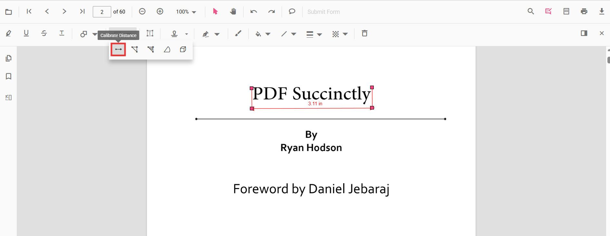
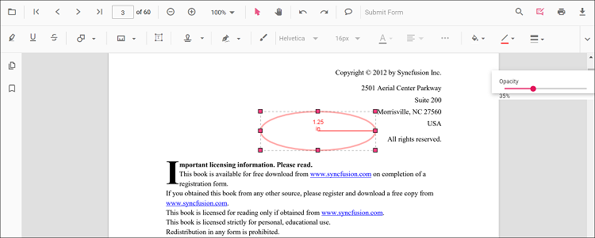

# Add Distance Annotations in Angular PDF Viewer
Distance is a measurement annotation used to measure the length between two points on a PDF page. Use it for precise reviews, markups, or engineering measurements.

## Enable Distance Annotation

To enable Distance annotation, inject the following modules into the Angular PDF Viewer:

- [**Annotation**](https://ej2.syncfusion.com/angular/documentation/api/pdfviewer/index-default#annotation)
- [**Toolbar**](https://ej2.syncfusion.com/angular/documentation/api/pdfviewer/index-default#toolbar)




import { Component } from '@angular/core';
import {
  PdfViewerModule,
  ToolbarService,
  AnnotationService
} from '@syncfusion/ej2-angular-pdfviewer';

@Component({
  selector: 'app-root',
  template: `
    

      <ejs-pdfviewer
        id="pdfViewer"
        [documentPath]="document"
        [resourceUrl]="resource"
        style="height:650px;display:block">
      </ejs-pdfviewer>
    

  `,
  imports: [PdfViewerModule],
  providers: [ToolbarService, AnnotationService]
})
export class AppComponent {

  public document: string =
    'https://cdn.syncfusion.com/content/pdf/pdf-succinctly.pdf';

  public resource: string =
    'https://cdn.syncfusion.com/ej2/31.2.2/dist/ej2-pdfviewer-lib';
}




## Add Distance Annotation

### Add Distance Using the Toolbar
1. Open the **Annotation Toolbar**.
2. Select **Measurement** → **Distance**.
3. Click to set the start point, then click again to set the end point.

N> If Pan mode is active, choosing a measurement tool switches the viewer into the appropriate interaction mode for a smoother workflow.

### Enable Distance Mode
Programmatically switch the viewer into Distance mode.




enableDistanceMode(): void {
  const pdfViewer = (document.getElementById('pdfViewer') as any).ej2_instances[0];
  pdfViewer.annotationModule.setAnnotationMode('Distance');
}




#### Exit Distance Mode



exitDistanceMode(): void {
  const pdfViewer = (document.getElementById('pdfViewer') as any).ej2_instances[0];
  pdfViewer.annotationModule.setAnnotationMode('None');
}




### Add Distance Programmatically
Use the [`addAnnotation`](https://ej2.syncfusion.com/angular/documentation/api/pdfviewer/index-default#addannotation) API to draw a Distance measurement by providing two **vertexPoints**.




addDistance(): void {
  const pdfViewer = (document.getElementById('pdfViewer') as any).ej2_instances[0];
  pdfViewer.annotation.addAnnotation('Distance', {
    offset: { x: 200, y: 230 },
    pageNumber: 1,
    vertexPoints: [
      { x: 200, y: 230 },
      { x: 350, y: 230 }
    ]
  });
}




## Customize Distance Appearance
Configure default properties using the [`Distance Settings`](https://ej2.syncfusion.com/angular/documentation/api/pdfviewer/index-default#distancesettings) property (for example, default **fill color**, **stroke color**, **opacity**).




import { Component } from '@angular/core';
import {
  PdfViewerModule,
  ToolbarService,
  AnnotationService
} from '@syncfusion/ej2-angular-pdfviewer';

@Component({
  selector: 'app-root',
  template: `
    

      <ejs-pdfviewer
        id="pdfViewer"
        [documentPath]="document"
        [resourceUrl]="resource"
        [distanceSettings]="distanceSettings"
        style="height:650px;display:block">
      </ejs-pdfviewer>
    

  `,
  imports: [PdfViewerModule],
  providers: [ToolbarService, AnnotationService]
})
export class AppComponent {

  public document: string =
    'https://cdn.syncfusion.com/content/pdf/pdf-succinctly.pdf';

  public resource: string =
    'https://cdn.syncfusion.com/ej2/31.2.2/dist/ej2-pdfviewer-lib';

  // Distance annotation default settings
  public distanceSettings = {
    fillColor: 'blue',
    strokeColor: 'green',
    opacity: 0.6
  };
}




## Manage Distance (Move, Resize, Edit, Delete)
- **Move**: Drag the measurement to reposition it.
- **Resize**: Drag the end handles to adjust the length.

### Edit Distance

#### Edit Distance (UI)
Change **stroke color**, **thickness**, and **opacity** using the annotation toolbar tools.

- Edit the **fill color** using the Edit Color tool.  
  
- Edit the **stroke color** using the Edit Stroke Color tool.
  
- Edit the **border thickness** using the Edit Thickness tool.
  
- Edit the **opacity** using the Edit Opacity tool.
  
- Open **Right Click → Properties** for additional line-based options.

#### Edit Distance Programmatically
Update properties and call `editAnnotation()`.




editDistanceProgrammatically(): void {
  const pdfViewer = (document.getElementById('pdfViewer') as any).ej2_instances[0];
  for (const ann of pdfViewer.annotationCollection) {
    if (ann.subject === 'Distance calculation') {
      ann.strokeColor = '#0000FF';
      ann.thickness = 2;
      ann.opacity = 0.8;
      pdfViewer.annotation.editAnnotation(ann);
      break;
    }
  }
}




### Delete Distance Annotation

Delete Distance Annotation via UI (toolbar/context menu) or programmatically. For supported workflows and APIs, see [**Delete Annotation**](../remove-annotations).

## Set Default Properties During Initialization
Apply defaults for Distance using the [`distanceSettings`](https://ej2.syncfusion.com/angular/documentation/api/pdfviewer/index-default#distancesettings) property.




import { Component } from '@angular/core';
import {
  PdfViewerModule,
  ToolbarService,
  AnnotationService
} from '@syncfusion/ej2-angular-pdfviewer';

@Component({
  selector: 'app-root',
  template: `
    

      <ejs-pdfviewer
        id="pdfViewer"
        [documentPath]="document"
        [resourceUrl]="resource"
        [distanceSettings]="distanceSettings"
        style="height:650px;display:block">
      </ejs-pdfviewer>
    

  `,
  imports: [PdfViewerModule],
  providers: [ToolbarService, AnnotationService]
})
export class AppComponent {

  public document: string =
    'https://cdn.syncfusion.com/content/pdf/pdf-succinctly.pdf';

  public resource: string =
    'https://cdn.syncfusion.com/ej2/31.2.2/dist/ej2-pdfviewer-lib';

  // Distance annotation default settings
  public distanceSettings = {
    fillColor: 'blue',
    strokeColor: 'green',
    opacity: 0.6
  };
}




## Set Properties While Adding Individual Annotation
Pass per-annotation values directly when calling [`addAnnotation`](https://ej2.syncfusion.com/angular/documentation/api/pdfviewer/index-default#addannotation).




addStyledDistance(): void {
  const pdfViewer = (document.getElementById('pdfViewer') as any).ej2_instances[0];
  pdfViewer.annotation.addAnnotation('Distance', {
    offset: { x: 220, y: 260 },
    pageNumber: 1,
    vertexPoints: [
      { x: 220, y: 260 },
      { x: 360, y: 260 }
    ],
    strokeColor: '#059669',
    opacity: 0.9,
    fillColor: '#D1FAE5',
    thickness: 2
  });
}




## Scale Ratio and Units

- Use **Scale Ratio** from the context menu to set the actual-to-page scale.  
  
- Supported units include **Inch, Millimeter, Centimeter, Point, Pica, Feet**.  
  

### Set Default Scale Ratio During Initialization
Configure scale defaults using [`measurementSettings`](https://ej2.syncfusion.com/angular/documentation/api/pdfviewer/index-default#measurementsettings).




import { Component } from '@angular/core';
import {
  PdfViewerModule,
  ToolbarService,
  AnnotationService
} from '@syncfusion/ej2-angular-pdfviewer';

@Component({
  selector: 'app-root',
  template: `
    

      <ejs-pdfviewer
        id="pdfViewer"
        [documentPath]="document"
        [resourceUrl]="resource"
        [measurementSettings]="measurementSettings"
        style="height:640px;display:block">
      </ejs-pdfviewer>
    

  `,
  imports: [PdfViewerModule],
  providers: [ToolbarService, AnnotationService]
})
export class AppComponent {

  public document: string =
    'https://cdn.syncfusion.com/content/pdf/pdf-succinctly.pdf';

  public resource: string =
    'https://cdn.syncfusion.com/ej2/31.2.2/dist/ej2-pdfviewer-lib';

  // Distance / Measurement configuration
  public measurementSettings = {
    scaleRatio: 2,
    conversionUnit: 'cm',
    displayUnit: 'cm'
  };
}




## Handle Distance Events

Listen to annotation life-cycle events (add/modify/select/remove). For the full list and parameters, see [**Annotation Events**](../annotation-event).

## Export and Import
Distance measurements can be exported or imported with other annotations. For workflows and supported formats, see [**Export and Import annotations**](../export-import-annotations).

## See Also
- [Annotation Toolbar](../../toolbar-customization/annotation-toolbar)
- [Customize Context Menu](../../context-menu/custom-context-menu)
- [Comments Panel](../comments)
- [Annotation Events](../annotation-event)
- [Export and Import annotations](../export-import-annotations)
- [Delete Annotations](../remove-annotations)
