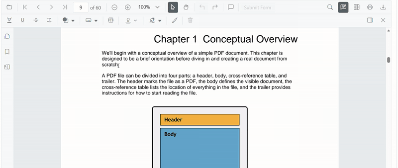
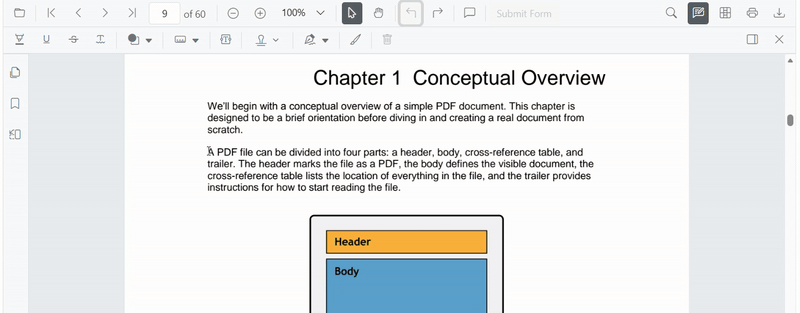

# Highlight Annotation (Text Markup) in Angular PDF Viewer

This guide explains how to **enable**, **apply**, **customize**, and **manage** *Highlight* text markup annotations in the Syncfusion **Angular PDF Viewer**.
You can highlight text using the toolbar or context menu, programmatically invoke highlight mode, customize default settings, handle events, and export the PDF with annotations.

## Enable Highlight in the Viewer

To enable Highlight annotations, inject the following modules into the Angular PDF Viewer:

- [**Annotation**](https://ej2.syncfusion.com/angular/documentation/api/pdfviewer/index-default#annotation)
- [**TextSelection**](https://ej2.syncfusion.com/angular/documentation/api/pdfviewer/index-default#textselection)
- [**Toolbar**](https://ej2.syncfusion.com/angular/documentation/api/pdfviewer/index-default#toolbar)

This minimal setup enables UI interactions like selection and highlighting.




import { Component } from '@angular/core';
import {
  PdfViewerModule,
  ToolbarService,
  AnnotationService,
  TextSelectionService
} from '@syncfusion/ej2-angular-pdfviewer';

@Component({
  selector: 'app-root',
  template: `
    

      <ejs-pdfviewer
        id="pdfViewer"
        [documentPath]="document"
        [resourceUrl]="resource"
        style="height:650px;display:block">
      </ejs-pdfviewer>
    

  `,
  imports: [PdfViewerModule],
  providers: [ToolbarService, AnnotationService, TextSelectionService]
})
export class AppComponent {

  public document: string =
    'https://cdn.syncfusion.com/content/pdf/pdf-succinctly.pdf';

  public resource: string =
    'https://cdn.syncfusion.com/ej2/31.2.2/dist/ej2-pdfviewer-lib';
}




## Add Highlight Annotation

### Add Highlight Using the Toolbar

1. Select the text you want to highlight.
2. Click the **Highlight** icon in the annotation toolbar.
   - If **Pan Mode** is active, the viewer automatically switches to **Text Selection** mode.

### Apply highlight using Context Menu

Right-click a selected text region → select **Highlight**.

To customize menu items, refer to [**Customize Context Menu**](../../context-menu/custom-context-menu) documentation.

### Enable Highlight Mode

Switch the viewer into highlight mode using `setAnnotationMode('Highlight')`.




enableHighlight(): void {
  const pdfViewer = (document.getElementById('pdfViewer') as any).ej2_instances[0];
  pdfViewer.annotationModule.setAnnotationMode('Highlight');
}




#### Exit Highlight Mode

Switch back to normal mode using:




disableHighlightMode(): void {
  const pdfViewer = (document.getElementById('pdfViewer') as any).ej2_instances[0];
  pdfViewer.annotationModule.setAnnotationMode('None');
}




### Add Highlight Programmatically

Use [`addAnnotation()`](https://ej2.syncfusion.com/angular/documentation/api/pdfviewer/index-default#addannotation) to insert highlight at a specific location.




addHighlight(): void {
  const pdfViewer = (document.getElementById('pdfViewer') as any).ej2_instances[0];

  pdfViewer.annotation.addAnnotation('Highlight', {
    bounds: [{ x: 97, y: 110, width: 350, height: 14 }],
    pageNumber: 1
  });
}




## Customize Highlight Appearance

Configure default highlight settings such as **color**, **opacity**, and **author** using [`highlightSettings`](https://ej2.syncfusion.com/angular/documentation/api/pdfviewer/index-default#highlightsettings).




import { Component } from '@angular/core';
import {
  PdfViewerModule,
  ToolbarService,
  AnnotationService,
  TextSelectionService
} from '@syncfusion/ej2-angular-pdfviewer';

@Component({
  selector: 'app-root',
  template: `
    

      <ejs-pdfviewer
        id="pdfViewer"
        [documentPath]="document"
        [resourceUrl]="resource"
        [highlightSettings]="highlightSettings"
        style="height:650px;display:block">
      </ejs-pdfviewer>
    

  `,
  imports: [PdfViewerModule],
  providers: [ToolbarService, AnnotationService, TextSelectionService]
})
export class AppComponent {

  public document: string =
    'https://cdn.syncfusion.com/content/pdf/pdf-succinctly.pdf';

  public resource: string =
    'https://cdn.syncfusion.com/ej2/31.2.2/dist/ej2-pdfviewer-lib';

  public highlightSettings = {
    author: 'Guest User',
    subject: 'Important',
    color: '#ffff00',
    opacity: 0.9
  };
}




## Manage Highlight (Edit, Delete, Comment)

### Edit Highlight

#### Edit Highlight Appearance (UI)

Use the annotation toolbar:
- **Edit Color** tool  

- **Edit Opacity** slider

#### Edit Highlight Programmatically

Modify an existing highlight programmatically using `editAnnotation()`.




editHighlightProgrammatically(): void {
  const pdfViewer = (document.getElementById('pdfViewer') as any).ej2_instances[0];

  for (let annot of pdfViewer.annotationCollection) {
    if (annot.textMarkupAnnotationType === 'Highlight') {
      annot.color = '#0000ff';
      annot.opacity = 0.8;
      pdfViewer.annotation.editAnnotation(annot);
      break;
    }
  }
}




### Delete Highlight

The PDF Viewer supports deleting existing annotations through both the UI and API.
For detailed behavior, supported deletion workflows, and API reference, see [Delete Annotation](../remove-annotations)

### Comments

Use the [Comments panel](../comments) to add, view, and reply to threaded discussions linked to underline annotations.
It provides a dedicated UI for reviewing feedback, tracking conversations, and collaborating on annotation‑related notes within the PDF Viewer.

## Set properties while adding Individual Annotation

Set properties for individual annotation before creating the control using [highlightSettings](https://ej2.syncfusion.com/angular/documentation/api/pdfviewer/index-default#highlightsettings)




addMultipleHighlights(): void {
  const pdfViewer = (document.getElementById('pdfViewer') as any).ej2_instances[0];

  // Highlight 1
  pdfViewer.annotation.addAnnotation('Highlight', {
    bounds: [{ x: 100, y: 150, width: 320, height: 14 }],
    pageNumber: 1,
    author: 'User 1',
    color: '#ffff00',
    opacity: 0.9
  });

  // Highlight 2
  pdfViewer.annotation.addAnnotation('Highlight', {
    bounds: [{ x: 110, y: 220, width: 300, height: 14 }],
    pageNumber: 1,
    author: 'User 2',
    color: '#ff1010',
    opacity: 0.9
  });
}




## Disable TextMarkup Annotation

Disable text markup annotations (including highlight) using the [`enableTextMarkupAnnotation`](https://ej2.syncfusion.com/angular/documentation/api/pdfviewer/index-default#enabletextmarkupannotation) property.




import { Component } from '@angular/core';
import {
  PdfViewerModule,
  ToolbarService,
  AnnotationService,
  TextSelectionService
} from '@syncfusion/ej2-angular-pdfviewer';

@Component({
  selector: 'app-root',
  template: `
    

      <ejs-pdfviewer
        id="pdfViewer"
        [enableTextMarkupAnnotation]="false"
        [documentPath]="document"
        [resourceUrl]="resource"
        style="height:650px;display:block">
      </ejs-pdfviewer>
    

  `,
  imports: [PdfViewerModule],
  providers: [ToolbarService, AnnotationService, TextSelectionService]
})
export class AppComponent {

  public document: string =
    'https://cdn.syncfusion.com/content/pdf/pdf-succinctly.pdf';

  public resource: string =
    'https://cdn.syncfusion.com/ej2/31.2.2/dist/ej2-pdfviewer-lib';
}




## Handle Highlight Events

The PDF viewer provides annotation life-cycle events that notify when highlight annotations are added, modified, selected, or removed.
For the full list of available events and their descriptions, see [**Annotation Events**](../annotation-event)

## Export and Import

The PDF Viewer supports exporting and importing annotations, allowing you to save annotations as a separate file or load existing annotations back into the viewer.
For full details on supported formats and steps to export or import annotations, see [Export and Import Annotation](../export-import-annotations)

## See Also

- [Annotation Toolbar](../../toolbar-customization/annotation-toolbar)
- [Customize Context Menu](../../context-menu/custom-context-menu)
- [Comments Panel](../comments)
- [Annotation Events](../annotation-event)
- [Export and Import annotations](../export-import-annotations)
- [Delete Annotations](../remove-annotations)
