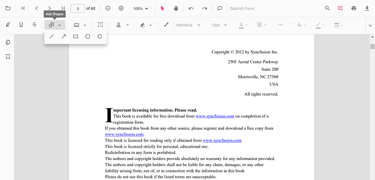

# Rectangle Annotation (Shape) in Angular PDF Viewer
Rectangle annotations let users highlight regions, group content, or draw callout boxes on PDFs for reviews and markups. You can add rectangles from the toolbar, switch to rectangle mode programmatically, customize appearance, edit/delete them in the UI, and export them with the document.

## Enable Rectangle Annotation in the Viewer

To enable Rectangle annotations, inject the following modules into the Angular PDF Viewer:

- [**Annotation**](https://ej2.syncfusion.com/angular/documentation/api/pdfviewer/index-default#annotation)
- [**Toolbar**](https://ej2.syncfusion.com/angular/documentation/api/pdfviewer/index-default#toolbar)




import { Component } from '@angular/core';
import {
  PdfViewerModule,
  ToolbarService,
  AnnotationService
} from '@syncfusion/ej2-angular-pdfviewer';

@Component({
  selector: 'app-root',
  template: `
    

      <ejs-pdfviewer
        id="pdfViewer"
        [documentPath]="document"
        [resourceUrl]="resource"
        style="height:650px;display:block">
      </ejs-pdfviewer>
    

  `,
  imports: [PdfViewerModule],
  providers: [ToolbarService, AnnotationService]
})
export class AppComponent {

  public document: string =
    'https://cdn.syncfusion.com/content/pdf/pdf-succinctly.pdf';

  public resource: string =
    'https://cdn.syncfusion.com/ej2/31.2.2/dist/ej2-pdfviewer-lib';
}




## Add Rectangle Annotation

### Add Rectangle Annotation Using the Toolbar

1. Open the **Annotation Toolbar**.
2. Select **Shapes** → **Rectangle**.
3. Click and drag on the PDF page to draw the rectangle.

N> When in Pan mode, selecting a shape tool automatically switches the viewer to selection mode for smooth interaction.

### Enable Rectangle Mode
Switch the viewer into rectangle mode using `setAnnotationMode('Rectangle')`.



enableRectangleMode(): void {
  const pdfViewer = (document.getElementById('pdfViewer') as any).ej2_instances[0];
  pdfViewer.annotation.setAnnotationMode('Rectangle');
}



#### Exit Rectangle Mode


exitRectangleMode(): void {
  const pdfViewer = (document.getElementById('pdfViewer') as any).ej2_instances[0];
  pdfViewer.annotation.setAnnotationMode('None');
}



### Add Rectangle Programmatically
Use the [`addAnnotation`](https://ej2.syncfusion.com/angular/documentation/api/pdfviewer/index-default#addannotation) API to draw a rectangle at a specific location.



addRectangle(): void {
  const pdfViewer = (document.getElementById('pdfViewer') as any).ej2_instances[0];

  pdfViewer.annotation.addAnnotation('Rectangle', {
    offset: { x: 200, y: 480 },
    pageNumber: 1,
    width: 150,
    height: 75
  });
}



## Customize Rectangle Appearance
Configure default rectangle appearance (fill color, stroke color, thickness, opacity) using the [`rectangleSettings`](https://ej2.syncfusion.com/angular/documentation/api/pdfviewer/index-default#rectanglesettings) property.




import { Component } from '@angular/core';
import {
  PdfViewerModule,
  ToolbarService,
  AnnotationService
} from '@syncfusion/ej2-angular-pdfviewer';

@Component({
  selector: 'app-root',
  template: `
    

      <ejs-pdfviewer
        id="pdfViewer"
        [documentPath]="document"
        [resourceUrl]="resource"
        [rectangleSettings]="rectangleSettings"
        style="height:650px;display:block">
      </ejs-pdfviewer>
    

  `,
  imports: [PdfViewerModule],
  providers: [ToolbarService, AnnotationService]
})
export class AppComponent {

  public document: string =
    'https://cdn.syncfusion.com/content/pdf/pdf-succinctly.pdf';

  public resource: string =
    'https://cdn.syncfusion.com/ej2/31.2.2/dist/ej2-pdfviewer-lib';

  // Rectangle annotation default settings
  public rectangleSettings = {
    fillColor: '#ffff00',
    strokeColor: '#ff6a00',
    thickness: 2,
    opacity: 0.9
  };
}




## Manage Rectangle (Edit, Move, Resize, Delete)
### Edit Rectangle 

#### Edit Rectangle (UI)
- Select a rectangle to view resize handles.
- Drag any side/corner to resize; drag inside the shape to move it.
- Edit **fill**, **stroke**, **thickness**, and **opacity** using the annotation toolbar.

Use the annotation toolbar:
- **Edit fill Color** tool  

- **Edit stroke Color** tool

- **Edit Opacity** slider

- **Edit Thickness** slider

#### Edit Rectangle Programmatically

Modify an existing Rectangle programmatically using `editAnnotation()`.



editRectangleProgrammatically(): void {
  const pdfViewer = (document.getElementById('pdfViewer') as any).ej2_instances[0];

  for (const annotation of pdfViewer.annotationCollection) {
    if (annotation.subject === 'Rectangle') {
      annotation.strokeColor = '#0000FF';
      annotation.thickness = 2;
      annotation.fillColor = '#FFFF00';

      pdfViewer.annotation.editAnnotation(annotation);
      break;
    }
  }
}



### Delete Rectangle
The PDF Viewer supports deleting existing annotations through the UI and API.
See [**Delete Annotation**](../remove-annotations) for full behavior and workflows.

### Comments
Use the [**Comments panel**](../comments) to add, view, and reply to threaded discussions linked to rectangle annotations. It provides a dedicated interface for collaboration and review within the PDF Viewer.

## Set Properties While Adding Individual Annotation
Pass per-annotation values directly when calling [`addAnnotation`](https://ej2.syncfusion.com/angular/documentation/api/pdfviewer/index-default#addannotation).



addStyledRectangles(): void {
  const pdfViewer = (document.getElementById('pdfViewer') as any).ej2_instances[0];

  // Rectangle 1
  pdfViewer.annotation.addAnnotation('Rectangle', {
    offset: { x: 200, y: 480 },
    pageNumber: 1,
    width: 150,
    height: 75,
    opacity: 0.9,
    strokeColor: '#ff6a00',
    fillColor: '#ffff00',
    author: 'User 1'
  });

  // Rectangle 2
  pdfViewer.annotation.addAnnotation('Rectangle', {
    offset: { x: 380, y: 480 },
    pageNumber: 1,
    width: 120,
    height: 60,
    opacity: 0.85,
    strokeColor: '#ff1010',
    fillColor: '#ffe600',
    author: 'User 2'
  });
}



## Disable Rectangle Annotation
Disable shape annotations (Line, Arrow, Rectangle, Circle, Polygon) using the [`enableShapeAnnotation`](https://ej2.syncfusion.com/angular/documentation/api/pdfviewer/index-default#enableshapeannotation) property.




import { Component } from '@angular/core';
import {
  PdfViewerModule,
  ToolbarService,
  AnnotationService
} from '@syncfusion/ej2-angular-pdfviewer';

@Component({
  selector: 'app-root',
  template: `
    

      <ejs-pdfviewer
        id="pdfViewer"
        [enableShapeAnnotation]="false"
        [documentPath]="document"
        [resourceUrl]="resource"
        style="height:650px;display:block">
      </ejs-pdfviewer>
    

  `,
  imports: [PdfViewerModule],
  providers: [ToolbarService, AnnotationService]
})
export class AppComponent {

  public document: string =
    'https://cdn.syncfusion.com/content/pdf/pdf-succinctly.pdf';

  public resource: string =
    'https://cdn.syncfusion.com/ej2/31.2.2/dist/ej2-pdfviewer-lib';
}




## Handle Rectangle Events

The PDF viewer provides annotation life-cycle events that notify when Rectangle annotations are added, modified, selected, or removed.
For the full list of available events and their descriptions, see [**Annotation Events**](../annotation-event)

## Export and Import
The PDF Viewer supports exporting and importing annotations. For details on supported formats and workflows, see [**Export and Import annotations**](../export-import-annotations).

## See Also
- [Annotation Toolbar](../../toolbar-customization/annotation-toolbar)
- [Customize Context Menu](../../context-menu/custom-context-menu)
- [Comments Panel](../comments)
- [Annotation Events](../annotation-event)
- [Export and Import annotations](../export-import-annotations)
- [Delete Annotations](../remove-annotations)
