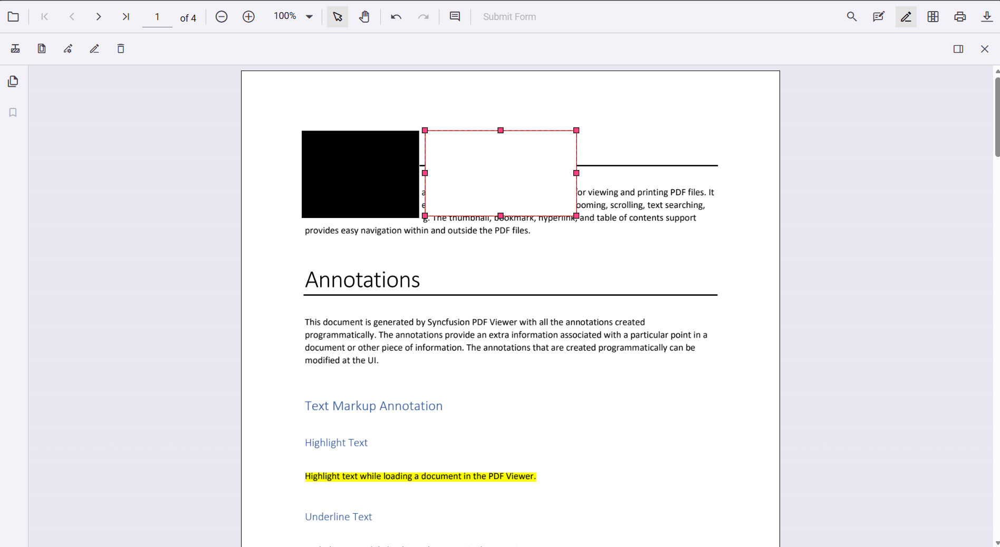
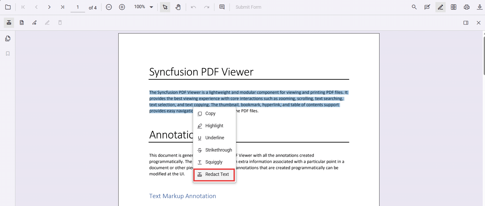
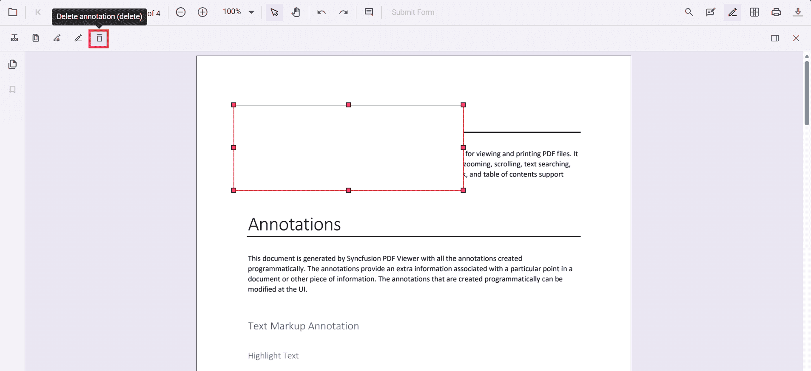

# Redaction annotation in Angular PDF Viewer

Redaction annotations permanently remove sensitive content from a PDF. You can draw redaction marks over text or graphics, redact entire pages, customize overlay text and styling, and apply redaction to finalize. 

## Add Redaction Annotation

### Add redaction annotations in UI
- Use the **Redaction** tool from the toolbar to draw over content to hide it.  
- Redaction marks can show overlay text (for example, “Confidential”) and can be styled.

Redaction annotations are interactive:
- **Movable**  
  
- **Resizable**  

You can also add redaction annotations from the **context menu** by selecting content and choosing **Redact Annotation**.  

N> Ensure the **Redaction** tool is included in the toolbar. See [RedactionToolbar](../../Redaction/toolbar.md) for configuration.

### Add redaction annotations programmatically (Angular)



addRedactionProgrammatically(): void {
  const pdfViewer = (document.getElementById('pdfViewer') as any).ej2_instances[0];

  pdfViewer.annotation.addAnnotation('Redaction', {
    bound: { x: 200, y: 480, width: 150, height: 75 },
    pageNumber: 1,
    markerFillColor: '#000',
    markerBorderColor: '#fff',
    fillColor: '#000',
    overlayText: 'Confidential',
    fontColor: '#fff',
    fontFamily: 'Times New Roman',
    fontSize: 10,
    beforeRedactionsApplied: false
  });
}

  

Track additions using the `annotationAdd` event (wired above as a component prop).

## Edit Redaction Annotations

### Edit redaction annotations in UI
Use the viewer to select, move, and resize Redaction annotations. Use the context menu for additional actions.

#### Edit the properties of redaction annotations in UI
Use the property panel or **context menu → Properties** to change overlay text, font, fill color, and more.  
  

### Edit redaction annotations programmatically (Angular)



editFirstRedaction(): void {
  const pdfViewer = (document.getElementById('pdfViewer') as any).ej2_instances[0];
  const annotations = pdfViewer.annotationCollection || [];

  for (const annotation of annotations) {
    if (annotation.subject === 'Redaction') {
      annotation.overlayText = 'EditedAnnotation';
      annotation.markerFillColor = '#222';
      annotation.fontColor = '#ff0';
      pdfViewer.annotation.editAnnotation(annotation);
      break;
    }
  }
}



## Delete redaction annotations

### Delete in UI
- **Right‑click → Delete**  

- Use the **Delete** button in the toolbar  

- Press **Delete** key

### Delete programmatically (Angular)



deleteFirstRedaction(): void {
  const pdfViewer = (document.getElementById('pdfViewer') as any).ej2_instances[0];
  const annotations = pdfViewer.annotationCollection || [];
  const firstRedaction = annotations.find((a: any) => a.subject === 'Redaction');

  if (firstRedaction) {
    pdfViewer.annotationModule.deleteAnnotationById(firstRedaction.annotationId);
  }
}



## Redact pages

### Redact pages in UI
Use the **Redact Pages** dialog to mark entire pages with options like **Current Page**, **Odd Pages Only**, **Even Pages Only**, and **Specific Pages**.  

### Add page redactions programmatically (Angular)



addPageRedactions(): void {
  const pdfViewer = (document.getElementById('pdfViewer') as any).ej2_instances[0];
  pdfViewer.annotation.addPageRedactions([1, 3, 5]);
}



## Apply redaction

### Apply redaction in UI
Click **Apply Redaction** to permanently remove marked content.  
  

N> **Redaction is permanent and cannot be undone.**

### Apply redaction programmatically (Angular)



applyRedaction(): void {
  const pdfViewer = (document.getElementById('pdfViewer') as any).ej2_instances[0];
  pdfViewer.annotation.redact();
}



N> Applying redaction is **irreversible**.

## Default redaction settings during initialization

Configure defaults with the `redactionSettings` **component property**:



import { Component } from '@angular/core';
import {
  PdfViewerModule,
  ToolbarService,
  AnnotationService
} from '@syncfusion/ej2-angular-pdfviewer';

@Component({
  selector: 'app-root',
  template: `
    

      <ejs-pdfviewer
        id="pdfViewer"
        [documentPath]="document"
        [resourceUrl]="resource"
        [redactionSettings]="redactionSettings"
        style="height:650px;display:block">
      </ejs-pdfviewer>
    

  `,
  imports: [PdfViewerModule],
  providers: [ToolbarService, AnnotationService]
})
export class AppComponent {

  public document: string =
    'https://cdn.syncfusion.com/content/pdf/pdf-succinctly.pdf';

  public resource: string =
    'https://cdn.syncfusion.com/ej2/31.2.2/dist/ej2-pdfviewer-lib';

  // Redaction annotation default settings
  public redactionSettings = {
    overlayText: 'Confidential',
    markerFillColor: '#000'
  };
}

  

[View Sample on GitHub](https://github.com/SyncfusionExamples/typescript-pdf-viewer-examples/tree/master)

## See also
- [Annotation Overview](../overview)
- [Redaction Overview](../../Redaction/overview)
- [Annotation Toolbar](../../toolbar-customization/annotation-toolbar)
- [Create and Modify Annotation](../../annotations/create-modify-annotation)
- [Customize Annotation](../../annotations/customize-annotation)
- [Remove Annotation](../../annotations/delete-annotation)
- [Handwritten Signature](../../annotations/signature-annotation)
- [Export and Import Annotation](../../annotations/export-import/export-annotation)
- [Annotation in Mobile View](../../annotations/annotations-in-mobile-view)
- [Annotation Events](../../annotations/annotation-event)
- [Annotation API](../../annotations/annotations-api)
