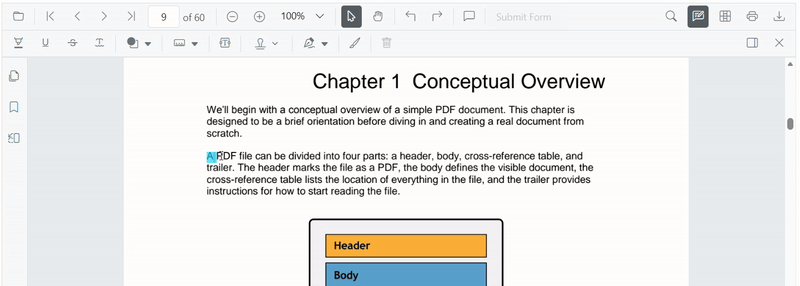
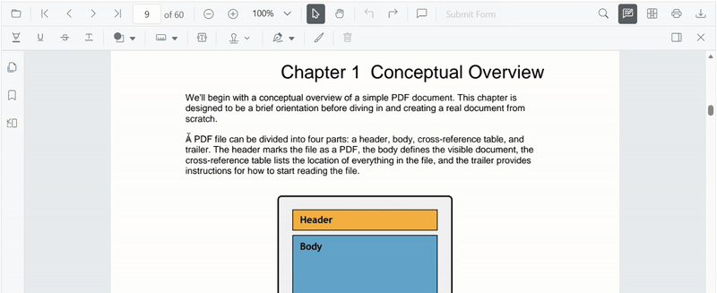

# Underline Annotation (Text Markup) in Angular PDF Viewer

This guide explains how to **enable**, **apply**, **customize**, and **manage** *Underline* text markup annotations in the Syncfusion **Angular PDF Viewer**. You can underline text using the toolbar or context menu, programmatically invoke underline mode, customize default settings, handle events, and export the PDF with annotations.

## Enable Underline in the Viewer
To enable Underline annotations, inject the following modules into the Angular PDF Viewer:
- [**Annotation**](https://ej2.syncfusion.com/angular/documentation/api/pdfviewer/index-default#annotation)
- [**TextSelection**](https://ej2.syncfusion.com/angular/documentation/api/pdfviewer/index-default#textselection)
- [**Toolbar**](https://ej2.syncfusion.com/angular/documentation/api/pdfviewer/index-default#toolbar)

This minimal setup enables UI interactions like selection and underlining.




import { Component } from '@angular/core';
import {
  PdfViewerModule,
  ToolbarService,
  AnnotationService,
  TextSelectionService
} from '@syncfusion/ej2-angular-pdfviewer';

@Component({
  selector: 'app-root',
  template: `
    

      <ejs-pdfviewer
        id="container"
        [documentPath]="document"
        [resourceUrl]="resource"
        style="height:650px;display:block">
      </ejs-pdfviewer>
    

  `,
  imports: [PdfViewerModule],
  providers: [ToolbarService, AnnotationService, TextSelectionService]
})
export class AppComponent {

  public document: string =
    'https://cdn.syncfusion.com/content/pdf/pdf-succinctly.pdf';

  public resource: string =
    'https://cdn.syncfusion.com/ej2/31.2.2/dist/ej2-pdfviewer-lib';
}




## Add Underline Annotation

### Add Underline Using the Toolbar
1. Select the text you want to underline.
2. Click the **Underline** icon in the annotation toolbar.
   - If **Pan Mode** is active, the viewer automatically switches to **Text Selection** mode.

### Apply underline using Context Menu
Right-click a selected text region → select **Underline**.

To customize menu items, refer to [**Customize Context Menu**](../../context-menu/custom-context-menu) documentation.

### Enable Underline Mode
Switch the viewer into underline mode using `setAnnotationMode('Underline')`.




enableUnderline(): void {
  const pdfViewer = (document.getElementById('container') as any).ej2_instances[0];
  pdfViewer.annotation.setAnnotationMode('Underline');
}




#### Exit Underline Mode
Switch back to normal mode using:




exitUnderlineMode(): void {
  const pdfViewer = (document.getElementById('container') as any).ej2_instances[0];
  pdfViewer.annotation.setAnnotationMode('None');
}




### Add Underline Programmatically
Use [`addAnnotation()`](https://ej2.syncfusion.com/angular/documentation/api/pdfviewer/index-default#addannotation) to insert an underline at a specific location.




addUnderline(): void {
  const pdfViewer = (document.getElementById('container') as any).ej2_instances[0];
  pdfViewer.annotation.addAnnotation('Underline', {
    bounds: [{ x: 97, y: 110, width: 350, height: 14 }],
    pageNumber: 1
  });
}




## Customize Underline Appearance
Configure default underline settings such as **color**, **opacity**, and **author** using [`underlineSettings`](https://ej2.syncfusion.com/angular/documentation/api/pdfviewer/index-default#underlinesettings).




import { Component } from '@angular/core';
import {
  PdfViewerModule,
  ToolbarService,
  AnnotationService,
  TextSelectionService
} from '@syncfusion/ej2-angular-pdfviewer';

@Component({
  selector: 'app-root',
  template: `
    

      <ejs-pdfviewer
        id="container"
        [documentPath]="document"
        [resourceUrl]="resource"
        [underlineSettings]="underlineSettings"
        style="height:650px;display:block">
      </ejs-pdfviewer>
    

  `,
  imports: [PdfViewerModule],
  providers: [ToolbarService, AnnotationService, TextSelectionService]
})
export class AppComponent {

  public document: string =
    'https://cdn.syncfusion.com/content/pdf/pdf-succinctly.pdf';

  public resource: string =
    'https://cdn.syncfusion.com/ej2/31.2.2/dist/ej2-pdfviewer-lib';

  public underlineSettings = {
    author: 'Guest User',
    subject: 'Important',
    color: '#00aa00',
    opacity: 0.9
  };
}




## Manage Underline (Edit, Delete, Comment)

### Edit Underline

#### Edit Underline Appearance (UI)
Use the annotation toolbar:
- **Edit Color** tool  

- **Edit Opacity** slider  

#### Edit Underline Programmatically
Modify an existing underline programmatically using `editAnnotation()`.




editUnderlineProgrammatically(): void {
  const pdfViewer = (document.getElementById('container') as any).ej2_instances[0];
  for (let annot of pdfViewer.annotationCollection) {
    if (annot.textMarkupAnnotationType === 'Underline') {
      annot.color = '#0000ff';
      annot.opacity = 0.8;
      pdfViewer.annotation.editAnnotation(annot);
      break;
    }
  }
}




### Delete Underline
The PDF Viewer supports deleting existing annotations through both the UI and API. For detailed behavior, supported deletion workflows, and API reference, see [**Delete Annotation**](../remove-annotations).

### Comments
Use the [**Comments panel**](../comments) to add, view, and reply to threaded discussions linked to underline annotations. It provides a dedicated UI for reviewing feedback, tracking conversations, and collaborating on annotation–related notes within the PDF Viewer.

## Set properties while adding Individual Annotation
Set properties for individual annotations when adding them programmatically by supplying fields on each `addAnnotation('Underline', …)` call.




addMultipleUnderlines(): void {
  const pdfViewer = (document.getElementById('container') as any).ej2_instances[0];
  // Underline 1
  pdfViewer.annotation.addAnnotation('Underline', {
    bounds: [{ x: 100, y: 150, width: 320, height: 14 }],
    pageNumber: 1,
    author: 'User 1',
    color: '#ffff00',
    opacity: 0.9
  });
  // Underline 2
  pdfViewer.annotation.addAnnotation('Underline', {
    bounds: [{ x: 110, y: 220, width: 300, height: 14 }],
    pageNumber: 1,
    author: 'User 2',
    color: '#ff1010',
    opacity: 0.9
  });
}




## Disable TextMarkup Annotation
Disable text markup annotations (including underline) using the [`enableTextMarkupAnnotation`](https://ej2.syncfusion.com/angular/documentation/api/pdfviewer/index-default#enabletextmarkupannotation) property.




import { Component } from '@angular/core';
import {
  PdfViewerModule,
  ToolbarService,
  AnnotationService,
  TextSelectionService
} from '@syncfusion/ej2-angular-pdfviewer';

@Component({
  selector: 'app-root',
  template: `
    

      <ejs-pdfviewer
        id="container"
        [documentPath]="document"
        [resourceUrl]="resource"
        [enableTextMarkupAnnotation]="false"
        style="height:650px;display:block">
      </ejs-pdfviewer>
    

  `,
  imports: [PdfViewerModule],
  providers: [ToolbarService, AnnotationService, TextSelectionService]
})
export class AppComponent {

  public document: string =
    'https://cdn.syncfusion.com/content/pdf/pdf-succinctly.pdf';

  public resource: string =
    'https://cdn.syncfusion.com/ej2/31.2.2/dist/ej2-pdfviewer-lib';
}




## Handle Underline Events
The PDF viewer provides annotation life-cycle events that notify when underline annotations are added, modified, selected, or removed. For the full list of available events and their descriptions, see [**Annotation Events**](../annotation-event).

## Export and Import
The PDF Viewer supports exporting and importing annotations, allowing you to save annotations as a separate file or load existing annotations back into the viewer. For full details on supported formats and steps to export or import annotations, see [**Export and Import Annotation**](../export-import-annotations)

## See Also
- [Annotation Toolbar](../../toolbar-customization/annotation-toolbar)
- [Customize Context Menu](../../context-menu/custom-context-menu)
- [Comments Panel](../comments)
- [Annotation Events](../annotation-event)
- [Export and Import annotations](../export-import-annotations)
- [Delete Annotations](../remove-annotations)
