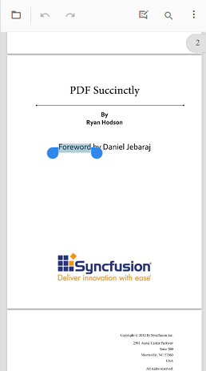
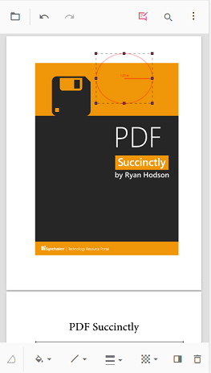
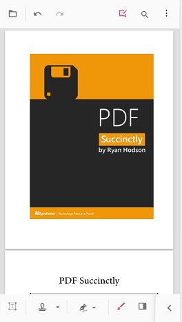
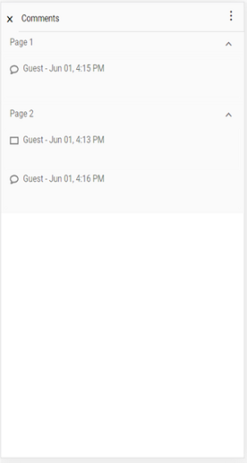

# Annotations in mobile view in Angular PDF Viewer control

This article describes how to use annotation tools in the Syncfusion Angular PDF Viewer on touch-enabled (mobile) devices. It covers enabling the annotation toolbar, adding common annotation types, adjusting annotation properties, using comments, and removing annotations.

## Open the annotation toolbar

**Step 1:** Tap the Edit Annotation icon on the main toolbar to enable the annotation toolbar.

**Step 2:** The annotation toolbar opens below the main toolbar, showing available annotation tools for touch interaction.

## Add sticky note annotations

**Step 1:** Tap the Sticky Notes icon to activate the sticky note tool, then tap the target location on the page to place a note.

**Step 2:** A sticky note annotation is added at the tapped location; tap the note to open or edit its content.

## Add text markup annotations

**Step 1:** Tap a text markup tool (for example, highlight or underline), then drag to select the text to be marked.

**Step 2:** Tap the selected area or use the toolbar action to apply the markup; the selected text is then annotated accordingly.

## Add shape and measurement annotations

**Step 1:** Tap the Shape or Measure icon to open the shape/measurement toolbar.

**Step 2:** Choose a shape or measurement type, then draw the annotation on the page using touch gestures.

**Step 3:** The shape or measurement annotation is added to the PDF and can be adjusted via its property toolbar.

## Add stamp annotations

**Step 1:** Tap the Stamp icon, then choose a stamp type from the presented menu.

**Step 2:** Tap the desired location on the page to place the stamp annotation.

## Add signature annotations

**Step 1:** Tap the Signature icon to open the signature canvas. Draw the signature, tap Create, then tap the viewer to place the signature on the page.

**Step 2:** The signature annotation is added and can be positioned or resized using standard touch controls.

## Add ink annotations

**Step 1:** Tap the Ink tool and draw directly on the page using a finger or stylus.

**Step 2:** The ink strokes are saved as an ink annotation and remain editable until committed.

## Change annotation properties (before adding)

**Step 1:** Open the annotation property toolbar prior to placing an annotation to set attributes such as color, opacity, stroke thickness, font, or measurement units.

**Step 2:** With the desired properties selected in the property toolbar, place the annotation on the page; the chosen settings apply to the new annotation.

## Change annotation properties (after adding)

**Step 1:** Select an existing annotation to reveal its property toolbar.

**Step 2:** Adjust properties such as color, opacity, stroke, or edit text; changes are applied immediately to the selected annotation.

## Delete annotations

**Step 1:** Select the annotation to display its property toolbar, then tap the Delete icon to remove the annotation from the page.

## Open the comment panel

**Step 1:** Tap the comment icon in the property toolbar or the annotation toolbar to open the comment panel for the selected annotation.

**Step 2:** The comment panel appears, showing existing comments and allowing new comments to be added.

## Close the comment panel

**Step 1:** Tap the Close button in the comment panel to dismiss it and return to the document view.

