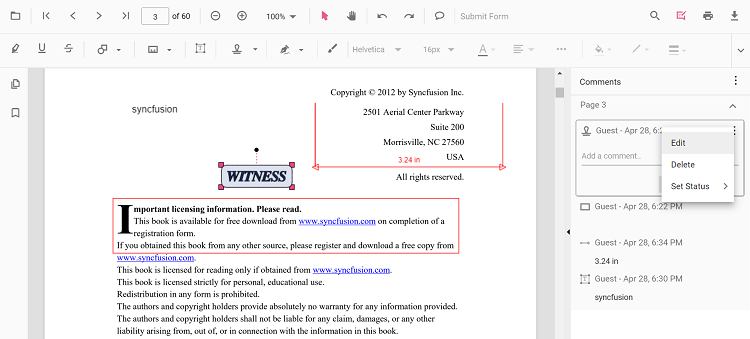

# Comments

The Angular PDF Viewer component provides options to add, edit, and delete comments for the following annotations in PDF documents:

* Shape annotation
* Stamp annotation
* Sticky note annotation
* Measurement annotation
* Text markup annotation
* Free text annotation
* Ink annotation


## Add a comment to an annotation

Comments, replies, and status can be added to the PDF document using the Comments panel.

### Comments panel

Annotation comments can be added using the Comments panel. Open the Comments panel in any of the following ways:

1. Using the annotation toolbar

    * Click the **Edit Annotation** button in the PDF Viewer toolbar. The annotation toolbar appears.
    * Click the **Comment Panel** button. The Comments panel appears.

2. Using the context menu

    * Select an annotation in the PDF document and right‑click it.
    * Select the comment option in the context menu that appears.

3. Using mouse clicks

    * Select an annotation in the PDF document and double‑click it. The Comments panel appears.

If the Comments panel is already open, select annotations and add comments using the panel.

### Add comments

* Select an annotation in the PDF document and click it.
* The selected annotation’s comment container is highlighted in the Comments panel.
* Add a comment or reply using the Comments panel.


### Add comment replies

* The PDF Viewer component provides an option to add multiple replies to a comment.
* After adding a comment, add replies as needed.

### Set comment or reply status

* Select the annotation comments in the Comments panel.
* Click the More options button in the comment or reply container.
* Select the Set Status option in the context menu that appears.
* Select the desired status for the comment.


### Edit comments and replies for annotations

The comment, comment replies, and status of the annotation can be edited using the comment panel.

### Edit a comment or reply

The annotation comment and comment replies can be edited in the following ways:

1. Using the context menu

    * Select the annotation comments in the Comments panel.
    * Click the More options button in the comment or reply container.
    * Select the Edit option in the context menu that appears.
    * Now, an editable text box appears. You can change the content of the annotation comment or comment reply.

2. Using mouse clicks

    * Select the annotation comments in the Comments panel.
    * Double‑click the comment or reply content.
    * Now, an editable text box appears. You can change the content of the annotation comment or comment reply.

### Edit comment or reply status

* Select the annotation comments in the Comments panel.
* Click the More options button in the comment or reply container.
* Select the Set Status option in the context menu that appears.
* Select the desired status for the comment.
* Status ‘None’ is the default state. When set to ‘None,’ the comment or reply is hidden.



### Delete a comment or reply

* Select the annotation comments in the Comments panel.
* Click the More options button in the comment or reply container.
* Select the Delete option in the context menu that appears.


>Deleting a comment from the Comments panel deletes the associated annotation.

## Check comments added by the user

Comments added to the PDF document can be viewed using the `comments` property of the annotation.

Refer to the following code to check the comments added to the PDF document using a button click event.




```html
<button (click)="checkComments()">Check the Comments</button>
<!--Render PDF Viewer component-->
<ejs-pdfviewer id="pdfViewer"
               [documentPath]='document'
               style="height:640px;display:block">
</ejs-pdfviewer>

```



```html
<button (click)="checkComments()">Check the Comments</button>
<!--Render PDF Viewer component-->
<ejs-pdfviewer id="pdfViewer"
               [serviceUrl]='service'
               [documentPath]='document'
               style="height:640px;display:block">
</ejs-pdfviewer>

```




```typescript
//Method to check the comments added in the PDF document.
checkComments(){
  var pdfviewer = (<any>document.getElementById("pdfViewer")).ej2_instances[0];
  var annotationCollections = pdfviewer.annotationCollection;
  for (var x = 0; x < annotationCollections.length; x++) {
    //Prints the annotation id in the console window.
    console.log(annotationCollections[x].annotationId);
    var comments = annotationCollections[x].comments;
    for (var y = 0; y < comments.length; y++) {
      var comment = comments[y];
      //Prints the PDF document's comments in the console window.
      console.log("comment" + "[" + y + "] :" + comment.note);
    }
    var note = annotationCollections[x].note;
    console.log("note : " + note);
  }
}

```

[View sample in GitHub](https://github.com/SyncfusionExamples/angular-pdf-viewer-examples/tree/master/Annotations/How%20to%20check%20the%20comments)