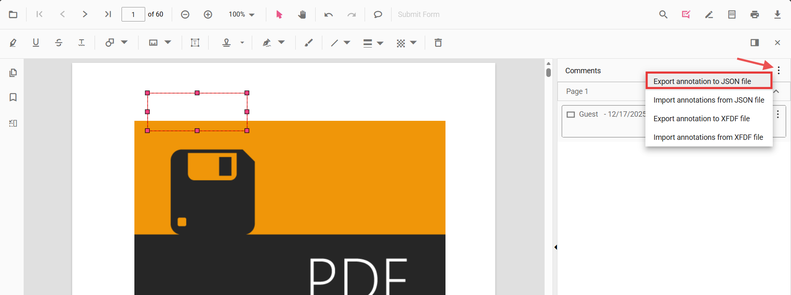

# Export annotations in Angular PDF Viewer

PDF Viewer provides support to export annotations. You can export annotations from the PDF Viewer in two ways:

- Using the built-in UI in the Comments panel (JSON or XFDF file)
- Programmatically (JSON, XFDF, or as an object for custom handling)

## Export using the UI (Comments panel)

The Comments panel provides export actions in its overflow menu:

- Export annotation to JSON file
- Export annotation to XFDF file

Follow the steps to export annotations:

1. Open the Comments panel in the PDF Viewer.
2. Click the overflow menu (three dots) at the top of the panel.
3. Choose Export annotation to JSON file or Export annotation to XFDF file.

This generates and downloads the selected format containing all annotations in the current document.

## Export programmatically

You can export annotations from code using
[exportAnnotation](https://ej2.syncfusion.com/angular/documentation/api/pdfviewer/index-default#exportannotation),
[exportAnnotationsAsObject](https://ej2.syncfusion.com/angular/documentation/api/pdfviewer/index-default#exportannotationsasobject)
and
[exportAnnotationsAsBase64String](https://ej2.syncfusion.com/angular/documentation/api/pdfviewer/index-default#exportannotationsasbase64string)
APIs.

Use the following example to initialize the viewer and export annotations as JSON, XFDF, or as an object.



import { Component } from '@angular/core';
import {
  PdfViewerModule,
  ToolbarService,
  AnnotationService,
  TextSelectionService,
  AnnotationDataFormat
} from '@syncfusion/ej2-angular-pdfviewer';

@Component({
  selector: 'app-root',
  imports: [PdfViewerModule],
  providers: [ToolbarService, AnnotationService, TextSelectionService],
  template: `
    

      <button (click)="exportAsJSON()">Export JSON</button>
      <button (click)="exportAsXFDF()">Export XFDF</button>
      <button (click)="exportAsObject()">Export as Object</button>
      <button (click)="exportAsBase64()">Export as Base64</button>
    

    <ejs-pdfviewer
      id="pdfViewer"
      [documentPath]="document"
      [resourceUrl]="resource"
      style="height: 650px">
    </ejs-pdfviewer>
  `
})
export class AppComponent {
  public document: string = 'https://cdn.syncfusion.com/content/pdf/pdf-succinctly.pdf';
  public resource: string = 'https://cdn.syncfusion.com/ej2/31.2.2/dist/ej2-pdfviewer-lib';

  private getViewer(): any {
    return (document.getElementById('pdfViewer') as any).ej2_instances[0];
  }

  exportAsJSON(): void {
    this.getViewer().exportAnnotation(AnnotationDataFormat.Json);
  }

  exportAsXFDF(): void {
    this.getViewer().exportAnnotation(AnnotationDataFormat.Xfdf);
  }

  exportAsObject(): void {
    this.getViewer().exportAnnotationsAsObject().then((value: any) => {
      console.log('Exported annotation object:', value);
    });
  }

  exportAsBase64(): void {
    this.getViewer()
      .exportAnnotationsAsBase64String(AnnotationDataFormat.Json)
      .then((value: string) => {
        console.log('Exported Base64:', value);
      });
  }
}



## Common use cases
- Archive or share annotations as portable JSON/XFDF files
- Save annotations alongside a document in your storage layer
- Send annotations to a backend for collaboration or review workflows
- Export as object for custom serialization and re-import later

## See also
- [Annotation Overview](../../overview)
- [Annotation Types](../../annotation/annotation-types/area-annotation)
- [Annotation Toolbar](../../toolbar-customization/annotation-toolbar)
- [Create and Modify Annotation](../../annotation/create-modify-annotation)
- [Customize Annotation](../../annotation/customize-annotation)
- [Remove Annotation](../../annotation/delete-annotation)
- [Handwritten Signature](../../annotation/signature-annotation)
- [Import Annotation](../export-import/import-annotation)
- [Import Export Events](../export-import/export-import-events)
- [Annotation Permission](../../annotation/annotation-permission)
- [Annotation in Mobile View](../../annotation/annotations-in-mobile-view)
- [Annotation Events](../../annotation/annotation-event)
- [Annotation API](../../annotation/annotations-api)