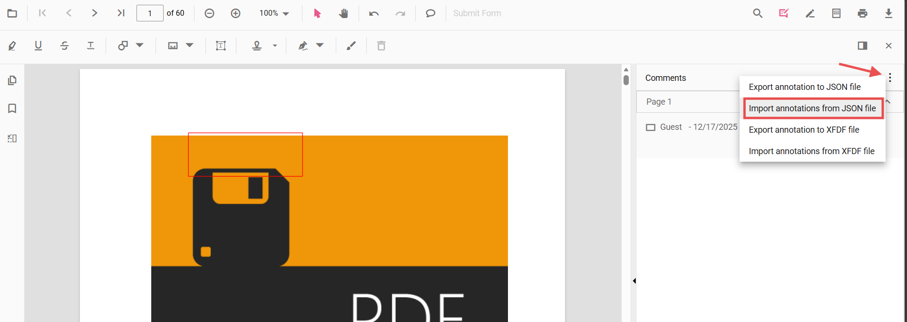

# Import annotations in Angular PDF Viewer

Annotations can be imported into the PDF Viewer using the built-in UI or programmatically.
The UI accepts JSON and XFDF files from the Comments panel; programmatic import accepts an annotation object previously exported by the viewer.

## Import using the UI (Comments panel)

The Comments panel provides import options in its overflow menu:

- Import annotations from JSON file
- Import annotations from XFDF file

Steps:
1. Open the Comments panel in the PDF Viewer.
2. Click the overflow menu (three dots) at the top of the panel.
3. Choose the appropriate import option and select the file.

All annotations in the selected file are applied to the current document.

## Import programmatically (from object)

Import annotations from an object previously exported using `exportAnnotationsAsObject()`.
Only objects produced by the viewer can be re-imported with the
[`importAnnotation`](https://ej2.syncfusion.com/angular/documentation/api/pdfviewer/index-default#importannotation)
API.

Example: export annotations as an object and import them back into the viewer.



import { Component } from '@angular/core';
import {
  PdfViewerModule,
  ToolbarService,
  AnnotationService,
  TextSelectionService
} from '@syncfusion/ej2-angular-pdfviewer';

@Component({
  selector: 'app-root',
  imports: [PdfViewerModule],
  providers: [ToolbarService, AnnotationService, TextSelectionService],
  template: `
    <button (click)="exportAsObject()">Export as Object</button>
    <button (click)="importFromObject()">Import from Object</button>

    <ejs-pdfviewer
      id="pdfViewer"
      [documentPath]="document"
      [resourceUrl]="resource"
      style="height: 650px">
    </ejs-pdfviewer>
  `
})
export class AppComponent {
  public document: string = 'https://cdn.syncfusion.com/content/pdf/pdf-succinctly.pdf';
  public resource: string = 'https://cdn.syncfusion.com/ej2/31.2.2/dist/ej2-pdfviewer-lib';

  private exportedObject: any = null;

  private getViewer(): any {
    return (document.getElementById('pdfViewer') as any).ej2_instances[0];
  }

  exportAsObject(): void {
    this.getViewer().exportAnnotationsAsObject().then((value: any) => {
      console.log('Exported annotation object:', value);
      this.exportedObject = value;
    });
  }

  importFromObject(): void {
    if (this.exportedObject) {
      this.getViewer().importAnnotation(JSON.parse(this.exportedObject));
    }
  }
}



N> Only objects produced by the viewer (for example, by `exportAnnotationsAsObject()`) are compatible with `importAnnotation`. Persist exported objects in a safe storage location (database or API) and validate them before import.

## Common use cases
- Restore annotations saved earlier (for example, from a database or API)
- Apply reviewer annotations shared as JSON/XFDF files via the Comments panel
- Migrate or merge annotations between documents or sessions
- Support collaborative workflows by reloading team annotations

## See also
- [Annotation Overview](../../overview)
- [Annotation Types](../../annotations/annotation-types/area-annotation)
- [Annotation Toolbar](../../toolbar-customization/annotation-toolbar)
- [Create and Modify Annotation](../../annotations/create-modify-annotation)
- [Customize Annotation](../../annotations/customize-annotation)
- [Remove Annotation](../../annotations/delete-annotation)
- [Handwritten Signature](../../annotations/signature-annotation)
- [Export Annotation](../export-import/export-annotation)
- [Import Export Events](../export-import/export-import-events)
- [Annotation Permission](../../annotations/annotation-permission)
- [Annotation in Mobile View](../../annotations/annotations-in-mobile-view)
- [Annotation Events](../../annotations/annotation-event)
- [Annotation API](../../annotations/annotations-api)