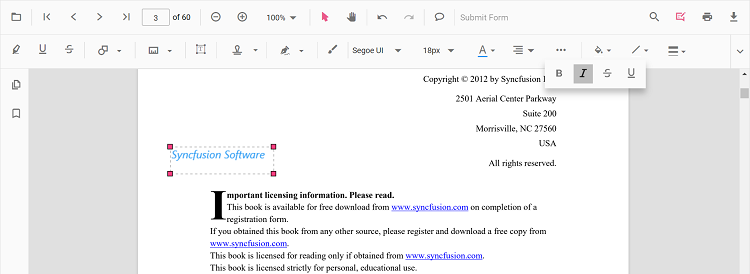

# Free text annotation in Angular PDF Viewer control

The PDF Viewer control supports adding, editing, and deleting free text annotations. This article explains how to add free text annotations using the toolbar and programmatically, modify their properties, and manage selection and focus.

## Add a free text annotation to the PDF document

Free text annotations can be added to the PDF document using the annotation toolbar.

* Click the **Edit Annotation** button in the PDF Viewer toolbar. The annotation toolbar appears below it.
* Select the **Free Text Annotation** button to enable free text annotation mode.
* Add text anywhere on the pages of the PDF document.

When in pan mode, selecting free text annotation switches the PDF Viewer to text-selection mode.


The following example switches to free text annotation mode using a button click.



import { Component, OnInit } from '@angular/core';
import { LinkAnnotationService, BookmarkViewService,
         MagnificationService, ThumbnailViewService, ToolbarService,
         NavigationService, TextSearchService, TextSelectionService,
         PrintService, FormDesignerService, FormFieldsService,
         AnnotationService, PageOrganizerService,
       } from '@syncfusion/ej2-angular-pdfviewer';
  @Component({
    selector: 'app-root',
    // Specifies the template string for the PDF Viewer component.
    template: `<button (click)="addAnnotation()">Add FreeText annotation</button>
                <div class="content-wrapper">
                <ejs-pdfviewer id="pdfViewer"
                              [documentPath]='document'
                              [resourceUrl] = 'resource'
                              style="height:640px;display:block">
                </ejs-pdfviewer>
                </div>`,
    providers: [ LinkAnnotationService, BookmarkViewService, MagnificationService,
                 ThumbnailViewService, ToolbarService, NavigationService,
                 TextSearchService, TextSelectionService, PrintService, FormDesignerService,
                 FormFieldsService, AnnotationService, PageOrganizerService]
    })
  export class AppComponent implements OnInit {
      public document: string = 'https://cdn.syncfusion.com/content/pdf/pdf-succinctly.pdf';
      public resource: string = "https://cdn.syncfusion.com/ej2/25.1.35/dist/ej2-pdfviewer-lib";
      ngOnInit(): void {
      }
      addAnnotation() {
          var pdfviewer = (<any>document.getElementById("pdfViewer")).ej2_instances[0];
          pdfviewer.annotationModule.setAnnotationMode("FreeText");
      }
  }



import { Component, OnInit } from '@angular/core';
import { LinkAnnotationService, BookmarkViewService,
         MagnificationService, ThumbnailViewService, ToolbarService,
         NavigationService, TextSearchService, TextSelectionService,
         PrintService, FormDesignerService, FormFieldsService,
         AnnotationService, PageOrganizerService,
       } from '@syncfusion/ej2-angular-pdfviewer';
  @Component({
    selector: 'app-root',
    // Specifies the template string for the PDF Viewer component.
    template: `<button (click)="addAnnotation()">Add FreeText annotation</button>
                <div class="content-wrapper">
                <ejs-pdfviewer id="pdfViewer"
                              [documentPath]='document'
                              [serviceUrl] = 'service'
                              style="height:640px;display:block">
                </ejs-pdfviewer>
                </div>`,
    providers: [ LinkAnnotationService, BookmarkViewService, MagnificationService,
                 ThumbnailViewService, ToolbarService, NavigationService,
                 TextSearchService, TextSelectionService, PrintService, FormDesignerService,
                 FormFieldsService, AnnotationService, PageOrganizerService]
    })
  export class AppComponent implements OnInit {
      public document: string = 'https://cdn.syncfusion.com/content/pdf/pdf-succinctly.pdf';
      public service: string = 'https://document.syncfusion.com/web-services/pdf-viewer/api/pdfviewer';
      ngOnInit(): void {
      }
      addAnnotation() {
          var pdfviewer = (<any>document.getElementById("pdfViewer")).ej2_instances[0];
          pdfviewer.annotationModule.setAnnotationMode("FreeText");
      }
  }



## Clear selection focus from free text annotation

Clear the selection focus for free text annotations by calling the [setAnnotationMode](https://ej2.syncfusion.com/angular/documentation/api/pdfviewer/annotation) API on the `annotationModule`.

The following sample removes the selection from the currently selected annotation using a button click.




<button (click)="RemoveSelection()">RemoveSelection</button>

<ejs-pdfviewer id="pdfViewer"
               [documentPath]='document'
               style="height:640px;display:block">
</ejs-pdfviewer>

//Event triggers while clicking the RemoveSelection button.
RemoveSelection() {
  var pdfviewer = (<any>document.getElementById('pdfViewer')).ej2_instances[0];
  // API to remove selection from the free text annotation.
  pdfviewer.annotationModule.setAnnotationMode('None');
}





<button (click)="RemoveSelection()">RemoveSelection</button>

<ejs-pdfviewer id="pdfViewer"
               [serviceUrl]='service'
               [documentPath]='document'
               style="height:640px;display:block">
</ejs-pdfviewer>

//Event triggers while clicking the RemoveSelection button.
RemoveSelection() {
  var pdfviewer = (<any>document.getElementById('pdfViewer')).ej2_instances[0];
  //API to remove the selection from the free text annotation.
  pdfviewer.annotationModule.setAnnotationMode('None');
}




[View sample in GitHub](https://github.com/SyncfusionExamples/angular-pdf-viewer-examples/tree/master/Annotations/How%20to%20clear%20the%20selection%20from%20annotation)

## Add a free text annotation programmatically to the PDF document

Add a free text annotation programmatically using the [addAnnotation()](https://ej2.syncfusion.com/angular/documentation/api/pdfviewer/annotation#addannotationn) method. The example below demonstrates adding a FreeText annotation with styling and position properties.




import { Component, OnInit } from '@angular/core';
import { LinkAnnotationService, BookmarkViewService,
         MagnificationService, ThumbnailViewService, ToolbarService,
         NavigationService, TextSearchService, TextSelectionService,
         PrintService, FormDesignerService, FormFieldsService,
         AnnotationService, PageOrganizerService, FreeTextSettings } from '@syncfusion/ej2-angular-pdfviewer';

@Component({
  selector: 'app-root',
  // specifies the template string for the PDF Viewer component
  template: `<div class="content-wrapper">
  <button (click)="addAnnotation()">Add FreeText annotation Programmatically</button>
  <ejs-pdfviewer
    id="pdfViewer"
    [documentPath]='document'
    [resourceUrl]='resource'
    style="height:640px;display:block">
  </ejs-pdfviewer>
</div>`,
  providers: [LinkAnnotationService, BookmarkViewService, MagnificationService,
    ThumbnailViewService, ToolbarService, NavigationService,
    TextSearchService, TextSelectionService, PrintService,
    AnnotationService, FormDesignerService, FormFieldsService, PageOrganizerService]
})
export class AppComponent implements OnInit {
  public document = 'https://cdn.syncfusion.com/content/pdf/pdf-succinctly.pdf';
  public resource: string = "https://cdn.syncfusion.com/ej2/25.1.35/dist/ej2-pdfviewer-lib";
  ngOnInit(): void {
  }
  addAnnotation() {
    var pdfviewer = (<any>document.getElementById('pdfViewer')).ej2_instances[0];
    pdfviewer.annotation.addAnnotation("FreeText", {
      offset: { x: 100, y: 150 },
      fontSize: 16,
      fontFamily: "Helvetica",
      pageNumber: 1,
      width: 200,
      height: 40,
      isLock: false,
      textAlignment : 'Center',
      borderStyle : 'solid',
      borderWidth : 2,
      borderColor : 'red',
      fillColor : 'blue',
      fontColor: 'white',
      defaultText: "Syncfusion"
    } as FreeTextSettings);
  }
}




import { Component, OnInit } from '@angular/core';
import { LinkAnnotationService, BookmarkViewService,
         MagnificationService, ThumbnailViewService, ToolbarService,
         NavigationService, TextSearchService, TextSelectionService,
         PrintService, FormDesignerService, FormFieldsService,
         AnnotationService, PageOrganizerService, FreeTextSettings } from '@syncfusion/ej2-angular-pdfviewer';

@Component({
  selector: 'app-root',
  // specifies the template string for the PDF Viewer component
  template: `<div class="content-wrapper">
  <button (click)="addAnnotation()">Add FreeText annotation Programmatically</button>
  <ejs-pdfviewer
    id="pdfViewer"
    [documentPath]='document'
    [serviceUrl]='service'
    style="height:640px;display:block">
  </ejs-pdfviewer>
</div>`,
  providers: [LinkAnnotationService, BookmarkViewService, MagnificationService,
    ThumbnailViewService, ToolbarService, NavigationService,
    TextSearchService, TextSelectionService, PrintService,
    AnnotationService, FormDesignerService, FormFieldsService, PageOrganizerService]
})
export class AppComponent implements OnInit {
  public document = 'https://cdn.syncfusion.com/content/pdf/pdf-succinctly.pdf';
  public service: string = 'https://document.syncfusion.com/web-services/pdf-viewer/api/pdfviewer';
  ngOnInit(): void {
  }
  addAnnotation() {
    var pdfviewer = (<any>document.getElementById('pdfViewer')).ej2_instances[0];
    pdfviewer.annotation.addAnnotation("FreeText", {
      offset: { x: 100, y: 150 },
      fontSize: 16,
      fontFamily: "Helvetica",
      pageNumber: 1,
      width: 200,
      height: 40,
      isLock: false,
      textAlignment : 'Center',
      borderStyle : 'solid',
      borderWidth : 2,
      borderColor : 'red',
      fillColor : 'blue',
      fontColor: 'white',
      defaultText: "Syncfusion"
    } as FreeTextSettings);
  }
}





## Edit free text annotation properties

Free text annotation properties that can be modified using the annotation toolbar include font family, font size, font styles, font color, text alignment, fill color, stroke color, border thickness, and opacity. The toolbar provides dedicated controls for each of these settings.

### Font family

Choose a font family from the Font Family tool to update the annotation text.


### Font size

Choose a size from the Font Size tool to update the annotation text size.


### Font color

Select a color from the Font Color palette to change the font color.


### Text alignment

Use the Text Align tool to set the annotation text alignment.


### Font styles

Enable bold, italic, or underline using the Font Style tool.



### Fill color

Set the annotation background using the Edit Color tool.


### Stroke color

Set the annotation border color using the Edit Stroke Color tool.


### Thickness

Adjust border thickness with the Edit Thickness slider.


### Opacity

Adjust annotation opacity with the Edit Opacity slider.


## Move free text annotation programmatically

Move a free text annotation programmatically by updating its `bounds` and calling `editAnnotation()` on the annotation module.

```html
 <button (click)="moveFreeText()">Move the Free Text</button>
```

```typescript

  moveFreeText() {
    var viewer = (<any>document.getElementById('pdfViewer')).ej2_instances[0];
    for (let i = 0; i < viewer.annotationCollection.length; i++)
    {
      if (viewer.annotationCollection[i].subject === "Text Box") {
        var width = viewer.annotationCollection[i].bounds.width;
        var height = viewer.annotationCollection[i].bounds.height;
        viewer.annotationCollection[i].bounds = {x : 100, y: 100, width: width, height: height };
        viewer.annotation.editAnnotation(viewer.annotationCollection[i]);
      }
    }
  }

```

Find the sample: how to move the free text annotation programmatically (https://stackblitz.com/edit/angular-dxub1a-qjbisb?file=app.component.ts)


## Get the ID of a newly added free text annotation

Use the `annotationAdd` event to obtain the ID of a newly added free text annotation. The event handler receives an argument with the `annotationId` property for the created annotation.

```typescript

public annotationAddEventHandler(args) {
  if (args.annotationType === 'FreeText') {
    console.log('annotationId:' + args.annotationId);
  }
}

```

Find the sample: how to get the newly added free text annotation id (https://stackblitz.com/edit/angular-dxub1a-utuefq?file=app.component.ts)


## Change the content of an existing free text annotation programmatically

Change the text content of an existing free text annotation by updating its `dynamicText` property and calling `editAnnotation()`.

```html
 <button (click)="changeContent()">Change Content</button>
```

```typescript

changeContent() {
  var viewer = (<any>document.getElementById('pdfViewer')).ej2_instances[0];
  for (let i = 0; i < viewer.annotationCollection.length; i++) {
    if (viewer.annotationCollection[i].subject === 'Text Box') {
      viewer.annotationCollection[i].dynamicText = 'syncfusion';
      viewer.annotation.editAnnotation(viewer.annotationCollection[i]);
    }
  }
}

```

N> The PDF Viewer cannot edit existing static PDF document text. It supports adding and modifying free text annotations only.


## Set default properties during control initialization

Default free text annotation properties can be configured before initializing the control by supplying `freeTextSettings`.

The example below shows how to set default free text annotation settings before the PDF Viewer is created.




import { Component, OnInit } from '@angular/core';
import { PdfViewerComponent, LinkAnnotationService, BookmarkViewService,
         MagnificationService, ThumbnailViewService, ToolbarService,
         NavigationService, TextSearchService, TextSelectionService,
         PrintService, AnnotationService, FormDesignerService, FormFieldsService,
         PageOrganizerService } from '@syncfusion/ej2-angular-pdfviewer';
@Component({
  selector: 'app-root',
  // Specifies the template string for the PDF Viewer component.
  template: `<div class="content-wrapper">
                <ejs-pdfviewer id="pdfViewer"
                      [documentPath]='document'
                      [freeTextSettings]='freeTextSettings'
                      [resourceUrl]='resource'
                      style="height:640px;display:block">
                </ejs-pdfviewer>
              </div>`,
  providers: [ LinkAnnotationService, BookmarkViewService, MagnificationService,
               ThumbnailViewService, ToolbarService, NavigationService,
               TextSearchService, TextSelectionService, PrintService,
               AnnotationService, FormDesignerService, FormFieldsService, PageOrganizerService]
  })
  export class AppComponent implements OnInit {
    public document: string = 'https://cdn.syncfusion.com/content/pdf/pdf-succinctly.pdf';
    public resource: string = "https://cdn.syncfusion.com/ej2/25.1.35/dist/ej2-pdfviewer-lib";
    public freeTextSettings = { fillColor: 'green', borderColor: 'blue', fontColor: 'yellow' };
    ngOnInit(): void {
    }
  }





import { Component, OnInit } from '@angular/core';
import { PdfViewerComponent, LinkAnnotationService, BookmarkViewService,
         MagnificationService, ThumbnailViewService, ToolbarService,
         NavigationService, TextSearchService, TextSelectionService,
         PrintService, AnnotationService, FormDesignerService, FormFieldsService,
         PageOrganizerService } from '@syncfusion/ej2-angular-pdfviewer';
@Component({
  selector: 'app-root',
  // Specifies the template string for the PDF Viewer component.
  template: `<div class="content-wrapper">
                <ejs-pdfviewer id="pdfViewer"
                      [serviceUrl]='service'
                      [documentPath]='document'
                      [freeTextSettings]='freeTextSettings'
                      style="height:640px;display:block">
                </ejs-pdfviewer>
              </div>`,
  providers: [ LinkAnnotationService, BookmarkViewService, MagnificationService,
               ThumbnailViewService, ToolbarService, NavigationService,
               TextSearchService, TextSelectionService, PrintService,
               AnnotationService, FormDesignerService, FormFieldsService, PageOrganizerService]
  })
  export class AppComponent implements OnInit {
    public service: string = 'https://document.syncfusion.com/web-services/pdf-viewer/api/pdfviewer';
    public document: string = 'https://cdn.syncfusion.com/content/pdf/pdf-succinctly.pdf';
    public freeTextSettings = { fillColor: 'green', borderColor: 'blue', fontColor: 'yellow' };
    ngOnInit(): void {
    }
  }




You can also enable the autofit support for free text annotation by using the enableAutoFit boolean property in freeTextSettings as below. The width of the free text rectangle box will be increased based on the text added to it.




import { Component, OnInit } from '@angular/core';
import {
  PdfViewerComponent, LinkAnnotationService, BookmarkViewService,
  MagnificationService, ThumbnailViewService, ToolbarService,
  NavigationService, TextSearchService, TextSelectionService,
  PrintService, AnnotationService, FormDesignerService, FormFieldsService,
  PageOrganizerService
} from '@syncfusion/ej2-angular-pdfviewer';
@Component({
  selector: 'app-root',
  // Specify the template string for the PDF Viewer component.
  template: `<div class="content-wrapper">
                <ejs-pdfviewer id="pdfViewer"
                      [documentPath]='document'
                      [freeTextSettings]='freeTextSettings'
                      [resourceUrl]='resource'
                      style="height:640px;display:block">
                </ejs-pdfviewer>
              </div>`,
  providers: [LinkAnnotationService, BookmarkViewService, MagnificationService,
    ThumbnailViewService, ToolbarService, NavigationService,
    TextSearchService, TextSelectionService, PrintService,
    AnnotationService, FormDesignerService, FormFieldsService, PageOrganizerService]
})
export class AppComponent implements OnInit {
  public document: string = 'https://cdn.syncfusion.com/content/pdf/pdf-succinctly.pdf';
  public resource: string = "https://cdn.syncfusion.com/ej2/25.1.35/dist/ej2-pdfviewer-lib";
  public freeTextSettings = { enableAutoFit: true };
  ngOnInit(): void {
  }
}





import { Component, OnInit } from '@angular/core';
import { PdfViewerComponent, LinkAnnotationService, BookmarkViewService,
         MagnificationService, ThumbnailViewService, ToolbarService,
         NavigationService, TextSearchService, TextSelectionService,
         PrintService, AnnotationService, FormDesignerService, FormFieldsService,
         PageOrganizerService } from '@syncfusion/ej2-angular-pdfviewer';
@Component({
  selector: 'app-root',
  // Specify the template string for the PDF Viewer component.
  template: `<div class="content-wrapper">
                <ejs-pdfviewer id="pdfViewer"
                      [serviceUrl]='service'
                      [documentPath]='document'
                      [freeTextSettings]='freeTextSettings'
                      style="height:640px;display:block">
                </ejs-pdfviewer>
              </div>`,
  providers: [ LinkAnnotationService, BookmarkViewService, MagnificationService,
               ThumbnailViewService, ToolbarService, NavigationService,
               TextSearchService, TextSelectionService, PrintService,
               AnnotationService, FormDesignerService, FormFieldsService, PageOrganizerService]
})
export class AppComponent implements OnInit {
  public service: string = 'https://document.syncfusion.com/web-services/pdf-viewer/api/pdfviewer';
  public document: string = 'https://cdn.syncfusion.com/content/pdf/pdf-succinctly.pdf';
  public freeTextSettings = { enableAutoFit: true };
  ngOnInit(): void {
  }
}




[View sample in GitHub](https://github.com/SyncfusionExamples/angular-pdf-viewer-examples/tree/master/Annotations/How%20to%20change%20the%20properties%20of%20free%20text%20annotation)