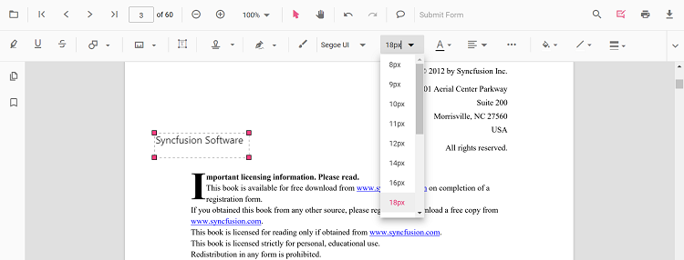
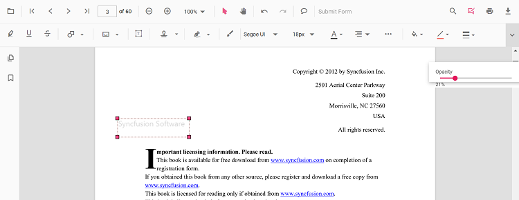

# Free text annotation in Angular PDF Viewer control

The PDF Viewer control provides options to add, edit, and delete free text annotations.

## Add a free text annotation to the PDF document

Free text annotations can be added to the PDF document using the annotation toolbar.

* Click the **Edit Annotation** button in the PDF Viewer toolbar. The annotation toolbar appears below it.
* Select the **Free Text Annotation** button to enable free text annotation mode.
* Add text anywhere on the pages of the PDF document.

When in pan mode, selecting free text annotation switches the PDF Viewer to text select mode.


The following example switches to free text annotation mode using a button click.



import { Component, OnInit } from '@angular/core';
import { LinkAnnotationService, BookmarkViewService,
         MagnificationService, ThumbnailViewService, ToolbarService,
         NavigationService, TextSearchService, TextSelectionService,
         PrintService, FormDesignerService, FormFieldsService,
         AnnotationService, PageOrganizerService,
       } from '@syncfusion/ej2-angular-pdfviewer';
  @Component({
    selector: 'app-root',
    // Specifies the template string for the PDF Viewer component.
    template: `<button (click)="addAnnotation()">Add FreeText annotation</button>
                <div class="content-wrapper">
                <ejs-pdfviewer id="pdfViewer"
                              [documentPath]='document'
                              [resourceUrl] = 'resource'
                              style="height:640px;display:block">
                </ejs-pdfviewer>
                </div>`,
    providers: [ LinkAnnotationService, BookmarkViewService, MagnificationService,
                 ThumbnailViewService, ToolbarService, NavigationService,
                 TextSearchService, TextSelectionService, PrintService, FormDesignerService,
                 FormFieldsService, AnnotationService, PageOrganizerService]
    })
  export class AppComponent implements OnInit {
      public document: string = 'https://cdn.syncfusion.com/content/pdf/pdf-succinctly.pdf';
      public resource: string = "https://cdn.syncfusion.com/ej2/25.1.35/dist/ej2-pdfviewer-lib";
      ngOnInit(): void {
      }
      addAnnotation() {
          var pdfviewer = (<any>document.getElementById("pdfViewer")).ej2_instances[0];
          pdfviewer.annotationModule.setAnnotationMode("FreeText");
      }
  }



import { Component, OnInit } from '@angular/core';
import { LinkAnnotationService, BookmarkViewService,
         MagnificationService, ThumbnailViewService, ToolbarService,
         NavigationService, TextSearchService, TextSelectionService,
         PrintService, FormDesignerService, FormFieldsService,
         AnnotationService, PageOrganizerService,
       } from '@syncfusion/ej2-angular-pdfviewer';
  @Component({
    selector: 'app-root',
    // Specifies the template string for the PDF Viewer component.
    template: `<button (click)="addAnnotation()">Add FreeText annotation</button>
                <div class="content-wrapper">
                <ejs-pdfviewer id="pdfViewer"
                              [documentPath]='document'
                              [serviceUrl] = 'service'
                              style="height:640px;display:block">
                </ejs-pdfviewer>
                </div>`,
    providers: [ LinkAnnotationService, BookmarkViewService, MagnificationService,
                 ThumbnailViewService, ToolbarService, NavigationService,
                 TextSearchService, TextSelectionService, PrintService, FormDesignerService,
                 FormFieldsService, AnnotationService, PageOrganizerService]
    })
  export class AppComponent implements OnInit {
      public document: string = 'https://cdn.syncfusion.com/content/pdf/pdf-succinctly.pdf';
      public service: string = 'https://document.syncfusion.com/web-services/pdf-viewer/api/pdfviewer';
      ngOnInit(): void {
      }
      addAnnotation() {
          var pdfviewer = (<any>document.getElementById("pdfViewer")).ej2_instances[0];
          pdfviewer.annotationModule.setAnnotationMode("FreeText");
      }
  }



## How to clear the selection focus from free text annotation

The free text annotations selection focus can be cleared by using the [setAnnotationMode](https://ej2.syncfusion.com/angular/documentation/api/pdfviewer/annotation/)  property of the `annotationModule`.

Refer to the following code sample to remove the selection focus from the annotation by using a button click.




<button (click)="RemoveSelection()">RemoveSelection</button>

<ejs-pdfviewer id="pdfViewer"
               [documentPath]='document'
               style="height:640px;display:block">
</ejs-pdfviewer>

//Event triggers while clicking the RemoveSelection button.
RemoveSelection() {
  var pdfviewer = (<any>document.getElementById('pdfViewer')).ej2_instances[0];
  //API to remove the selection from the free text annotation.
  pdfviewer.annotationModule.setAnnotationMode('None');
}





<button (click)="RemoveSelection()">RemoveSelection</button>

<ejs-pdfviewer id="pdfViewer"
               [serviceUrl]='service'
               [documentPath]='document'
               style="height:640px;display:block">
</ejs-pdfviewer>

//Event triggers while clicking the RemoveSelection button.
RemoveSelection() {
  var pdfviewer = (<any>document.getElementById('pdfViewer')).ej2_instances[0];
  //API to remove the selection from the free text annotation.
  pdfviewer.annotationModule.setAnnotationMode('None');
}




[View sample in GitHub](https://github.com/SyncfusionExamples/angular-pdf-viewer-examples/tree/master/Annotations/How%20to%20clear%20the%20selection%20from%20annotation)

## Add a free text annotation programmatically to the PDF document

The PDF Viewer library allows adding a free text annotation programmatically using the [addAnnotation()](https://ej2.syncfusion.com/angular/documentation/api/pdfviewer/annotation/#addannotationn) method

Here is an example of adding a free text annotation programmatically using addAnnotation():




import { Component, OnInit } from '@angular/core';
import { LinkAnnotationService, BookmarkViewService,
         MagnificationService, ThumbnailViewService, ToolbarService,
         NavigationService, TextSearchService, TextSelectionService,
         PrintService, FormDesignerService, FormFieldsService,
         AnnotationService, PageOrganizerService, FreeTextSettings } from '@syncfusion/ej2-angular-pdfviewer';

@Component({
  selector: 'app-root',
  // specifies the template string for the PDF Viewer component
  template: `<div class="content-wrapper">
  <button (click)="addAnnotation()">Add FreeText annotation Programmatically</button>
  <ejs-pdfviewer
    id="pdfViewer"
    [documentPath]='document'
    [resourceUrl]='resource'
    style="height:640px;display:block">
  </ejs-pdfviewer>
</div>`,
  providers: [LinkAnnotationService, BookmarkViewService, MagnificationService,
    ThumbnailViewService, ToolbarService, NavigationService,
    TextSearchService, TextSelectionService, PrintService,
    AnnotationService, FormDesignerService, FormFieldsService, PageOrganizerService]
})
export class AppComponent implements OnInit {
  public document = 'https://cdn.syncfusion.com/content/pdf/pdf-succinctly.pdf';
  public resource: string = "https://cdn.syncfusion.com/ej2/25.1.35/dist/ej2-pdfviewer-lib";
  ngOnInit(): void {
  }
  addAnnotation() {
    var pdfviewer = (<any>document.getElementById('pdfViewer')).ej2_instances[0];
    pdfviewer.annotation.addAnnotation("FreeText", {
      offset: { x: 100, y: 150 },
      fontSize: 16,
      fontFamily: "Helvetica",
      pageNumber: 1,
      width: 200,
      height: 40,
      isLock: false,
      textAlignment : 'Center',
      borderStyle : 'solid',
      borderWidth : 2,
      borderColor : 'red',
      fillColor : 'blue',
      fontColor: 'white',
      defaultText: "Syncfusion"
    } as FreeTextSettings);
  }
}




import { Component, OnInit } from '@angular/core';
import { LinkAnnotationService, BookmarkViewService,
         MagnificationService, ThumbnailViewService, ToolbarService,
         NavigationService, TextSearchService, TextSelectionService,
         PrintService, FormDesignerService, FormFieldsService,
         AnnotationService, PageOrganizerService, FreeTextSettings } from '@syncfusion/ej2-angular-pdfviewer';

@Component({
  selector: 'app-root',
  // specifies the template string for the PDF Viewer component
  template: `<div class="content-wrapper">
  <button (click)="addAnnotation()">Add FreeText annotation Programmatically</button>
  <ejs-pdfviewer
    id="pdfViewer"
    [documentPath]='document'
    [serviceUrl]='service'
    style="height:640px;display:block">
  </ejs-pdfviewer>
</div>`,
  providers: [LinkAnnotationService, BookmarkViewService, MagnificationService,
    ThumbnailViewService, ToolbarService, NavigationService,
    TextSearchService, TextSelectionService, PrintService,
    AnnotationService, FormDesignerService, FormFieldsService, PageOrganizerService]
})
export class AppComponent implements OnInit {
  public document = 'https://cdn.syncfusion.com/content/pdf/pdf-succinctly.pdf';
  public service: string = 'https://document.syncfusion.com/web-services/pdf-viewer/api/pdfviewer';
  ngOnInit(): void {
  }
  addAnnotation() {
    var pdfviewer = (<any>document.getElementById('pdfViewer')).ej2_instances[0];
    pdfviewer.annotation.addAnnotation("FreeText", {
      offset: { x: 100, y: 150 },
      fontSize: 16,
      fontFamily: "Helvetica",
      pageNumber: 1,
      width: 200,
      height: 40,
      isLock: false,
      textAlignment : 'Center',
      borderStyle : 'solid',
      borderWidth : 2,
      borderColor : 'red',
      fillColor : 'blue',
      fontColor: 'white',
      defaultText: "Syncfusion"
    } as FreeTextSettings);
  }
}




## Edit the properties of free text annotations

Font family, font size, styles, font color, text alignment, fill color, stroke color, border thickness, and opacity can be edited using the Font Family, Font Size, Font Color, Text Align, Font Style, Edit Color, Edit Stroke Color, Edit Thickness, and Edit Opacity tools in the annotation toolbar.

### Edit font family

Edit the font family by selecting a font in the Font Family tool.


### Edit font size

Edit the font size by selecting a size in the Font Size tool.



### Edit font color

Edit the font color using the color palette in the Font Color tool.


### Edit the text alignment

Align text by selecting an option from the Text Align tool..


### Edit text styles

Edit text styles by selecting options in the Font Style tool.


### Edit fill color

Edit the fill color using the color palette in the Edit Color tool.


### Edit stroke color

Edit the stroke color using the color palette in the Edit Stroke Color tool.


### Edit thickness

Edit border thickness using the range slider in the Edit Thickness tool.


### Edit opacity

Edit border thickness using the range slider in the Edit Thickness tool.



## Move the free text annotation programmatically

The PDF Viewer library allows you to move the free text annotation in the PDF Viewer control programmatically using the **editAnnotation()** method.

Here is an example of how you can use the **editAnnotation()** method to move the free text annotation programmatically:

```html
 <button (click)="moveFreeText()">Move the Free Text</button>
```

```typescript

  moveFreeText() {
    var viewer = (<any>document.getElementById('pdfViewer')).ej2_instances[0];
    for (let i = 0; i < viewer.annotationCollection.length; i++)
    {
      if (viewer.annotationCollection[i].subject === "Text Box") {
        var width = viewer.annotationCollection[i].bounds.width;
        var height = viewer.annotationCollection[i].bounds.height;
        viewer.annotationCollection[i].bounds = {x : 100, y: 100, width: width, height: height };
        viewer.annotation.editAnnotation(viewer.annotationCollection[i]);
      }
    }
  }

```

Find the sample [how to move the free text annotation programmatically](https://stackblitz.com/edit/angular-dxub1a-qjbisb?file=app.component.ts)

## Get the newly added free text annotation ID

To get the ID of a newly added free text annotation in the Syncfusion<sup style="font-size:70%">&reg;</sup> PDF viewer, you can use the **annotationAdd()** event. This event is triggered whenever a new annotation is added to the PDF document, and it provides the annotationAddEventHandler object as a parameter. You can access the ID of the new annotation through the AnnotationID property of the annotationAddEventHandler object.

Here is an example of how you can use the **annotationAdd()** event to get the ID of a new free text annotation:

```typescript

public annotationAddEventHandler(args) {
  if (args.annotationType === 'FreeText') {
    console.log('annotationId:' + args.annotationId);
  }
}

```

Find the sample [how to get the newly added free text annotation id](https://stackblitz.com/edit/angular-dxub1a-utuefq?file=app.component.ts)

## Change the content of an existing free text annotation programmatically

To change the content of an existing free text annotation programmatically, use the editAnnotation() method.

Here is an example of changing the content of a free text annotation using editAnnotation():

```html
 <button (click)="changeContent()">Change Contect</button>
```

```typescript

changeContent() {
  var viewer = (<any>document.getElementById('pdfViewer')).ej2_instances[0];
  for (let i = 0; i < viewer.annotationCollection.length; i++) {
    if (viewer.annotationCollection[i].subject === 'Text Box') {
      viewer.annotationCollection[i].dynamicText = 'syncfusion';
      viewer.annotation.editAnnotation(viewer.annotationCollection[i]);
    }
  }
}

```

N> The current version of the PDF Viewer does not edit existing document text. New free text annotations can be added and modified within the document.

## Set default properties during control initialization

Default properties for free text annotations can be set before creating the control using FreeTextSettings.

After changing default values, the selected values are applied. The following example sets default free text annotation settings.




import { Component, OnInit } from '@angular/core';
import { PdfViewerComponent, LinkAnnotationService, BookmarkViewService,
         MagnificationService, ThumbnailViewService, ToolbarService,
         NavigationService, TextSearchService, TextSelectionService,
         PrintService, AnnotationService, FormDesignerService, FormFieldsService,
         PageOrganizerService } from '@syncfusion/ej2-angular-pdfviewer';
@Component({
  selector: 'app-root',
  // Specifies the template string for the PDF Viewer component.
  template: `<div class="content-wrapper">
                <ejs-pdfviewer id="pdfViewer"
                      [documentPath]='document'
                      [freeTextSettings]='freeTextSettings'
                      [resourceUrl]='resource'
                      style="height:640px;display:block">
                </ejs-pdfviewer>
              </div>`,
  providers: [ LinkAnnotationService, BookmarkViewService, MagnificationService,
               ThumbnailViewService, ToolbarService, NavigationService,
               TextSearchService, TextSelectionService, PrintService,
               AnnotationService, FormDesignerService, FormFieldsService, PageOrganizerService]
  })
  export class AppComponent implements OnInit {
    public document: string = 'https://cdn.syncfusion.com/content/pdf/pdf-succinctly.pdf';
    public resource: string = "https://cdn.syncfusion.com/ej2/25.1.35/dist/ej2-pdfviewer-lib";
    public freeTextSettings = { fillColor: 'green', borderColor: 'blue', fontColor: 'yellow' };
    ngOnInit(): void {
    }
  }





import { Component, OnInit } from '@angular/core';
import { PdfViewerComponent, LinkAnnotationService, BookmarkViewService,
         MagnificationService, ThumbnailViewService, ToolbarService,
         NavigationService, TextSearchService, TextSelectionService,
         PrintService, AnnotationService, FormDesignerService, FormFieldsService,
         PageOrganizerService } from '@syncfusion/ej2-angular-pdfviewer';
@Component({
  selector: 'app-root',
  // Specifies the template string for the PDF Viewer component.
  template: `<div class="content-wrapper">
                <ejs-pdfviewer id="pdfViewer"
                      [serviceUrl]='service'
                      [documentPath]='document'
                      [freeTextSettings]='freeTextSettings'
                      style="height:640px;display:block">
                </ejs-pdfviewer>
              </div>`,
  providers: [ LinkAnnotationService, BookmarkViewService, MagnificationService,
               ThumbnailViewService, ToolbarService, NavigationService,
               TextSearchService, TextSelectionService, PrintService,
               AnnotationService, FormDesignerService, FormFieldsService, PageOrganizerService]
  })
  export class AppComponent implements OnInit {
    public service: string = 'https://document.syncfusion.com/web-services/pdf-viewer/api/pdfviewer';
    public document: string = 'https://cdn.syncfusion.com/content/pdf/pdf-succinctly.pdf';
    public freeTextSettings = { fillColor: 'green', borderColor: 'blue', fontColor: 'yellow' };
    ngOnInit(): void {
    }
  }




You can also enable the autofit support for free text annotation by using the enableAutoFit boolean property in freeTextSettings as below. The width of the free text rectangle box will be increased based on the text added to it.




import { Component, OnInit } from '@angular/core';
import {
  PdfViewerComponent, LinkAnnotationService, BookmarkViewService,
  MagnificationService, ThumbnailViewService, ToolbarService,
  NavigationService, TextSearchService, TextSelectionService,
  PrintService, AnnotationService, FormDesignerService, FormFieldsService,
  PageOrganizerService
} from '@syncfusion/ej2-angular-pdfviewer';
@Component({
  selector: 'app-root',
  // Specify the template string for the PDF Viewer component.
  template: `<div class="content-wrapper">
                <ejs-pdfviewer id="pdfViewer"
                      [documentPath]='document'
                      [freeTextSettings]='freeTextSettings'
                      [resourceUrl]='resource'
                      style="height:640px;display:block">
                </ejs-pdfviewer>
              </div>`,
  providers: [LinkAnnotationService, BookmarkViewService, MagnificationService,
    ThumbnailViewService, ToolbarService, NavigationService,
    TextSearchService, TextSelectionService, PrintService,
    AnnotationService, FormDesignerService, FormFieldsService, PageOrganizerService]
})
export class AppComponent implements OnInit {
  public document: string = 'https://cdn.syncfusion.com/content/pdf/pdf-succinctly.pdf';
  public resource: string = "https://cdn.syncfusion.com/ej2/25.1.35/dist/ej2-pdfviewer-lib";
  public freeTextSettings = { enableAutoFit: true };
  ngOnInit(): void {
  }
}





import { Component, OnInit } from '@angular/core';
import { PdfViewerComponent, LinkAnnotationService, BookmarkViewService,
         MagnificationService, ThumbnailViewService, ToolbarService,
         NavigationService, TextSearchService, TextSelectionService,
         PrintService, AnnotationService, FormDesignerService, FormFieldsService,
         PageOrganizerService } from '@syncfusion/ej2-angular-pdfviewer';
@Component({
  selector: 'app-root',
  // Specify the template string for the PDF Viewer component.
  template: `<div class="content-wrapper">
                <ejs-pdfviewer id="pdfViewer"
                      [serviceUrl]='service'
                      [documentPath]='document'
                      [freeTextSettings]='freeTextSettings'
                      style="height:640px;display:block">
                </ejs-pdfviewer>
              </div>`,
  providers: [ LinkAnnotationService, BookmarkViewService, MagnificationService,
               ThumbnailViewService, ToolbarService, NavigationService,
               TextSearchService, TextSelectionService, PrintService,
               AnnotationService, FormDesignerService, FormFieldsService, PageOrganizerService]
})
export class AppComponent implements OnInit {
  public service: string = 'https://document.syncfusion.com/web-services/pdf-viewer/api/pdfviewer';
  public document: string = 'https://cdn.syncfusion.com/content/pdf/pdf-succinctly.pdf';
  public freeTextSettings = { enableAutoFit: true };
  ngOnInit(): void {
  }
}




[View sample in GitHub](https://github.com/SyncfusionExamples/angular-pdf-viewer-examples/tree/master/Annotations/How%20to%20change%20the%20properties%20of%20free%20text%20annotation)