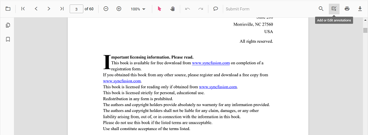
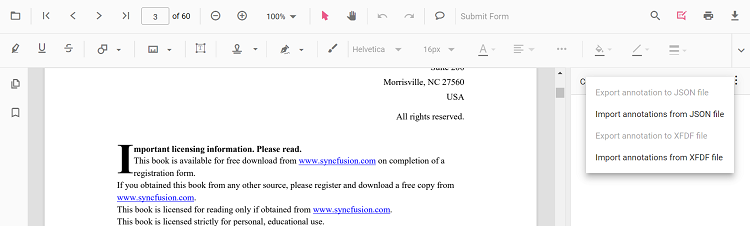
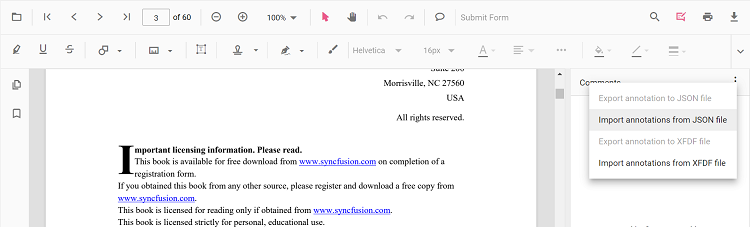
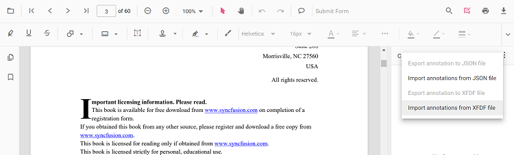
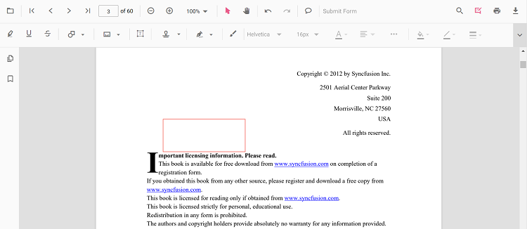
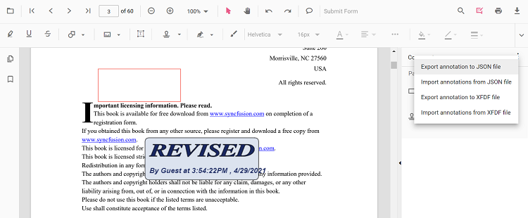
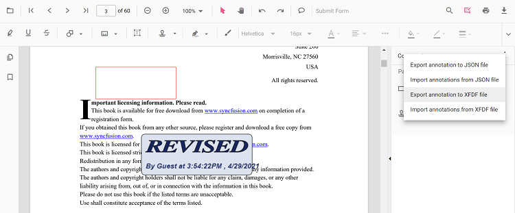

# Import and export annotation

The PDF Viewer control provides the support to import and export annotations using JSON object in the PDF document.

* Click the Add or Edit annotation button in the PDF Viewer toolbar.

* The annotation toolbar will appear.
* Click the Comment Panel button in the annotation toolbar.

* The comments panel will displayed.
* Click the **More Option** button in the comment panel container.

## Importing annotation to the PDF document

* Click the Add or Edit annotation button in the PDF Viewer toolbar.
* The annotation toolbar will appear.
* Click the Comment Panel button in the annotation toolbar.
* The comments panel will displayed.
* Click the **More Option** button in the comment panel container.
* Select the Import annotations from JSON file option to import annotations from a JSON file.

* Select the Import annotations from XFDF file option to import annotations from an XFDF file.

* Then the file explorer dialog will be opened. Choose the JSON file or the XFDF file to be imported into the loaded PDF document.

## Importing annotation using PDF Viewer API

You can import annotations using JSON object or JSON file in code behind like the below code snippet.




import { ViewChild } from '@angular/core';
import { Component, OnInit } from '@angular/core';
import { PdfViewerComponent, LinkAnnotationService, BookmarkViewService,
         MagnificationService, ThumbnailViewService, ToolbarService,
         NavigationService, TextSearchService, TextSelectionService,
         PrintService, AnnotationService, AnnotationDataFormat
       } from '@syncfusion/ej2-angular-pdfviewer';
  @Component({
    selector: 'app-root',
    // specifies the template string for the PDF Viewer component
    template: `<button (click)="OnImportAnnotationsClick()">Import Annotations</button>
               

                  <ejs-pdfviewer id="pdfViewer"
                        [documentPath]='document'
                        style="height:640px;display:block">
                  </ejs-pdfviewer>
               
`,
    providers: [ LinkAnnotationService, BookmarkViewService, MagnificationService,
                 ThumbnailViewService, ToolbarService, NavigationService,
                 TextSearchService, TextSelectionService, PrintService,
                 AnnotationService],
  })
  export class AppComponent implements OnInit {
    @ViewChild('pdfviewer')
    public pdfviewerControl: PdfViewerComponent;
    //Local file path
    public document: string = 'https://cdn.syncfusion.com/content/pdf/pdf-succinctly.pdf';
    OnImportAnnotationsClick() {
      var pdfviewer = (<any>document.getElementById('pdfViewer')).ej2_instances[0];
      pdfviewer.importAnnotation({
        pdfAnnotation: {
          '0': {
            shapeAnnotation: [
              {
                ShapeAnnotationType: 'Square',
                Author: 'Guest',
                AnnotationSelectorSettings: {
                  selectionBorderColor: '',
                  resizerBorderColor: 'black',
                  resizerFillColor: '#FF4081',
                  resizerSize: 8,
                  selectionBorderThickness: 1,
                  resizerShape: 'Square',
                  selectorLineDashArray: [],
                  resizerLocation: 3,
                  resizerCursorType: null,
                },
                ModifiedDate: '5/19/2021, 11:44:51 AM',
                Subject: 'Rectangle',
                Note: '',
                IsCommentLock: false,
                StrokeColor: 'rgba(255,0,0,1)',
                FillColor: 'rgba(255,255,255,0)',
                Opacity: 1,
                Bounds: {
                  X: 154,
                  Y: 71,
                  Width: 299,
                  Height: 173,
                  Location: { X: 154, Y: 71 },
                  Size: { IsEmpty: false, Width: 299, Height: 173 },
                  Left: 154,
                  Top: 71,
                  Right: 453,
                  Bottom: 244,
                },
                Thickness: 1,
                BorderStyle: 'Solid',
                BorderDashArray: 0,
                RotateAngle: 'RotateAngle0',
                IsCloudShape: false,
                CloudIntensity: 0,
                RectangleDifference: null,
                VertexPoints: null,
                LineHeadStart: null,
                LineHeadEnd: null,
                IsLocked: false,
                AnnotName: 'e9ba2384-a202-45ff-0146-444fa0424dc5',
                Comments: null,
                State: '',
                StateModel: '',
                AnnotType: 'shape',
                EnableShapeLabel: false,
                LabelContent: null,
                LabelFillColor: null,
                LabelBorderColor: null,
                FontColor: null,
                FontSize: 0,
                CustomData: null,
                LabelBounds: {
                  X: 0,
                  Y: 0,
                  Width: 0,
                  Height: 0,
                  Location: { X: 0, Y: 0 },
                  Size: { IsEmpty: true, Width: 0, Height: 0 },
                  Left: 0,
                  Top: 0,
                  Right: 0,
                  Bottom: 0,
                },
                LabelSettings: null,
                AnnotationSettings: {
                  minWidth: 0,
                  maxWidth: 0,
                  minHeight: 0,
                  maxHeight: 0,
                  isLock: false,
                  isPrint: true,
                },
                AllowedInteractions: ['None'],
                IsPrint: true,
                ExistingCustomData: null,
              },
              {
                ShapeAnnotationType: 'Circle',
                Author: 'Guest',
                AnnotationSelectorSettings: {
                  selectionBorderColor: '',
                  resizerBorderColor: 'black',
                  resizerFillColor: '#FF4081',
                  resizerSize: 8,
                  selectionBorderThickness: 1,
                  resizerShape: 'Square',
                  selectorLineDashArray: [],
                  resizerLocation: 3,
                  resizerCursorType: null,
                },
                ModifiedDate: '5/19/2021, 11:44:53 AM',
                Subject: 'Circle',
                Note: '',
                IsCommentLock: false,
                StrokeColor: 'rgba(255,0,0,1)',
                FillColor: 'rgba(255,255,255,0)',
                Opacity: 1,
                Bounds: {
                  X: 591,
                  Y: 104,
                  Width: 100,
                  Height: 144,
                  Location: { X: 591, Y: 104 },
                  Size: { IsEmpty: false, Width: 100, Height: 144 },
                  Left: 591,
                  Top: 104,
                  Right: 691,
                  Bottom: 248,
                },
                Thickness: 1,
                BorderStyle: 'Solid',
                BorderDashArray: 0,
                RotateAngle: 'RotateAngle0',
                IsCloudShape: false,
                CloudIntensity: 0,
                RectangleDifference: null,
                VertexPoints: null,
                LineHeadStart: null,
                LineHeadEnd: null,
                IsLocked: false,
                AnnotName: '317e203f-e078-4ca1-2125-b86a806dbea5',
                Comments: null,
                State: '',
                StateModel: '',
                AnnotType: 'shape',
                EnableShapeLabel: false,
                LabelContent: null,
                LabelFillColor: null,
                LabelBorderColor: null,
                FontColor: null,
                FontSize: 0,
                CustomData: null,
                LabelBounds: {
                  X: 0,
                  Y: 0,
                  Width: 0,
                  Height: 0,
                  Location: { X: 0, Y: 0 },
                  Size: { IsEmpty: true, Width: 0, Height: 0 },
                  Left: 0,
                  Top: 0,
                  Right: 0,
                  Bottom: 0,
                },
                LabelSettings: null,
                AnnotationSettings: {
                  minWidth: 0,
                  maxWidth: 0,
                  minHeight: 0,
                  maxHeight: 0,
                  isLock: false,
                  isPrint: true,
                },
                AllowedInteractions: ['None'],
                IsPrint: true,
                ExistingCustomData: null,
              },
            ],
          },
        },
      });
    }
  }




import { ViewChild } from '@angular/core';
import { Component, OnInit } from '@angular/core';
import { PdfViewerComponent, LinkAnnotationService, BookmarkViewService,
         MagnificationService, ThumbnailViewService, ToolbarService,
         NavigationService, TextSearchService, TextSelectionService,
         PrintService, AnnotationService, AnnotationDataFormat
       } from '@syncfusion/ej2-angular-pdfviewer';
  @Component({
    selector: 'app-root',
    // specifies the template string for the PDF Viewer component
    template: `<button (click)="OnImportAnnotationsClick()">Import Annotations</button>
               

                  <ejs-pdfviewer id="pdfViewer"
                        [serviceUrl]='service'
                        [documentPath]='document'
                        style="height:640px;display:block">
                  </ejs-pdfviewer>
               
`,
    providers: [ LinkAnnotationService, BookmarkViewService, MagnificationService,
                 ThumbnailViewService, ToolbarService, NavigationService,
                 TextSearchService, TextSelectionService, PrintService,
                 AnnotationService],
  })
  export class AppComponent implements OnInit {
    @ViewChild('pdfviewer')
    public pdfviewerControl: PdfViewerComponent;
    //The service must be running in the local
    public service: string =
      'https://document.syncfusion.com/web-services/pdf-viewer/api/pdfviewer';
    //Local file path
    public document: string = 'https://cdn.syncfusion.com/content/pdf/pdf-succinctly.pdf';
    OnImportAnnotationsClick() {
      var pdfviewer = (<any>document.getElementById('pdfViewer')).ej2_instances[0];
      pdfviewer.importAnnotation({
        pdfAnnotation: {
          '0': {
            shapeAnnotation: [
              {
                ShapeAnnotationType: 'Square',
                Author: 'Guest',
                AnnotationSelectorSettings: {
                  selectionBorderColor: '',
                  resizerBorderColor: 'black',
                  resizerFillColor: '#FF4081',
                  resizerSize: 8,
                  selectionBorderThickness: 1,
                  resizerShape: 'Square',
                  selectorLineDashArray: [],
                  resizerLocation: 3,
                  resizerCursorType: null,
                },
                ModifiedDate: '5/19/2021, 11:44:51 AM',
                Subject: 'Rectangle',
                Note: '',
                IsCommentLock: false,
                StrokeColor: 'rgba(255,0,0,1)',
                FillColor: 'rgba(255,255,255,0)',
                Opacity: 1,
                Bounds: {
                  X: 154,
                  Y: 71,
                  Width: 299,
                  Height: 173,
                  Location: { X: 154, Y: 71 },
                  Size: { IsEmpty: false, Width: 299, Height: 173 },
                  Left: 154,
                  Top: 71,
                  Right: 453,
                  Bottom: 244,
                },
                Thickness: 1,
                BorderStyle: 'Solid',
                BorderDashArray: 0,
                RotateAngle: 'RotateAngle0',
                IsCloudShape: false,
                CloudIntensity: 0,
                RectangleDifference: null,
                VertexPoints: null,
                LineHeadStart: null,
                LineHeadEnd: null,
                IsLocked: false,
                AnnotName: 'e9ba2384-a202-45ff-0146-444fa0424dc5',
                Comments: null,
                State: '',
                StateModel: '',
                AnnotType: 'shape',
                EnableShapeLabel: false,
                LabelContent: null,
                LabelFillColor: null,
                LabelBorderColor: null,
                FontColor: null,
                FontSize: 0,
                CustomData: null,
                LabelBounds: {
                  X: 0,
                  Y: 0,
                  Width: 0,
                  Height: 0,
                  Location: { X: 0, Y: 0 },
                  Size: { IsEmpty: true, Width: 0, Height: 0 },
                  Left: 0,
                  Top: 0,
                  Right: 0,
                  Bottom: 0,
                },
                LabelSettings: null,
                AnnotationSettings: {
                  minWidth: 0,
                  maxWidth: 0,
                  minHeight: 0,
                  maxHeight: 0,
                  isLock: false,
                  isPrint: true,
                },
                AllowedInteractions: ['None'],
                IsPrint: true,
                ExistingCustomData: null,
              },
              {
                ShapeAnnotationType: 'Circle',
                Author: 'Guest',
                AnnotationSelectorSettings: {
                  selectionBorderColor: '',
                  resizerBorderColor: 'black',
                  resizerFillColor: '#FF4081',
                  resizerSize: 8,
                  selectionBorderThickness: 1,
                  resizerShape: 'Square',
                  selectorLineDashArray: [],
                  resizerLocation: 3,
                  resizerCursorType: null,
                },
                ModifiedDate: '5/19/2021, 11:44:53 AM',
                Subject: 'Circle',
                Note: '',
                IsCommentLock: false,
                StrokeColor: 'rgba(255,0,0,1)',
                FillColor: 'rgba(255,255,255,0)',
                Opacity: 1,
                Bounds: {
                  X: 591,
                  Y: 104,
                  Width: 100,
                  Height: 144,
                  Location: { X: 591, Y: 104 },
                  Size: { IsEmpty: false, Width: 100, Height: 144 },
                  Left: 591,
                  Top: 104,
                  Right: 691,
                  Bottom: 248,
                },
                Thickness: 1,
                BorderStyle: 'Solid',
                BorderDashArray: 0,
                RotateAngle: 'RotateAngle0',
                IsCloudShape: false,
                CloudIntensity: 0,
                RectangleDifference: null,
                VertexPoints: null,
                LineHeadStart: null,
                LineHeadEnd: null,
                IsLocked: false,
                AnnotName: '317e203f-e078-4ca1-2125-b86a806dbea5',
                Comments: null,
                State: '',
                StateModel: '',
                AnnotType: 'shape',
                EnableShapeLabel: false,
                LabelContent: null,
                LabelFillColor: null,
                LabelBorderColor: null,
                FontColor: null,
                FontSize: 0,
                CustomData: null,
                LabelBounds: {
                  X: 0,
                  Y: 0,
                  Width: 0,
                  Height: 0,
                  Location: { X: 0, Y: 0 },
                  Size: { IsEmpty: true, Width: 0, Height: 0 },
                  Left: 0,
                  Top: 0,
                  Right: 0,
                  Bottom: 0,
                },
                LabelSettings: null,
                AnnotationSettings: {
                  minWidth: 0,
                  maxWidth: 0,
                  minHeight: 0,
                  maxHeight: 0,
                  isLock: false,
                  isPrint: true,
                },
                AllowedInteractions: ['None'],
                IsPrint: true,
                ExistingCustomData: null,
              },
            ],
          },
        },
      });
    }
  }




Refer to the following code snippet to import annotations from a JSON file.




import { ViewChild } from '@angular/core';
import { Component, OnInit } from '@angular/core';
import { PdfViewerComponent, LinkAnnotationService, BookmarkViewService,
         MagnificationService, ThumbnailViewService, ToolbarService,
         NavigationService, TextSearchService, TextSelectionService,
         PrintService, AnnotationService, AnnotationDataFormat
       } from '@syncfusion/ej2-angular-pdfviewer';
@Component({
  selector: 'app-root',
  // specifies the template string for the PDF Viewer component
  template: `<button (click)="onImportAnnotationsClick()">Import Annotations</button>
             

                <ejs-pdfviewer id="pdfViewer"
                        [documentPath]='document'
                        style="height:640px;display:block">
                </ejs-pdfviewer>
             
`,
  providers: [ LinkAnnotationService, BookmarkViewService, MagnificationService,
               ThumbnailViewService, ToolbarService, NavigationService,
               TextSearchService,TextSelectionService, PrintService,
               AnnotationService],
  })
  export class AppComponent implements OnInit {
    @ViewChild('pdfviewer')
    public document: string = 'https://cdn.syncfusion.com/content/pdf/pdf-succinctly.pdf';
    onImportAnnotationsClick() {
      var pdfviewer = (<any>document.getElementById('pdfViewer')).ej2_instances[0];
      pdfviewer.importAnnotation('PDF_Succinctly.json', AnnotationDataFormat.Json);
    }
}





import { ViewChild } from '@angular/core';
import { Component, OnInit } from '@angular/core';
import { PdfViewerComponent, LinkAnnotationService, BookmarkViewService,
         MagnificationService, ThumbnailViewService, ToolbarService,
         NavigationService, TextSearchService, TextSelectionService,
         PrintService, AnnotationService, AnnotationDataFormat
       } from '@syncfusion/ej2-angular-pdfviewer';
@Component({
  selector: 'app-root',
  // specifies the template string for the PDF Viewer component
  template: `<button (click)="onImportAnnotationsClick()">Import Annotations</button>
             

                <ejs-pdfviewer id="pdfViewer"
                        [serviceUrl]='service'
                        [documentPath]='document'
                        style="height:640px;display:block">
                </ejs-pdfviewer>
             
`,
  providers: [ LinkAnnotationService, BookmarkViewService, MagnificationService,
               ThumbnailViewService, ToolbarService, NavigationService,
               TextSearchService,TextSelectionService, PrintService,
               AnnotationService],
  })
  export class AppComponent implements OnInit {
    @ViewChild('pdfviewer')
    public service: string = 'https://localhost:44347/pdfviewer';
    public document: string = 'https://cdn.syncfusion.com/content/pdf/pdf-succinctly.pdf';
    onImportAnnotationsClick() {
      var pdfviewer = (<any>document.getElementById('pdfViewer')).ej2_instances[0];
      pdfviewer.importAnnotation('PDF_Succinctly.json', AnnotationDataFormat.Json);
    }
}




>Run the [web service](https://github.com/SyncfusionExamples/EJ2-PDFViewer-WebServices/tree/main/ASP.NET%20Core/PdfViewerWebService_3.0) and then the angular code. Also note that, the JSON file for importing the annotation should be placed in the location as specified in the GetDocumentPath method of the PdfViewerController.

Refer to the following code snippet to import annotations from an XFDF file.




import { ViewChild } from '@angular/core';
import { Component, OnInit } from '@angular/core';
import { PdfViewerComponent, LinkAnnotationService, BookmarkViewService,
         MagnificationService, ThumbnailViewService, ToolbarService,
         NavigationService, TextSearchService, TextSelectionService,
         PrintService, AnnotationService, AnnotationDataFormat
       } from '@syncfusion/ej2-angular-pdfviewer';

  @Component({
    selector: 'app-root',
    // specifies the template string for the PDF Viewer component
    template: `<button (click)="OnImportAnnotationsClick()">Import Annotations</button>
               

                  <ejs-pdfviewer id="pdfViewer"
                          [documentPath]='document'
                          style="height:640px;display:block">
                   </ejs-pdfviewer>
               
`,
    providers: [ LinkAnnotationService, BookmarkViewService, MagnificationService,
                 ThumbnailViewService, ToolbarService, NavigationService,
                 TextSearchService, TextSelectionService, PrintService,
                 AnnotationService ]
  })
  export class AppComponent implements OnInit {
      @ViewChild('pdfviewer')
      public pdfviewerControl: PdfViewerComponent;
      public document: string = 'https://cdn.syncfusion.com/content/pdf/pdf-succinctly.pdf';
      OnImportAnnotationsClick() {
          var pdfviewer = (<any>document.getElementById('pdfViewer')).ej2_instances[0];
          pdfviewer.importAnnotation('PDF_Succinctly.xfdf', AnnotationDataFormat.xfdf);
      }
  }




import { ViewChild } from '@angular/core';
import { Component, OnInit } from '@angular/core';
import { PdfViewerComponent, LinkAnnotationService, BookmarkViewService,
         MagnificationService, ThumbnailViewService, ToolbarService,
         NavigationService, TextSearchService, TextSelectionService,
         PrintService, AnnotationService, AnnotationDataFormat
       } from '@syncfusion/ej2-angular-pdfviewer';

  @Component({
    selector: 'app-root',
    // specifies the template string for the PDF Viewer component
    template: `<button (click)="OnImportAnnotationsClick()">Import Annotations</button>
               

                  <ejs-pdfviewer id="pdfViewer"
                          [serviceUrl]='service'
                          [documentPath]='document'
                          style="height:640px;display:block">
                   </ejs-pdfviewer>
               
`,
    providers: [ LinkAnnotationService, BookmarkViewService, MagnificationService,
                 ThumbnailViewService, ToolbarService, NavigationService,
                 TextSearchService, TextSelectionService, PrintService,
                 AnnotationService ]
  })
  export class AppComponent implements OnInit {
      @ViewChild('pdfviewer')
      public pdfviewerControl: PdfViewerComponent;
      public service: string = 'https://localhost:44347/pdfviewer';
      public document: string = 'https://cdn.syncfusion.com/content/pdf/pdf-succinctly.pdf';
      OnImportAnnotationsClick() {
          var pdfviewer = (<any>document.getElementById('pdfViewer')).ej2_instances[0];
          pdfviewer.importAnnotation('PDF_Succinctly.xfdf', AnnotationDataFormat.xfdf);
      }
  }




>Run the [web service](https://github.com/SyncfusionExamples/EJ2-PDFViewer-WebServices/tree/main/ASP.NET%20Core/PdfViewerWebService_3.0) and then the angular code. Also note that, the XFDF file for importing the annotation should be placed in the location as specified in the GetDocumentPath method of the PdfViewerController.

## Importing Annotation Using Base64 Data

You can import annotations into the Syncfusion Angular PDF Viewer by decoding Base64-encoded JSON annotation data at runtime and passing the parsed object to the importAnnotation API, as shown in the following code snippet.




import { Component, OnInit } from '@angular/core';
import {
  LinkAnnotationService, BookmarkViewService, MagnificationService,
  ThumbnailViewService, ToolbarService, NavigationService,
  TextSearchService, TextSelectionService, PrintService,
  FormDesignerService, FormFieldsService, AnnotationService,
  PageOrganizerService
} from '@syncfusion/ej2-angular-pdfviewer';

@Component({
  selector: 'app-root',
  template: `
    <!-- Button to trigger annotation import -->
    <button (click)="fileInput.click()">Import Annotation</button>

    <!-- Hidden file input (only JSON files allowed) -->
    <input type="file" #fileInput accept=".json" style="display:none" (change)="onFileSelected($event)" />

    <!-- PDF Viewer container -->
    

      <ejs-pdfviewer id="pdfViewer"
        [documentPath]="document"
        [resourceUrl]="resource"
        style="height:640px;display:block">
      </ejs-pdfviewer>
    

  `,
  // Register all necessary PDF viewer services
  providers: [
    LinkAnnotationService, BookmarkViewService, MagnificationService,
    ThumbnailViewService, ToolbarService, NavigationService,
    TextSearchService, TextSelectionService, PrintService,
    AnnotationService, FormDesignerService, FormFieldsService, PageOrganizerService
  ]
})
export class AppComponent implements OnInit {
  // URL of the sample PDF document
  public document: string = 'https://cdn.syncfusion.com/content/pdf/handwritten-signature.pdf';

  // Syncfusion PDF viewer resource URL
  public resource: string = 'https://cdn.syncfusion.com/ej2/28.1.33/dist/ej2-pdfviewer-lib';

  ngOnInit(): void {}

  /**
   * Triggered when a file is selected from the input.
   * Handles reading and importing the JSON annotation file.
   */
  onFileSelected(event: any): void {
    const file = event.target.files[0];

    // Validate that the selected file is a .json file
    if (!file || !file.name.endsWith('.json')) {
      alert('Please select a valid JSON file.');
      return;
    }

    const reader = new FileReader();

    // When file reading is done
    reader.onload = (e: any) => {
      // Extract Base64 string (after the "data:application/json;base64," part)
      const base64String = e.target.result.split(',')[1];

      // Decode Base64 to original JSON string
      const decodedJsonString = atob(base64String);

      try {
        // Parse the JSON string into a JavaScript object
        const annotationData = JSON.parse(decodedJsonString);

        // Get reference to the PDF viewer instance
        const viewer = (document.getElementById('pdfViewer') as any).ej2_instances[0];

        // Import the parsed annotation data into the viewer
        viewer.importAnnotation(annotationData);
      } catch (err) {
        // Handle errors (e.g., invalid JSON)
        console.error('Invalid JSON file:', err);
        alert('Failed to parse JSON.');
      }
    };

    // Start reading the file as a data URL (Base64 encoded)
    reader.readAsDataURL(file);
  }
}




import { Component, OnInit } from '@angular/core';
import {
  LinkAnnotationService, BookmarkViewService, MagnificationService,
  ThumbnailViewService, ToolbarService, NavigationService,
  TextSearchService, TextSelectionService, PrintService,
  FormDesignerService, FormFieldsService, AnnotationService,
  PageOrganizerService
} from '@syncfusion/ej2-angular-pdfviewer';

@Component({
  selector: 'app-root',
  template: `
    <!-- Button to trigger annotation import -->
    <button (click)="fileInput.click()">Import Annotation</button>

    <!-- Hidden file input (only JSON files allowed) -->
    <input type="file" #fileInput accept=".json" style="display:none" (change)="onFileSelected($event)" />

    <!-- PDF Viewer container -->
    

      <ejs-pdfviewer id="pdfViewer"
        [documentPath]="document"
        [serviceUrl]="service"
        style="height:640px;display:block">
      </ejs-pdfviewer>
    

  `,
  // Register all necessary PDF viewer services
  providers: [
    LinkAnnotationService, BookmarkViewService, MagnificationService,
    ThumbnailViewService, ToolbarService, NavigationService,
    TextSearchService, TextSelectionService, PrintService,
    AnnotationService, FormDesignerService, FormFieldsService, PageOrganizerService
  ]
})
export class AppComponent implements OnInit {
  // URL of the sample PDF document
  public document: string = 'https://cdn.syncfusion.com/content/pdf/handwritten-signature.pdf';

  // Syncfusion PDF viewer resource URL
  public service: string = 'https://document.syncfusion.com/web-services/pdf-viewer/api/pdfviewer';

  ngOnInit(): void {}

  /**
   * Triggered when a file is selected from the input.
   * Handles reading and importing the JSON annotation file.
   */
  onFileSelected(event: any): void {
    const file = event.target.files[0];

    // Validate that the selected file is a .json file
    if (!file || !file.name.endsWith('.json')) {
      alert('Please select a valid JSON file.');
      return;
    }

    const reader = new FileReader();

    // When file reading is done
    reader.onload = (e: any) => {
      // Extract Base64 string (after the "data:application/json;base64," part)
      const base64String = e.target.result.split(',')[1];

      // Decode Base64 to original JSON string
      const decodedJsonString = atob(base64String);

      try {
        // Parse the JSON string into a JavaScript object
        const annotationData = JSON.parse(decodedJsonString);

        // Get reference to the PDF viewer instance
        const viewer = (document.getElementById('pdfViewer') as any).ej2_instances[0];

        // Import the parsed annotation data into the viewer
        viewer.importAnnotation(annotationData);
      } catch (err) {
        // Handle errors (e.g., invalid JSON)
        console.error('Invalid JSON file:', err);
        alert('Failed to parse JSON.');
      }
    };

    // Start reading the file as a data URL (Base64 encoded)
    reader.readAsDataURL(file);
  }
}



## Exporting annotation from the PDF document

The PDF Viewer control provides the support to export the annotations as JSON file or JSON object and XFDF file using annotation toolbar.

* Click the Add or Edit annotation button in the PDF Viewer toolbar.
* The annotation toolbar will appear.
* Click the Comment Panel button in the annotation toolbar.
* The comments panel will displayed.
* Click the **More Option** button in the comment panel container.
* Select the Export annotation to JSON file option to export annotations to a JSON file.

* Select the Export annotation to XFDF file option to export annotations to an XFDF file.

>Export annotations will be in the disabled state when the loaded PDF document does not contain any annotations.

## Exporting annotation using PDF Viewer API

You can export annotations as JSON file in code behind like the following code snippet.




import { ViewChild } from '@angular/core';
import { Component, OnInit } from '@angular/core';
import { PdfViewerComponent,LinkAnnotationService, BookmarkViewService,
         MagnificationService, ThumbnailViewService, ToolbarService,
         NavigationService, TextSearchService, TextSelectionService,
         PrintService, AnnotationService,  AnnotationDataFormat
       } from '@syncfusion/ej2-angular-pdfviewer';
  @Component({
    selector: 'app-root',
    // specifies the template string for the PDF Viewer component
    template: `<button (click)="OnExportAnnotationsClick()">Export Annotations</button>
                

                  <ejs-pdfviewer id="pdfViewer"
                            [documentPath]='document'
                            [exportAnnotationFileName]='exportAnnotationFileName'
                            style="height:640px;display:block">
                  </ejs-pdfviewer>
                
`,
    providers: [ LinkAnnotationService, BookmarkViewService, MagnificationService,
                 ThumbnailViewService, ToolbarService, NavigationService,
                 TextSearchService, TextSelectionService, PrintService,
                 AnnotationService]
  })
  export class AppComponent implements OnInit {
    @ViewChild('pdfviewer')
    public pdfviewerControl: PdfViewerComponent;
    public document: string = 'https://cdn.syncfusion.com/content/pdf/pdf-succinctly.pdf';
    public exportAnnotationFileName: string = 'ExportedAnnotations.json';
    OnExportAnnotationsClick() {
      var pdfviewer = (<any>document.getElementById("pdfViewer")).ej2_instances[0];
      pdfviewer.exportAnnotation(AnnotationDataFormat.Json);
    }
  }




import { ViewChild } from '@angular/core';
import { Component, OnInit } from '@angular/core';
import { PdfViewerComponent,LinkAnnotationService, BookmarkViewService,
         MagnificationService, ThumbnailViewService, ToolbarService,
         NavigationService, TextSearchService, TextSelectionService,
         PrintService, AnnotationService,  AnnotationDataFormat
       } from '@syncfusion/ej2-angular-pdfviewer';
  @Component({
    selector: 'app-root',
    // specifies the template string for the PDF Viewer component
    template: `<button (click)="OnExportAnnotationsClick()">Export Annotations</button>
                

                  <ejs-pdfviewer id="pdfViewer"
                            [serviceUrl]='service'
                            [documentPath]='document'
                            [exportAnnotationFileName]='exportAnnotationFileName'
                            style="height:640px;display:block">
                  </ejs-pdfviewer>
                
`,
    providers: [ LinkAnnotationService, BookmarkViewService, MagnificationService,
                 ThumbnailViewService, ToolbarService, NavigationService,
                 TextSearchService, TextSelectionService, PrintService,
                 AnnotationService]
  })
  export class AppComponent implements OnInit {
    @ViewChild('pdfviewer')
    public pdfviewerControl: PdfViewerComponent;
    public service: string = 'https://document.syncfusion.com/web-services/pdf-viewer/api/pdfviewer';
    public document: string = 'https://cdn.syncfusion.com/content/pdf/pdf-succinctly.pdf';
    public exportAnnotationFileName: string = 'ExportedAnnotations.json';
    OnExportAnnotationsClick() {
      var pdfviewer = (<any>document.getElementById("pdfViewer")).ej2_instances[0];
      pdfviewer.exportAnnotation(AnnotationDataFormat.Json);
    }
  }




Refer to the following code snippet to export annotations as XFDF file.




import { ViewChild } from '@angular/core';
import { Component, OnInit } from '@angular/core';
import { PdfViewerComponent, LinkAnnotationService, BookmarkViewService,
         MagnificationService, ThumbnailViewService, ToolbarService,
         NavigationService, TextSearchService, TextSelectionService,
         PrintService, AnnotationService, AnnotationDataFormat
       } from '@syncfusion/ej2-angular-pdfviewer';
@Component({
  selector: 'app-root',
  // specifies the template string for the PDF Viewer component
  template: `<button (click)="OnExportAnnotationsClick()">Export Annotations</button>
              

                  <ejs-pdfviewer id="pdfViewer"
                          [documentPath]='document'
                          [exportAnnotationFileName]='exportAnnotationFileName'
                          style="height:640px;display:block">
                  </ejs-pdfviewer>
              
`,
  providers: [ LinkAnnotationService, BookmarkViewService, MagnificationService,
               ThumbnailViewService, ToolbarService, NavigationService,
               TextSearchService, TextSelectionService, PrintService,
               AnnotationService]
})
export class AppComponent implements OnInit {
    @ViewChild('pdfviewer')
    public pdfviewerControl: PdfViewerComponent;
    public document: string = 'https://cdn.syncfusion.com/content/pdf/pdf-succinctly.pdf';
    public exportAnnotationFileName: string = 'ExportedAnnotations.xfdf';
    OnExportAnnotationsClick() {
        var pdfviewer = (<any>document.getElementById("pdfViewer")).ej2_instances[0];
        pdfviewer.exportAnnotation(AnnotationDataFormat.Xfdf);
    }
}




import { ViewChild } from '@angular/core';
import { Component, OnInit } from '@angular/core';
import { PdfViewerComponent, LinkAnnotationService, BookmarkViewService,
         MagnificationService, ThumbnailViewService, ToolbarService,
         NavigationService, TextSearchService, TextSelectionService,
         PrintService, AnnotationService, AnnotationDataFormat
       } from '@syncfusion/ej2-angular-pdfviewer';
@Component({
  selector: 'app-root',
  // specifies the template string for the PDF Viewer component
  template: `<button (click)="OnExportAnnotationsClick()">Export Annotations</button>
              

                  <ejs-pdfviewer id="pdfViewer"
                          [serviceUrl]='service'
                          [documentPath]='document'
                          [exportAnnotationFileName]='exportAnnotationFileName'
                          style="height:640px;display:block">
                  </ejs-pdfviewer>
              
`,
  providers: [ LinkAnnotationService, BookmarkViewService, MagnificationService,
               ThumbnailViewService, ToolbarService, NavigationService,
               TextSearchService, TextSelectionService, PrintService,
               AnnotationService]
})
export class AppComponent implements OnInit {
    @ViewChild('pdfviewer')
    public pdfviewerControl: PdfViewerComponent;
    public service: string = 'https://document.syncfusion.com/web-services/pdf-viewer/api/pdfviewer';
    public document: string = 'https://cdn.syncfusion.com/content/pdf/pdf-succinctly.pdf';
    public exportAnnotationFileName: string = 'ExportedAnnotations.xfdf';
    OnExportAnnotationsClick() {
        var pdfviewer = (<any>document.getElementById("pdfViewer")).ej2_instances[0];
        pdfviewer.exportAnnotation(AnnotationDataFormat.Xfdf);
    }
}


