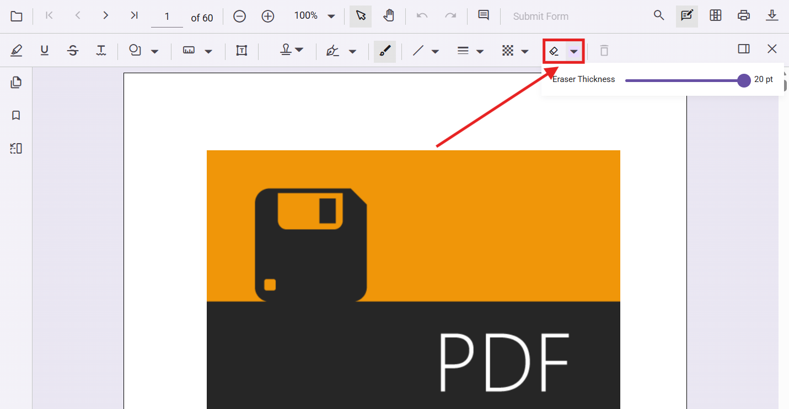

# Ink Eraser in Angular PDF Viewer

## Overview

The Ink Eraser feature allows users to selectively remove or correct parts of freehand ink annotations (strokes) drawn on a PDF document. Whether you've made a mistake while annotating, want to refine your drawing, or need to clean up messy marks, the Ink Eraser provides a precise way to remove unwanted strokes without deleting the entire annotation.

Imagine you're reviewing a PDF document by hand-writing feedback. You accidentally draw a line across important text, or you want to refine a freehand arrow pointing to a specific area. Without an eraser, you'd have to delete the entire ink annotation and redraw it. The Ink Eraser lets you simply remove the unwanted parts while keeping your good work intact.


## When to use the Ink Eraser

The Ink Eraser is most useful in these scenarios:

- **Handwritten document reviews**: Correct accidental marks or lines drawn across text
- **Freehand annotations**: Refine arrows, circles, or sketches without redrawing everything
- **Precise feedback**: Remove small portions of ink marks to highlight specific areas
- **Sketch-based reviews**: Clean up rough drawings or correct mistakes during brainstorming sessions
- **Digital note-taking**: Erase unwanted strokes when taking notes or annotating PDFs
- **Collaborative editing**: Clean up ink marks before sharing documents with others

## Enable Ink Eraser

To enable the Ink Eraser feature, inject the following services into the Angular PDF Viewer:

- [**Annotation**](https://ej2.syncfusion.com/angular/documentation/api/pdfviewer/index-default#annotation)
- [**Toolbar**](https://ej2.syncfusion.com/angular/documentation/api/pdfviewer/index-default#toolbar)




import { Component, OnInit } from '@angular/core';
import {
  PdfViewerModule,
  LinkAnnotationService,
  BookmarkViewService,
  MagnificationService,
  ThumbnailViewService,
  ToolbarService,
  NavigationService,
  AnnotationService,
  TextSearchService,
  TextSelectionService,
  PrintService,
  FormDesignerService,
  FormFieldsService,
  PageOrganizerService,
} from '@syncfusion/ej2-angular-pdfviewer';

@Component({
  imports: [PdfViewerModule],
  standalone: true,
  selector: 'app-container',
  template: `<div class="content-wrapper">
    <ejs-pdfviewer 
      id="pdfViewer" 
      [documentPath]='document' 
      [resourceUrl]='resource' 
      style="height:640px;display:block">
    </ejs-pdfviewer>
  </div>`,
  providers: [
    LinkAnnotationService,
    BookmarkViewService,
    MagnificationService,
    ThumbnailViewService,
    ToolbarService,
    NavigationService,
    AnnotationService,
    TextSearchService,
    TextSelectionService,
    PrintService,
    FormDesignerService,
    FormFieldsService,
    PageOrganizerService,
  ],
})
export class AppComponent implements OnInit {
  public document: string = 'https://cdn.syncfusion.com/content/pdf/pdf-succinctly.pdf';
  public resource: string = 'https://cdn.syncfusion.com/ej2/33.1.44/dist/ej2-pdfviewer-lib';
  
  ngOnInit(): void {}
}




## UI-based erasing

The Ink Eraser is accessible through the annotation toolbar in the PDF Viewer.

### How to erase ink strokes using the toolbar

Follow these steps to erase unwanted ink strokes using the Ink Eraser tool:

1. Locate the **Ink Eraser tool** in the annotation toolbar (displayed as a split button next to the ink drawing tool)
2. Click the **Ink Eraser icon** to activate eraser mode
3. The cursor changes to indicate the eraser is active
4. **Draw over the ink strokes** you want to erase using your mouse, pen, or touch input
5. The eraser automatically removes any ink it touches
6. To exit eraser mode, click a different annotation tool or press **Escape**

> **Tip**: The eraser only removes ink strokes; it does not affect other annotation types like highlights, text boxes, or shapes.


### Adjusting eraser size

The Ink Eraser includes an adjustable size slider to control the eraser width. Follow these steps to change the eraser size:

1. Click the **dropdown arrow** next to the Ink Eraser split button in the toolbar
2. A **size slider** appears below the eraser icon
3. Drag the slider to adjust the eraser size:
   - **Move left** for a smaller, more precise eraser
   - **Move right** for a larger eraser that removes more ink at once
4. The eraser size updates in real-time as you adjust the slider
5. Your new eraser size is remembered for subsequent use



### Best practices for using the Ink Eraser

- **Start with a smaller eraser size** for precision work, then increase if needed
- **Use single strokes** when erasing to avoid accidentally removing too much ink
- **Erase partially** to refine shapes rather than erasing completely and redrawing
- **Combine with zoom** (Ctrl+scroll or pinch) for detailed erasing on small marks
- **Use a stylus or pen** if available for better eraser precision on touch devices

## Programmatic control

You can programmatically enable or disable the Ink Eraser and control its size through code. This allows you to:

- Auto-enable the eraser for specific user roles
- Set preset eraser sizes based on document type
- Provide keyboard shortcuts or custom buttons for eraser control
- Integrate eraser control with your application workflow

### Enable or disable Ink Eraser mode

Use the `enableInkEraser` property to control whether the Ink Eraser is active:




import { Component, ViewChild, OnInit } from '@angular/core';
import {
  PdfViewerModule,
  PdfViewerComponent,
  LinkAnnotationService,
  BookmarkViewService,
  MagnificationService,
  ThumbnailViewService,
  ToolbarService,
  NavigationService,
  AnnotationService,
  TextSearchService,
  TextSelectionService,
  PrintService,
  FormDesignerService,
  FormFieldsService,
  PageOrganizerService,
} from '@syncfusion/ej2-angular-pdfviewer';

@Component({
  imports: [PdfViewerModule],
  standalone: true,
  selector: 'app-container',
  template: `<div class="content-wrapper">
    <button (click)="enableEraser()" style="margin-bottom: 10px;">Enable Eraser</button>
    <button (click)="disableEraser()" style="margin-left: 10px;">Disable Eraser</button>
    <ejs-pdfviewer 
      #pdfViewer
      id="pdfViewer" 
      [documentPath]='document' 
      [resourceUrl]='resource' 
      style="height:640px;display:block">
    </ejs-pdfviewer>
  </div>`,
  providers: [
    LinkAnnotationService,
    BookmarkViewService,
    MagnificationService,
    ThumbnailViewService,
    ToolbarService,
    NavigationService,
    AnnotationService,
    TextSearchService,
    TextSelectionService,
    PrintService,
    FormDesignerService,
    FormFieldsService,
    PageOrganizerService,
  ],
})
export class AppComponent implements OnInit {
  @ViewChild('pdfViewer')
  public pdfViewerComponent!: PdfViewerComponent;
  
  public document: string = 'https://cdn.syncfusion.com/content/pdf/pdf-succinctly.pdf';
  public resource: string = 'https://cdn.syncfusion.com/ej2/33.1.44/dist/ej2-pdfviewer-lib';

  ngOnInit(): void {}

  enableEraser() {
    this.pdfViewerComponent.enableInkEraser = true;
  }

  disableEraser() {
    this.pdfViewerComponent.enableInkEraser = false;
  }
}




### Set eraser size programmatically

Use the `inkEraserSize` property to control the width of the eraser:




import { Component, ViewChild, OnInit } from '@angular/core';
import {
  PdfViewerModule,
  PdfViewerComponent,
  LinkAnnotationService,
  BookmarkViewService,
  MagnificationService,
  ThumbnailViewService,
  ToolbarService,
  NavigationService,
  AnnotationService,
  TextSearchService,
  TextSelectionService,
  PrintService,
  FormDesignerService,
  FormFieldsService,
  PageOrganizerService,
} from '@syncfusion/ej2-angular-pdfviewer';

@Component({
  imports: [PdfViewerModule],
  standalone: true,
  selector: 'app-container',
  template: `<div class="content-wrapper">
    <button (click)="setEraserSize(10)" style="margin-bottom: 10px;">Small (10px)</button>
    <button (click)="setEraserSize(15)" style="margin-left: 10px;">Medium (15px)</button>
    <button (click)="setEraserSize(20)" style="margin-left: 10px;">Large (20px)</button>
    <ejs-pdfviewer 
      #pdfViewer
      id="pdfViewer" 
      [documentPath]='document' 
      [resourceUrl]='resource' 
      style="height:640px;display:block">
    </ejs-pdfviewer>
  </div>`,
  providers: [
    LinkAnnotationService,
    BookmarkViewService,
    MagnificationService,
    ThumbnailViewService,
    ToolbarService,
    NavigationService,
    AnnotationService,
    TextSearchService,
    TextSelectionService,
    PrintService,
    FormDesignerService,
    FormFieldsService,
    PageOrganizerService,
  ],
})
export class AppComponent implements OnInit {
  @ViewChild('pdfViewer')
  public pdfViewerComponent!: PdfViewerComponent;
  
  public document: string = 'https://cdn.syncfusion.com/content/pdf/pdf-succinctly.pdf';
  public resource: string = 'https://cdn.syncfusion.com/ej2/33.1.44/dist/ej2-pdfviewer-lib';

  ngOnInit(): void {}

  setEraserSize(size: number) {
    this.pdfViewerComponent.inkEraserSize = size;
  }
}




### Practical example: Role-based eraser control

Here's a real-world scenario where eraser accessibility is controlled based on user roles:

```ts
// Pseudo-code showing Role-based eraser control
export class AppComponent {
  @ViewChild('pdfViewer')
  pdfViewerComponent!: PdfViewerComponent;

  userRole: string = 'editor'; // Returns: 'editor', 'reviewer', 'viewer'

  applyRoleBasedEraserSettings() {
    if (this.userRole === 'editor') {
      // Editors get full eraser control with large size default
      this.pdfViewerComponent.enableInkEraser = true;
      this.pdfViewerComponent.inkEraserSize = 15;
    } else if (this.userRole === 'reviewer') {
      // Reviewers can use eraser for cleanup with medium size
      this.pdfViewerComponent.enableInkEraser = true;
      this.pdfViewerComponent.inkEraserSize = 10;
    } else if (this.userRole === 'viewer') {
      // Viewers cannot use eraser
      this.pdfViewerComponent.enableInkEraser = false;
    }
  }
}
```

### Combine with Ink drawing

You can programmatically switch between Ink drawing mode and Eraser mode for a seamless workflow:




import { Component, ViewChild, OnInit } from '@angular/core';
import {
  PdfViewerModule,
  PdfViewerComponent,
  LinkAnnotationService,
  BookmarkViewService,
  MagnificationService,
  ThumbnailViewService,
  ToolbarService,
  NavigationService,
  AnnotationService,
  TextSearchService,
  TextSelectionService,
  PrintService,
  FormDesignerService,
  FormFieldsService,
  PageOrganizerService,
} from '@syncfusion/ej2-angular-pdfviewer';

@Component({
  imports: [PdfViewerModule],
  standalone: true,
  selector: 'app-container',
  template: `<div class="content-wrapper">
    <button 
      (click)="switchToDrawing()" 
      [style.backgroundColor]="mode === 'draw' ? '#007bff' : '#e9ecef'" 
      style="margin-bottom: 10px; cursor: pointer;">
      Draw Mode
    </button>
    <button 
      (click)="switchToEraser()" 
      [style.backgroundColor]="mode === 'erase' ? '#dc3545' : '#e9ecef'" 
      style="margin-left: 10px; cursor: pointer;">
      Erase Mode
    </button>
    <ejs-pdfviewer 
      #pdfViewer
      id="pdfViewer" 
      [documentPath]='document' 
      [resourceUrl]='resource' 
      style="height:640px;display:block">
    </ejs-pdfviewer>
  </div>`,
  providers: [
    LinkAnnotationService,
    BookmarkViewService,
    MagnificationService,
    ThumbnailViewService,
    ToolbarService,
    NavigationService,
    AnnotationService,
    TextSearchService,
    TextSelectionService,
    PrintService,
    FormDesignerService,
    FormFieldsService,
    PageOrganizerService,
  ],
})
export class AppComponent implements OnInit {
  @ViewChild('pdfViewer')
  public pdfViewerComponent!: PdfViewerComponent;
  
  public mode: string = 'draw';
  public document: string = 'https://cdn.syncfusion.com/content/pdf/pdf-succinctly.pdf';
  public resource: string = 'https://cdn.syncfusion.com/ej2/33.1.44/dist/ej2-pdfviewer-lib';

  ngOnInit(): void {}

  switchToDrawing() {
    this.pdfViewerComponent.enableInkEraser = false;
    this.pdfViewerComponent.annotation.setAnnotationMode('Ink');
    this.mode = 'draw';
  }

  switchToEraser() {
    this.pdfViewerComponent.enableInkEraser = true;
    this.mode = 'erase';
  }
}




## Behavior notes

### Eraser mechanics
- **Only removes ink**: The eraser only affects freehand ink annotations. Other annotation types (highlights, text boxes, shapes) are not affected.
- **Partial erasing**: You can erase any portion of an ink stroke without affecting other strokes.
- **Real-time erasing**: Erased content is immediately removed as the eraser moves across the stroke.
- **Undo/Redo support**: Eraser actions can be undone and redone using the toolbar buttons or keyboard shortcuts (Ctrl+Z, Ctrl+Y).
- **Size adjustability**: The eraser size can be changed at any time without exiting eraser mode.
- **Mouse and touch input**: The eraser works with mouse, stylus, and touch input on supported devices.

### Programmatic control behavior
- `enableInkEraser = true`: Activates eraser mode; users can erase ink by drawing on the document
- `enableInkEraser = false`: Deactivates eraser mode; eraser is disabled even if the toolbar button exists
- `inkEraserSize` value: Defines the eraser brush width in pixels (typical range: 5-30px)
- Size changes take effect immediately and persist until changed again

## Best practices for Ink Eraser

- **Provide clear mode indicators**: Use button states or status messages to show whether users are in draw or erase mode
- **Set appropriate default sizes**: Choose a default eraser size based on typical document resolution and zoom levels
- **Lock eraser for read-only documents**: Disable eraser for documents with restricted editing permissions
- **Combine with undo/redo**: Always enable undo/redo functionality alongside eraser to minimize user frustration
- **Test on different devices**: Eraser behavior may vary between mouse, touch, and stylus inputs
- **Use consistent keyboard shortcuts**: If providing custom controls, use intuitive shortcuts (e.g., 'E' for eraser)
- **Provide size presets**: Offer quick-access buttons for common eraser sizes instead of forcing users to adjust sliders

## See also

- [Ink Annotation](./annotation-types/ink-annotation)
- [Annotation Toolbar](../toolbar-customization/annotation-toolbar)
- [Annotation Events](./annotation-event)
- [Undo and Redo Annotations](./annotations-undo-redo)
- [Export and Import Annotation](./export-import/export-annotation)
- [Delete Annotation](./delete-annotation)
- [Annotation API](./annotations-api)
