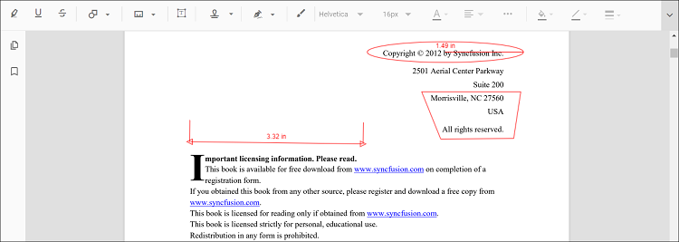
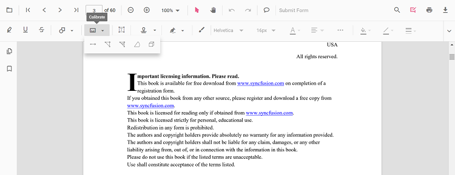
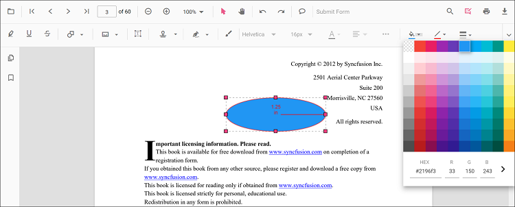
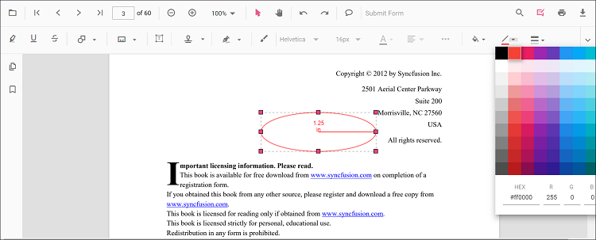
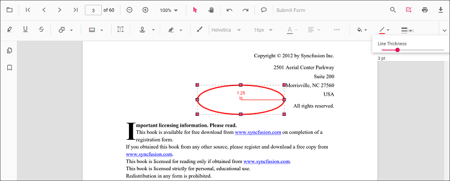
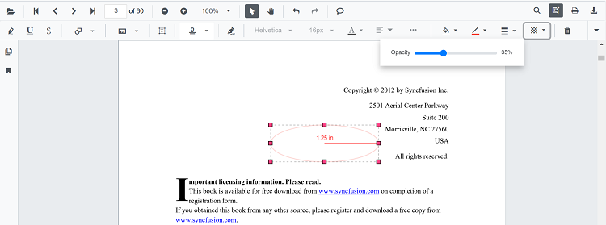
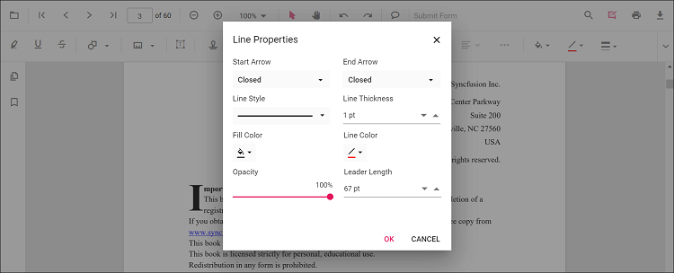
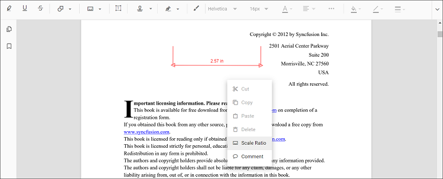
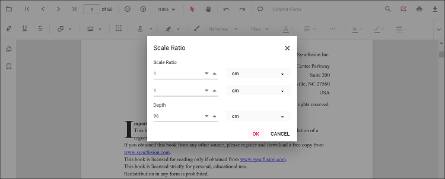

# Measurement annotation in Angular PDF Viewer component

The Angular PDF Viewer component provides options to add measurement annotations. The supported measurement annotations are:

* Distance
* Perimeter
* Area
* Radius
* Volume

## Add measurement annotations to a PDF document

The measurement annotations can be added to the PDF document using the annotation toolbar.

* Click the **Edit Annotation** button in the PDF Viewer toolbar. A toolbar appears below it.
* Click the **Measurement Annotation** dropdown. A popup appears showing the available measurement annotations.
* Select a measurement type to add to the page. The selected measurement mode is enabled.
* Measure and add the annotation anywhere on the PDF pages.

While in pan mode, entering a measurement annotation mode switches the viewer to text selection mode.

The following example shows how to switch to Distance annotation mode.




import { Component, OnInit } from '@angular/core';
import { LinkAnnotationService, BookmarkViewService,
         MagnificationService, ThumbnailViewService, ToolbarService,
         NavigationService, TextSearchService, TextSelectionService,
         PrintService, FormDesignerService, FormFieldsService,
         AnnotationService, PageOrganizerService } from '@syncfusion/ej2-angular-pdfviewer';

@Component({
  selector: 'app-root',
  // specifies the template string for the PDF Viewer component
  template: `

  <button (click)="addAnnotation()">Distance</button>
  <ejs-pdfviewer
    id="pdfViewer"
    [documentPath]='document'
    [resourceUrl]='resource'
    style="height:640px;display:block">
  </ejs-pdfviewer>

`,
  providers: [ LinkAnnotationService, BookmarkViewService, MagnificationService,
               ThumbnailViewService, ToolbarService, NavigationService,
               TextSearchService, TextSelectionService, PrintService,
               AnnotationService, FormDesignerService, FormFieldsService, PageOrganizerService]
})
export class AppComponent implements OnInit {
    public document = 'https://cdn.syncfusion.com/content/pdf/pdf-succinctly.pdf';
    public resource: string = "https://cdn.syncfusion.com/ej2/25.1.35/dist/ej2-pdfviewer-lib";
    ngOnInit(): void {
    }
    addAnnotation() {
      var pdfviewer = (<any>document.getElementById('pdfViewer')).ej2_instances[0];
      pdfviewer.annotationModule.setAnnotationMode('Distance');
  }
}



import { Component, OnInit } from '@angular/core';
import { LinkAnnotationService, BookmarkViewService,
         MagnificationService, ThumbnailViewService, ToolbarService,
         NavigationService, TextSearchService, TextSelectionService,
         PrintService, FormDesignerService, FormFieldsService,
         AnnotationService, PageOrganizerService } from '@syncfusion/ej2-angular-pdfviewer';

@Component({
  selector: 'app-root',
  // specifies the template string for the PDF Viewer component
  template: `

  <button (click)="addAnnotation()">Distance</button>
  <ejs-pdfviewer
    id="pdfViewer"
    [documentPath]='document'
    [serviceUrl]='service'
    style="height:640px;display:block">
  </ejs-pdfviewer>

`,
  providers: [ LinkAnnotationService, BookmarkViewService, MagnificationService,
               ThumbnailViewService, ToolbarService, NavigationService,
               TextSearchService, TextSelectionService, PrintService,
               AnnotationService, FormDesignerService, FormFieldsService, PageOrganizerService]
})
export class AppComponent implements OnInit {
    public document = 'https://cdn.syncfusion.com/content/pdf/pdf-succinctly.pdf';
    public service: string = 'https://document.syncfusion.com/web-services/pdf-viewer/api/pdfviewer';
    ngOnInit(): void {
    }
    addAnnotation() {
      var pdfviewer = (<any>document.getElementById('pdfViewer')).ej2_instances[0];
      pdfviewer.annotationModule.setAnnotationMode('Distance');
  }
}



## Add a measurement annotation to a PDF document programmatically

With the PDF Viewer library, a measurement annotation can be added programmatically using the [**addAnnotation()**](https://ej2.syncfusion.com/angular/documentation/api/pdfviewer/annotation/#addannotationn) method.

Here is an example of how to use the **addAnnotation()** method to include a measurement annotation programmatically:




import { Component, OnInit } from '@angular/core';
import { LinkAnnotationService, BookmarkViewService,
         MagnificationService, ThumbnailViewService, ToolbarService,
         NavigationService, TextSearchService, TextSelectionService,
         PrintService, FormDesignerService, FormFieldsService,
         AnnotationService, PageOrganizerService, DistanceSettings, PerimeterSettings,
         AreaSettings, RadiusSettings, VolumeSettings } from '@syncfusion/ej2-angular-pdfviewer';

@Component({
  selector: 'app-root',
  // specifies the template string for the PDF Viewer component
  template: `

  <button (click)="addDistanceAnnotation()">Add Distance annotation Programmatically</button>
  <button (click)="addPerimeterAnnotation()">Add Perimeter annotation Programmatically</button>
  <button (click)="addAreaAnnotation()">Add Area annotation Programmatically</button>
  <button (click)="addRadiusAnnotation()">Add Radius annotation Programmatically</button>
  <button (click)="addVolumeAnnotation()">Add Volume annotation Programmatically</button>
  <ejs-pdfviewer
    id="pdfViewer"
    [documentPath]='document'
    [resourceUrl]='resource'
    style="height:640px;display:block">
  </ejs-pdfviewer>

`,
  providers: [ LinkAnnotationService, BookmarkViewService, MagnificationService,
               ThumbnailViewService, ToolbarService, NavigationService,
               TextSearchService, TextSelectionService, PrintService,
               AnnotationService, FormDesignerService, FormFieldsService, PageOrganizerService]
})
export class AppComponent implements OnInit {
    public document = 'https://cdn.syncfusion.com/content/pdf/pdf-succinctly.pdf';
    public resource: string = "https://cdn.syncfusion.com/ej2/25.1.35/dist/ej2-pdfviewer-lib";
    ngOnInit(): void {
    }

  addDistanceAnnotation() {
    var pdfviewer = (<any>document.getElementById('pdfViewer')).ej2_instances[0];
    pdfviewer.annotation.addAnnotation("Distance", {
      offset: { x: 200, y: 230 },
      pageNumber: 1,
      vertexPoints: [{ x: 200, y: 230 }, { x: 350, y: 230 }]
    } as DistanceSettings);
  }

  addPerimeterAnnotation() {
    var pdfviewer = (<any>document.getElementById('pdfViewer')).ej2_instances[0];
    pdfviewer.annotation.addAnnotation("Perimeter", {
    offset: { x: 200, y: 350 },
    pageNumber: 1,
    vertexPoints: [{ x: 200, y: 350 }, { x: 285, y: 350 }, { x: 286, y: 412 }]
    } as PerimeterSettings);
  }

  addAreaAnnotation() {
    var pdfviewer = (<any>document.getElementById('pdfViewer')).ej2_instances[0];
    pdfviewer.annotation.addAnnotation("Area", {
    offset: { x: 200, y: 500 },
    pageNumber: 1,
    vertexPoints: [{ x: 200, y: 500 }, { x: 288, y: 499 }, { x: 289, y: 553 }, { x: 200, y: 500 }]
    } as AreaSettings);
  }

  addRadiusAnnotation() {
    var pdfviewer = (<any>document.getElementById('pdfViewer')).ej2_instances[0];
    pdfviewer.annotation.addAnnotation("Radius", {
    offset: { x: 200, y: 630 },
    pageNumber: 1,
    width: 90,
    height: 90
    } as RadiusSettings);
  }
  addVolumeAnnotation() {
    var pdfviewer = (<any>document.getElementById('pdfViewer')).ej2_instances[0];
    pdfviewer.annotation.addAnnotation("Volume", {
      offset: { x: 200, y: 810 },
      pageNumber: 1,
      vertexPoints: [{ x: 200, y: 810 }, { x: 200, y: 919 }, { x: 320, y: 919 }, { x: 320, y: 809 }, { x: 200, y: 810 }]
    } as VolumeSettings);
  }
}




import { Component, OnInit } from '@angular/core';
import { LinkAnnotationService, BookmarkViewService,
         MagnificationService, ThumbnailViewService, ToolbarService,
         NavigationService, TextSearchService, TextSelectionService,
         PrintService, FormDesignerService, FormFieldsService,
         AnnotationService, PageOrganizerService, DistanceSettings, PerimeterSettings,
         AreaSettings, RadiusSettings, VolumeSettings } from '@syncfusion/ej2-angular-pdfviewer';

@Component({
  selector: 'app-root',
  // specifies the template string for the PDF Viewer component
  template: `

  <button (click)="addDistanceAnnotation()">Add Distance annotation Programmatically</button>
  <button (click)="addPerimeterAnnotation()">Add Perimeter annotation Programmatically</button>
  <button (click)="addAreaAnnotation()">Add Area annotation Programmatically</button>
  <button (click)="addRadiusAnnotation()">Add Radius annotation Programmatically</button>
  <button (click)="addVolumeAnnotation()">Add Volume annotation Programmatically</button>
  <ejs-pdfviewer
    id="pdfViewer"
    [documentPath]='document'
    [serviceUrl]='service'
    style="height:640px;display:block">
  </ejs-pdfviewer>

`,
  providers: [ LinkAnnotationService, BookmarkViewService, MagnificationService,
               ThumbnailViewService, ToolbarService, NavigationService,
               TextSearchService, TextSelectionService, PrintService,
               AnnotationService, FormDesignerService, FormFieldsService, PageOrganizerService]
})
export class AppComponent implements OnInit {
    public document = 'https://cdn.syncfusion.com/content/pdf/pdf-succinctly.pdf';
    public service: string = 'https://document.syncfusion.com/web-services/pdf-viewer/api/pdfviewer';
    ngOnInit(): void {
    }

  addDistanceAnnotation() {
    var pdfviewer = (<any>document.getElementById('pdfViewer')).ej2_instances[0];
    pdfviewer.annotation.addAnnotation("Distance", {
      offset: { x: 200, y: 230 },
      pageNumber: 1,
      vertexPoints: [{ x: 200, y: 230 }, { x: 350, y: 230 }]
    } as DistanceSettings);
  }

  addPerimeterAnnotation() {
    var pdfviewer = (<any>document.getElementById('pdfViewer')).ej2_instances[0];
    pdfviewer.annotation.addAnnotation("Perimeter", {
    offset: { x: 200, y: 350 },
    pageNumber: 1,
    vertexPoints: [{ x: 200, y: 350 }, { x: 285, y: 350 }, { x: 286, y: 412 }]
    } as PerimeterSettings);
  }

  addAreaAnnotation() {
    var pdfviewer = (<any>document.getElementById('pdfViewer')).ej2_instances[0];
    pdfviewer.annotation.addAnnotation("Area", {
    offset: { x: 200, y: 500 },
    pageNumber: 1,
    vertexPoints: [{ x: 200, y: 500 }, { x: 288, y: 499 }, { x: 289, y: 553 }, { x: 200, y: 500 }]
    } as AreaSettings);
  }

  addRadiusAnnotation() {
    var pdfviewer = (<any>document.getElementById('pdfViewer')).ej2_instances[0];
    pdfviewer.annotation.addAnnotation("Radius", {
    offset: { x: 200, y: 630 },
    pageNumber: 1,
    width: 90,
    height: 90
    } as RadiusSettings);
  }
  addVolumeAnnotation() {
    var pdfviewer = (<any>document.getElementById('pdfViewer')).ej2_instances[0];
    pdfviewer.annotation.addAnnotation("Volume", {
      offset: { x: 200, y: 810 },
      pageNumber: 1,
      vertexPoints: [{ x: 200, y: 810 }, { x: 200, y: 919 }, { x: 320, y: 919 }, { x: 320, y: 809 }, { x: 200, y: 810 }]
    } as VolumeSettings);
  }
}




## Edit an existing measurement annotation programmatically

To modify existing measurement annotation in the Syncfusion&reg; PDF viewer programmatically, you can use the **editAnnotation()** method.

The following example shows how to use the **editAnnotation()** method:




import { Component, OnInit } from '@angular/core';
import { LinkAnnotationService, BookmarkViewService,
         MagnificationService, ThumbnailViewService, ToolbarService,
         NavigationService, TextSearchService, TextSelectionService,
         PrintService, FormDesignerService, FormFieldsService,
         AnnotationService, PageOrganizerService } from '@syncfusion/ej2-angular-pdfviewer';

@Component({
  selector: 'app-root',
  // specifies the template string for the PDF Viewer component
  template: `

  <button (click)="editDistanceAnnotation()">Edit Distance annotation Programmatically</button>
  <button (click)="editPerimeterAnnotation()">Edit Perimeter annotation Programmatically</button>
  <button (click)="editAreaAnnotation()">Edit Area annotation Programmatically</button>
  <button (click)="editRadiusAnnotation()">Edit Radius annotation Programmatically</button>
  <button (click)="editVolumeAnnotation()">Edit Volume annotation Programmatically</button>
  <ejs-pdfviewer
    id="pdfViewer"
    [documentPath]='document'
    [resourceUrl]='resource'
    style="height:640px;display:block">
  </ejs-pdfviewer>

`,
  providers: [ LinkAnnotationService, BookmarkViewService, MagnificationService,
               ThumbnailViewService, ToolbarService, NavigationService,
               TextSearchService, TextSelectionService, PrintService,
               AnnotationService, FormDesignerService, FormFieldsService, PageOrganizerService]
})
export class AppComponent implements OnInit {
    public document = 'https://cdn.syncfusion.com/content/pdf/pdf-succinctly.pdf';
    public resource: string = "https://cdn.syncfusion.com/ej2/25.1.35/dist/ej2-pdfviewer-lib";
    ngOnInit(): void {
    }

  editDistanceAnnotation() {
    var pdfviewer = (<any>document.getElementById('pdfViewer')).ej2_instances[0];
    for (let i = 0; i < pdfviewer.annotationCollection.length; i++) {
      if (pdfviewer.annotationCollection[i].subject === "Distance calculation") {
        pdfviewer.annotationCollection[i].annotationSelectorSettings.resizerShape = "Circle"
        pdfviewer.annotationCollection[i].strokeColor = "#0000FF";
        pdfviewer.annotationCollection[i].thickness = 2 ;
        pdfviewer.annotationCollection[i].fillColor = "#FFFF00";
        pdfviewer.annotation.editAnnotation(pdfviewer.annotationCollection[i]);
      }
    }
  }

  editPerimeterAnnotation() {
    var pdfviewer = (<any>document.getElementById('pdfViewer')).ej2_instances[0];
    for (let i = 0; i < pdfviewer.annotationCollection.length; i++) {
      if (pdfviewer.annotationCollection[i].subject === "Perimeter calculation") {
        pdfviewer.annotationCollection[i].annotationSelectorSettings.resizerShape = "Circle"
        pdfviewer.annotationCollection[i].strokeColor = "#0000FF";
        pdfviewer.annotationCollection[i].thickness = 2 ;
        pdfviewer.annotationCollection[i].fillColor = "#FFFF00";
        pdfviewer.annotation.editAnnotation(pdfviewer.annotationCollection[i]);
      }
    }
  }

  editAreaAnnotation() {
    var pdfviewer = (<any>document.getElementById('pdfViewer')).ej2_instances[0];
    for (let i = 0; i < pdfviewer.annotationCollection.length; i++) {
      if (pdfviewer.annotationCollection[i].subject === "Area calculation") {
        pdfviewer.annotationCollection[i].annotationSelectorSettings.resizerShape = "Circle"
        pdfviewer.annotationCollection[i].strokeColor = "#0000FF";
        pdfviewer.annotationCollection[i].thickness = 2 ;
        pdfviewer.annotationCollection[i].fillColor = "#FFFF00";
        pdfviewer.annotation.editAnnotation(pdfviewer.annotationCollection[i]);
      }
    }
  }

  editRadiusAnnotation() {
    var pdfviewer = (<any>document.getElementById('pdfViewer')).ej2_instances[0];
    for (let i = 0; i < pdfviewer.annotationCollection.length; i++) {
      if (pdfviewer.annotationCollection[i].subject === "Radius calculation") {
        pdfviewer.annotationCollection[i].annotationSelectorSettings.resizerShape = "Circle"
        pdfviewer.annotationCollection[i].strokeColor = "#0000FF";
        pdfviewer.annotationCollection[i].thickness = 2 ;
        pdfviewer.annotationCollection[i].fillColor = "#FFFF00";
        pdfviewer.annotation.editAnnotation(pdfviewer.annotationCollection[i]);
      }
    }
  }
  editVolumeAnnotation() {
    var pdfviewer = (<any>document.getElementById('pdfViewer')).ej2_instances[0];
    for (let i = 0; i < pdfviewer.annotationCollection.length; i++) {
      if (pdfviewer.annotationCollection[i].subject === "Volume calculation") {
        pdfviewer.annotationCollection[i].annotationSelectorSettings.resizerShape = "Circle"
        pdfviewer.annotationCollection[i].strokeColor = "#0000FF";
        pdfviewer.annotationCollection[i].thickness = 2 ;
        pdfviewer.annotationCollection[i].fillColor = "#FFFF00";
        pdfviewer.annotation.editAnnotation(pdfviewer.annotationCollection[i]);
      }
    }
  }
}




import { Component, OnInit } from '@angular/core';
import { LinkAnnotationService, BookmarkViewService,
         MagnificationService, ThumbnailViewService, ToolbarService,
         NavigationService, TextSearchService, TextSelectionService,
         PrintService, FormDesignerService, FormFieldsService,
         AnnotationService, PageOrganizerService } from '@syncfusion/ej2-angular-pdfviewer';

@Component({
  selector: 'app-root',
  // specifies the template string for the PDF Viewer component
  template: `

  <button (click)="editDistanceAnnotation()">Edit Distance annotation Programmatically</button>
  <button (click)="editPerimeterAnnotation()">Edit Perimeter annotation Programmatically</button>
  <button (click)="editAreaAnnotation()">Edit Area annotation Programmatically</button>
  <button (click)="editRadiusAnnotation()">Edit Radius annotation Programmatically</button>
  <button (click)="editVolumeAnnotation()">Edit Volume annotation Programmatically</button>
  <ejs-pdfviewer
    id="pdfViewer"
    [documentPath]='document'
    [serviceUrl]='service'
    style="height:640px;display:block">
  </ejs-pdfviewer>

`,
  providers: [ LinkAnnotationService, BookmarkViewService, MagnificationService,
               ThumbnailViewService, ToolbarService, NavigationService,
               TextSearchService, TextSelectionService, PrintService,
               AnnotationService, FormDesignerService, FormFieldsService, PageOrganizerService]
})
export class AppComponent implements OnInit {
    public document = 'https://cdn.syncfusion.com/content/pdf/pdf-succinctly.pdf';
    public service: string = 'https://document.syncfusion.com/web-services/pdf-viewer/api/pdfviewer';
    ngOnInit(): void {
    }

  editDistanceAnnotation() {
    var pdfviewer = (<any>document.getElementById('pdfViewer')).ej2_instances[0];
    for (let i = 0; i < pdfviewer.annotationCollection.length; i++) {
      if (pdfviewer.annotationCollection[i].subject === "Distance calculation") {
        pdfviewer.annotationCollection[i].annotationSelectorSettings.resizerShape = "Circle"
        pdfviewer.annotationCollection[i].strokeColor = "#0000FF";
        pdfviewer.annotationCollection[i].thickness = 2 ;
        pdfviewer.annotationCollection[i].fillColor = "#FFFF00";
        pdfviewer.annotation.editAnnotation(pdfviewer.annotationCollection[i]);
      }
    }
  }

  editPerimeterAnnotation() {
    var pdfviewer = (<any>document.getElementById('pdfViewer')).ej2_instances[0];
    for (let i = 0; i < pdfviewer.annotationCollection.length; i++) {
      if (pdfviewer.annotationCollection[i].subject === "Perimeter calculation") {
        pdfviewer.annotationCollection[i].annotationSelectorSettings.resizerShape = "Circle"
        pdfviewer.annotationCollection[i].strokeColor = "#0000FF";
        pdfviewer.annotationCollection[i].thickness = 2 ;
        pdfviewer.annotationCollection[i].fillColor = "#FFFF00";
        pdfviewer.annotation.editAnnotation(pdfviewer.annotationCollection[i]);
      }
    }
  }

  editAreaAnnotation() {
    var pdfviewer = (<any>document.getElementById('pdfViewer')).ej2_instances[0];
    for (let i = 0; i < pdfviewer.annotationCollection.length; i++) {
      if (pdfviewer.annotationCollection[i].subject === "Area calculation") {
        pdfviewer.annotationCollection[i].annotationSelectorSettings.resizerShape = "Circle"
        pdfviewer.annotationCollection[i].strokeColor = "#0000FF";
        pdfviewer.annotationCollection[i].thickness = 2 ;
        pdfviewer.annotationCollection[i].fillColor = "#FFFF00";
        pdfviewer.annotation.editAnnotation(pdfviewer.annotationCollection[i]);
      }
    }
  }

  editRadiusAnnotation() {
    var pdfviewer = (<any>document.getElementById('pdfViewer')).ej2_instances[0];
    for (let i = 0; i < pdfviewer.annotationCollection.length; i++) {
      if (pdfviewer.annotationCollection[i].subject === "Radius calculation") {
        pdfviewer.annotationCollection[i].annotationSelectorSettings.resizerShape = "Circle"
        pdfviewer.annotationCollection[i].strokeColor = "#0000FF";
        pdfviewer.annotationCollection[i].thickness = 2 ;
        pdfviewer.annotationCollection[i].fillColor = "#FFFF00";
        pdfviewer.annotation.editAnnotation(pdfviewer.annotationCollection[i]);
      }
    }
  }
  editVolumeAnnotation() {
    var pdfviewer = (<any>document.getElementById('pdfViewer')).ej2_instances[0];
    for (let i = 0; i < pdfviewer.annotationCollection.length; i++) {
      if (pdfviewer.annotationCollection[i].subject === "Volume calculation") {
        pdfviewer.annotationCollection[i].annotationSelectorSettings.resizerShape = "Circle"
        pdfviewer.annotationCollection[i].strokeColor = "#0000FF";
        pdfviewer.annotationCollection[i].thickness = 2 ;
        pdfviewer.annotationCollection[i].fillColor = "#FFFF00";
        pdfviewer.annotation.editAnnotation(pdfviewer.annotationCollection[i]);
      }
    }
  }
}




## Edit the properties of measurement annotations

The fill color, stroke color, thickness, and opacity of measurement annotations can be edited using the Edit Color, Edit Stroke Color, Edit Thickness, and Edit Opacity tools in the annotation toolbar.

### Edit fill color

The fill color of the annotation can be changed using the color palette in the Edit Color tool.

### Edit stroke color

The stroke color of the annotation can be changed using the color palette in the Edit Stroke Color tool.

### Edit thickness

The annotation border thickness can be adjusted using the range slider in the Edit Thickness tool.

### Edit opacity

The annotation opacity can be adjusted using the range slider in the Edit Opacity tool.

### Edit line properties

Line measurement properties (such as distance and perimeter) can be edited using the Line Properties window. Open it by selecting the Properties option in the context menu when right‑clicking distance or perimeter annotations.

## Set default properties during control initialization

Measurement annotation properties can be set before initializing the component using distanceSettings, perimeterSettings, areaSettings, radiusSettings, and volumeSettings.
Refer to the following code snippet to set the default annotation settings.



import { Component, OnInit } from '@angular/core';
import { LinkAnnotationService, BookmarkViewService,
         MagnificationService, ThumbnailViewService, ToolbarService,
         NavigationService, TextSearchService, TextSelectionService,
         PrintService, FormDesignerService, FormFieldsService,
         AnnotationService, PageOrganizerService } from '@syncfusion/ej2-angular-pdfviewer';

@Component({
  selector: 'app-root',
  // specifies the template string for the PDF Viewer component
  template: `

  <ejs-pdfviewer
    id="pdfViewer"
    [documentPath]='document'
    [resourceUrl]='resource'
    [distanceSettings]='distanceSettings'
    [perimeterSettings]='perimeterSettings'
    [areaSettings]='areaSettings'
    [radiusSettings]='radiusSettings'
    [volumeSettings]='volumeSettings'
    style="height:640px;display:block">
  </ejs-pdfviewer>

`,
  providers: [ LinkAnnotationService, BookmarkViewService, MagnificationService,
               ThumbnailViewService, ToolbarService, NavigationService,
               TextSearchService, TextSelectionService, PrintService,
               AnnotationService, FormDesignerService, FormFieldsService, PageOrganizerService]
})
export class AppComponent implements OnInit {
    public document = 'https://cdn.syncfusion.com/content/pdf/pdf-succinctly.pdf';
    public resource: string = "https://cdn.syncfusion.com/ej2/25.1.35/dist/ej2-pdfviewer-lib";
    public distanceSettings = { fillColor: 'blue', opacity: 0.6, strokeColor: 'green' };
    public perimeterSettings = { fillColor: 'green', opacity: 0.6, strokeColor: 'blue' };
    public areaSettings = { fillColor: 'yellow', opacity: 0.6, strokeColor: 'orange' };
    public radiusSettings = { fillColor: 'orange', opacity: 0.6, strokeColor: 'pink' };
    public volumeSettings = { fillColor: 'pink', opacity: 0.6, strokeColor: 'yellow' };
    ngOnInit(): void {
    }
}


import { Component, OnInit } from '@angular/core';
import { LinkAnnotationService, BookmarkViewService,
         MagnificationService, ThumbnailViewService, ToolbarService,
         NavigationService, TextSearchService, TextSelectionService,
         PrintService, FormDesignerService, FormFieldsService,
         AnnotationService, PageOrganizerService } from '@syncfusion/ej2-angular-pdfviewer';

@Component({
  selector: 'app-root',
  // specifies the template string for the PDF Viewer component
  template: `

  <ejs-pdfviewer
    id="pdfViewer"
    [documentPath]='document'
    [serviceUrl]='service'
    [distanceSettings]='distanceSettings'
    [perimeterSettings]='perimeterSettings'
    [areaSettings]='areaSettings'
    [radiusSettings]='radiusSettings'
    [volumeSettings]='volumeSettings'
    style="height:640px;display:block">
  </ejs-pdfviewer>

`,
  providers: [ LinkAnnotationService, BookmarkViewService, MagnificationService,
               ThumbnailViewService, ToolbarService, NavigationService,
               TextSearchService, TextSelectionService, PrintService,
               AnnotationService, FormDesignerService, FormFieldsService, PageOrganizerService]
})
export class AppComponent implements OnInit {
    public document = 'https://cdn.syncfusion.com/content/pdf/pdf-succinctly.pdf';
    public service: string = 'https://document.syncfusion.com/web-services/pdf-viewer/api/pdfviewer';
    public distanceSettings = { fillColor: 'blue', opacity: 0.6, strokeColor: 'green' };
    public perimeterSettings = { fillColor: 'green', opacity: 0.6, strokeColor: 'blue' };
    public areaSettings = { fillColor: 'yellow', opacity: 0.6, strokeColor: 'orange' };
    public radiusSettings = { fillColor: 'orange', opacity: 0.6, strokeColor: 'pink' };
    public volumeSettings = { fillColor: 'pink', opacity: 0.6, strokeColor: 'yellow' };
    ngOnInit(): void {
    }
}



## Edit scale ratio and units of measurement annotations

The scale ratio and units can be modified using the Scale Ratio option in the context menu of the PDF Viewer component.

The supported units for measurement annotations are

* Inch
* Millimeter
* Centimeter
* Point
* Pica
* Feet

## Set default scale ratio during control initialization

Scale ratio properties for measurement annotations can be set before initializing the component using ScaleRatioSettings, as shown in the following code:



import { Component, OnInit } from '@angular/core';
import { LinkAnnotationService, BookmarkViewService,
         MagnificationService, ThumbnailViewService, ToolbarService,
         NavigationService, TextSearchService, TextSelectionService,
         PrintService, FormDesignerService, FormFieldsService,
         AnnotationService, PageOrganizerService } from '@syncfusion/ej2-angular-pdfviewer';

@Component({
  selector: 'app-root',
  // specifies the template string for the PDF Viewer component
  template: `

  <ejs-pdfviewer
    id="pdfViewer"
    [documentPath]='document'
    [resourceUrl]='resource'
    [measurementSettings]='measurementSettings'
    style="height:640px;display:block">
  </ejs-pdfviewer>

`,
  providers: [ LinkAnnotationService, BookmarkViewService, MagnificationService,
               ThumbnailViewService, ToolbarService, NavigationService,
               TextSearchService, TextSelectionService, PrintService,
               AnnotationService, FormDesignerService, FormFieldsService, PageOrganizerService]
})
export class AppComponent implements OnInit {
    public document = 'https://cdn.syncfusion.com/content/pdf/pdf-succinctly.pdf';
    public resource: string = "https://cdn.syncfusion.com/ej2/25.1.35/dist/ej2-pdfviewer-lib";
    public measurementSettings = { scaleRatio: 2, conversionUnit: 'cm', displayUnit: 'cm' };
    ngOnInit(): void {
    }
}


import { Component, OnInit } from '@angular/core';
import { LinkAnnotationService, BookmarkViewService,
         MagnificationService, ThumbnailViewService, ToolbarService,
         NavigationService, TextSearchService, TextSelectionService,
         PrintService, FormDesignerService, FormFieldsService,
         AnnotationService, PageOrganizerService } from '@syncfusion/ej2-angular-pdfviewer';

@Component({
  selector: 'app-root',
  // specifies the template string for the PDF Viewer component
  template: `

  <ejs-pdfviewer
    id="pdfViewer"
    [documentPath]='document'
    [serviceUrl]='service'
    [measurementSettings]='measurementSettings'
    style="height:640px;display:block">
  </ejs-pdfviewer>

`,
  providers: [ LinkAnnotationService, BookmarkViewService, MagnificationService,
               ThumbnailViewService, ToolbarService, NavigationService,
               TextSearchService, TextSelectionService, PrintService,
               AnnotationService, FormDesignerService, FormFieldsService, PageOrganizerService]
})
export class AppComponent implements OnInit {
    public document = 'https://cdn.syncfusion.com/content/pdf/pdf-succinctly.pdf';
    public service: string = 'https://document.syncfusion.com/web-services/pdf-viewer/api/pdfviewer';
    public measurementSettings = { scaleRatio: 2, conversionUnit: 'cm', displayUnit: 'cm' };
    ngOnInit(): void {
    }
}


