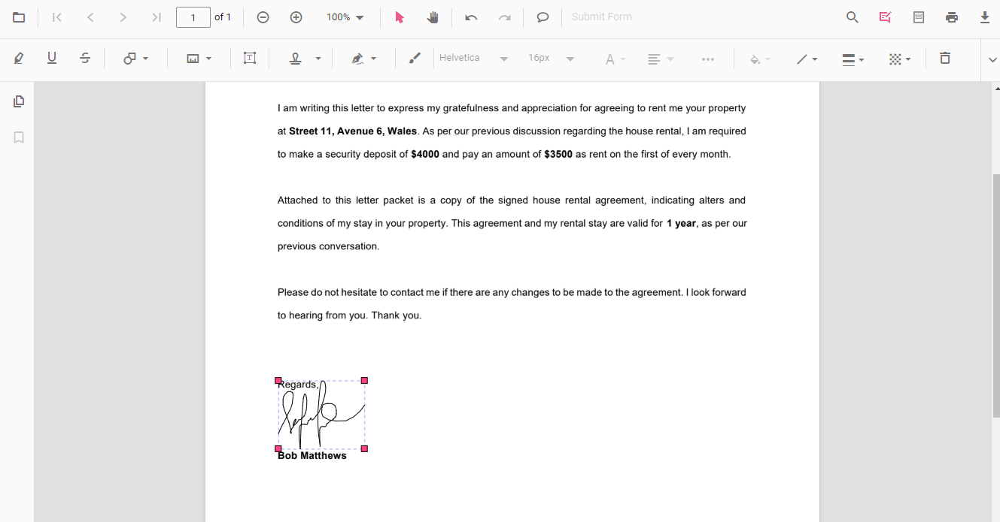
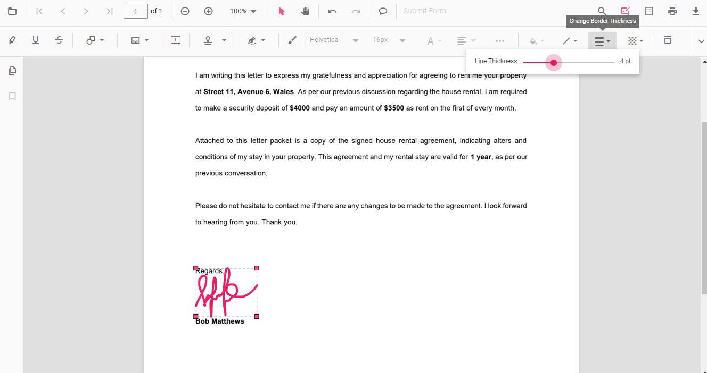
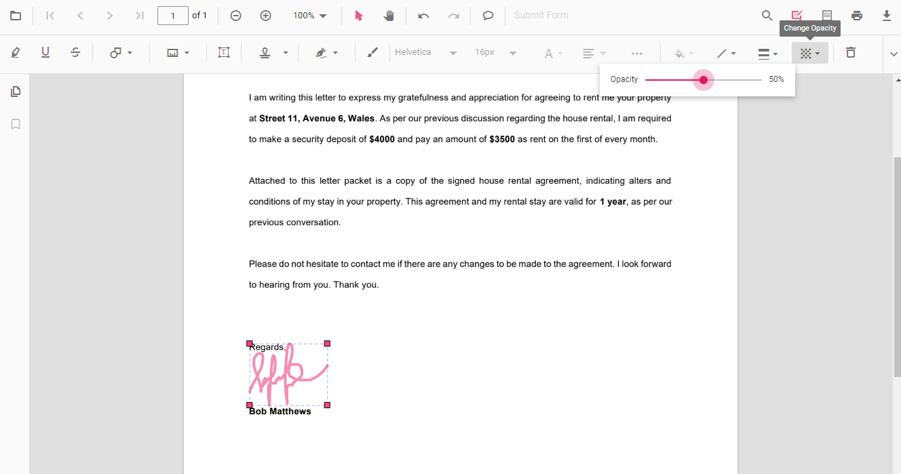

# Handwritten signature in Angular PDF Viewer control

The PDF Viewer control supports adding handwritten signatures to a PDF document. Handwritten signatures reduce paperwork and enable digital verification.

## Add signature annotation

### Adding a handwritten signature in UI

The handwritten signature can be added to the PDF document using the annotation toolbar.

- Click the **Edit Annotation** button in the PDF Viewer toolbar. A toolbar appears below it.
- Select the **Handwritten signature** button in the annotation toolbar. The signature panel appears.

- Draw the signature in the panel.

- Click **Create**, move the signature, and place it at the desired location.

Refer to the following code sample to switch to the handwritten signature mode programmatically.



import { Component } from '@angular/core';
import {
  PdfViewerModule,
  ToolbarService,
  AnnotationService,
  MagnificationService,
  NavigationService,
  LinkAnnotationService,
  BookmarkViewService,
  ThumbnailViewService,
  PrintService,
  TextSelectionService,
  TextSearchService,
  FormFieldsService,
  FormDesignerService,
  PageOrganizerService
} from '@syncfusion/ej2-angular-pdfviewer';

@Component({
  selector: 'app-root',
  standalone: true,
  imports: [PdfViewerModule],
  providers: [
    ToolbarService,
    AnnotationService,
    MagnificationService,
    NavigationService,
    LinkAnnotationService,
    BookmarkViewService,
    ThumbnailViewService,
    PrintService,
    TextSelectionService,
    TextSearchService,
    FormFieldsService,
    FormDesignerService,
    PageOrganizerService
  ],
  template: `
    

      <button (click)="handWrittenSignature()">
        HandWritten Signature mode
      </button>

      

        <ejs-pdfviewer
          id="pdfViewer"
          [documentPath]="documentPath"
          [resourceUrl]="resourceUrl"
          style="height: 640px">
        </ejs-pdfviewer>
      

    

  `
})
export class AppComponent {

  public documentPath: string =
    'https://cdn.syncfusion.com/content/pdf/pdf-succinctly.pdf';

  public resourceUrl: string =
    'https://cdn.syncfusion.com/ej2/31.2.2/dist/ej2-pdfviewer-lib';

  /** Switch to Handwritten Signature annotation mode */
  handWrittenSignature(): void {
    const viewer = (document.getElementById('pdfViewer') as any)
      ?.ej2_instances?.[0];

    if (viewer) {
      viewer.annotation.setAnnotationMode('HandWrittenSignature');
    }
  }
}


import { Component } from '@angular/core';
import {
  PdfViewerModule,
  ToolbarService,
  AnnotationService,
  MagnificationService,
  NavigationService,
  LinkAnnotationService,
  BookmarkViewService,
  ThumbnailViewService,
  PrintService,
  TextSelectionService,
  TextSearchService,
  FormFieldsService,
  FormDesignerService,
  PageOrganizerService
} from '@syncfusion/ej2-angular-pdfviewer';

@Component({
  selector: 'app-root',
  standalone: true,
  imports: [PdfViewerModule],
  providers: [
    ToolbarService,
    AnnotationService,
    MagnificationService,
    NavigationService,
    LinkAnnotationService,
    BookmarkViewService,
    ThumbnailViewService,
    PrintService,
    TextSelectionService,
    TextSearchService,
    FormFieldsService,
    FormDesignerService,
    PageOrganizerService
  ],
  template: `
    

      <button (click)="handWrittenSignature()">
        HandWritten Signature mode
      </button>

      

        <ejs-pdfviewer
          id="pdfViewer"
          [documentPath]="documentPath"
          [serviceUrl]="serviceUrl"
          style="height: 640px">
        </ejs-pdfviewer>
      

    

  `
})
export class AppComponent {

  public documentPath: string =
    'https://cdn.syncfusion.com/content/pdf/pdf-succinctly.pdf';

  public serviceUrl: string =
    'https://document.syncfusion.com/web-services/pdf-viewer/api/pdfviewer';

  /** Switch to Handwritten Signature annotation mode */
  handWrittenSignature(): void {
    const viewer = (document.getElementById('pdfViewer') as any)
      ?.ej2_instances?.[0];

    if (viewer) {
      viewer.annotation.setAnnotationMode('HandWrittenSignature');
    }
  }
}



### Add a handwritten signature programmatically

With the PDF Viewer library, you can programmatically add a handwritten signature to the PDF Viewer control using the [**addAnnotation()**](https://ej2.syncfusion.com/angular/documentation/api/pdfviewer/annotation#addannotation) method.

Here is an example of adding a handwritten signature programmatically using the `addAnnotation()` method:



import { Component, OnInit } from '@angular/core';
import { LinkAnnotationService, BookmarkViewService,
         MagnificationService, ThumbnailViewService, ToolbarService,
         NavigationService, TextSearchService, TextSelectionService,
         PrintService, FormDesignerService, FormFieldsService,
         AnnotationService, PageOrganizerService, HandWrittenSignatureSettings, DisplayMode } from '@syncfusion/ej2-angular-pdfviewer';

@Component({
  selector: 'app-root',
  // specifies the template string for the PDF Viewer component
  template: `

  <button (click)="addAnnotation()">Add Handwritten signature Programmatically</button>
  <ejs-pdfviewer
    id="pdfViewer"
    [documentPath]='document'
    [resourceUrl]='resource'
    style="height:640px;display:block">
  </ejs-pdfviewer>
  
`,
  providers: [ LinkAnnotationService, BookmarkViewService, MagnificationService,
               ThumbnailViewService, ToolbarService, NavigationService,
               TextSearchService, TextSelectionService, PrintService,
               AnnotationService, FormDesignerService, FormFieldsService, PageOrganizerService]
})
export class AppComponent implements OnInit {
    public document = 'https://cdn.syncfusion.com/content/pdf/pdf-succinctly.pdf';
    public resource: string = "https://cdn.syncfusion.com/ej2/27.1.48/dist/ej2-pdfviewer-lib";
    ngOnInit(): void {
    }
    addAnnotation() {
        var pdfviewer = (<any>document.getElementById('pdfViewer')).ej2_instances[0];
        pdfviewer.annotation.addAnnotation("HandWrittenSignature", {
            offset: { x: 220, y: 180 },
            pageNumber: 1,
            width: 150,
            height: 60,
            signatureItem: ['Signature'],
            signatureDialogSettings: {
                displayMode: DisplayMode.Draw
            },
            canSave: true,
            path: '[{\"command\":\"M\",\"x\":244.83334350585938,\"y\":982.0000305175781}]'
        } as HandWrittenSignatureSettings );
        pdfviewer.annotation.addAnnotation("HandWrittenSignature", {
            offset: { x: 200, y: 310 },
            pageNumber: 1,
            width: 200,
            height: 65,
            signatureItem: ['Signature'],
            signatureDialogSettings: {
                displayMode: DisplayMode.Text, hideSaveSignature: false
            },
            canSave: false,
            path: 'Syncfusion',
            fontFamily: "Helvetica",
        } as HandWrittenSignatureSettings );
        pdfviewer.annotation.addAnnotation("Initial", {
            offset: { x: 200, y: 500 },
            pageNumber: 1,
            width: 200,
            height: 80,
            signatureItem: ['Initial'],
            initialDialogSettings: {
                displayMode: DisplayMode.Upload, hideSaveSignature: false
            },
            canSave: true,
            path: "data:image/jpeg;base64,/9j/4AAQSkZ..."
        } as HandWrittenSignatureSettings );
    }
}



import { Component, OnInit } from '@angular/core';
import { LinkAnnotationService, BookmarkViewService,
         MagnificationService, ThumbnailViewService, ToolbarService,
         NavigationService, TextSearchService, TextSelectionService,
         PrintService, FormDesignerService, FormFieldsService,
         AnnotationService, PageOrganizerService, HandWrittenSignatureSettings, DisplayMode } from '@syncfusion/ej2-angular-pdfviewer';

@Component({
    selector: 'app-root',
    // specifies the template string for the PDF Viewer component
    template: `

        <button (click)="addAnnotation()">Add Handwritten signature Programmatically</button>
        <ejs-pdfviewer
            id="pdfViewer"
            [documentPath]='document'
            [serviceUrl]='service'
            style="height:640px;display:block">
        </ejs-pdfviewer>
    
`,
  providers: [ LinkAnnotationService, BookmarkViewService, MagnificationService,
               ThumbnailViewService, ToolbarService, NavigationService,
               TextSearchService, TextSelectionService, PrintService,
               AnnotationService, FormDesignerService, FormFieldsService, PageOrganizerService]
})
export class AppComponent implements OnInit {
    public document = 'https://cdn.syncfusion.com/content/pdf/pdf-succinctly.pdf';
    public service: string = 'https://document.syncfusion.com/web-services/pdf-viewer/api/pdfviewer';
    ngOnInit(): void {
    }
    addAnnotation() {
        var pdfviewer = (<any>document.getElementById('pdfViewer')).ej2_instances[0];
        pdfviewer.annotation.addAnnotation("Initial", {
            offset: { x: 220, y: 180 },
            pageNumber: 1,
            width: 150,
            height: 60,
            signatureItem: ['Initial'],
            initialDialogSettings: {
                displayMode: DisplayMode.Draw
            },
            canSave: true,
            path: '[{\"command\":\"M\",\"x\...}]'
        } as HandWrittenSignatureSettings );
        pdfviewer.annotation.addAnnotation("Initial", {
            offset: { x: 200, y: 310 },
            pageNumber: 1,
            width: 200,
            height: 65,
            signatureItem: ['Initial'],
            initialDialogSettings: {
                displayMode: DisplayMode.Text, hideSaveSignature: false
            },
            canSave: false,
            path: 'Syncfusion',
            fontFamily: "Helvetica",
        } as HandWrittenSignatureSettings );
        pdfviewer.annotation.addAnnotation("HandWrittenSignature", {
            offset: { x: 200, y: 500 },
            pageNumber: 1,
            width: 200,
            height: 80,
            signatureItem: ['Signature'],
            signatureDialogSettings: {
                displayMode: DisplayMode.Upload, hideSaveSignature: false
            },
            canSave: true,
            path: "data:image/jpeg;base64,/9j/4AAQSkZJRgAB..."
        } as HandWrittenSignatureSettings );
    }
}



[View sample in GitHub](https://github.com/SyncfusionExamples/angular-pdf-viewer-examples/tree/master/How%20to/Add%20Handwritten%20Signature%20Programmatically)

## Edit signature annotation

### Edit signature annotation in UI

Stroke color, border thickness, and opacity can be edited using the Edit Stroke Color, Edit Thickness, and Edit Opacity tools in the annotation toolbar.

#### Edit stroke color

Edit the stroke color using the color palette in the Edit Stroke Color tool.

#### Edit thickness

Edit border thickness using the range slider in the Edit Thickness tool.

#### Edit opacity

Edit opacity using the range slider in the Edit Opacity tool.

### Edit Signature Annotation Programmatically

With the PDF Viewer library, you can programmatically edit a handwritten signature in the PDF Viewer control using the `editSignature()` method.

Here is an example of editing a handwritten signature programmatically using the `editSignature()` method:



import { Component } from '@angular/core';
import {
  PdfViewerModule,
  ToolbarService,
  MagnificationService,
  NavigationService,
  AnnotationService,
  LinkAnnotationService,
  ThumbnailViewService,
  BookmarkViewService,
  TextSelectionService,
  TextSearchService,
  FormFieldsService,
  FormDesignerService
} from '@syncfusion/ej2-angular-pdfviewer';

import { DisplayMode } from '@syncfusion/ej2-pdfviewer';

@Component({
  selector: 'app-root',
  standalone: true,
  imports: [PdfViewerModule],
  providers: [
    ToolbarService,
    MagnificationService,
    NavigationService,
    AnnotationService,
    LinkAnnotationService,
    ThumbnailViewService,
    BookmarkViewService,
    TextSelectionService,
    TextSearchService,
    FormFieldsService,
    FormDesignerService
  ],
  template: `
    

      

        <button (click)="addSignature()">Add Signature Annotation</button>
        <button (click)="editSignature()">Edit Signature Annotation</button>
      

      <ejs-pdfviewer
        id="pdfViewer"
        [documentPath]="documentPath"
        [resourceUrl]="resourceUrl"
        style="height: 650px">
      </ejs-pdfviewer>
    

  `
})
export class AppComponent {

  public documentPath: string =
    'https://cdn.syncfusion.com/content/pdf/form-designer.pdf';

  public resourceUrl: string =
    'https://cdn.syncfusion.com/ej2/31.2.2/dist/ej2-pdfviewer-lib';

  /** Get PDF Viewer instance */
  private getViewer(): any {
    return (document.getElementById('pdfViewer') as any)
      ?.ej2_instances?.[0];
  }

  /** Add Handwritten Signature (Text mode) */
  addSignature(): void {
    const viewer = this.getViewer();
    if (!viewer) { return; }

    viewer.annotation.addAnnotation('HandWrittenSignature', {
      offset: { x: 200, y: 310 },
      pageNumber: 1,
      width: 200,
      height: 65,
      signatureItem: ['Signature'],
      signatureDialogSettings: {
        displayMode: DisplayMode.Text,
        hideSaveSignature: false
      },
      canSave: false,
      path: 'Syncfusion',
      fontFamily: 'Helvetica'
    });
  }

  /** Edit existing Signature annotation */
  editSignature(): void {
    const viewer = this.getViewer();
    if (!viewer || !viewer.signatureCollection) { return; }

    for (const signature of viewer.signatureCollection) {
      if (signature.shapeAnnotationType === 'SignatureText') {
        signature.fontSize = 12;
        signature.thickness = 2;
        signature.strokeColor = '#0000FF';
        signature.opacity = 0.8;

        viewer.annotationModule.editSignature(signature);
      }
    }
  }
}


import { Component } from '@angular/core';
import {
  PdfViewerModule,
  ToolbarService,
  MagnificationService,
  NavigationService,
  AnnotationService,
  LinkAnnotationService,
  ThumbnailViewService,
  BookmarkViewService,
  TextSelectionService,
  TextSearchService,
  FormFieldsService,
  FormDesignerService
} from '@syncfusion/ej2-angular-pdfviewer';

import { DisplayMode } from '@syncfusion/ej2-pdfviewer';

@Component({
  selector: 'app-root',
  standalone: true,
  imports: [PdfViewerModule],
  providers: [
    ToolbarService,
    MagnificationService,
    NavigationService,
    AnnotationService,
    LinkAnnotationService,
    ThumbnailViewService,
    BookmarkViewService,
    TextSelectionService,
    TextSearchService,
    FormFieldsService,
    FormDesignerService
  ],
  template: `
    

      

        <button (click)="addSignature()">Add Signature Annotation</button>
        <button (click)="editSignature()">Edit Signature Annotation</button>
      

      <ejs-pdfviewer
        id="pdfViewer"
        [documentPath]="documentPath"
        [serviceUrl]="serviceUrl"
        style="height: 650px">
      </ejs-pdfviewer>
    

  `
})
export class AppComponent {

  public documentPath: string =
    'https://cdn.syncfusion.com/content/pdf/form-designer.pdf';

  public serviceUrl: string =
    'https://document.syncfusion.com/web-services/pdf-viewer/api/pdfviewer';

  /** Get PDF Viewer instance */
  private getViewer(): any {
    return (document.getElementById('pdfViewer') as any)
      ?.ej2_instances?.[0];
  }

  /** Add Handwritten Signature (Text mode) */
  addSignature(): void {
    const viewer = this.getViewer();
    if (!viewer) { return; }

    viewer.annotation.addAnnotation('HandWrittenSignature', {
      offset: { x: 200, y: 310 },
      pageNumber: 1,
      width: 200,
      height: 65,
      signatureItem: ['Signature'],
      signatureDialogSettings: {
        displayMode: DisplayMode.Text,
        hideSaveSignature: false
      },
      canSave: false,
      path: 'Syncfusion',
      fontFamily: 'Helvetica'
    });
  }

  /** Edit existing Signature annotation */
  editSignature(): void {
    const viewer = this.getViewer();
    if (!viewer || !viewer.signatureCollection) { return; }

    for (const signature of viewer.signatureCollection) {
      if (signature.shapeAnnotationType === 'SignatureText') {
        signature.fontSize = 12;
        signature.thickness = 2;
        signature.strokeColor = '#0000FF';
        signature.opacity = 0.8;

        viewer.annotationModule.editSignature(signature);
      }
    }
  }
}



## Enable or disable handwritten signature

The following example enables or disables the handwritten signature in the PDF Viewer. Setting the value to `false` disables the feature.



import { Component } from '@angular/core';
import {
  PdfViewerModule,
  ToolbarService,
  AnnotationService,
  MagnificationService,
  NavigationService,
  LinkAnnotationService,
  BookmarkViewService,
  ThumbnailViewService,
  PrintService,
  TextSelectionService,
  TextSearchService,
  FormFieldsService,
  FormDesignerService,
  PageOrganizerService
} from '@syncfusion/ej2-angular-pdfviewer';

@Component({
  selector: 'app-root',
  standalone: true,
  imports: [PdfViewerModule],
  providers: [
    ToolbarService,
    AnnotationService,
    MagnificationService,
    NavigationService,
    LinkAnnotationService,
    BookmarkViewService,
    ThumbnailViewService,
    PrintService,
    TextSelectionService,
    TextSearchService,
    FormFieldsService,
    FormDesignerService,
    PageOrganizerService
  ],
  template: `
    

      

        <!-- Render the PDF Viewer -->
        <ejs-pdfviewer
          id="pdfViewer"
          [documentPath]="documentPath"
          [serviceUrl]="serviceUrl"
          [enableHandwrittenSignature]="true"
          style="height: 640px">
        </ejs-pdfviewer>
      

    

  `
})
export class AppComponent {

  public documentPath: string =
    'https://cdn.syncfusion.com/content/pdf/pdf-succinctly.pdf';

  public serviceUrl: string =
    'https://document.syncfusion.com/web-services/pdf-viewer/api/pdfviewer';
}


import { Component } from '@angular/core';
import {
  PdfViewerModule,
  ToolbarService,
  AnnotationService,
  MagnificationService,
  NavigationService,
  LinkAnnotationService,
  BookmarkViewService,
  ThumbnailViewService,
  PrintService,
  TextSelectionService,
  TextSearchService,
  FormFieldsService,
  FormDesignerService,
  PageOrganizerService
} from '@syncfusion/ej2-angular-pdfviewer';

@Component({
  selector: 'app-root',
  standalone: true,
  imports: [PdfViewerModule],
  providers: [
    ToolbarService,
    AnnotationService,
    MagnificationService,
    NavigationService,
    LinkAnnotationService,
    BookmarkViewService,
    ThumbnailViewService,
    PrintService,
    TextSelectionService,
    TextSearchService,
    FormFieldsService,
    FormDesignerService,
    PageOrganizerService
  ],
  template: `
    

      

        <!-- Render the PDF Viewer -->
        <ejs-pdfviewer
          id="pdfViewer"
          [documentPath]="documentPath"
          [resourceUrl]="resourceUrl"
          [enableHandwrittenSignature]="true"
          style="height: 640px">
        </ejs-pdfviewer>
      

    

  `
})
export class AppComponent {

  public documentPath: string =
    'https://cdn.syncfusion.com/content/pdf/pdf-succinctly.pdf';

  public resourceUrl: string =
    'https://cdn.syncfusion.com/ej2/31.2.2/dist/ej2-pdfviewer-lib';
}



N> When `enableHandwrittenSignature` is set to `false`, the handwritten signature toolbar and related UI are disabled; existing handwritten signature annotations remain in the document unless removed. The `canSave` option in annotation examples controls whether a signature can be saved for reuse; when `canSave` is `false`, signatures are not persisted in the signature collection for later reuse.

## See also

- [Annotation Overview](../overview)
- [Annotation Types](../annotation/annotation-types/area-annotation)
- [Annotation Toolbar](../toolbar-customization/annotation-toolbar)
- [Create and Modify Annotation](../annotation/create-modify-annotation)
- [Customize Annotation](../annotation/customize-annotation)
- [Remove Annotation](../annotation/delete-annotation)
- [Export and Import Annotation](../annotation/export-import/export-annotation)
- [Annotation Permission](../annotation/annotation-permission)
- [Annotation in Mobile View](../annotation/annotations-in-mobile-view)
- [Annotation Events](../annotation/annotation-event)
- [Annotation API](../annotation/annotations-api)