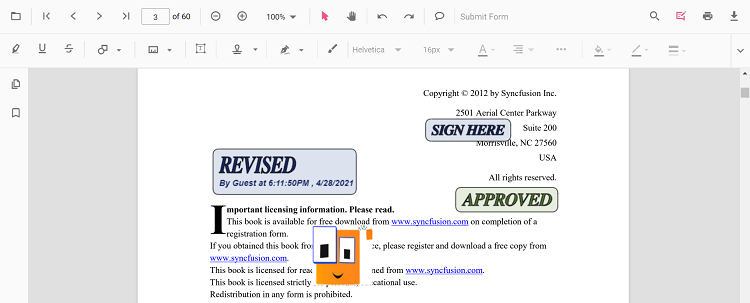
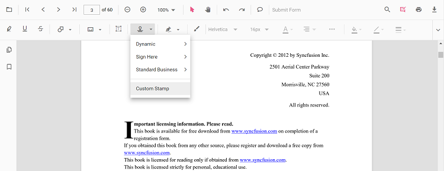

# Stamp Annotation in Angular PDF Viewer component

The PDF Viewer control provides options to add, edit, delete, and rotate the following stamp annotations in PDF documents:

* Dynamic
* Sign Here
* Standard Business
* Custom Stamp

## Add stamp annotations to the PDF document

The stamp annotations can be added to the PDF document using the annotation toolbar.

* Click the **Edit Annotation** button in the PDF Viewer toolbar. A toolbar appears below it.
* Click the **Stamp Annotation** drop-down button. The pop-up lists available stamp annotation types.

* Select a stamp type to enable its annotation mode.

* Place the stamp on the pages of the PDF document.

N> When in pan mode and a stamp annotation tool is selected, the PDF Viewer switches to text select mode automatically for a smooth interaction experience.

The following examples switch to stamp annotation modes.




  import { Component, OnInit } from '@angular/core';
  import { PdfViewerComponent, LinkAnnotationService, BookmarkViewService,
           MagnificationService, ThumbnailViewService, ToolbarService,
           NavigationService, TextSearchService, TextSelectionService,
           PrintService, AnnotationService, SignStampItem
         } from '@syncfusion/ej2-angular-pdfviewer';
  @Component({
      selector: 'app-root',
      // Specifies the template string for the PDF Viewer component.
      template: `<button (click)="addAnnotation()">Stamp</button>
                  

                    <ejs-pdfviewer id="pdfViewer"
                      [documentPath]='document'
                      [resourceUrl]='resource'
                      style="height:640px;display:block">
                    </ejs-pdfviewer>
                  
`,
    providers: [ LinkAnnotationService, BookmarkViewService, MagnificationService,
                 ThumbnailViewService, ToolbarService, NavigationService,
                 TextSearchService, TextSelectionService, PrintService,
                 AnnotationService]
    })
  export class AppComponent implements OnInit {
      public document: string = 'https://cdn.syncfusion.com/content/pdf/pdf-succinctly.pdf';
      public resource: string = "https://cdn.syncfusion.com/ej2/25.1.35/dist/ej2-pdfviewer-lib";
      ngOnInit(): void {
      }
      addAnnotation() {
          var pdfviewer = (<any>document.getElementById("pdfViewer")).ej2_instances[0];
          pdfviewer.annotationModule.setAnnotationMode("Stamp", null, SignStampItem.Witness);
      }
  }




  import { Component, OnInit } from '@angular/core';
  import { PdfViewerComponent, LinkAnnotationService, BookmarkViewService,
           MagnificationService, ThumbnailViewService, ToolbarService,
           NavigationService, TextSearchService, TextSelectionService,
           PrintService, AnnotationService, SignStampItem
         } from '@syncfusion/ej2-angular-pdfviewer';
  @Component({
      selector: 'app-root',
      // Specifies the template string for the PDF Viewer component.
      template: `<button (click)="addAnnotation()">Stamp</button>
                  

                    <ejs-pdfviewer id="pdfViewer"
                      [serviceUrl]='service'
                      [documentPath]='document'
                      style="height:640px;display:block">
                    </ejs-pdfviewer>
                  
`,
    providers: [ LinkAnnotationService, BookmarkViewService, MagnificationService,
                 ThumbnailViewService, ToolbarService, NavigationService,
                 TextSearchService, TextSelectionService, PrintService,
                 AnnotationService]
    })
  export class AppComponent implements OnInit {
      public service: string = 'https://document.syncfusion.com/web-services/pdf-viewer/api/pdfviewer';
      public document: string = 'https://cdn.syncfusion.com/content/pdf/pdf-succinctly.pdf';
      ngOnInit(): void {
      }
      addAnnotation() {
          var pdfviewer = (<any>document.getElementById("pdfViewer")).ej2_instances[0];
          pdfviewer.annotationModule.setAnnotationMode("Stamp", null, SignStampItem.Witness);
      }
  }




## Add a stamp annotation to the PDF document programmatically
The PDF Viewer library allows adding a stamp annotation programmatically using the [addAnnotation()](https://ej2.syncfusion.com/angular/documentation/api/pdfviewer/annotation/#addannotation) method.

Here are examples showing how to add stamp annotations programmatically using addAnnotation():




import { Component, OnInit } from '@angular/core';
import { LinkAnnotationService, BookmarkViewService,
         MagnificationService, ThumbnailViewService, ToolbarService,
         NavigationService, TextSearchService, TextSelectionService,
         PrintService, FormDesignerService, FormFieldsService,
         AnnotationService, PageOrganizerService, StampSettings, DynamicStampItem ,
         SignStampItem, StandardBusinessStampItem, CustomStampSettings} from '@syncfusion/ej2-angular-pdfviewer';
@Component({
  selector: 'app-root',
  // specifies the template string for the PDF Viewer component
  template: `

  <button (click)="addDynamicStamp()">Add Dynamic Stamp Programmatically</button>
  <button (click)="addSignStamp()">Add Sign Stamp Programmatically</button>
  <button (click)="addStandardBusinessStamp()">Add StandardBusiness Stamp Programmatically</button>
  <button (click)="addCustomStamp()">Add Custom Stamp Programmatically</button>
  <ejs-pdfviewer
    id="pdfViewer"
    [documentPath]='document'
    [resourceUrl]='resource'
    style="height:640px;display:block">
  </ejs-pdfviewer>

`,
  providers: [ LinkAnnotationService, BookmarkViewService, MagnificationService,
               ThumbnailViewService, ToolbarService, NavigationService,
               TextSearchService, TextSelectionService, PrintService,
               AnnotationService, FormDesignerService, FormFieldsService, PageOrganizerService]
})
export class AppComponent implements OnInit {
    public document = 'https://cdn.syncfusion.com/content/pdf/pdf-succinctly.pdf';
    public resource: string = "https://cdn.syncfusion.com/ej2/25.1.35/dist/ej2-pdfviewer-lib";
    ngOnInit(): void {
    }
  addDynamicStamp() {
    var pdfviewer = (<any>document.getElementById('pdfViewer')).ej2_instances[0];
    pdfviewer.annotation.addAnnotation("Stamp", {
      offset: { x: 200, y: 140 },
      pageNumber: 1
    } as StampSettings, DynamicStampItem.Approved);
  }
  addSignStamp() {
    var pdfviewer = (<any>document.getElementById('pdfViewer')).ej2_instances[0];
    pdfviewer.annotation.addAnnotation("Stamp", {
      offset: { x: 200, y: 240 },
      pageNumber: 1
    } as StampSettings, undefined, SignStampItem.Witness);
  }
  addStandardBusinessStamp() {
    var pdfviewer = (<any>document.getElementById('pdfViewer')).ej2_instances[0];
    pdfviewer.annotation.addAnnotation("Stamp", {
      offset: { x: 200, y: 340 },
      pageNumber: 1
    } as StampSettings, undefined, undefined, StandardBusinessStampItem.Approved);
  }
  addCustomStamp() {
    var viewer = (<any>document.getElementById('pdfViewer')).ej2_instances[0];
    viewer.annotation.addAnnotation('Stamp',
      {
        offset: { x: 100, y: 440 },
        width: 46,
        author: 'Guest',
        height: 100,
        isLock: true,
        pageNumber: 1,
        customStamps: [
          {
            customStampName: "Image",
            customStampImageSource:
              "data:image/jpeg;base64,/9j/4AAQSkZJRgABAQAAAQABAAD/2wCEAAkGBwgHBgkIBwgKCgkLDRYPDQwMDRsUFRAWIB0iIiAdHx8kKDQsJCYxJx8fLT0tMTU3Ojo6Iys/RD84QzQ5OjcBCgoKDQwNGg8PGjclHyU3Nzc3Nzc3Nzc3Nzc3Nzc3Nzc3Nzc3Nzc3Nzc3Nzc3Nzc3Nzc3Nzc3Nzc3Nzc3Nzc3N//AABEIAIIAqwMBIgACEQEDEQH/xAAbAAEAAgMBAQAAAAAAAAAAAAAABQYBAwQHAv/EAEEQAAEDAwIEAwYDBAYLAAAAAAECAwQABREGIRIxQVETYXEHFCIygZEVQmIjUnKCJCUzU6HRFhc1c5KisbKzwvD/xAAVAQEBAAAAAAAAAAAAAAAAAAAAAf/EABQRAQAAAAAAAAAAAAAAAAAAAAD/2gAMAwEAAhEDEQA/APcaUpQKUpQKUpQKUpQKUpQKVzXGdFtsN2ZPfbYjNJ4nHHDgJFfEK5Q5ttbuUaQhcNxvxUPcklPfflQdlYJxURpe/salthuMNpxEYvuNtKc28VKVcPGB2JB577Vyz7pNuUxy26eWlCml8Mu4OI4kR/0oB2Wvp2T17EJK43qDbloakOqL7m6I7TanHVjOMhCQTjzxgVut89i4Mqdj8Y4VlC0OIKFIUOYKTuOn0INRZZtWkrVLuDpIIHHJlPK4nX1dOJR5kk4A5DYDArVoWbHuVgTPjvF5Ul5xx5zhIBc4jkJyBlI+UHqE0FjpSlApSlApSlApSlApSlApSlApSlArClAczgVmqr7QZLptkezxHi1KvD4ihxKsFprBU6v6IB+pFBTdUKf1uUuFa0WpyUIVoYBx706chchXdKEhZSPLNXXVTsOw6NdjNxkvJS0iLEidHnDhLaPME4z5ZzVHk6kTHu1vTpyE1Jf8L3Oww1ZDaGc4XJXjklXDhP6UlWd63ybrL1rq1mNa1hLcAKEeQgcTbbvyuScHnw5KGweZJPIVRYoDT6okfSlnfWhmCwlu43FGAUKxu2j9atyT+UHvirZBixLZBaiQ2kR4zCMIQnZKRWuz2yLZ7czBgo4GWh13KidypR6qJJJPevOvaFqCXqC4HSGmzxlxQbmvJJAPXwwe2M8R9R3FQc1xde9qOqEW+C44jTFuVxPvtnHvCvI+e4HYZPavV4sdmLGajxmktMtJCENpGAkDkBUbpixRNO2dm3Q0/Cj4lrPNazzUf/uWKlkkEZByKDNKUoFKUoFKUoFKUoFKwahZ2p7dFfMZhTs+ZnHu0FHirB/VjZHqogUE3WOIYzUApzUlwBKUxLOwQCFL/bv467DCEn6qr5i6btk5ht+ZOlXlCxlLkiTxtr8whGG8fy0HdK1FZorymHbjH8dPNlC+NY/lTk1XNTe0m12SCXBFnrkOpX7uh6ItkKUBzPGEnhzjcA1bokKLAZS1BjMx20jAQy2EjHoK85i6PuOovaFNv+pWPDt8J/ggMKUCXktq+BX8HNXmT2G9HLF1trSyW2GrUFgbluT3eCIRIS26tS/iSjwgCcDl35Z3qBlSb/edVcN58e4tojKafiW2MfDQpRBXF8X5UnZPGsq5ZAr0TV2j52oL9Anx7wqCxHYWypLbeXAFH4lNqz8KiNs8x0qy2e1QrNbmYFuZDUdkYSkHOT1JPUk7k0HhsG6u3SHPeisLFwnucE95hOPdmc8DUNhR/OrCR5Ak9NvX9F6cRp20IZIR706AX1I5DA2Qn9KRsPvzJqGmXG0N6pfk3KTEhW2ykBsLKUh2Y4nKlY6lKCAOuVmuafry5T5rFs0vaHQ5JSVIm3FBaQhvq7wfNwjurAPnQZ9pms1WtlVmtDqRcnxwrdK+ERknqT0Vj7DftUN7OA1BilywWx65TnU8PjOAtMsJJzlbhBypXMhPFgADbrF6B0sNSagkzrk+5cbTDeUQ5IHwy3T+bHbYE/y9yK9sabQ02lDSAhCRhKUjAAoIaFaZ8gh++zg8vIKYsUFphB+/Ev8AmONuVTYGBgcqzSoFKUoFKUoFKUoFcV4mOW+2yJbEN6Y40gqTHYGVuHsK7awRmg8rd/1gameJn2n8Ptv5YQn+78f+8cSFLI57AJ8/Oy2eyalhxkRo79htEVI2YgQ1uEH+JSgD68NW/FQ2r7yqxWCTNZR4knZqM1/ePLPChP3IoKRc4l91FqJ3TkfUst2Aygfiz7TDTaEA8mkEAnjPXfAH2NohaPehR2Y8bVF9QwygNttJMcJSkDAAAZru0hY02CyMxFK8SWv9rMfPN55W6lE9d9vQCpughmrLNZVxI1Fc19kupYUn/wAYP+NdQVMjD+khEhsfM40nhUPMp3z9D9K76xQRN/uNxjWj3qwW9F0krKfDa8YISUn83F25VVocf2kXdR/EJlrskZQxiM14ryR5ZJA9c/SrHo973m2SFjPhCfKSzn9wPLCceXbyxUpPmRrdDemTHUMx2UFbjizgJAoPGrbpyJBRPvEi53STfhc34MRCVMrckLSvCT8aFEEjBUQdhUlfbHcrcItuYvc+VqbUBDcpf7PgDSfnJPBxBCQcDBGcnlUn7Om4kly+aonhbPBPkeGiRsIqCEqUcHkSMZ9K5bRqqMbjJ1E5FkTrndFe72m2sAF1MVBI4iD8iVKyoqO2w7VRbrJpRdkt7MGDe56GGhgJ8Njn1P8AZ9fPNd5gXNKQEXt0q7uRmz/0AqFja29znGFq2EmxuqaLzDrkhK2XUj5gF7YUNvhqsX+66nvtqlarsrsmDa7aUvQIqQULuCUqHiLdGPk4c8I686g9BMK8/lu7IxyzCB/9q4bpJkWeP7xd9TQojGeHjdipRk9hlW5/yrF21raoEGM/HcM+TMSDEhwyFuv55YA5DfcnYVx2fTD9wm/jeskMS7goYYhY42IKeyQeajtlR68tqCUjtXWVHakQL/FejupC23PcwsLSeoKVgEVsLWomsFMm1yAM5C2HGir6hSsfY1B6ILViuV50utSWkRpHvNvQTgGO6OLCe/CviB7bVMXjVMC2vCG0VTrk4MtQIeHHleZHJCf1KwKDTcNSqskB2XqSCYjTQ3fYcDzSj0SOSgSdhlP1r50FqherbM5cVQVQwmQtkNlfFxBON8/XB8wa4JNsfUzJ1Jq/wXFQWnH4tvbPEzFCUk8RyPjd2+bkOQ7nHs0iSLRY7dBkKUoy4gnYV8yHFEFxPoCtOPU+VBdaUpQKUpQKqF4H4xry027YxrYyq4yB3cPwND/vV9BVvNVTRf8ATrhqC9KIUJU4x2T2aZHAB/xcZ+tBa6UpQKr+r7lIjRWrdaz/AFrcleBF2z4W3xOq8kDf1wOtSV5ukSz216fOc4GGhk4GSo9EpHVROwHU1DaWtst2S9qG+N8Nzlp4WWSc+6R85S0P1dVHqfSgm7Rb2bTbItvjcXhR2g2kqOVKx1J6k8zVbfP+leoSxkGx2h7LxztJlD8h6FCOZ/VjtXdq25ymWY9ptSv61uSi2yr+4Rj43T5JHLzIrRfHIujtCy/dthFiqQyD8zrqhgZ7qUo/40FJsbL2q7W/YYchUdqdMlXC5SEDJQhbq/CbHTKuEEj90edXfRWi4Gk4yvAUqTMdADsp35ikckj91I7Vn2e6bTpnTUaG5hUtweLJcHVw9PQch6VZ6Dhudot12aQ1dIEWa2hXEhEllLgSe4Cga7OBPBwYHDjGMbYr6pQRNp03ZrM669arVChuu/OphkJJ8tunlUt0pSgjLxYLVew2LtAYleEctqcT8SPRXMfevq0WO12VtTdpgRoiVHKy02AVnuo8z9akaUEBr2O9L0beI8dtx1xyMpIQ2kqUodQANycZrk07JVeLyq4R2HmrZCiiJFW62UF9SilS1AHfhHAgA7b8XlVqIzWMb0GaUpQKUpQc9wkCJAkyVcmWlOH6AmoL2bsqZ0LZi4SXHowfcUeZU58ZP3VUpqNlcjT1zYaGVuRHUJA6koIFcuiZDcnR9lea+RcFkgdvgG1BN1omS48GM7JluoZYaSVuOLOEpSOZJrXdLjEtUF2bcJLceM0MrccOAP8AP0qqR4czWk1qfd2HItgZWFxLe6MLlKHJ14dE9kH1NBttDEjVVzYvtxaUza4547ZCdThSz0kLHQ4+UdAc86tcmQzDjOyJLiW2WUFxxxWwSkDJJ+lbQAOVVPU6vx29xdLsqPgBKZdzIG3ghWEtE9CtX/Kk0GzSTDlwekamnNlL08BMNCs5ZijdAweRVniPqB0qsarce1XrezWlghVsiTCp3B/tFtDicPok8CP4lq7VedSzXYFr8OBwpmyVCPEyPhStQPxEfupAKj5JNVz2eW9t2RIvLJWqGlsQbetXN1pCsuPerjmVZ6gCqLyBis0pUClKUClKUClKUClKUClKUClKUGCMjFVNqw36yeOxpmbb/wAPdcU43GntLPuqlHJCFJO6ckkJI2zzq20oKtE0iZE5q46mnKu8to8TLSmwiMwe6G99/wBSiTVoGwrNcV4uUez2yTcJiiGY7ZWrAyT2AHUk7D1oMXq6R7PapNxlk+FHQVkAZKj0SB1JOAPWozRtqfhW5ybcf9qXJz3qZk54FEbNg9kDCfoT1qGi++alvEGJdGwlq2hE+e0FApTKVu0we4Qk8R7nhNXkcqCs6q0zK1DcIWbkqNbW23ESmWk4ceCsZAV+UEAgnngnvViix2okZqPHbS2y0kIbQkYCUjYAVtpQKUpQKUpQKUpQKUpQKUpQKUpQKUpQKUpQKouv7mwi7W2HJBdZiJNxXHSd5DoUER2gOpU4rI/gq9VxO2i3PXRu6OwmFz2m/DbkKQCtKck4B+p+9BxaTtblqtQEvhM+UtUqatO4U8vdW/YbJHkkVNVgDFZoFKUoFKUoFKUoFKUoFKUoFKUoFKUoFKUoFKUoFKUoFKUoFKUoFKUoFKUoFKUoFKUoFKUoFKUoP//Z"
          }
        ]
      } as CustomStampSettings);
  }
}




import { Component, OnInit } from '@angular/core';
import { LinkAnnotationService, BookmarkViewService,
         MagnificationService, ThumbnailViewService, ToolbarService,
         NavigationService, TextSearchService, TextSelectionService,
         PrintService, FormDesignerService, FormFieldsService,
         AnnotationService, PageOrganizerService, StampSettings, DynamicStampItem ,
         SignStampItem, StandardBusinessStampItem, CustomStampSettings} from '@syncfusion/ej2-angular-pdfviewer';
@Component({
  selector: 'app-root',
  // specifies the template string for the PDF Viewer component
  template: `

  <button (click)="addDynamicStamp()">Add Dynamic Stamp Programmatically</button>
  <button (click)="addSignStamp()">Add Sign Stamp Programmatically</button>
  <button (click)="addStandardBusinessStamp()">Add StandardBusiness Stamp Programmatically</button>
  <button (click)="addCustomStamp()">Add Custom Stamp Programmatically</button>
  <ejs-pdfviewer
    id="pdfViewer"
    [documentPath]='document'
    [serviceUrl]='service'
    style="height:640px;display:block">
  </ejs-pdfviewer>

`,
  providers: [ LinkAnnotationService, BookmarkViewService, MagnificationService,
               ThumbnailViewService, ToolbarService, NavigationService,
               TextSearchService, TextSelectionService, PrintService,
               AnnotationService, FormDesignerService, FormFieldsService, PageOrganizerService]
})
export class AppComponent implements OnInit {
    public document = 'https://cdn.syncfusion.com/content/pdf/pdf-succinctly.pdf';
    public service: string = 'https://document.syncfusion.com/web-services/pdf-viewer/api/pdfviewer';
    ngOnInit(): void {
    }
  addDynamicStamp() {
    var pdfviewer = (<any>document.getElementById('pdfViewer')).ej2_instances[0];
    pdfviewer.annotation.addAnnotation("Stamp", {
      offset: { x: 200, y: 140 },
      pageNumber: 1
    } as StampSettings, DynamicStampItem.Approved);
  }
  addSignStamp() {
    var pdfviewer = (<any>document.getElementById('pdfViewer')).ej2_instances[0];
    pdfviewer.annotation.addAnnotation("Stamp", {
      offset: { x: 200, y: 240 },
      pageNumber: 1
    } as StampSettings, undefined, SignStampItem.Witness);
  }
  addStandardBusinessStamp() {
    var pdfviewer = (<any>document.getElementById('pdfViewer')).ej2_instances[0];
    pdfviewer.annotation.addAnnotation("Stamp", {
      offset: { x: 200, y: 340 },
      pageNumber: 1
    } as StampSettings, undefined, undefined, StandardBusinessStampItem.Approved);
  }
  addCustomStamp() {
    var viewer = (<any>document.getElementById('pdfViewer')).ej2_instances[0];
    viewer.annotation.addAnnotation('Stamp',
      {
        offset: { x: 100, y: 440 },
        width: 46,
        author: 'Guest',
        height: 100,
        isLock: true,
        pageNumber: 1,
        customStamps: [
          {
            customStampName: "Image",
            customStampImageSource:
              "data:image/jpeg;base64,/9j/4AAQSkZJRgABAQAAAQABAAD/2wCEAAkGBwgHBgkIBwgKCgkLDRYPDQwMDRsUFRAWIB0iIiAdHx8kKDQsJCYxJx8fLT0tMTU3Ojo6Iys/RD84QzQ5OjcBCgoKDQwNGg8PGjclHyU3Nzc3Nzc3Nzc3Nzc3Nzc3Nzc3Nzc3Nzc3Nzc3Nzc3Nzc3Nzc3Nzc3Nzc3Nzc3Nzc3N//AABEIAIIAqwMBIgACEQEDEQH/xAAbAAEAAgMBAQAAAAAAAAAAAAAABQYBAwQHAv/EAEEQAAEDAwIEAwYDBAYLAAAAAAECAwQABREGIRIxQVETYXEHFCIygZEVQmIjUnKCJCUzU6HRFhc1c5KisbKzwvD/xAAVAQEBAAAAAAAAAAAAAAAAAAAAAf/EABQRAQAAAAAAAAAAAAAAAAAAAAD/2gAMAwEAAhEDEQA/APcaUpQKUpQKUpQKUpQKUpQKVzXGdFtsN2ZPfbYjNJ4nHHDgJFfEK5Q5ttbuUaQhcNxvxUPcklPfflQdlYJxURpe/salthuMNpxEYvuNtKc28VKVcPGB2JB577Vyz7pNuUxy26eWlCml8Mu4OI4kR/0oB2Wvp2T17EJK43qDbloakOqL7m6I7TanHVjOMhCQTjzxgVut89i4Mqdj8Y4VlC0OIKFIUOYKTuOn0INRZZtWkrVLuDpIIHHJlPK4nX1dOJR5kk4A5DYDArVoWbHuVgTPjvF5Ul5xx5zhIBc4jkJyBlI+UHqE0FjpSlApSlApSlApSlApSlApSlApSlArClAczgVmqr7QZLptkezxHi1KvD4ihxKsFprBU6v6IB+pFBTdUKf1uUuFa0WpyUIVoYBx706chchXdKEhZSPLNXXVTsOw6NdjNxkvJS0iLEidHnDhLaPME4z5ZzVHk6kTHu1vTpyE1Jf8L3Oww1ZDaGc4XJXjklXDhP6UlWd63ybrL1rq1mNa1hLcAKEeQgcTbbvyuScHnw5KGweZJPIVRYoDT6okfSlnfWhmCwlu43FGAUKxu2j9atyT+UHvirZBixLZBaiQ2kR4zCMIQnZKRWuz2yLZ7czBgo4GWh13KidypR6qJJJPevOvaFqCXqC4HSGmzxlxQbmvJJAPXwwe2M8R9R3FQc1xde9qOqEW+C44jTFuVxPvtnHvCvI+e4HYZPavV4sdmLGajxmktMtJCENpGAkDkBUbpixRNO2dm3Q0/Cj4lrPNazzUf/uWKlkkEZByKDNKUoFKUoFKUoFKUoFKwahZ2p7dFfMZhTs+ZnHu0FHirB/VjZHqogUE3WOIYzUApzUlwBKUxLOwQCFL/bv467DCEn6qr5i6btk5ht+ZOlXlCxlLkiTxtr8whGG8fy0HdK1FZorymHbjH8dPNlC+NY/lTk1XNTe0m12SCXBFnrkOpX7uh6ItkKUBzPGEnhzjcA1bokKLAZS1BjMx20jAQy2EjHoK85i6PuOovaFNv+pWPDt8J/ggMKUCXktq+BX8HNXmT2G9HLF1trSyW2GrUFgbluT3eCIRIS26tS/iSjwgCcDl35Z3qBlSb/edVcN58e4tojKafiW2MfDQpRBXF8X5UnZPGsq5ZAr0TV2j52oL9Anx7wqCxHYWypLbeXAFH4lNqz8KiNs8x0qy2e1QrNbmYFuZDUdkYSkHOT1JPUk7k0HhsG6u3SHPeisLFwnucE95hOPdmc8DUNhR/OrCR5Ak9NvX9F6cRp20IZIR706AX1I5DA2Qn9KRsPvzJqGmXG0N6pfk3KTEhW2ykBsLKUh2Y4nKlY6lKCAOuVmuafry5T5rFs0vaHQ5JSVIm3FBaQhvq7wfNwjurAPnQZ9pms1WtlVmtDqRcnxwrdK+ERknqT0Vj7DftUN7OA1BilywWx65TnU8PjOAtMsJJzlbhBypXMhPFgADbrF6B0sNSagkzrk+5cbTDeUQ5IHwy3T+bHbYE/y9yK9sabQ02lDSAhCRhKUjAAoIaFaZ8gh++zg8vIKYsUFphB+/Ev8AmONuVTYGBgcqzSoFKUoFKUoFKUoFcV4mOW+2yJbEN6Y40gqTHYGVuHsK7awRmg8rd/1gameJn2n8Ptv5YQn+78f+8cSFLI57AJ8/Oy2eyalhxkRo79htEVI2YgQ1uEH+JSgD68NW/FQ2r7yqxWCTNZR4knZqM1/ePLPChP3IoKRc4l91FqJ3TkfUst2Aygfiz7TDTaEA8mkEAnjPXfAH2NohaPehR2Y8bVF9QwygNttJMcJSkDAAAZru0hY02CyMxFK8SWv9rMfPN55W6lE9d9vQCpughmrLNZVxI1Fc19kupYUn/wAYP+NdQVMjD+khEhsfM40nhUPMp3z9D9K76xQRN/uNxjWj3qwW9F0krKfDa8YISUn83F25VVocf2kXdR/EJlrskZQxiM14ryR5ZJA9c/SrHo973m2SFjPhCfKSzn9wPLCceXbyxUpPmRrdDemTHUMx2UFbjizgJAoPGrbpyJBRPvEi53STfhc34MRCVMrckLSvCT8aFEEjBUQdhUlfbHcrcItuYvc+VqbUBDcpf7PgDSfnJPBxBCQcDBGcnlUn7Om4kly+aonhbPBPkeGiRsIqCEqUcHkSMZ9K5bRqqMbjJ1E5FkTrndFe72m2sAF1MVBI4iD8iVKyoqO2w7VRbrJpRdkt7MGDe56GGhgJ8Njn1P8AZ9fPNd5gXNKQEXt0q7uRmz/0AqFja29znGFq2EmxuqaLzDrkhK2XUj5gF7YUNvhqsX+66nvtqlarsrsmDa7aUvQIqQULuCUqHiLdGPk4c8I686g9BMK8/lu7IxyzCB/9q4bpJkWeP7xd9TQojGeHjdipRk9hlW5/yrF21raoEGM/HcM+TMSDEhwyFuv55YA5DfcnYVx2fTD9wm/jeskMS7goYYhY42IKeyQeajtlR68tqCUjtXWVHakQL/FejupC23PcwsLSeoKVgEVsLWomsFMm1yAM5C2HGir6hSsfY1B6ILViuV50utSWkRpHvNvQTgGO6OLCe/CviB7bVMXjVMC2vCG0VTrk4MtQIeHHleZHJCf1KwKDTcNSqskB2XqSCYjTQ3fYcDzSj0SOSgSdhlP1r50FqherbM5cVQVQwmQtkNlfFxBON8/XB8wa4JNsfUzJ1Jq/wXFQWnH4tvbPEzFCUk8RyPjd2+bkOQ7nHs0iSLRY7dBkKUoy4gnYV8yHFEFxPoCtOPU+VBdaUpQKUpQKqF4H4xry027YxrYyq4yB3cPwND/vV9BVvNVTRf8ATrhqC9KIUJU4x2T2aZHAB/xcZ+tBa6UpQKr+r7lIjRWrdaz/AFrcleBF2z4W3xOq8kDf1wOtSV5ukSz216fOc4GGhk4GSo9EpHVROwHU1DaWtst2S9qG+N8Nzlp4WWSc+6R85S0P1dVHqfSgm7Rb2bTbItvjcXhR2g2kqOVKx1J6k8zVbfP+leoSxkGx2h7LxztJlD8h6FCOZ/VjtXdq25ymWY9ptSv61uSi2yr+4Rj43T5JHLzIrRfHIujtCy/dthFiqQyD8zrqhgZ7qUo/40FJsbL2q7W/YYchUdqdMlXC5SEDJQhbq/CbHTKuEEj90edXfRWi4Gk4yvAUqTMdADsp35ikckj91I7Vn2e6bTpnTUaG5hUtweLJcHVw9PQch6VZ6Dhudot12aQ1dIEWa2hXEhEllLgSe4Cga7OBPBwYHDjGMbYr6pQRNp03ZrM669arVChuu/OphkJJ8tunlUt0pSgjLxYLVew2LtAYleEctqcT8SPRXMfevq0WO12VtTdpgRoiVHKy02AVnuo8z9akaUEBr2O9L0beI8dtx1xyMpIQ2kqUodQANycZrk07JVeLyq4R2HmrZCiiJFW62UF9SilS1AHfhHAgA7b8XlVqIzWMb0GaUpQKUpQc9wkCJAkyVcmWlOH6AmoL2bsqZ0LZi4SXHowfcUeZU58ZP3VUpqNlcjT1zYaGVuRHUJA6koIFcuiZDcnR9lea+RcFkgdvgG1BN1omS48GM7JluoZYaSVuOLOEpSOZJrXdLjEtUF2bcJLceM0MrccOAP8AP0qqR4czWk1qfd2HItgZWFxLe6MLlKHJ14dE9kH1NBttDEjVVzYvtxaUza4547ZCdThSz0kLHQ4+UdAc86tcmQzDjOyJLiW2WUFxxxWwSkDJJ+lbQAOVVPU6vx29xdLsqPgBKZdzIG3ghWEtE9CtX/Kk0GzSTDlwekamnNlL08BMNCs5ZijdAweRVniPqB0qsarce1XrezWlghVsiTCp3B/tFtDicPok8CP4lq7VedSzXYFr8OBwpmyVCPEyPhStQPxEfupAKj5JNVz2eW9t2RIvLJWqGlsQbetXN1pCsuPerjmVZ6gCqLyBis0pUClKUClKUClKUClKUClKUClKUGCMjFVNqw36yeOxpmbb/wAPdcU43GntLPuqlHJCFJO6ckkJI2zzq20oKtE0iZE5q46mnKu8to8TLSmwiMwe6G99/wBSiTVoGwrNcV4uUez2yTcJiiGY7ZWrAyT2AHUk7D1oMXq6R7PapNxlk+FHQVkAZKj0SB1JOAPWozRtqfhW5ybcf9qXJz3qZk54FEbNg9kDCfoT1qGi++alvEGJdGwlq2hE+e0FApTKVu0we4Qk8R7nhNXkcqCs6q0zK1DcIWbkqNbW23ESmWk4ceCsZAV+UEAgnngnvViix2okZqPHbS2y0kIbQkYCUjYAVtpQKUpQKUpQKUpQKUpQKUpQKUpQKUpQKUpQKouv7mwi7W2HJBdZiJNxXHSd5DoUER2gOpU4rI/gq9VxO2i3PXRu6OwmFz2m/DbkKQCtKck4B+p+9BxaTtblqtQEvhM+UtUqatO4U8vdW/YbJHkkVNVgDFZoFKUoFKUoFKUoFKUoFKUoFKUoFKUoFKUoFKUoFKUoFKUoFKUoFKUoFKUoFKUoFKUoFKUoFKUoP//Z"
          }
        ]
      } as CustomStampSettings);
  }
}




## Edit the existing stamp annotation programmatically

To modify an existing stamp annotation in the Syncfusion® PDF Viewer programmatically, use the **editAnnotation()** method.

Here is an example of how you can use the **editAnnotation()** method:



import { Component, OnInit } from '@angular/core';
import { LinkAnnotationService, BookmarkViewService,
         MagnificationService, ThumbnailViewService, ToolbarService,
         NavigationService, TextSearchService, TextSelectionService,
         PrintService, FormDesignerService, FormFieldsService,
         AnnotationService, PageOrganizerService } from '@syncfusion/ej2-angular-pdfviewer';

@Component({
  selector: 'app-root',
  // specifies the template string for the PDF Viewer component
  template: `

  <button (click)="editAnnotation()">Edit Stamp annotation</button>
  <ejs-pdfviewer
    id="pdfViewer"
    [documentPath]='document'
    [resourceUrl]='resource'
    style="height:640px;display:block">
  </ejs-pdfviewer>

`,
  providers: [ LinkAnnotationService, BookmarkViewService, MagnificationService,
               ThumbnailViewService, ToolbarService, NavigationService,
               TextSearchService, TextSelectionService, PrintService,
               AnnotationService, FormDesignerService, FormFieldsService, PageOrganizerService]
})
export class AppComponent implements OnInit {
    public document = 'https://cdn.syncfusion.com/content/pdf/pdf-succinctly.pdf';
    public resource: string = "https://cdn.syncfusion.com/ej2/25.1.35/dist/ej2-pdfviewer-lib";
    ngOnInit(): void {
    }
    editAnnotation() {
      var viewer = (<any>document.getElementById('pdfViewer')).ej2_instances[0];
      for (let i = 0; i < viewer.annotationCollection.length; i++)
      {
        if (viewer.annotationCollection[i].shapeAnnotationType === "stamp") {
          var width = viewer.annotationCollection[i].bounds.width;
          var height = viewer.annotationCollection[i].bounds.height;
          viewer.annotationCollection[i].bounds = {x : 100, y: 100, width: width, height: height };
          viewer.annotationCollection[i].annotationSettings.isLock = true;
          viewer.annotation.editAnnotation(viewer.annotationCollection[i]);
        }
      }
    }
}




import { Component, OnInit } from '@angular/core';
import { LinkAnnotationService, BookmarkViewService,
         MagnificationService, ThumbnailViewService, ToolbarService,
         NavigationService, TextSearchService, TextSelectionService,
         PrintService, FormDesignerService, FormFieldsService,
         AnnotationService, PageOrganizerService } from '@syncfusion/ej2-angular-pdfviewer';

@Component({
  selector: 'app-root',
  // specifies the template string for the PDF Viewer component
  template: `

  <button (click)="editAnnotation()">Edit Stamp annotation</button>
  <ejs-pdfviewer
    id="pdfViewer"
    [documentPath]='document'
    [serviceUrl]='service'
    style="height:640px;display:block">
  </ejs-pdfviewer>

`,
  providers: [ LinkAnnotationService, BookmarkViewService, MagnificationService,
               ThumbnailViewService, ToolbarService, NavigationService,
               TextSearchService, TextSelectionService, PrintService,
               AnnotationService, FormDesignerService, FormFieldsService, PageOrganizerService]
})
export class AppComponent implements OnInit {
    public document = 'https://cdn.syncfusion.com/content/pdf/pdf-succinctly.pdf';
    public service: string = 'https://document.syncfusion.com/web-services/pdf-viewer/api/pdfviewer';
    ngOnInit(): void {
    }
    editAnnotation() {
      var viewer = (<any>document.getElementById('pdfViewer')).ej2_instances[0];
      for (let i = 0; i < viewer.annotationCollection.length; i++)
      {
        if (viewer.annotationCollection[i].shapeAnnotationType === "stamp") {
          var width = viewer.annotationCollection[i].bounds.width;
          var height = viewer.annotationCollection[i].bounds.height;
          viewer.annotationCollection[i].bounds = {x : 100, y: 100, width: width, height: height };
          viewer.annotationCollection[i].annotationSettings.isLock = true;
          viewer.annotation.editAnnotation(viewer.annotationCollection[i]);
        }
      }
    }
}




## Add a custom stamp to the PDF document

* Click the **Edit Annotation** button in the PDF Viewer toolbar. A toolbar appears below it.
* Click the **Stamp Annotation** drop-down button. The pop-up lists available stamp annotation types.
* Click the Custom Stamp button.

* In the file explorer dialog, choose an image and add it to the PDF page.

N> Only JPG and JPEG image formats are supported for custom stamp annotations.

## Setting default properties during control initialization

Default properties for stamp annotations can be set before creating the control using StampSettings.

After changing the default opacity using the Edit Opacity tool, the selected value is applied to subsequent stamps. The following example shows how to set default stamp annotation settings.




import { Component, OnInit } from '@angular/core';
import { PdfViewerComponent, LinkAnnotationService, BookmarkViewService,
         MagnificationService, ThumbnailViewService, ToolbarService,
         NavigationService, TextSearchService, TextSelectionService,
         PrintService, AnnotationService
       } from '@syncfusion/ej2-angular-pdfviewer';
  @Component({
      selector: 'app-root',
      // Specifies the template string for the PDF Viewer component.
      template: `

                    <ejs-pdfviewer id="pdfViewer"
                          [documentPath]='document'
                          [stampSettings]='stampSettings'
                          style="height:640px;display:block">
                    </ejs-pdfviewer>
                 
`,
    providers: [ LinkAnnotationService, BookmarkViewService, MagnificationService,
                 ThumbnailViewService, ToolbarService, NavigationService,
                 TextSearchService, TextSelectionService, PrintService,
                 AnnotationService]
     })
  export class AppComponent implements OnInit {
    public document: string = 'https://cdn.syncfusion.com/content/pdf/pdf-succinctly.pdf';
    public stampSettings = { opacity: 0.3, author: 'Guest User' };
  }




import { Component, OnInit } from '@angular/core';
import { PdfViewerComponent, LinkAnnotationService, BookmarkViewService,
         MagnificationService, ThumbnailViewService, ToolbarService,
         NavigationService, TextSearchService, TextSelectionService,
         PrintService, AnnotationService
       } from '@syncfusion/ej2-angular-pdfviewer';
  @Component({
      selector: 'app-root',
      // Specifies the template string for the PDF Viewer component.
      template: `

                    <ejs-pdfviewer id="pdfViewer"
                          [serviceUrl]='service'
                          [documentPath]='document'
                          [stampSettings]='stampSettings'
                          style="height:640px;display:block">
                    </ejs-pdfviewer>
                 
`,
    providers: [ LinkAnnotationService, BookmarkViewService, MagnificationService,
                 ThumbnailViewService, ToolbarService, NavigationService,
                 TextSearchService, TextSelectionService, PrintService,
                 AnnotationService]
     })
  export class AppComponent implements OnInit {
    public service: string = 'https://document.syncfusion.com/web-services/pdf-viewer/api/pdfviewer';
    public document: string = 'https://cdn.syncfusion.com/content/pdf/pdf-succinctly.pdf';
    public stampSettings = { opacity: 0.3, author: 'Guest User' };
  }


