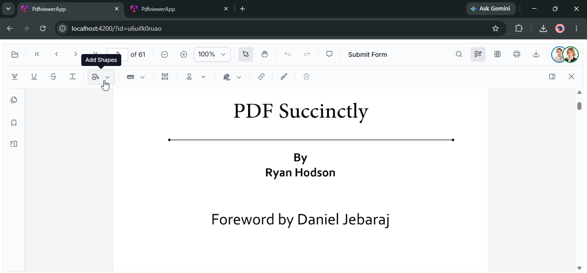

# Collaborative Editing in Syncfusion Angular PDF Viewer

The Angular PDF Viewer supports real-time collaborative editing through the Syncfusion Collaborator framework. The framework uses a shared client package and a platform-specific Collaboration Server to synchronize PDF Viewer actions between users.



## Architecture

Collaborative editing uses the following components:

- **Collaboration Client** - The `@syncfusion/ej2-collaborator` package connects the Angular PDF Viewer to the Collaboration Server.
- **PDF Viewer adapter** - A client-side `PdfViewerAdapter` implements `ICollaborationProvider` and translates actions between the PDF Viewer and the Collaboration Client.
- **Collaboration Server** - Use `ej2-collaborator-server` for Node.js.
- **Redis** - Required by the Collaboration Server for operation storage, synchronization, and scale-out.

The Collaboration Server manages the transport, collaboration sessions, operation synchronization, and save processing. The PDF Viewer application supplies the control adapter and document routes. Do not add a separate Socket.IO Redis adapter or implement the collaboration operation queue in the PDF Viewer application.

## Collaborative features

Users can collaborate on the same PDF room and see shared changes to:

- **Annotations** - Comments, highlights, drawings, and stamps
- **Form field interactions** - Form field changes and value updates
- **Page Organizer operations** - Page reordering, page rotation, and page changes

## Prerequisites

- An Angular PDF Viewer application.
- A Redis instance reachable from the server.
- Node.js 18 or later.
- A PDF Viewer adapter on the client and server. The adapter is the control-specific bridge; the common Collaborator packages provide the collaboration infrastructure.

## Client package

Install the shared client package in the Angular application:

```bash
npm install @syncfusion/ej2-collaborator
```

Create a `pdfViewerAdapter.ts` file that implements the collaboration provider contract, then create a `CollaborationClient` with the adapter and join the room after the PDF document has been loaded. See the platform-specific pages for the adapter and initialization examples:

- [Collaborative editing with Node.js](./using-redis-cache-nodejs)

## Server packages

Choose the following Collaboration Server implementation:

| Server | Package | Transport |
| --- | --- | --- |
| Node.js | `ej2-collaborator-server` | WebSocket |

The server implementation requires Redis. Configure the Redis connection and register the PDF Viewer server adapter before starting the server.

## Collaboration flow

1. The adapter posts to `ImportFile` with the room name, PDF file name, and user name.
2. The server returns the current version and pending PDF Viewer action snapshots.
3. The client joins the room with `CollaborationClient.joinRoomAsync`.
4. The PDF Viewer `documentChanged` event sends annotation, form field, form field action, or page organizer operations to `UpdateAction`.
5. The server stores the operation and broadcasts the clean action request to the other users in the room.
6. The adapter applies remote actions through the PDF Viewer collaborative editing handler.
7. `GetPDFDocument` returns the current PDF content for the room, including the finalized document when it is available.

The Node.js sample uses the following routes under `/api/CollaborativeEditing`:

| Route | Purpose |
| --- | --- |
| `POST /ImportFile` | Loads the room state and returns pending operations. |
| `POST /UpdateAction` | Validates, stores, and broadcasts a PDF Viewer operation. |
| `GET /GetPDFDocument` | Retrieves the PDF content for a room as Base64. |

## See Also

- [Collaborative editing with Node.js](./using-redis-cache-nodejs)
- [Collaboration Client](../../../../Collaborator/collaboration-client)
- [Collaboration Server](../../../../Collaborator/collaboration-server)