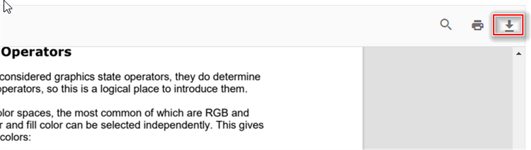

# Download in Angular PDF Viewer component

The Angular PDF Viewer lets users download the currently loaded PDF. Enable the download toolbar button with `enableDownload` for both standalone and server-backed viewers. The examples below demonstrate typical configurations and how to trigger a programmatic download.




import { Component, OnInit } from '@angular/core';
import { LinkAnnotationService, BookmarkViewService, MagnificationService,
         ThumbnailViewService, ToolbarService, NavigationService,
         TextSearchService, AnnotationService, TextSelectionService,
         PrintService
       } from '@syncfusion/ej2-angular-pdfviewer';
@Component({
  selector: 'app-container',
  // specifies the template string for the PDF Viewer component
  template: `<div class="content-wrapper">
               <ejs-pdfviewer id="pdfViewer"
                        enableDownload='true'
                        [documentPath]='document'
                        style="height:640px;display:block">
               </ejs-pdfviewer>
            </div>`,
  providers: [ LinkAnnotationService, BookmarkViewService, MagnificationService,
               ThumbnailViewService, ToolbarService, NavigationService,
               AnnotationService, TextSearchService, TextSelectionService,
               PrintService]
  })
  export class AppComponent implements OnInit {
      public document = 'https://cdn.syncfusion.com/content/pdf/pdf-succinctly.pdf';
  }





import { Component, OnInit } from '@angular/core';
import { LinkAnnotationService, BookmarkViewService, MagnificationService,
         ThumbnailViewService, ToolbarService, NavigationService,
         TextSearchService, AnnotationService, TextSelectionService,
         PrintService
       } from '@syncfusion/ej2-angular-pdfviewer';
@Component({
  selector: 'app-container',
  // specifies the template string for the PDF Viewer component
  template: `<div class="content-wrapper">
               <ejs-pdfviewer id="pdfViewer"
                        [serviceUrl]='service'
                        enableDownload='true'
                        [documentPath]='document'
                        style="height:640px;display:block">
               </ejs-pdfviewer>
            </div>`,
  providers: [ LinkAnnotationService, BookmarkViewService, MagnificationService,
               ThumbnailViewService, ToolbarService, NavigationService,
               AnnotationService, TextSearchService, TextSelectionService,
               PrintService]
  })
  export class AppComponent implements OnInit {
      public service = 'https://document.syncfusion.com/web-services/pdf-viewer/api/pdfviewer';
      public document = 'https://cdn.syncfusion.com/content/pdf/pdf-succinctly.pdf';
  }





To invoke download programmatically, use the following snippet:

```html
<script>
    window.onload = function () {
        var pdfViewer = document.getElementById('pdfviewer').ej2_instances[0];
        pdfViewer.download();
    }
</script>

```

## See also

* [Toolbar items](./toolbar)
* [Feature Modules](./feature-module)