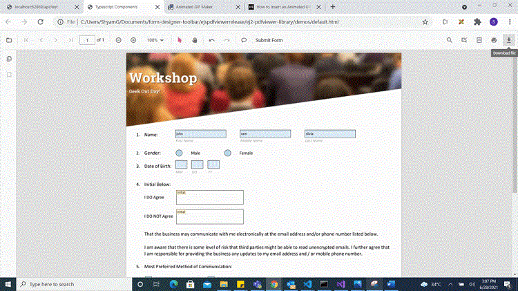
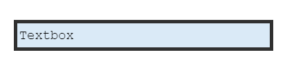

# Create programmatically in Angular Pdf viewer control

The PDF Viewer component provides options to add, edit, and delete form fields. The supported form field types are:

- Textbox
- Password
- CheckBox
- RadioButton
- ListBox
- DropDown
- Signature field
- Initial field

## Add a form field to PDF document programmatically

Use the addFormField method to add form fields programmatically. Pass the form field type and the corresponding property object as parameters. The following example demonstrates adding multiple fields on document load.



import { ViewChild } from '@angular/core';
import { Component, OnInit } from '@angular/core';
import {PdfViewerComponent, LinkAnnotationService, BookmarkViewService, MagnificationService, ThumbnailViewService,
  ToolbarService, NavigationService, TextSearchService, TextSelectionService, PrintService, AnnotationService,
  FormDesignerService, LoadEventArgs, FormFieldsService, TextFieldSettings, SignatureFieldSettings, InitialFieldSettings,
  CheckBoxFieldSettings, RadioButtonFieldSettings } from '@syncfusion/ej2-angular-pdfviewer';

@Component({
  selector: 'app-container',
  // Specifies the template string for the PDF Viewer component.
  template: `<div class="content-wrapper">
  <ejs-pdfviewer
    id="pdfViewer"
    #pdfviewer
    [documentPath]='document'
    [resourceUrl]='resource'
    (documentLoad)='documentLoaded($event)'
    style="height:640px;display:block">
  </ejs-pdfviewer>
  </div>`,
  providers: [LinkAnnotationService, BookmarkViewService, MagnificationService, ThumbnailViewService, ToolbarService,
NavigationService, TextSearchService, TextSelectionService, PrintService, AnnotationService, FormDesignerService, FormFieldsService]
})
export class AppComponent implements OnInit {
  @ViewChild('pdfviewer')
  public pdfviewerControl?: PdfViewerComponent;
  public document: string = 'https://cdn.syncfusion.com/content/pdf/form-designer.pdf';
  public resource: string = "https://cdn.syncfusion.com/ej2/23.1.43/dist/ej2-pdfviewer-lib";

  documentLoaded(e: LoadEventArgs): void {
    this.pdfviewerControl?.formDesignerModule.addFormField("Textbox", {name: 'First Name', bounds: { X: 146, Y: 229, Width: 150, Height: 24 },} as TextFieldSettings);
    this.pdfviewerControl?.formDesignerModule.addFormField("Textbox", { name: "Middle Name", bounds: { X: 338, Y: 229, Width: 150, Height: 24 },} as TextFieldSettings);
    this.pdfviewerControl?.formDesignerModule.addFormField('Textbox', {name: 'Last Name',bounds: { X: 530, Y: 229, Width: 150, Height: 24 },} as TextFieldSettings);
    this.pdfviewerControl?.formDesignerModule.addFormField('RadioButton', {bounds: { X: 148, Y: 289, Width: 18, Height: 18 },name: 'Gender',isSelected: false,} as RadioButtonFieldSettings);
    this.pdfviewerControl?.formDesignerModule.addFormField('RadioButton', {bounds: { X: 292, Y: 289, Width: 18, Height: 18 },name: 'Gender',isSelected: false,} as RadioButtonFieldSettings);
    this.pdfviewerControl?.formDesignerModule.addFormField('Textbox', {name: 'DOB Month',bounds: { X: 146, Y: 320, Width: 35, Height: 24 },} as TextFieldSettings);
    this.pdfviewerControl?.formDesignerModule.addFormField('Textbox', {name: 'DOB Date',bounds: { X: 193, Y: 320, Width: 35, Height: 24 },} as TextFieldSettings);
    this.pdfviewerControl?.formDesignerModule.addFormField('Textbox', {name: 'DOB Year',bounds: { X: 242, Y: 320, Width: 35, Height: 24 },} as TextFieldSettings);
    this.pdfviewerControl?.formDesignerModule.addFormField('InitialField', {name: 'Agree',bounds: { X: 148, Y: 408, Width: 200, Height: 43 },} as InitialFieldSettings);
    this.pdfviewerControl?.formDesignerModule.addFormField('InitialField', {name: 'Do Not Agree',bounds: { X: 148, Y: 466, Width: 200, Height: 43 },} as InitialFieldSettings);
    this.pdfviewerControl?.formDesignerModule.addFormField('CheckBox', {name: 'Text Message',bounds: { X: 56, Y: 664, Width: 20, Height: 20 },isChecked: false,} as CheckBoxFieldSettings);
    this.pdfviewerControl?.formDesignerModule.addFormField('CheckBox', {name: 'Email',bounds: { X: 242, Y: 664, Width: 20, Height: 20 },isChecked: false,} as CheckBoxFieldSettings);
    this.pdfviewerControl?.formDesignerModule.addFormField('CheckBox', {name: 'Appointment Reminder',bounds: { X: 56, Y: 740, Width: 20, Height: 20 },isChecked: false,} as CheckBoxFieldSettings);
    this.pdfviewerControl?.formDesignerModule.addFormField('CheckBox', {name: 'Request for Customerservice',bounds: { X: 56, Y: 778, Width: 20, Height: 20 },isChecked: false,} as CheckBoxFieldSettings);
    this.pdfviewerControl?.formDesignerModule.addFormField('CheckBox', {name: 'Information Billing',bounds: { X: 290, Y: 740, Width: 20, Height: 20 },isChecked: false,} as CheckBoxFieldSettings);
    this.pdfviewerControl?.formDesignerModule.addFormField('Textbox', {name: 'My Email',bounds: { X: 146, Y: 850, Width: 200, Height: 24 },} as TextFieldSettings);
    this.pdfviewerControl?.formDesignerModule.addFormField('Textbox', {name: 'My Phone',bounds: { X: 482, Y: 850, Width: 200, Height: 24 },} as TextFieldSettings);
    this.pdfviewerControl?.formDesignerModule.addFormField('SignatureField', {name: 'Sign',bounds: { X: 57, Y: 923, Width: 200, Height: 43 },} as SignatureFieldSettings);
    this.pdfviewerControl?.formDesignerModule.addFormField('Textbox', {name: 'DOS Month',bounds: { X: 386, Y: 923, Width: 35, Height: 24 },} as TextFieldSettings);
    this.pdfviewerControl?.formDesignerModule.addFormField('Textbox', {name: 'DOS Date',bounds: { X: 434, Y: 923, Width: 35, Height: 24 },} as TextFieldSettings);
    this.pdfviewerControl?.formDesignerModule.addFormField('Textbox', {name: 'DOS Year',bounds: { X: 482, Y: 923, Width: 35, Height: 24 },} as TextFieldSettings);
  }

  ngOnInit(): void {
  }
}







N> To configure the server-backed PDF Viewer, add the following `serviceUrl` in the `index.ts` file:
`public service: string = 'https://document.syncfusion.com/web-services/pdf-viewer/api/pdfviewer'`;
Within the template, configure the PDF Viewer by adding the `[serviceUrl]='service'` attribute inside the div element.



## Edit/Update form field programmatically

Use the updateFormField method to modify a form field programmatically. Retrieve the target field from the formFieldCollections property (by object or ID) and pass it as the first parameter. Provide the properties to update as the second parameter. The following example updates the background color of a Textbox field.



import { ViewChild } from '@angular/core';
import { Component, OnInit } from '@angular/core';
import {PdfViewerComponent, LinkAnnotationService, BookmarkViewService, MagnificationService, ThumbnailViewService,
  ToolbarService, NavigationService, TextSearchService, TextSelectionService, PrintService, AnnotationService,
  FormDesignerService, FormFieldsService, TextFieldSettings, SignatureFieldSettings, InitialFieldSettings,
  CheckBoxFieldSettings, LoadEventArgs, RadioButtonFieldSettings } from '@syncfusion/ej2-angular-pdfviewer';

@Component({
  selector: 'app-container',
  // Specifies the template string for the PDF Viewer component.
  template: `<div class="content-wrapper">
  <ejs-pdfviewer
    id="pdfViewer"
    #pdfviewer
    [documentPath]='document'
    [resourceUrl]='resource'
    (documentLoad)='documentLoaded($event)'
    style="height:640px;display:block">
   </ejs-pdfviewer>
  </div>`,
  providers: [LinkAnnotationService, BookmarkViewService, MagnificationService, ThumbnailViewService, ToolbarService,
NavigationService, TextSearchService, TextSelectionService, PrintService, AnnotationService, FormDesignerService, FormFieldsService]
})
export class AppComponent implements OnInit {
  @ViewChild('pdfviewer')
  public pdfviewerControl?: PdfViewerComponent;
  public document: string = 'https://cdn.syncfusion.com/content/pdf/form-designer.pdf';
  public resource: string = "https://cdn.syncfusion.com/ej2/23.1.43/dist/ej2-pdfviewer-lib";

   documentLoaded(e: LoadEventArgs): void {
    this.pdfviewerControl?.formDesignerModule.addFormField("Textbox", {name: 'First Name', bounds: { X: 146, Y: 229, Width: 150, Height: 24 },} as TextFieldSettings);
    this.pdfviewerControl?.formDesignerModule.addFormField("Textbox", { name: "Middle Name", bounds: { X: 338, Y: 229, Width: 150, Height: 24 },} as TextFieldSettings);
    this.pdfviewerControl?.formDesignerModule.addFormField('Textbox', {name: 'Last Name',bounds: { X: 530, Y: 229, Width: 150, Height: 24 },} as TextFieldSettings);
    this.pdfviewerControl?.formDesignerModule.addFormField('RadioButton', {bounds: { X: 148, Y: 289, Width: 18, Height: 18 },name: 'Gender',isSelected: false,} as RadioButtonFieldSettings);
    this.pdfviewerControl?.formDesignerModule.addFormField('RadioButton', {bounds: { X: 292, Y: 289, Width: 18, Height: 18 },name: 'Gender',isSelected: false,} as RadioButtonFieldSettings);
    this.pdfviewerControl?.formDesignerModule.addFormField('Textbox', {name: 'DOB Month',bounds: { X: 146, Y: 320, Width: 35, Height: 24 },} as TextFieldSettings);
    this.pdfviewerControl?.formDesignerModule.addFormField('Textbox', {name: 'DOB Date',bounds: { X: 193, Y: 320, Width: 35, Height: 24 },} as TextFieldSettings);
    this.pdfviewerControl?.formDesignerModule.addFormField('Textbox', {name: 'DOB Year',bounds: { X: 242, Y: 320, Width: 35, Height: 24 },} as TextFieldSettings);
    this.pdfviewerControl?.formDesignerModule.addFormField('InitialField', {name: 'Agree',bounds: { X: 148, Y: 408, Width: 200, Height: 43 },} as InitialFieldSettings);
    this.pdfviewerControl?.formDesignerModule.addFormField('InitialField', {name: 'Do Not Agree',bounds: { X: 148, Y: 466, Width: 200, Height: 43 },} as InitialFieldSettings);
    this.pdfviewerControl?.formDesignerModule.addFormField('CheckBox', {name: 'Text Message',bounds: { X: 56, Y: 664, Width: 20, Height: 20 },isChecked: false,} as CheckBoxFieldSettings);
    this.pdfviewerControl?.formDesignerModule.addFormField('CheckBox', {name: 'Email',bounds: { X: 242, Y: 664, Width: 20, Height: 20 },isChecked: false,} as CheckBoxFieldSettings);
    this.pdfviewerControl?.formDesignerModule.addFormField('CheckBox', {name: 'Appointment Reminder',bounds: { X: 56, Y: 740, Width: 20, Height: 20 },isChecked: false,} as CheckBoxFieldSettings);
    this.pdfviewerControl?.formDesignerModule.addFormField('CheckBox', {name: 'Request for Customerservice',bounds: { X: 56, Y: 778, Width: 20, Height: 20 },isChecked: false,} as CheckBoxFieldSettings);
    this.pdfviewerControl?.formDesignerModule.addFormField('CheckBox', {name: 'Information Billing',bounds: { X: 290, Y: 740, Width: 20, Height: 20 },isChecked: false,} as CheckBoxFieldSettings);
    this.pdfviewerControl?.formDesignerModule.addFormField('Textbox', {name: 'My Email',bounds: { X: 146, Y: 850, Width: 200, Height: 24 },} as TextFieldSettings);
    this.pdfviewerControl?.formDesignerModule.addFormField('Textbox', {name: 'My Phone',bounds: { X: 482, Y: 850, Width: 200, Height: 24 },} as TextFieldSettings);
    this.pdfviewerControl?.formDesignerModule.addFormField('SignatureField', {name: 'Sign',bounds: { X: 57, Y: 923, Width: 200, Height: 43 },} as SignatureFieldSettings);
    this.pdfviewerControl?.formDesignerModule.addFormField('Textbox', {name: 'DOS Month',bounds: { X: 386, Y: 923, Width: 35, Height: 24 },} as TextFieldSettings);
    this.pdfviewerControl?.formDesignerModule.addFormField('Textbox', {name: 'DOS Date',bounds: { X: 434, Y: 923, Width: 35, Height: 24 },} as TextFieldSettings);
    this.pdfviewerControl?.formDesignerModule.addFormField('Textbox', {name: 'DOS Year',bounds: { X: 482, Y: 923, Width: 35, Height: 24 },} as TextFieldSettings);
    this.pdfviewerControl?.formDesignerModule.updateFormField(this.pdfviewerControl?.formFieldCollections[0], { backgroundColor: 'red' } as TextFieldSettings);
  }

  ngOnInit(): void {
  }
}







N> To configure the server-backed PDF Viewer, add the following `serviceUrl` in the `index.ts` file:
`public service: string = 'https://document.syncfusion.com/web-services/pdf-viewer/api/pdfviewer'`;
Within the template, configure the PDF Viewer by adding the `[serviceUrl]='service'` attribute inside the div element.



## Delete form field programmatically

Use the deleteFormField method to remove a form field programmatically. Retrieve the target field from the formFieldCollections property (by object or ID) and pass it to deleteFormField. The following example deletes the first form field.



import { ViewChild } from '@angular/core';
import { Component, OnInit } from '@angular/core';
import {PdfViewerComponent, LinkAnnotationService, BookmarkViewService, MagnificationService, ThumbnailViewService,
  ToolbarService, NavigationService, TextSearchService, TextSelectionService, PrintService, AnnotationService,
  FormDesignerService, FormFieldsService, TextFieldSettings, SignatureFieldSettings, InitialFieldSettings,
  CheckBoxFieldSettings, LoadEventArgs, RadioButtonFieldSettings } from '@syncfusion/ej2-angular-pdfviewer';

@Component({
  selector: 'app-container',
  // Specifies the template string for the PDF Viewer component.
  template: `<div class="content-wrapper">
  <ejs-pdfviewer
    id="pdfViewer"
    #pdfviewer
    [documentPath]='document'
    [resourceUrl]='resource'
    (documentLoad)='documentLoaded($event)'
    style="height:640px;display:block">
  </ejs-pdfviewer>
  </div>`,
  providers: [LinkAnnotationService, BookmarkViewService, MagnificationService, ThumbnailViewService, ToolbarService,
NavigationService, TextSearchService, TextSelectionService, PrintService, AnnotationService, FormDesignerService, FormFieldsService]
})
export class AppComponent implements OnInit {
  @ViewChild('pdfviewer')
  public pdfviewerControl?: PdfViewerComponent;
  public document: string = 'https://cdn.syncfusion.com/content/pdf/form-designer.pdf';
  public resource: string = "https://cdn.syncfusion.com/ej2/23.1.43/dist/ej2-pdfviewer-lib";

  documentLoaded(e: LoadEventArgs): void {
    this.pdfviewerControl?.formDesignerModule.addFormField("Textbox", {name: 'First Name', bounds: { X: 146, Y: 229, Width: 150, Height: 24 },} as TextFieldSettings);
    this.pdfviewerControl?.formDesignerModule.addFormField("Textbox", { name: "Middle Name", bounds: { X: 338, Y: 229, Width: 150, Height: 24 },} as TextFieldSettings);
    this.pdfviewerControl?.formDesignerModule.addFormField('Textbox', {name: 'Last Name',bounds: { X: 530, Y: 229, Width: 150, Height: 24 },} as TextFieldSettings);
    this.pdfviewerControl?.formDesignerModule.addFormField('RadioButton', {bounds: { X: 148, Y: 289, Width: 18, Height: 18 },name: 'Gender',isSelected: false,} as RadioButtonFieldSettings);
    this.pdfviewerControl?.formDesignerModule.addFormField('RadioButton', {bounds: { X: 292, Y: 289, Width: 18, Height: 18 },name: 'Gender',isSelected: false,} as RadioButtonFieldSettings);
    this.pdfviewerControl?.formDesignerModule.addFormField('Textbox', {name: 'DOB Month',bounds: { X: 146, Y: 320, Width: 35, Height: 24 },} as TextFieldSettings);
    this.pdfviewerControl?.formDesignerModule.addFormField('Textbox', {name: 'DOB Date',bounds: { X: 193, Y: 320, Width: 35, Height: 24 },} as TextFieldSettings);
    this.pdfviewerControl?.formDesignerModule.addFormField('Textbox', {name: 'DOB Year',bounds: { X: 242, Y: 320, Width: 35, Height: 24 },} as TextFieldSettings);
    this.pdfviewerControl?.formDesignerModule.addFormField('InitialField', {name: 'Agree',bounds: { X: 148, Y: 408, Width: 200, Height: 43 },} as InitialFieldSettings);
    this.pdfviewerControl?.formDesignerModule.addFormField('InitialField', {name: 'Do Not Agree',bounds: { X: 148, Y: 466, Width: 200, Height: 43 },} as InitialFieldSettings);
    this.pdfviewerControl?.formDesignerModule.addFormField('CheckBox', {name: 'Text Message',bounds: { X: 56, Y: 664, Width: 20, Height: 20 },isChecked: false,} as CheckBoxFieldSettings);
    this.pdfviewerControl?.formDesignerModule.addFormField('CheckBox', {name: 'Email',bounds: { X: 242, Y: 664, Width: 20, Height: 20 },isChecked: false,} as CheckBoxFieldSettings);
    this.pdfviewerControl?.formDesignerModule.addFormField('CheckBox', {name: 'Appointment Reminder',bounds: { X: 56, Y: 740, Width: 20, Height: 20 },isChecked: false,} as CheckBoxFieldSettings);
    this.pdfviewerControl?.formDesignerModule.addFormField('CheckBox', {name: 'Request for Customerservice',bounds: { X: 56, Y: 778, Width: 20, Height: 20 },isChecked: false,} as CheckBoxFieldSettings);
    this.pdfviewerControl?.formDesignerModule.addFormField('CheckBox', {name: 'Information Billing',bounds: { X: 290, Y: 740, Width: 20, Height: 20 },isChecked: false,} as CheckBoxFieldSettings);
    this.pdfviewerControl?.formDesignerModule.addFormField('Textbox', {name: 'My Email',bounds: { X: 146, Y: 850, Width: 200, Height: 24 },} as TextFieldSettings);
    this.pdfviewerControl?.formDesignerModule.addFormField('Textbox', {name: 'My Phone',bounds: { X: 482, Y: 850, Width: 200, Height: 24 },} as TextFieldSettings);
    this.pdfviewerControl?.formDesignerModule.addFormField('SignatureField', {name: 'Sign',bounds: { X: 57, Y: 923, Width: 200, Height: 43 },} as SignatureFieldSettings);
    this.pdfviewerControl?.formDesignerModule.addFormField('Textbox', {name: 'DOS Month',bounds: { X: 386, Y: 923, Width: 35, Height: 24 },} as TextFieldSettings);
    this.pdfviewerControl?.formDesignerModule.addFormField('Textbox', {name: 'DOS Date',bounds: { X: 434, Y: 923, Width: 35, Height: 24 },} as TextFieldSettings);
    this.pdfviewerControl?.formDesignerModule.addFormField('Textbox', {name: 'DOS Year',bounds: { X: 482, Y: 923, Width: 35, Height: 24 },} as TextFieldSettings);
    this.pdfviewerControl?.formDesignerModule.deleteFormField(this.pdfviewerControl.formFieldCollections[0]);
  }

  ngOnInit(): void {
  }
}







N> To configure the server-backed PDF Viewer, add the following `serviceUrl` in the `index.ts` file:
`public service: string = 'https://document.syncfusion.com/web-services/pdf-viewer/api/pdfviewer'`;
Within the template, configure the PDF Viewer by adding the `[serviceUrl]='service'` attribute inside the div element.



The following code illustrates how to delete a signature from the signature field using the `retrieveFormFields` and `clearFormFields` APIs.




<!--Method to remove signature-->
<button (click)="removeSignature()">Remove Signature</button>
<!--Render PDF Viewer component-->
<ejs-pdfviewer id="pdfViewer"
               [documentPath]="document"
               style="height:640px;display:block">
</ejs-pdfviewer>




<!--Method to remove signature-->
<button (click)="removeSignature()">Remove Signature</button>
<!--Render PDF Viewer component-->
<ejs-pdfviewer id="pdfViewer"
               [serviceUrl]="service"
               [documentPath]="document"
               style="height:640px;display:block">
</ejs-pdfviewer>




```typescript
//Event triggers while clicking the Remove Signature button.
removeSignature() {
  var viewer = (<any>document.getElementById('pdfViewer')).ej2_instances[0];
  var forms = viewer.retrieveFormFields();
  //API to remove a signature from the signature field.
  viewer.clearFormFields(forms[8]);
}

```

[View sample in GitHub](https://github.com/SyncfusionExamples/angular-pdf-viewer-examples/tree/master/Form%20fields/Delete%20signature%20programmatically%20from%20signature%20field)

## Saving the form fields

Selecting the Download icon on the toolbar saves the form fields in the exported PDF without modifying the original document. See the following GIF for reference.



You can invoke the print action using the following code snippet:

```html
<script>
    window.onload = function () {
        var pdfViewer = document.getElementById('pdfviewer').ej2_instances[0];
        pdfViewer.download();
    }
</script>

```

## Printing the form fields

Selecting the Print icon on the toolbar prints the PDF with the added form fields. This action does not modify the original document. See the following GIF for reference.


You can invoke the print action using the following code snippet:

```html
<script>
    window.onload = function () {
        var pdfViewer = document.getElementById('pdfviewer').ej2_instances[0];
        pdfViewer.print.print();
    }
</script>

```

## Open the existing PDF document

Open a PDF that already contains form fields by clicking the Open icon on the toolbar. See the following GIF for reference.


## Validate form fields

TForm fields are validated when enableFormFieldsValidation is set to true and the validateFormFields event is handled. The event triggers during download or print if required fields are not filled. The non-filled fields are available in the nonFillableFields property of the event arguments.

Add the following code to validate form fields:



```typescript

import { ViewChild } from '@angular/core';
import { Component, OnInit } from '@angular/core';
import { PdfViewerComponent, LinkAnnotationService, BookmarkViewService,
         MagnificationService, ThumbnailViewService, ToolbarService,
         NavigationService, TextSearchService, TextSelectionService,
         PrintService, AnnotationService, FormDesignerService,
         FormFieldsService, LoadEventArgs, TextFieldSettings
       } from '@syncfusion/ej2-angular-pdfviewer';

@Component({
  selector: 'app-root',
  // Specifies the template string for the PDF Viewer component.
  template: `<div class="content-wrapper">
               <ejs-pdfviewer id="pdfViewer"
                     #pdfviewer
                     [documentPath]='document'
                     [enableFormFieldsValidation]=true
                     (validateFormFields)='validateFormFields($event)'
                     style="height:640px;display:block">
               </ejs-pdfviewer>
             </div>`,
  providers: [ LinkAnnotationService, BookmarkViewService, MagnificationService,
               ThumbnailViewService, ToolbarService, NavigationService,
               TextSearchService, TextSelectionService, PrintService,
               AnnotationService, FormDesignerService, FormFieldsService]
})
export class AppComponent implements OnInit {
  @ViewChild('pdfviewer')
  public pdfviewerControl: PdfViewerComponent;
  public document: string = 'https://cdn.syncfusion.com/content/pdf/form-designer.pdf';

  public validateFormFields(e: ValidateFormFieldsArgs): void {
    this.e.nonFillableFields;
  }
}

```



```typescript

import { ViewChild } from '@angular/core';
import { Component, OnInit } from '@angular/core';
import { PdfViewerComponent, LinkAnnotationService, BookmarkViewService,
         MagnificationService, ThumbnailViewService, ToolbarService,
         NavigationService, TextSearchService, TextSelectionService,
         PrintService, AnnotationService, FormDesignerService,
         FormFieldsService, LoadEventArgs, TextFieldSettings
       } from '@syncfusion/ej2-angular-pdfviewer';

@Component({
  selector: 'app-root',
  // Specifies the template string for the PDF Viewer component.
  template: `<div class="content-wrapper">
               <ejs-pdfviewer id="pdfViewer"
                     #pdfviewer [serviceUrl]='service'
                     [documentPath]='document'
                     [enableFormFieldsValidation]=true
                     (validateFormFields)='validateFormFields($event)'
                     style="height:640px;display:block">
               </ejs-pdfviewer>
             </div>`,
  providers: [ LinkAnnotationService, BookmarkViewService, MagnificationService,
               ThumbnailViewService, ToolbarService, NavigationService,
               TextSearchService, TextSelectionService, PrintService,
               AnnotationService, FormDesignerService, FormFieldsService]
})
export class AppComponent implements OnInit {
  @ViewChild('pdfviewer')
  public pdfviewerControl: PdfViewerComponent;
  public service: string = 'https://document.syncfusion.com/web-services/pdf-viewer/api/pdfviewer';
  public document: string = 'https://cdn.syncfusion.com/content/pdf/form-designer.pdf';

  public validateFormFields(e: ValidateFormFieldsArgs): void {
    this.e.nonFillableFields;
  }
}

```


## Export and import form fields

The PDF Viewer component supports exporting and importing form field data using the importFormFields, exportFormFields, and exportFormFieldsAsObject methods in the following formats:

- FDF
- XFDF
- JSON
- XML

### Export and import as FDF

Using the `exportFormFields` method, the form field data can be exported in the specified data format. This method accepts two parameters:

* The first one must be the destination path for the exported data. If path is not specified, it will ask for the location while exporting.
* The second parameter should be the format type of the form data.

The following example exports and imports form field data as FDF.

```html

<button (click)="OnExportFdf()">Export FDF</button>
<button (click)="OnImportFdf()">Import FDF</button>

```

```typescript
// Event triggers on the Export FDF button click.
OnExportFdf() {
  var viewer = (<any>document.getElementById('pdfViewer')).ej2_instances[0];
  // Data must be the desired path for the exported document.
  viewer.exportFormFields('Data', FormFieldDataFormat.Fdf);
}

// Event triggers on the Import FDF button click.
OnImportFdf() {
  var viewer = (<any>document.getElementById('pdfViewer')).ej2_instances[0];
  // The file for importing the form fields should be placed in the desired location and the path should be provided correctly
  viewer.importFormFields('File', FormFieldDataFormat.Fdf);
}
```

### Export and import as XFDF

The following example exports and imports form field data as XFDF.

```html

<button (click)="OnExportXfdf()">Export XFDF</button>
<button (click)="OnImportXfdf()">Import XFDF</button>

```

```typescript
// Event triggers on the Export XFDF button click.
OnExportXfdf() {
  var viewer = (<any>document.getElementById('pdfViewer')).ej2_instances[0];
  // Data must be the desired path for the exported document.
  viewer.exportFormFields('Data', FormFieldDataFormat.Xfdf);
}

// Event triggers on the Import XFDF button click.
OnImportXfdf() {
  var viewer = (<any>document.getElementById('pdfViewer')).ej2_instances[0];
  // The file for importing the form fields should be placed in the desired location and the path should be provided correctly
  viewer.importFormFields('File', FormFieldDataFormat.Xfdf);
}
```

### Export and import as JSON

The following example exports and imports form field data as JSON.

```html

<button (click)="OnExportJson()">Export JSON</button>
<button (click)="OnImportJson()">Import JSON</button>

```

```typescript
// Event triggers on the Export JSON button click.
OnExportJson() {
  var viewer = (<any>document.getElementById('pdfViewer')).ej2_instances[0];
  // Data must be the desired path for the exported document.
  viewer.exportFormFields('Data', FormFieldDataFormat.Json);
}

// Event triggers on the Import JSON button click.
OnImportJson() {
  var viewer = (<any>document.getElementById('pdfViewer')).ej2_instances[0];
  // The file for importing the form fields should be placed in the desired location and the path should be provided correctly
  viewer.importFormFields('File', FormFieldDataFormat.Json);
}
```

### Export and import as Object

The PDF Viewer component supports exporting the form field data as an object and importing that data back into the current PDF document.

The following code shows how to export the form field data as an object and import the form field data from that object into the current PDF document via a button click.

```html

<button (click)="exportDataAsObject()">Export Object</button>
<button (click)="importData()">Import Data</button>

```

```typescript
var exportedData;

// Event triggers on the Export Object button click.
exportDataAsObject() {
  var viewer = (<any>document.getElementById('pdfViewer')).ej2_instances[0];
  // Export the form fields data to an FDF object.
  exportedData = viewer.exportFormFieldsAsObject(FormFieldDataFormat.Fdf);
  //// Export the form fields data to an XFDF object.
  //exportedData = viewer.exportFormFieldsAsObject(FormFieldDataFormat.Xfdf);
  //// Export the form fields data to an JSON object.
  //exportedData = viewer.exportFormFieldsAsObject(FormFieldDataFormat.Json);
}

// Event triggers on Import Data button click.
importData() {
  var viewer = (<any>document.getElementById('pdfViewer')).ej2_instances[0];
  // Import the form fields data from the FDF object into the current PDF document.
  viewer.importFormFields(exportedData, FormFieldDataFormat.Fdf);
  //// Import the form fields data from the XFDF object into the current PDF document.
  //viewer.importFormFields(exportedData, FormFieldDataFormat.Xfdf);
  //// Import the form fields data from the JSON object into the current PDF document.
  //viewer.importFormFields(exportedData, FormFieldDataFormat.Json);
}
```

### Export and import as XML

The following example exports and imports form field data as XML.

```html

<button (click)="OnExportXml()">Export XML</button>
<button (click)="OnImportXml()">Import XML</button>

```

```typescript
// Event triggers on the Export Xml button click.
OnExportXml() {
  var viewer = (<any>document.getElementById('pdfViewer')).ej2_instances[0];
  // Data must be the desired path for the exported document.
  viewer.exportFormFields('Data', FormFieldDataFormat.Xml);
}

// Event triggers on the Import Xml button click.
OnImportXml() {
  var viewer = (<any>document.getElementById('pdfViewer')).ej2_instances[0];
  // The file for importing the form fields should be placed in the desired location and the path should be provided correctly
  viewer.importFormFields('File', FormFieldDataFormat.Xml);
}
```

## Form field properties

Form field properties allow customization and interaction with fields embedded in PDF documents. The following sections outline the supported field types and their configurable settings.

- Textbox
- Password
- CheckBox
- RadioButton
- ListBox
- DropDown
- Signature field
- Initial field

### Signature and initial fields settings

Use the updateFormField method to modify form fields programmatically.

The following code example explains how to update the signature field properties on a button click.

```html

<button (click)="updateProperties()">Update Properties</button>

```

```typescript
    // Event triggers on the Update Properties button click.
    updateProperties() {
        var formField = viewer.retrieveFormFields();
        viewer.formDesignerModule.updateFormField(formField[0], {
            name: 'Initial',
            isReadOnly: true,
            visibility: 'visible',
            isRequired: false,
            isPrint: true,
            tooltip: 'Initial',
            thickness: 4
        });
}

```

The following code shows how to configure default properties for a signature field added from the Form Designer toolbar.





    <ejs-pdfviewer
      id="pdfViewer"
      [documentPath]="document"
      [initialFieldSettings] = "initialFieldSettings"
      [signatureFieldSettings] = "signatureFieldSettings"
      style="height:640px;display:block"
    > </ejs-pdfviewer>






    <ejs-pdfviewer
      id="pdfViewer"
      [serviceUrl]="service"
      [documentPath]="document"
      [initialFieldSettings] = "initialFieldSettings"
      [signatureFieldSettings] = "signatureFieldSettings"
      style="height:640px;display:block"
    > </ejs-pdfviewer>




```typescript
      // Properties to customize the signature field settings
      public signatureFieldSettings = {
        // Set the name of the form field element.
        name: 'Signature',
        // Specify whether the signature field is in read-only or read-write mode.
        isReadOnly: false,
        // Set the visibility of the form field.
        visibility: 'visible',
        // Specify whether the field is mandatory or not.
        isRequired: false,
        // Specify whether to print the signature field.
        isPrint: true,
        // Set the text to be displayed as a tooltip.
        tooltip: 'Signature',
        // Set the thickness of the signature field. To hide the borders, set the value to 0 (zero).
        thickness: 4,
        // Specify the properties of the signature Dialog Settings in the signature field.
        signatureDialogSettings: {
            displayMode: DisplayMode.Draw | DisplayMode.Upload | DisplayMode.Text,
            hideSaveSignature: false,
        },
        // Specify the properties of the signature indicator in the signature field.
        signatureIndicatorSettings: {
            opacity: 1,
            backgroundColor: '#237ba2',
            height: 50,
            fontSize: 15,
            text: 'Signature Field',
            color: 'white'
        }
  };

```


The following code shows how to configure default properties for an initial field added from the Form Designer toolbar.

```typescript
     // Properties to customize the initial field settings
     public initialFieldSettings = {
        // Set the name of the form field element.
        name: 'Initial',
        // Specify whether the initial field is in read-only or read-write mode.
        isReadOnly: false,
        // Set the visibility of the form field.
        visibility: 'visible',
        // Specify whether the field is mandatory or not.
        isRequired: false,
        // Specify whether to print the initial field.
        isPrint: true,
        // Set the text to be displayed as tooltip.
        tooltip: 'Initial',
        // Set the thickness of the initial field. To hide the borders, set the value to 0 (zero).
        thickness: 4,
        // Specify the properties of the initial indicator in the initial field.
        initialIndicatorSettings: {
          opacity: 1,
          backgroundColor: '#237ba2',
          height: 50,
          fontSize: 15,
          text: 'Initial Field',
          color: 'white',
        },
        // Specify the properties of the initial Dialog Settings in the intial field.
        initialDialogSettings: {
          displayMode: DisplayMode.Draw | DisplayMode.Upload | DisplayMode.Text,
          hideSaveSignature: false,
        },
    };

```


### Textbox field settings

Using the `updateFormField` method, the form fields can be updated programmatically.

The following example updates Textbox field properties on a button click.

```html

<button (click)="updateProperties()">Update Properties</button>

```

```typescript
  // Event triggers on the Update Properties button click.
  updateProperties() {
    var viewer = (<any>document.getElementById('pdfViewer')).ej2_instances[0];
    var formField = viewer.retrieveFormFields();
    viewer.formDesignerModule.updateFormField(formField[0], {
      name: 'Textbox',
      isReadOnly: true,
      visibility: 'visible',
      isRequired: false,
      isPrint: true,
      tooltip: 'Textbox',
      thickness: 4,
      value:'Textbox',
      fontFamily: 'Courier',
      fontSize: 10,
      fontStyle: 'None',
      color: 'black',
      borderColor: 'black',
      backgroundColor: 'white',
      alignment: 'Left',
      maxLength: 0,
      isMultiline: false,
      bounds: { X: 146, Y: 229, Width: 150, Height: 24 }
    });
  }

```

The following code shows how to configure default properties for a Textbox field added from the Form Designer toolbar.




  <ejs-pdfviewer
    id="pdfViewer"
    [documentPath]="document"
    [textFieldSettings] = "textFieldSettings"
    style="height:640px;display:block">
  </ejs-pdfviewer>





  <ejs-pdfviewer
    id="pdfViewer"
    [serviceUrl]="service"
    [documentPath]="document"
    [textFieldSettings] = "textFieldSettings"
    style="height:640px;display:block">
  </ejs-pdfviewer>




```typescript
  // Properties to customize the Textbox field settings
  public textFieldSettings = {
    // Set the name of the form field element.
    name: 'Textbox',
    // Specify whether the Textbox field is in read-only or read-write mode.
    isReadOnly: false,
    // Set the visibility of the form field.
    visibility: 'visible',
    // Specify whether the field is mandatory or not.
    isRequired: false,
    // Specify whether to print the Textbox field.
    isPrint: true,
    // Set the text to be displayed as a tooltip.
    tooltip: 'Textbox',
    // Set the thickness of the Textbox field. To hide the borders, set the value to 0 (zero).
    thickness: 4,
    // Set the value of the form field element.
    value:'Textbox',
    // Set the font family of the textbox field.
    fontFamily: 'Courier',
    // Set the font size of the textbox field.
    fontSize: 10,
    // Specify the font style
    fontStyle: 'None',
    // Set the font color of the textbox field.
    color: 'black',
    // Set the border color of the textbox field.
    borderColor: 'black',
    // Set the background color of the textbox field.
    backgroundColor: 'White',
    // Set the alignment of the text.
    alignment: 'Left',
    // Set the maximum character length.
    maxLength: 0,
    // Allows multiline input in the text field. FALSE, by default.
    isMultiline: false
  };

```



### Password field settings

Using the `updateFormField` method, the form fields can be updated programmatically.

The following example updates Password field properties on a button click.

```html

<button (click)="updateProperties()">Update Properties</button>

```

```typescript

  // Event triggers on the Update Properties button click.
  updateProperties() {
    var viewer = (<any>document.getElementById('pdfViewer')).ej2_instances[0];
    var formField = viewer.retrieveFormFields();
    viewer.formDesignerModule.updateFormField(formField[0], {
      name: 'Password',
      isReadOnly: true,
      visibility: 'visible',
      isRequired: false,
      isPrint: true,
      tooltip: 'Password',
      thickness: 4,
      value:'Password',
      fontFamily: 'Courier',
      fontSize: 10,
      fontStyle: 'None',
      color: 'black',
      borderColor: 'black',
      backgroundColor: 'white',
      alignment: 'Left',
      maxLength: 0,
      bounds: { X: 148, Y: 229, Width: 150, Height: 24 }
    });
  }

```

The following code shows how to configure default properties for a Password field added from the Form Designer toolbar.




  <ejs-pdfviewer
    id="pdfViewer"
    [documentPath]="document"
    [passwordFieldSettings] = "passwordFieldSettings"
    style="height:640px;display:block">
  </ejs-pdfviewer>





  <ejs-pdfviewer
    id="pdfViewer"
    [serviceUrl]="service"
    [documentPath]="document"
    [passwordFieldSettings] = "passwordFieldSettings"
    style="height:640px;display:block">
  </ejs-pdfviewer>




```typescript
  // Properties to customize the Password field settings
  public passwordFieldSettings = {
    // Set the name of the form field element.
    name: 'Password',
    // Specify whether the Password field is in read-only or read-write mode.
    isReadOnly: false,
    // Set the visibility of the form field.
    visibility: 'visible',
    // Specify whether the field is mandatory or not.
    isRequired: false,
    // Specify whether to print the Password field.
    isPrint: true,
    // Set the text to be displayed as a tooltip.
    tooltip: 'Password',
    // Set the thickness of the Password field. To hide the borders, set the value to 0 (zero).
    thickness: 4,
    // Set the value of the form field element.
    value:'Password',
    // Set the font family of the Password field.
    fontFamily: 'Courier',
    // Set the font size of the Password field.
    fontSize: 10,
    // Specify the font style
    fontStyle: 'None',
    // Set the font color of the Password field.
    color: 'black',
    // Set the border color of the Password field.
    borderColor: 'black',
    // Set the background color of the Password field.
    backgroundColor: 'white',
    // Set the alignment of the text.
    alignment: 'Left',
    // Set the maximum character length.
    maxLength: 0,
  };

```


### CheckBox field settings

Using the `updateFormField` method, the form fields can be updated programmatically.

The following example updates CheckBox field properties on a button click.

```html

<button (click)="updateProperties()">Update Properties</button>

```

```typescript

  // Event triggers on the Update Properties button click.
  updateProperties() {
    var viewer = (<any>document.getElementById('pdfViewer')).ej2_instances[0];
    var formField = viewer.retrieveFormFields();
    viewer.formDesignerModule.updateFormField(formField[0], {
      name: 'CheckBox',
      isReadOnly: true,
      visibility: 'visible',
      isRequired: false,
      isPrint: true,
      tooltip: 'CheckBox',
      thickness: 4,
      isChecked: true,
      backgroundColor: 'white',
      borderColor: 'black',
      value: 'CheckBox',
    });
  }

```

The following code shows how to configure default properties for a CheckBox field added from the Form Designer toolbar.




  <ejs-pdfviewer
    id="pdfViewer"
    [documentPath]="document"
    [checkBoxFieldSettings] = "checkBoxFieldSettings"
    style="height:640px;display:block">
  </ejs-pdfviewer>





  <ejs-pdfviewer
    id="pdfViewer"
    [serviceUrl]="service"
    [documentPath]="document"
    [checkBoxFieldSettings] = "checkBoxFieldSettings"
    style="height:640px;display:block">
  </ejs-pdfviewer>




```typescript
  // Properties to customize the CheckBox field settings
  public checkBoxFieldSettings = {
    // Set the name of the form field element.
    name: 'CheckBox',
    // Specify whether the CheckBox field is in read-only or read-write mode.
    isReadOnly: false,
    // Set the visibility of the form field.
    visibility: 'visible',
    // Specify whether the field is mandatory or not.
    isRequired: false,
    // Specify whether to print the CheckBox field.
    isPrint: true,
    // Set the text to be displayed as a tooltip.
    tooltip: 'CheckBox',
    // Set the thickness of the CheckBox field. To hide the borders, set the value to 0 (zero).
    thickness: 4,
    // Specifies whether the check box is in checked state or not.
    isChecked: true,
    // Set the background color of the check box in hexadecimal string format.
    backgroundColor: 'white',
    // Set the border color of the check box field.
    borderColor: 'black',
    // Set the value of the form field element.
    value: 'CheckBox'
  };

```


### RadioButton field settings

Using the `updateFormField` method, the form fields can be updated programmatically.

The following example updates RadioButton field properties on a button click.

```html

<button (click)="updateProperties()">Update Properties</button>

```

```typescript

  // Event triggers on the Update Properties button click.
  updateProperties() {
    var viewer = (<any>document.getElementById('pdfViewer')).ej2_instances[0];
    var formField = viewer.retrieveFormFields();
    viewer.formDesignerModule.updateFormField(formField[0], {
        name: 'RadioButton',
        isReadOnly: true,
        visibility: 'visible',
        isRequired: false,
        isPrint: true,
        tooltip: 'RadioButton',
        thickness: 4,
        isSelected: true,
        backgroundColor: 'white',
        borderColor: 'black',
        value: 'RadioButton'
    });
  }

```

The following code shows how to configure default properties for a RadioButton field added from the Form Designer toolbar.




  <ejs-pdfviewer
    id="pdfViewer"
    [documentPath]="document"
    [radioButtonFieldSettings] = "radioButtonFieldSettings"
    style="height:640px;display:block">
  </ejs-pdfviewer>





  <ejs-pdfviewer
    id="pdfViewer"
    [serviceUrl]="service"
    [documentPath]="document"
    [radioButtonFieldSettings] = "radioButtonFieldSettings"
    style="height:640px;display:block">
  </ejs-pdfviewer>




```typescript
  // Properties to customize the RadioButton field settings
  public radioButtonFieldSettings = {
    // Set the name of the form field element.
    name: 'RadioButton',
    // Specify whether the RadioButton field is in read-only or read-write mode.
    isReadOnly: false,
    // Set the visibility of the form field.
    visibility: 'visible',
    // Specify whether the field is mandatory or not.
    isRequired: false,
    // Specify whether to print the RadioButton field.
    isPrint: true,
    // Set the text to be displayed as a tooltip.
    tooltip: 'RadioButton',
    // Set the thickness of the RadioButton field. To hide the borders, set the value to 0 (zero).
    thickness: 4,
    // Specifies whether the radio button is in checked state or not.
    isSelected: true,
    // Set the background color of the radio button in hexadecimal string format.
    backgroundColor: 'white',
    // Set the border color of the radio button field.
    borderColor: 'black',
    // Set the value of the form field element.
    value: 'RadioButton'
  };

```


### ListBox field settings

Using the `updateFormField` method, the form fields can be updated programmatically.

The following example updates ListBox field properties on a button click.

```html

<button (click)="updateProperties()">Update Properties</button>

```

```typescript

  // Event triggers on the Update Properties button click.
  updateProperties() {
    var viewer = (<any>document.getElementById('pdfViewer')).ej2_instances[0];
    var formField = viewer.retrieveFormFields();
    var customOptions  = [{itemName:'item1',itemValue:'item1'}, {itemName:'item2',itemValue:'item2'}, {itemName:'item3',itemValue:'item3'}]
    viewer.formDesignerModule.updateFormField(formField[0], {
      name: 'ListBox',
      isReadOnly: true,
      visibility: 'visible',
      isRequired: false,
      isPrint: true,
      tooltip: 'ListBox',
      thickness: 4,
      fontFamily: 'Courier',
      fontSize: 10,
      fontStyle: 'None',
      color: 'black',
      borderColor: 'black',
      backgroundColor: 'white',
      alignment: 'Left',
      options: customOptions,
    });
  }

```

The following code shows how to configure default properties for a ListBox field added from the Form Designer toolbar.




  <ejs-pdfviewer
    id="pdfViewer"
    [documentPath]="document"
    [listBoxFieldSettings] = "listBoxFieldSettings"
    style="height:640px;display:block">
  </ejs-pdfviewer>





  <ejs-pdfviewer
    id="pdfViewer"
    [serviceUrl]="service"
    [documentPath]="document"
    [listBoxFieldSettings] = "listBoxFieldSettings"
    style="height:640px;display:block">
  </ejs-pdfviewer>




```typescript
  // Properties to customize the ListBox field settings
  public listBoxFieldSettings = {
     var customOptions  = [{itemName:'item1',itemValue:'item1'}, {itemName:'item2',itemValue:'item2'}, {itemName:'item3',itemValue:'item3'}]
    // Set the name of the form field element.
    name: 'ListBox',
    // Specify whether the ListBox field is in read-only or read-write mode.
    isReadOnly: false,
    // Set the visibility of the form field.
    visibility: 'visible',
    // Specify whether the field is mandatory or not.
    isRequired: false,
    // Specify whether to print the ListBox field.
    isPrint: true,
    // Set the text to be displayed as a tooltip.
    tooltip: 'ListBox',
    // Set the thickness of the ListBox field. To hide the borders, set the value to 0 (zero).
    thickness: 4,
    // Set the value of the form field element.
    value:'ListBox',
    // Set the font family of the ListBox field.
    fontFamily: 'Courier',
    // Set the font size of the ListBox field.
    fontSize: 10,
    // Specify the font style
    fontStyle: 'None',
    // Set the  font color of the ListBox field.
    color: 'black',
    // Set the border color of the ListBox field.
    borderColor: 'black',
    // Set the background color of the ListBox field.
    backgroundColor: 'White',
    // Set the alignment of the text.
    alignment: 'Left',
    // Set the listbox items.
    options: customOptions
  };

```


### DropDown field settings

Using the `updateFormField` method, the form fields can be updated programmatically.

The following example updates DropDown field properties on a button click.

```html

<button (click)="updateProperties()">Update Properties</button>

```

```typescript

  // Event triggers on the Update Properties button click.
  updateProperties() {
    var viewer = (<any>document.getElementById('pdfViewer')).ej2_instances[0];
    var formField = viewer.retrieveFormFields();
    var customOptions  = [{itemName:'item1',itemValue:'item1'}, {itemName:'item2',itemValue:'item2'}, {itemName:'item3',itemValue:'item3'}]
    viewer.formDesignerModule.updateFormField(formField[0], {
        name: 'DropDown',
        isReadOnly: true,
        visibility: 'visible',
        isRequired: false,
        isPrint: true,
        tooltip: 'DropDown',
        thickness: 4,
        fontFamily: 'Courier',
        fontSize: 10,
        fontStyle: 'None',
        color: 'black',
        borderColor: 'black',
        backgroundColor: 'white',
        alignment: 'Left',
        options: customOptions,
    });
  }

```

The following code shows how to configure default properties for a DropDown field added from the Form Designer toolbar.




  <ejs-pdfviewer
    id="pdfViewer"
    [documentPath]="document"
    [DropdownFieldSettings] = "DropdownFieldSettings"
    style="height:640px;display:block">
  </ejs-pdfviewer>





  <ejs-pdfviewer
    id="pdfViewer"
    [serviceUrl]="service"
    [documentPath]="document"
    [DropdownFieldSettings] = "DropdownFieldSettings"
    style="height:640px;display:block">
  </ejs-pdfviewer>




```typescript

  // Properties to customize the DropDown field settings
  public DropdownFieldSettings = {
    var customOptions = [{itemName:'item1',itemValue:'item1'}, {itemName:'item2',itemValue:'item2'}, {itemName:'item3',itemValue:'item3'}]
    // Set the name of the form field element.
    name: 'DropDown',
    // Specify whether the DropDown field is in read-only or read-write mode.
    isReadOnly: false,
    // Set the visibility of the form field.
    visibility: 'visible',
    // Specify whether the field is mandatory or not.
    isRequired: false,
    // Specify whether to print the DropDown field.
    isPrint: true,
    // Set the text to be displayed as a tooltip.
    tooltip: 'DropDown',
    // Set the thickness of the DropDown field. To hide the borders, set the value to 0 (zero).
    thickness: 4,
    // Set the value of the form field element.
    value:'DropDown',
    // Set the font family of the DropDown field.
    fontFamily: 'Courier',
    // Set the font size of the DropDown field.
    fontSize: 10,
    // Specify the font style
    fontStyle: 'None',
    // Set the  font color of the DropDown field.
    color: 'black',
    // Set the border color of the DropDown field.
    borderColor: 'black',
    // Set the background color of the DropDown field.
    backgroundColor: 'White',
    // Set the alignment of the text.
    alignment: 'Left',
    // Set the DropDown items.
    options: customOptions
  };

```


