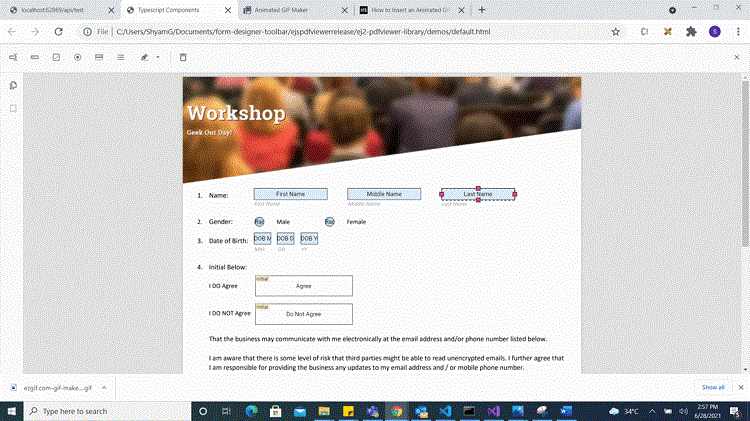

# Create form fields with UI interaction

The PDF Viewer component supports interacting with form fields, such as dragging and resizing. A form field can be drawn dynamically by clicking the Form Field icon on the toolbar and drawing it on the PDF document. The supported form field types are:

* Textbox
* Password
* CheckBox
* RadioButton
* ListBox
* DropDown
* SignatureField
* InitialField

## Enable or disable the form designer toolbar

Inject the FormDesigner module and set enableFormDesignerToolbar to true to show the Form Designer icon on the toolbar. By default, enableFormDesignerToolbar is true. Use the following code to inject the FormDesigner module and enable the enableFormDesignerToolbar property.




import { ViewChild } from '@angular/core';
import { Component, OnInit } from '@angular/core';
import { PdfViewerComponent, LinkAnnotationService, BookmarkViewService,
         MagnificationService, ThumbnailViewService, ToolbarService,
         NavigationService, TextSearchService, TextSelectionService,
         PrintService, AnnotationService, FormDesignerService,
         FormFieldsService
       } from '@syncfusion/ej2-angular-pdfviewer';

@Component({
  selector: 'app-root',
  // Specifies the template string for the PDF Viewer component.
  template: `<div class="content-wrapper">
                <ejs-pdfviewer id="pdfViewer"
                        [documentPath]='document'
                        [enableFormDesignerToolbar]='true'
                        style="height:640px;display:block">
                </ejs-pdfviewer>
             </div>`,
  providers: [ LinkAnnotationService, BookmarkViewService, MagnificationService,
               ThumbnailViewService, ToolbarService, NavigationService,
               TextSearchService, TextSelectionService, PrintService,
               AnnotationService, FormDesignerService, FormFieldsService]
})
export class AppComponent implements OnInit {
  @ViewChild('pdfviewer')
  public pdfviewerControl: PdfViewerComponent;
  public document: string = 'https://cdn.syncfusion.com/content/pdf/form-designer.pdf';
  ngOnInit(): void {
  }
}




import { ViewChild } from '@angular/core';
import { Component, OnInit } from '@angular/core';
import { PdfViewerComponent, LinkAnnotationService, BookmarkViewService,
         MagnificationService, ThumbnailViewService, ToolbarService,
         NavigationService, TextSearchService, TextSelectionService,
         PrintService, AnnotationService, FormDesignerService,
         FormFieldsService
       } from '@syncfusion/ej2-angular-pdfviewer';

@Component({
  selector: 'app-root',
  // Specifies the template string for the PDF Viewer component.
  template: `<div class="content-wrapper">
                <ejs-pdfviewer id="pdfViewer"
                        [serviceUrl]='service'
                        [documentPath]='document'
                        [enableFormDesignerToolbar]='true'
                        style="height:640px;display:block">
                </ejs-pdfviewer>
             </div>`,
  providers: [ LinkAnnotationService, BookmarkViewService, MagnificationService,
               ThumbnailViewService, ToolbarService, NavigationService,
               TextSearchService, TextSelectionService, PrintService,
               AnnotationService, FormDesignerService, FormFieldsService]
})
export class AppComponent implements OnInit {
  @ViewChild('pdfviewer')
  public pdfviewerControl: PdfViewerComponent;
  public service: string = 'https://document.syncfusion.com/web-services/pdf-viewer/api/pdfviewer';
  public document: string = 'https://cdn.syncfusion.com/content/pdf/form-designer.pdf';
  ngOnInit(): void {
  }
}




## Add a form field dynamically

Click the Form Field icon on the toolbar, then click on the PDF document to draw a form field. See the following GIF for reference.


## Drag the form field

Drag the selected form field in the PDF document. See the following GIF for reference.


## Resize the form field

Resize the selected form field in the PDF document. See the following GIF for reference.



## Edit or update a form field dynamically

Edit form field properties using the Form Field Properties window. Open it by choosing Properties from the context menu that appears when you click a form field. The following images show the available properties.


## Clipboard operations with form fields

The PDF Viewer component supports clipboard operations such as cut, copy, and paste for form fields. Right-click a form field to open the context menu and choose the desired clipboard option. See the following image for the available options.


## Undo and redo

Undo and redo form field actions at runtime. Use the following code to perform undo/redo actions.

```html
<script>
    window.onload = function () {
        var pdfViewer = document.getElementById('pdfviewer').ej2_instances[0];
        pdfViewer.undo();
        pdfViewer.redo();
    }
</script>

```