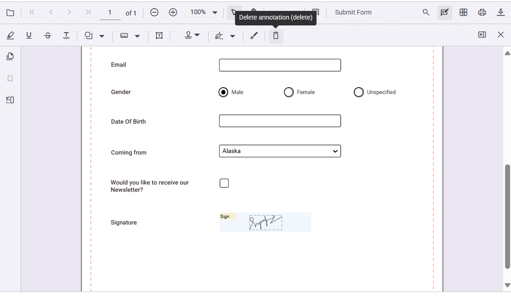

# Form filling in Angular PDF Viewer

The PDF Viewer displays existing form fields in a PDF and enables users to fill, validate, and download the filled data.

The PDF Viewer supports the following form field types:

* Text box
* Password
* Check box
* Radio button
* List box
* Dropdown
* Signature field
* Initial field

## Disabling form fields

The PDF Viewer provides an option to disable interaction with form fields. Use the following configuration to disable form fields in the viewer.




import { Component } from '@angular/core';
import {
  ToolbarService,
  MagnificationService,
  NavigationService,
  LinkAnnotationService,
  AnnotationService,
  BookmarkViewService,
  ThumbnailViewService,
  PrintService,
  TextSelectionService,
  TextSearchService,
  FormDesignerService,
  FormFieldsService
} from '@syncfusion/ej2-angular-pdfviewer';

@Component({
  selector: 'app-root',
  template: `
    <ejs-pdfviewer
      id="container"
      [documentPath]="documentPath"
      [resourceUrl]="resourceUrl"
      [enableFormDesigner]="false"
      style="height: 640px">
    </ejs-pdfviewer>
  `,
  providers: [
    ToolbarService,
    MagnificationService,
    NavigationService,
    LinkAnnotationService,
    AnnotationService,
    BookmarkViewService,
    ThumbnailViewService,
    PrintService,
    TextSelectionService,
    TextSearchService,
    FormDesignerService,
    FormFieldsService
  ]
})
export class AppComponent {
  public documentPath: string = 'https://cdn.syncfusion.com/content/pdf/pdf-succinctly.pdf';
  public resourceUrl: string = 'https://cdn.syncfusion.com/ej2/31.2.2/dist/ej2-pdfviewer-lib';
}




## Add a handwritten signature to a signature field

Add a handwritten signature to a signature field by following these steps:

* Click the signature field in the PDF document to open the signature panel.

* Draw the signature in the signature panel.

* Select **CREATE**. The drawn signature is added to the signature field.

## Delete a signature from a signature field

Delete a signature placed in a signature field by using the Delete option in the annotation toolbar.

## Export and import form fields

The PDF Viewer supports exporting and importing form field data using the `importFormFields`, `exportFormFields`, and `exportFormFieldsAsObject` methods. The following formats are supported:

* FDF
* XFDF
* JSON

For more information, see the [Form fields documentation](https://help.syncfusion.com/document-processing/pdf/pdf-viewer/angular/form-designer/create-programmatically#export-and-import-form-fields).

## See also

* [Handwritten signature in Angular PDF Viewer](./annotation/signature-annotation)
* [Form Designer events](./form-designer/form-field-events)
