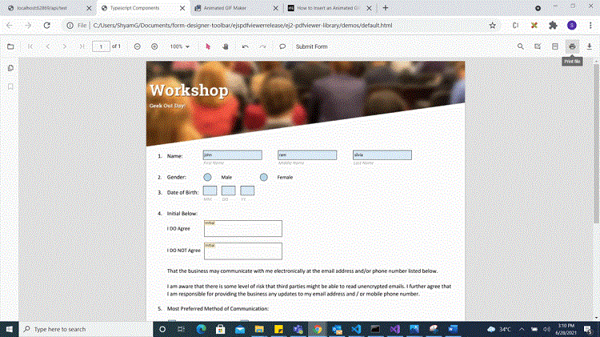

# Programmatically work with form field

The Angular PDF Viewer component supports adding, editing, and deleting form fields. The supported form field types are:

* Textbox
* Password
* CheckBox
* RadioButton
* ListBox
* DropDown
* SignatureField
* InitialField

## Add a form field to a PDF document programmatically

Using the addFormField method, form fields can be added to the PDF document programmatically. Pass two parameters to this method: the form field type and the properties for that field. The following code adds a form field programmatically.













## Edit or update a form field programmatically

Using the updateFormField method, a form field can be updated programmatically. Retrieve the form field object/Id from the FormFieldCollections property for the field to be edited and pass it as a parameter to updateFormField. Provide the properties to update as the second parameter. The example updates the value and backgroundColor properties of a Textbox form field.













## Delete a form field programmatically

Using the deleteFormField method, a form field can be deleted programmatically. Retrieve the form field object/Id from the FormFieldCollections property and pass it as a parameter to deleteFormField. The following code deletes a form field programmatically.













## Saving the form fields

When the download icon is selected on the toolbar, the Form Fields will be saved in the PDF document and this action will not affect the original document. Refer the below GIF for further reference.


The download action can be invoked using the following code snippet.

```html
<script>
    window.onload = function () {
        var pdfViewer = document.getElementById('pdfviewer').ej2_instances[0];
        pdfViewer.download();
    }
</script>

```

## Printing the form fields

When the print icon is selected on the toolbar, the PDF document will be printed along with the Form Fields added to the pages and this action will not affect the original document. Refer the below GIF for further reference.



The print action can be invoked using the following code snippet.

```html
<script>
    window.onload = function () {
        var pdfViewer = document.getElementById('pdfviewer').ej2_instances[0];
        pdfViewer.print.print();
    }
</script>

```

## Open the existing PDF document

An existing PDF document that contains form fields can be opened by clicking the Open icon on the toolbar. See the following GIF for reference.


