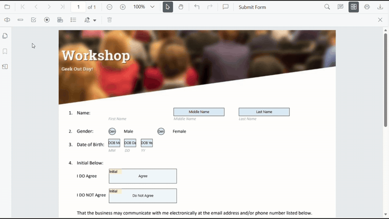
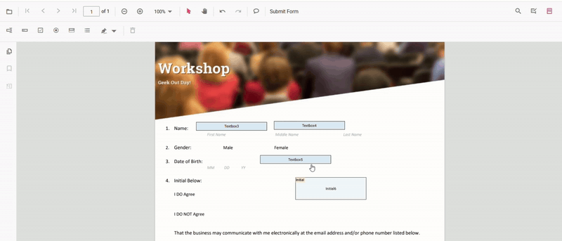
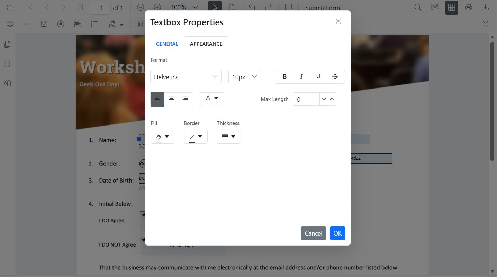

# Form Designer in Angular PDF Viewer

When **Form Designer mode** is enabled in the Syncfusion [Angular PDF Viewer](https://help.syncfusion.com/document-processing/pdf/pdf-viewer/angular/overview), a default [Form Designer user interface (UI)](https://document.syncfusion.com/demos/pdf-viewer/angular/#/tailwind3/pdfviewer/formdesigner.html) is displayed. This UI includes a built-in toolbar for adding form fields such as text boxes, password fields, check boxes, radio buttons, drop down lists, list boxes, and signature and initial fields.

Using the Form Designer UI, users can place form fields on the PDF, move and resize them, configure field and widget properties, preview the designed form, and remove fields when required. The Form Designer toolbar can also be shown or hidden and customized to control the available tools based on application requirements, enabling flexible and interactive form design directly within the viewer.

## Key Features

**Add Form Fields**
You can add the following form fields to the PDF:

- [Text box](../forms/manage-form-fields/create-form-fields#add-textbox)
- [Password Field](../forms/manage-form-fields/create-form-fields#add-password)
- [Check box](../forms/manage-form-fields/create-form-fields#add-checkbox)
- [Radio button](../forms/manage-form-fields/create-form-fields#add-radiobutton)
- [Dropdown List](../forms/manage-form-fields/create-form-fields#add-dropdown)
- [List box](../forms/manage-form-fields/create-form-fields#add-listbox)
- [Signature field](../forms/manage-form-fields/create-form-fields#add-signature-field)
- [Initial field](../forms/manage-form-fields/create-form-fields#add-initial-field)

**Edit Form Fields**
You can move, resize, align, distribute, copy, paste, and undo or redo changes to form fields.

**Set Field Properties**
You can configure field properties such as name, value, font, color, border, alignment, visibility, tab order, and required or read only state.

**Control Field Behavior**
You can enable or disable read only mode, show or hide fields, and control whether fields appear when printing the document.

**Manage Form Fields**
You can select, group or ungroup, reorder, and delete form fields as needed.

**Save and Print Forms**
Designed form fields can be saved into the PDF document and printed with their appearances.

## Form Designer with UI interaction

When [Form Designer mode](https://ej2.syncfusion.com/angular/documentation/api/pdfviewer/formdesigner) is enabled in the Syncfusion [Angular PDF Viewer](https://help.syncfusion.com/document-processing/pdf/pdf-viewer/angular/overview), a default [Form Designer user interface (UI)](https://document.syncfusion.com/demos/pdf-viewer/angular/#/tailwind3/pdfviewer/formdesigner.html) is displayed. This UI provides a built-in toolbar for adding common form fields such as text boxes, check boxes, radio buttons, drop down lists, and signature fields. Users can place fields on the PDF, select them, resize or move them, and configure their properties using the available editing options, enabling interactive form creation directly within the viewer.

For more information about creating and editing form fields in the PDF Viewer, refer to the [Form Creation](./manage-form-fields/create-form-fields) in Angular PDF Viewer documentation.

## Enable Form Designer

To enable form design features, inject the [FormDesigner](https://ej2.syncfusion.com/angular/documentation/api/pdfviewer/formdesigner) module into the PDF Viewer. After injecting the module, use the `enableFormDesigner` property or API to enable or disable the Form Designer option in the main toolbar (set to `true` to enable). Note: the standalone examples below show `enableFormDesigner` set to `false`; change this to `true` to enable form design in those samples.



import { Component, OnInit } from '@angular/core';
import {
  ToolbarService,
  MagnificationService,
  NavigationService,
  AnnotationService,
  TextSelectionService,
  TextSearchService,
  FormFieldsService,
  FormDesignerService,
  PdfViewerModule,
} from '@syncfusion/ej2-angular-pdfviewer';

@Component({
  selector: 'app-root',
  standalone: true,
  imports: [PdfViewerModule],
  template: `
    

      <ejs-pdfviewer
        id="pdfViewer"
        [resourceUrl]="resourceUrl"
        [documentPath]="document"
        [enableFormDesigner]="false"
        style="height: 640px; display: block;">
      </ejs-pdfviewer>
    

  `,
  providers: [
    ToolbarService,
    MagnificationService,
    NavigationService,
    AnnotationService,
    TextSelectionService,
    TextSearchService,
    FormFieldsService,
    FormDesignerService,
  ],
})
export class AppComponent implements OnInit {
  public document: string =
    'https://cdn.syncfusion.com/content/pdf/form-filling-document.pdf';
  public resourceUrl: string =
    'https://cdn.syncfusion.com/ej2/31.1.23/dist/ej2-pdfviewer-lib';

  ngOnInit(): void {}
}




## Form Designer Toolbar

The **Form Designer toolbar** appears at the top of the PDF Viewer and provides quick access to form field creation tools. It includes frequently used field types such as:

- [Text box](../forms/manage-form-fields/create-form-fields#add-textbox)
- [Password Field](../forms/manage-form-fields/create-form-fields#add-password)
- [Check box](../forms/manage-form-fields/create-form-fields#add-checkbox)
- [Radio button](../forms/manage-form-fields/create-form-fields#add-radiobutton)
- [Dropdown List](../forms/manage-form-fields/create-form-fields#add-dropdown)
- [List box](../forms/manage-form-fields/create-form-fields#add-listbox)
- [Signature field](../forms/manage-form-fields/create-form-fields#add-signature-field)
- [Initial field](../forms/manage-form-fields/create-form-fields#add-initial-field)

#### Show or Hide the Built-in Form Designer Toolbar

The visibility of the Form Designer toolbar is controlled by the [isFormDesignerToolbarVisible()](https://ej2.syncfusion.com/documentation/api/pdfviewer/index-default#isformdesignertoolbarvisible) method. This method enables the application to display or hide the Form Designer tools based on requirements. Refer to the code example [here](../toolbar-customization/form-designer-toolbar#2-show-or-hide-form-designer-toolbar-at-runtime).

- The Form Designer toolbar is shown when form design is required.
- The toolbar can be hidden to provide a cleaner viewing experience.

#### Customize the Built-in Form Designer Toolbar

The Form Designer toolbar can be customized by specifying the tools to display and arranging them in the required order using the [FormDesignerToolbarItems](https://ej2.syncfusion.com/angular/documentation/api/pdfviewer/formdesignertoolbaritem) property.

This customization helps limit the available tools and simplify the user interface. A code example is available [here](../toolbar-customization/form-designer-toolbar#3-show-or-hide-form-designer-toolbar-items).

**Key Points**
- Only the toolbar items listed are included, in the exact order specified.
- Any toolbar items not listed remain hidden, resulting in a cleaner and more focused UI.

### Adding Form Fields

Each toolbar item in form designer toolbar allows users to place the corresponding form field by selecting the tool and clicking on the desired location in the PDF document.

For more information about creating form fields in the PDF Viewer, refer to the [Form Creation in Angular PDF Viewer documentation](./manage-form-fields/create-form-fields#create-form-fields-using-the-form-designer-ui).

### Move, Resize, and Edit Form Fields

Fields can be moved, resized, and edited directly in the PDF Viewer using the Form Designer.

- A field is moved by selecting it and dragging it to the required position.

- Fields are resized using the handles displayed on the field boundary.

- Selecting a field opens the Form Field Properties popover, which allows modification of the form field and widget annotation properties. Changes are reflected immediately in the viewer and are saved when the properties popover is closed.
For more information, see Editing Form Fields

### Edit Form Field properties

The **Properties** panel lets you customize the styles of form fields. Open the panel by selecting the **Properties** option in a field's context menu.

### Deleting Form Fields

A form field is removed by selecting it and either clicking the `Delete` option in the Form Designer UI or pressing the `Delete` key on the keyboard. The selected form field and its associated widget annotation are permanently removed from the page.

For more information, see  [Deleting Form Fields](./manage-form-fields/remove-form-fields)

## See Also

- [Filling PDF Forms](./form-filling)
- [Create](./manage-form-fields/create-form-fields), [edit](./manage-form-fields/modify-form-fields), [style](./manage-form-fields/style-form-fields) and [remove](./manage-form-fields/remove-form-fields) form fields
- [Grouping form fields](./group-form-fields)
- [Form Constraints](./form-constrain)
- [Form Validation](./form-validation)
- [Custom Data](./custom-data)
- [Import](./import-export-form-fields/import-form-fields)/[Export Form Data](./import-export-form-fields/export-form-fields)
- [Form field events](./form-field-events)
