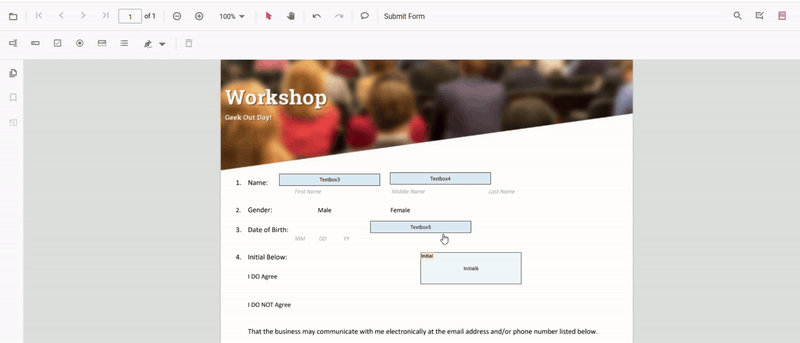

# Move and Resize Form Fields in Angular PDF Viewer
- **Move**: Drag the form field to reposition it.
- **Resize**: Use the resize handles to change width and height.

## Move and Resize Fields Programmatically (API)
You can set absolute bounds to reposition and resize fields.

**Set absolute bounds**



import { Component, ViewChild } from '@angular/core';
import {
  ToolbarService,
  MagnificationService,
  NavigationService,
  AnnotationService,
  TextSelectionService,
  TextSearchService,
  FormFieldsService,
  FormDesignerService,
  PdfViewerModule,
  PdfViewerComponent,
} from '@syncfusion/ej2-angular-pdfviewer';

@Component({
  selector: 'app-root',
  standalone: true,
  imports: [PdfViewerModule],
  template: `
    

      <button (click)="resizeMove()">Resize and Move FormFields</button>

      <ejs-pdfviewer #pdfViewer id="pdfViewer"
        [resourceUrl]="resourceUrl"
        [documentPath]="document"
        style="height: 640px; display: block;">
      </ejs-pdfviewer>
    

  `,
  providers: [
    ToolbarService,
    MagnificationService,
    NavigationService,
    AnnotationService,
    TextSelectionService,
    TextSearchService,
    FormFieldsService,
    FormDesignerService,
  ],
})
export class AppComponent {
  public document: string = 'https://cdn.syncfusion.com/content/pdf/form-filling-document.pdf';
  public resourceUrl: string = 'https://cdn.syncfusion.com/ej2/31.1.23/dist/ej2-pdfviewer-lib';

  @ViewChild('pdfViewer') public pdfviewer!: PdfViewerComponent;

  resizeMove(): void {
    const fields = this.pdfviewer.retrieveFormFields();
    const field = fields.find((f: any) => f.name === 'First Name') || fields[0];
    if (field) {
      this.pdfviewer.formDesignerModule.updateFormField(field, {
        bounds: { X: 140, Y: 210, Width: 220, Height: 24 },
      } as any);
    }
  }
}



## See also

- [Form Designer overview](../overview)
- [Form Designer Toolbar](../../toolbar-customization/form-designer-toolbar)
- [Create form fields](./create-form-fields)
- [Remove form Fields](./remove-form-fields)
- [Customize form fields](./customize-form-fields)
- [Group form fields](../group-form-fields)
- [Form validation](../form-validation)
- [Form fields API](../form-fields-api)