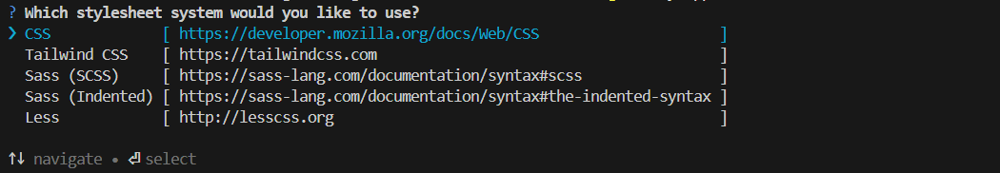
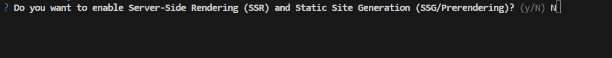
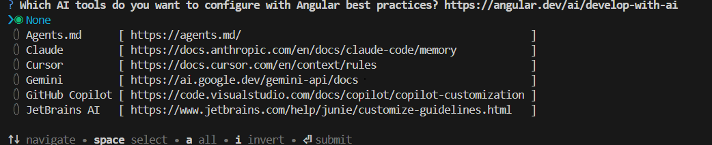

# Getting started with Angular Standalone PDF Viewer component

This section explains the steps required to create a simple Standalone Angular PDF Viewer and demonstrates the basic usage of the PDF Viewer control in an Angular 21.

> Note: This guide supports **Angular 21** and other recent Angular versions. For detailed compatibility with other Angular versions, please refer to the [Angular version support matrix](https://ej2.syncfusion.com/angular/documentation/system-requirement#angular-version-compatibility). Starting from Angular 19, standalone components are the default, and this guide reflects that architecture.

N> For older versions of Angular, see the following links:

* [Create a Standalone PDF Viewer in Angular 17 and above with-no-standalone-flag](./how-to/create-a-standalone-pdf-viewer-in-angular-17-and-above-with-no-standalone-flag).
* [Create a Standalone PDF Viewer in Angular 17 and above without --no-standalone flag](./how-to/create-a-standalone-pdf-viewer-in-angular-17-and-above-without-no-standalone-flag).

## Prerequisites

Ensure your development environment meets the [System Requirements for Syncfusion<sup style="font-size:70%">&reg;</sup> Angular UI Components](https://ej2.syncfusion.com/angular/documentation/system-requirement).

## Setup Angular Environment

You can use the [`Angular CLI`](https://github.com/angular/angular-cli) to setup your Angular applications.
To install the latest Angular CLI globally use the following command.

```bash
npm install -g @angular/cli
```

> **Angular 21 Standalone Architecture:** Standalone components are the default in Angular 21. This guide uses the modern standalone architecture. If you need more information about the standalone architecture, refer to the [Standalone Guide](https://ej2.syncfusion.com/angular/documentation/getting-started/angular-standalone).

### Installing a specific version

To install a particular version of Angular CLI, use:

```bash
npm install -g @angular/cli@21.0.0
```

## Create an Angular Application

Start a new Angular application using the Angular CLI command as follows.

```bash
ng new my-app
```

* This command will prompt you to configure settings like enabling Angular routing and choosing a stylesheet format.



* By default, a CSS-based application is created. Use SCSS if required:

```bash
ng new my-app --style=scss
```

* During project setup, when prompted for the Server-side rendering (SSR) option, choose the appropriate configuration.



* Select the required AI tool or 'none' if you do not need any AI tool.



* Navigate to your newly created application directory:

```bash
cd my-app
```

> Note: In Angular 19 and below, it uses `app.component.ts`, `app.component.html`, `app.component.css` etc. In Angular 20+, the CLI generates a simpler structure with `src/app/app.ts`, `app.html`, and `app.css` (no `.component.` suffixes).

## Installing Syncfusion<sup style="font-size:70%">&reg;</sup> PDF Viewer package

All the available Essential<sup style="font-size:70%">&reg;</sup> JS 2 packages are published in `npmjs.com` registry.

* To install PDF Viewer component, use the following command.

```bash
npm install @syncfusion/ej2-angular-pdfviewer --save
```

* Copy the contents of the ej2-pdfviewer-lib folder from ./node_modules/@syncfusion/ej2-pdfviewer/dist to the src/assets directory using the command:

```bash
cp -R ./node_modules/@syncfusion/ej2-pdfviewer/dist/ej2-pdfviewer-lib  src/assets/ej2-pdfviewer-lib
```

* Confirm that there is an 'ej2-pdfviewer-lib' directory within your `src/assets` directory, housing the assets of the PDF Viewer library.

* Validate that your server has been configured to utilize the Content-Type: application/wasm MIME type. Additional information can be found in the [Troubleshooting](./troubleshooting/troubleshooting) section.

## Adding CSS reference

Add the Angular PDF Viewer component's styles as given below in `src/styles.css` file.

```css
@import '../node_modules/@syncfusion/ej2-base/styles/material.css';
@import '../node_modules/@syncfusion/ej2-buttons/styles/material.css';
@import '../node_modules/@syncfusion/ej2-dropdowns/styles/material.css';
@import '../node_modules/@syncfusion/ej2-inputs/styles/material.css';
@import '../node_modules/@syncfusion/ej2-navigations/styles/material.css';
@import '../node_modules/@syncfusion/ej2-popups/styles/material.css';
@import '../node_modules/@syncfusion/ej2-splitbuttons/styles/material.css';
@import '../node_modules/@syncfusion/ej2-pdfviewer/styles/material.css';
@import '../node_modules/@syncfusion/ej2-notifications/styles/material.css';
```

## Add the PDF Viewer component

Add the Angular PDF Viewer by using `<ejs-pdfviewer>` selector in `template` section of the `src/app/app.ts` file to render the PDF Viewer component.

```typescript
import { Component, OnInit } from '@angular/core';
import { PdfViewerModule, LinkAnnotationService, BookmarkViewService,
         MagnificationService, ThumbnailViewService, ToolbarService,
         NavigationService, TextSearchService, TextSelectionService,
         PrintService, FormDesignerService, FormFieldsService,
         AnnotationService, PageOrganizerService } from '@syncfusion/ej2-angular-pdfviewer';

@Component({
  selector: 'app-root',
  // specifies the template string for the PDF Viewer component
  template: `<div class="content-wrapper">
                <ejs-pdfviewer id="pdfViewer"
                    [documentPath]='document'
                    [resourceUrl]='resource'
                    style="height:640px;display:block">
                </ejs-pdfviewer>
             </div>`,
  imports: [ PdfViewerModule ],
  providers: [ LinkAnnotationService, BookmarkViewService, MagnificationService,
               ThumbnailViewService, ToolbarService, NavigationService,
               TextSearchService, TextSelectionService, PrintService,
               AnnotationService, FormDesignerService, FormFieldsService, PageOrganizerService]
})
export class App implements OnInit {
  public document: string = 'https://cdn.syncfusion.com/content/pdf/pdf-succinctly.pdf';
  public resource: string = "https://cdn.syncfusion.com/ej2/26.2.11/dist/ej2-pdfviewer-lib";
  ngOnInit(): void {
  }
}
```

### Load PDF Viewer with local resources

To configure the PDF Viewer to use local files for `documentPath` and `resourceUrl` instead of files hosted on a CDN, follow these steps:

**Step 1:** Ensure that your application includes the `ej2-pdfviewer-lib` folder. This folder must contain the `pdfium.js`, `pdfium.wasm` files, and the PDF file that you intend to display. These should be located in the `assets` directory within your project's `src` folder.

**Step 2:** Register the assets folder inside `angular.json`
```json
"assets": [
  "src/assets"
]
```

**Step 3:** Assign local file paths to the `documentPath` and `resourceUrl` properties within the PDF Viewer setup. The `documentPath` should refer to your PDF file, while the `resourceUrl` should point to the directory containing the supporting resources.

By following these steps, you will configure your PDF Viewer to load the required resources locally. See the code snippet below for reference.

```typescript
  template: `<ejs-pdfviewer id="pdfViewer"
                    [documentPath]='document'
                    [resourceUrl]='resource'
                    style="height:640px;display:block">
              </ejs-pdfviewer>`,
export class AppComponent implements OnInit {
  public document: string = window.location.origin + "/assets/pdfsuccinctly.pdf";
  public resource: string = window.location.origin + "/assets/ej2-pdfviewer-lib";
  }
```

View the sample in GitHub to [load PDF Viewer with local resources](https://github.com/SyncfusionExamples/angular-pdf-viewer-examples/tree/master/How%20to/Refer%20resource%20url%20locally)

## Run the application

Use the following command to run the application in browser.

```javascript
ng serve --open
```

The output will appear as follows.



import { Component, OnInit } from '@angular/core';
import { PdfViewerModule, LinkAnnotationService, BookmarkViewService,
         MagnificationService, ThumbnailViewService, ToolbarService,
         NavigationService, TextSearchService, TextSelectionService,
         PrintService, FormDesignerService, FormFieldsService,
         AnnotationService, PageOrganizerService } from '@syncfusion/ej2-angular-pdfviewer';

@Component({
  selector: 'app-root',
  // specifies the template string for the PDF Viewer component
  template: `<div class="content-wrapper">
  <ejs-pdfviewer
    id="pdfViewer"
    [documentPath]='document'
    [resourceUrl]='resource'
    style="height:640px;display:block">
  </ejs-pdfviewer>
</div>`,
  imports: [ PdfViewerModule ],
  providers: [ LinkAnnotationService, BookmarkViewService, MagnificationService,
               ThumbnailViewService, ToolbarService, NavigationService,
               TextSearchService, TextSelectionService, PrintService,
               AnnotationService, FormDesignerService, FormFieldsService, PageOrganizerService]
})
export class App implements OnInit {
    public document = 'https://cdn.syncfusion.com/content/pdf/pdf-succinctly.pdf';
    public resource: string = "https://cdn.syncfusion.com/ej2/26.2.11/dist/ej2-pdfviewer-lib";
    ngOnInit(): void {
    }
}



import { bootstrapApplication } from '@angular/platform-browser';
import { appConfig } from './app/app.config';
import { App } from './app/app';

bootstrapApplication(App, appConfig)
  .catch((err) => console.error(err));






## Module injection

To enable additional features, inject the required modules. The following modules extend the PDF Viewer's functionality:

* `LinkAnnotationService`: Enables hyperlink navigation.
* `BookmarkViewService`: Displays and navigates document bookmarks.
* `MagnificationService`: Provides zoom in/out operations.
* `NavigationService`: Enables page navigation.
* `TextSelectionService`: Enables text selection.
* `ThumbnailViewService`: Displays page thumbnails for navigation.
* `ToolbarService`: Enables the built-in toolbar UI.
* `PrintService`: Enables printing.
* `AnnotationService`: Enables annotation features.
* `TextSearchService`: Enables text search.
* `FormFieldsService`: Enables form field support.
* `FormDesignerService`: Enables designing and editing of form fields.
* `PageOrganizerService`: Enables page organization features.

Inject modules using the `providers` array in the component or module.

> Refer to the [Angular PDF Viewer feature tour](https://www.syncfusion.com/pdf-viewer-sdk/angular-pdf-viewer) for an overview of capabilities. Explore the [Angular PDF Viewer example](https://document.syncfusion.com/demos/pdf-viewer/angular/#/tailwind3/pdfviewer/default) to see core features in action.

[View sample in GitHub](https://github.com/SyncfusionExamples/angular-pdf-viewer-examples/tree/master/Getting%20started%20-%20Standalone).
