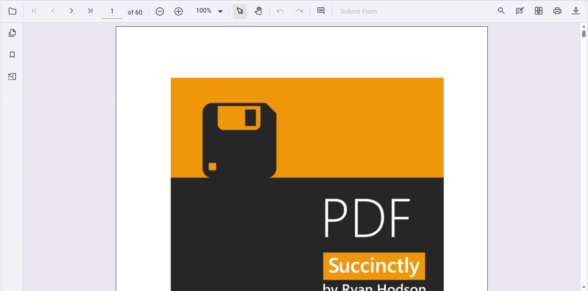
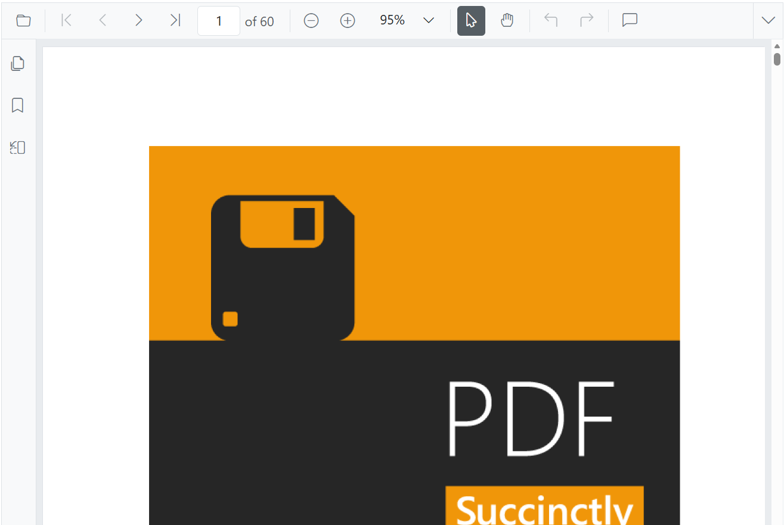

---
title: Getting Started with Angular PDF Viewer | Syncfusion
description: Set up and run the standalone Angular PDF Viewer using Syncfusion Essential JS 2 to render and interact with PDF documents in the browser.
platform: document-processing
control: PDF Viewer
documentation: ug
domainurl: ##DomainURL##
---

# Getting Started with Angular PDF Viewer

[Syncfusion® Angular PDF Viewer](https://www.syncfusion.com/pdf-viewer-sdk/angular-pdf-viewer) enables you to view, annotate, and interact with PDF documents in web applications. This section guides you through the steps to get started and create a PDF Viewer in an Angular application.





## Prerequisites

- [Node.js 24+](https://nodejs.org/en) (LTS recommended).
- Syncfusion CLI.

## Install the Syncfusion CLI

Install the Syncfusion CLI globally using the following command:




npm install -g @syncfusion/syncfusion-cli




## Set up the project using Syncfusion CLI

You can create an Angular application using the Syncfusion CLI. The CLI provides two ways to create a project:

### Non-interactive mode

Non-interactive mode allows you to create a project directly using a single command with the required command-line arguments.




sf new syncfusion-angular-app --framework angular --template pdf-viewer




In this mode, the project configuration is passed directly in the command. The above command creates an Angular application configured with the Syncfusion&reg; `PDF Viewer` component.

### Interactive mode

Interactive mode guides you through the project creation process with step-by-step prompts.




sf




When you run the `sf` command, the CLI prompts you to select the required project configuration. To create an Angular application with the Syncfusion&reg; `PDF Viewer` component, select the following options:




√ Project name? ... syncfusion-angular-app
√ Choose Framework: » Angular
√ Choose Build Tool: » Webpack
√ Choose Language: » TypeScript
√ Choose Template: » PDF Viewer
√ Choose Theme: » Tailwind3
√ Choose Style Format: » CSS
√ Would you like to integrate the Syncfusion MCP Server (AI Assistant) into this project? ... no
√ Would you like to install Syncfusion Component Skills for AI-powered development? ... no
√ Install dependencies and start app now? ... no




The above selections generate an Angular application configured with the Syncfusion&reg; `PDF Viewer` component. You can choose different values for language, theme, style format, MCP setup, and skills installation based on your project requirements.

The Syncfusion&reg; CLI creates the project with a predefined template. After the project is generated, you can customize or replace the component code based on your application requirements.

## Run the project

Once the project is created, navigate to the project directory and run the following commands in your terminal.




cd syncfusion-angular-app
npm install
npm start




The output will appear as follows:

You can also explore the PDF Viewer interactively using the live sample below.



N> [View Sample in GitHub](https://github.com/SyncfusionExamples/angular-pdf-viewer-examples/tree/master/Getting%20started%20-%20Standalone).





## Prerequisites

[System requirements for Syncfusion® Angular components](https://ej2.syncfusion.com/angular/documentation/system-requirement)

## Create an Angular application

Use [Angular CLI](https://angular.dev/installation) to create a new Angular application, as it provides a standardized project structure, built-in testing tools, and simplified deployment. Use an Angular CLI version that matches the target Angular version (e.g., Angular CLI 17 for Angular 17 projects).

Install Angular CLI globally using the following command:




npm install -g @angular/cli




Create a new Angular application using the following commands:




ng new pdfviewer-app
cd pdfviewer-app




N> When prompted during project creation, select the default options: **CSS** for stylesheet, **No** for SSR/SSG, and **None** for AI tools. The available prompts may vary by Angular CLI version; accept the default values for any prompts not listed here.

## Install the Syncfusion® Angular PDF Viewer package

Install the Syncfusion [Angular PDF Viewer](https://www.npmjs.com/package/@syncfusion/ej2-angular-pdfviewer) package from npm:




npm install @syncfusion/ej2-angular-pdfviewer --save




## Import the required CSS styles

Themes for PDF Viewer can be applied using CSS or SASS files from the [npm theme packages](https://ej2.syncfusion.com/angular/documentation/appearance/overview#theme-packages), CDN, CRG, or [Theme Studio](https://ej2.syncfusion.com/angular/documentation/appearance/theme-studio). For more information, see the [themes documentation](https://ej2.syncfusion.com/angular/documentation/appearance/overview#theme-packages).

This guide uses the `Tailwind 3` theme as an example, sourced from the theme package. In this package, each component includes an `index.css` file that automatically loads all the required dependency styles. To install the [Tailwind 3](https://www.npmjs.com/package/@syncfusion/ej2-tailwind3-theme) theme package, use the following command:




npm install @syncfusion/ej2-tailwind3-theme




Add the required PDF Viewer theme style reference to the `src/styles.css` file:




@import '../node_modules/@syncfusion/ej2-tailwind3-theme/styles/pdfviewer/index.css';




N> The `index.css` file automatically includes all required dependent component styles for the PDF Viewer. You do not need to import individual dependency styles such as Base, Buttons, Dropdowns, Inputs, Navigations, Popups, SplitButtons, and Notifications separately.

N> Refer to the [Themes topic](https://ej2.syncfusion.com/angular/documentation/appearance/overview) to learn more about built-in themes and different ways to refer to themes in an Angular project.

## Initialize the PDF Viewer

Add the PDF Viewer component to your application. The component requires the **PdfViewerModule** and its associated services (for full functionality).

Update `src/app/app.ts` as shown below:




import { Component } from '@angular/core';
import { PdfViewerModule, LinkAnnotationService, BookmarkViewService,
         MagnificationService, ThumbnailViewService, ToolbarService,
         NavigationService, TextSearchService, TextSelectionService,
         PrintService, FormDesignerService, FormFieldsService,
         AnnotationService, PageOrganizerService } from '@syncfusion/ej2-angular-pdfviewer';

@Component({
  selector: 'app-root',
  standalone: true,
  imports: [PdfViewerModule],
  providers: [ LinkAnnotationService, BookmarkViewService, MagnificationService,
               ThumbnailViewService, ToolbarService, NavigationService,
               TextSearchService, TextSelectionService, PrintService,
               FormDesignerService, FormFieldsService, AnnotationService, PageOrganizerService],
  template: `
    <ejs-pdfviewer
      id="pdfViewer"
      [documentPath]="documentPath"
      [resourceUrl]="resourcesUrl"
      style="height:640px; display:block">
    </ejs-pdfviewer>
  `
})
export class App {
  public documentPath: string =
    'https://cdn.syncfusion.com/content/pdf/pdf-succinctly.pdf';
  public resourcesUrl: string =
    'https://cdn.syncfusion.com/ej2/31.2.2/dist/ej2-pdfviewer-lib';
}




N> The `documentPath` property sets the PDF file path to be loaded. You can provide a remote URL, Base64 string, or local file path (e.g., `'assets/sample.pdf'`) and the `resourceUrl` property specifies the PDFium library resources path required for PDF rendering. This example uses CDN-hosted resources. For local resources, refer to [Load PDF Viewer with Local Resources](https://help.syncfusion.com/document-processing/pdf/pdf-viewer/angular/how-to/load-pdf-viewer-with-local-resources).

## Run the application

Run the following command to start the Angular application:




ng serve --open




After the application starts, open `http://localhost` (the default dev server URL) in the browser. The Angular PDF Viewer is rendered in the browser with a toolbar and an interactive PDF area, as shown below.

You can also explore the PDF Viewer interactively using the live sample below.



N> [View Sample in GitHub](https://github.com/SyncfusionExamples/angular-pdf-viewer-examples/tree/master/Getting%20started%20-%20Standalone).

## Video tutorial

To get started quickly with the Angular PDF Viewer, you can watch this video:







## Angular version compatibility

For detailed compatibility information, refer to the [Angular version support matrix](https://ej2.syncfusion.com/angular/documentation/system-requirement#angular-version-compatibility).

## Older versions

For older Angular versions, refer to the following guides:
* [Create a Standalone PDF Viewer in Angular 17 and above with the --no-standalone flag](./how-to/create-a-standalone-pdf-viewer-in-angular-17-and-above-with-no-standalone-flag).
* [Create a Standalone PDF Viewer in Angular 17 and above without the --no-standalone flag](./how-to/create-a-standalone-pdf-viewer-in-angular-17-and-above-without-no-standalone-flag).
* [Create a Standalone PDF Viewer in Angular 12](./how-to/create-a-standalone-pdf-viewer-in-angular-12)

N> Looking for the full Angular PDF Viewer component overview, features, pricing, and documentation? Visit the [Angular PDF Viewer](https://www.syncfusion.com/pdf-viewer-sdk/angular-pdf-viewer) page.

## See also

- [Getting started with Server-Backed Angular PDF Viewer](./getting-started-with-server-backed)
- [Open PDF Files](./open-pdf-files)
- [Save PDF Files](./save-pdf-files)
