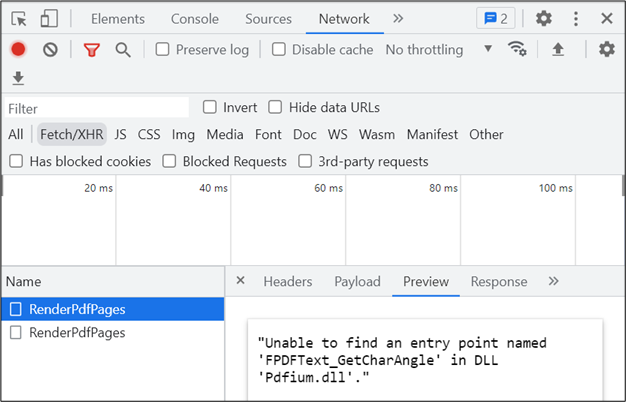

# Resolve "Unable to find an entry point named FPDFText_GetCharAngle" error

With the release of version **21.1.0.35 (2023 Volume 1)** of Essential Studio&reg;, the Pdfium package has been upgraded to improve functionalities such as text search, text selection, rendering, and overall performance. When updating a project to this version of the Syncfusion&reg; PDF Viewer, users may encounter a **"Web-Service is not listening"** error. The Network tab can assist in identifying the root cause, which is typically an older version of the Pdfium assembly being referenced in the local web service project. The following assemblies should be referenced for their respective operating systems:

* Windows – pdfium.dll
* Linux – libpdfium.so
* OSX – libpdfium.dylib

### Steps to Resolve:

To resolve this issue, follow these steps:

1.  Clear the `bin` and `obj` files of the web-service project.
2.  Re-publish the web-service project.

N> **Note:** When hosting the application in Azure, AWS, or Linux environments, ensure older published files are deleted before republishing the application.