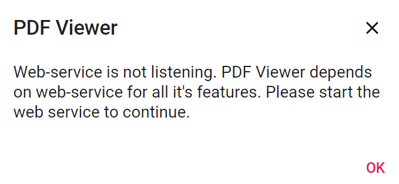
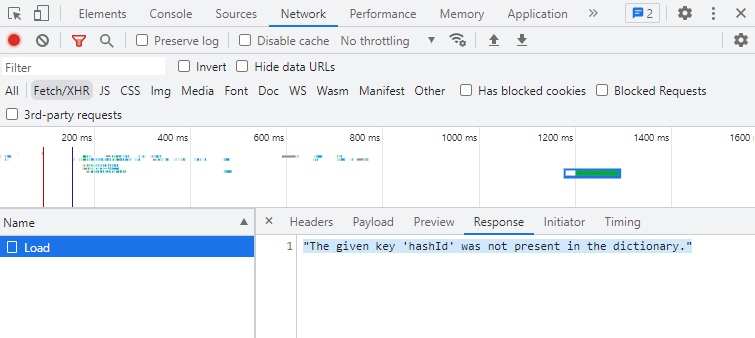

# How to clear the "Web-service is not listening" error

If the Syncfusion&reg; PDF Viewer encounters a **Web-service is not listening** error, this can stem from various underlying issues. To aid in troubleshooting, the Network tab within the browser's developer tools can provide valuable information. Here are the detailed steps:

**Step 1:** Open the browser's developer tools by right-clicking on the page and selecting `Inspect` from the dropdown menu. Navigate to the `Network` tab, which displays all requests made by the page.

**Step 2:** Attempt to request the web service. If the service is unresponsive, the request will fail, and an error message will appear in the Network tab. Click on the failed request to view error details, such as the error message or stack trace. This information can help identify the root cause. Additionally, check server logs for any errors or warnings that may indicate the cause of the issue and assist in troubleshooting.

**Step 3:** Verify that the request URL and parameters are correct. Incorrect typing or parameters may prevent the web service from processing the request.

By following these steps and utilizing the Network tab in the browser's developer tools, more information about the issue can be gathered, leading to more effective troubleshooting.

N> Ensure a stable internet connection. Access other websites or services to confirm connectivity, and verify that the URL used to access the web service is correct and properly formatted.

## Common exceptions

* File not found.
* Document cache not found.
* Document pointer does not exist in the cache.

## File not found

If the web service is not listening due to a file not found error in the Syncfusion&reg; PDF Viewer, try the following steps to resolve the issue:

### Check the file path

Ensure that the file path used to access the PDF file is correct and that the file exists at that location. If the file does not exist, update the file path accordingly.

## Document cache not found

The `Document cache not found` exception in Syncfusion&reg; PDF Viewer typically occurs when the cache storing rendered PDF document pages is missing or has been deleted. This can happen if the cache directory is changed or deleted, or if the application is running in an environment different from its previous execution.

### Check for multiple instances

Multiple instances of the Syncfusion&reg; PDF Viewer running simultaneously can cause issues with the document cache. To check for this, open Task Manager and look for any running instances of the Syncfusion&reg; PDF Viewer. If multiple instances are found, close them all and reopen the viewer.

Redis cache and distributed cache can be used to address this issue.

### Check network connection

Ensure that the network connection is stable and sufficiently robust to support the web service. Sometimes, simply restarting the web service can resolve the issue. Try stopping and starting the service again to see if the problem is resolved.

## The document pointer does not exist in the cache

The `Document pointer does not exist in the cache` exception in the Syncfusion&reg; PDF Viewer usually indicates an issue with loading or caching the PDF document.

To clear this error in the Syncfusion&reg; PDF Viewer, try the following steps:

**Step 1:** Clearing the cache may help resolve the issue. To clear the cache, locate the cache directory by checking the Syncfusion&reg; PDF Viewer's settings or configuration files. Once the cache folder is located, delete its contents.

**Step 2:** Reload the document to ensure it loads correctly. This can be done by calling the controller's `Load()` method. Ensure the document is not already loaded before attempting to load it again.

**Step 3:** Restart the application. If clearing the cache does not resolve the issue, restarting the PDF Viewer application may help. This will reload all necessary components and could resolve the error.

## Internal Server Error

Server-side exceptions occur for various use cases. Specifying them is difficult if they are document-specific. Provide the document, or contact Syncfusion&reg; support for further assistance.
