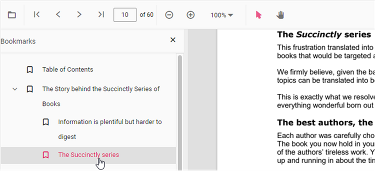

# Bookmark navigation in Angular PDF Viewer control

The Bookmarks saved in PDF files are loaded and made ready for easy navigation.
You can enable/disable bookmark navigation by using the following code snippet.,



import { Component, ViewEncapsulation, OnInit, ViewChild, AfterViewInit } from '@angular/core';
import {
  PdfViewerComponent,
  LinkAnnotationService,
  BookmarkViewService,
  MagnificationService,
  ThumbnailViewService,
  ToolbarService,
  NavigationService,
  TextSearchService,
  TextSelectionService,
  PrintService,
  AnnotationService,
  FormFieldsService,
  FormDesignerService,
  PageOrganizerService,
  PdfViewerModule,
} from '@syncfusion/ej2-angular-pdfviewer';

/**
 * Default PdfViewer Controller
 */
@Component({
  selector: 'app-root',
  // templateUrl: 'app.html',
    template: `
    <div class="control-section">
      <div class="content-wrapper">
        <button ejs-button cssClass="e-primary" id="getBookmarks">annotationSelector</button>
      </div>
    </div>
    <ejs-pdfviewer
      #pdfviewer
      id="pdfViewer"
      [documentPath]="document"
      [resourceUrl] = "resource"
      [enableBookmark]='true'
      >
      style="height:640px;display:block"
    </ejs-pdfviewer>
    `,
  encapsulation: ViewEncapsulation.None,
  // tslint:disable-next-line:max-line-length
  providers: [
    LinkAnnotationService,
    BookmarkViewService,
    MagnificationService,
    ThumbnailViewService,
    ToolbarService,
    NavigationService,
    TextSearchService,
    TextSelectionService,
    PrintService,
    AnnotationService,
    FormFieldsService,
    FormDesignerService,
    PageOrganizerService,
  ],
  styleUrls: ['app.css'],
  standalone: true,
  imports: [PdfViewerModule],
    
})
export class AppComponent {
  @ViewChild('pdfviewer')
  public viewer: PdfViewerComponent;
  public document: string =
    'https://cdn.syncfusion.com/content/pdf/pdf-succinctly.pdf';
  public resource: string =
    'https://cdn.syncfusion.com/ej2/23.2.6/dist/ej2-pdfviewer-lib';

  ngOnInit(): void {
    // ngOnInit function
  }
}




import { Component, ViewEncapsulation, OnInit, ViewChild, AfterViewInit } from '@angular/core';
import {
  PdfViewerComponent,
  LinkAnnotationService,
  BookmarkViewService,
  MagnificationService,
  ThumbnailViewService,
  ToolbarService,
  NavigationService,
  TextSearchService,
  TextSelectionService,
  PrintService,
  AnnotationService,
  FormFieldsService,
  FormDesignerService,
  PageOrganizerService,
  PdfViewerModule,
} from '@syncfusion/ej2-angular-pdfviewer';

/**
 * Default PdfViewer Controller
 */
@Component({
  selector: 'app-root',
  // templateUrl: 'app.html',
    template: `
    <div class="control-section">
      <div class="content-wrapper">
        <button ejs-button cssClass="e-primary" id="getBookmarks">annotationSelector</button>
      </div>
    </div>
    <ejs-pdfviewer
      #pdfviewer
      id="pdfViewer"
      [documentPath]="document"
      [resourceUrl] = "resource"
      [enableBookmark]='true'
      >
      style="height:640px;display:block"
    </ejs-pdfviewer>
    `,
  encapsulation: ViewEncapsulation.None,
  // tslint:disable-next-line:max-line-length
  providers: [
    LinkAnnotationService,
    BookmarkViewService,
    MagnificationService,
    ThumbnailViewService,
    ToolbarService,
    NavigationService,
    TextSearchService,
    TextSelectionService,
    PrintService,
    AnnotationService,
    FormFieldsService,
    FormDesignerService,
    PageOrganizerService,
  ],
  styleUrls: ['app.css'],
  standalone: true,
  imports: [PdfViewerModule],
    
})

export class AppComponent {
  @ViewChild('pdfviewer')
  public viewer: PdfViewerComponent;
  public service = 'https://document.syncfusion.com/web-services/pdf-viewer/api/pdfviewer';
  public document: string =
    'https://cdn.syncfusion.com/content/pdf/pdf-succinctly.pdf';

  ngOnInit(): void {
    // ngOnInit function
  }
}






To perform bookmark navigation, you can use the **goToBookmark** method. It's important to note that the **goToBookmark** method will throw an error if the specified bookmark does not exist in the PDF document.

Here is an example of how to use the **goToBookmark** method:

```
  <button id="gotobookmark">Specfic Page</button>
```

```ts
import { Component, ViewChild, AfterViewInit } from '@angular/core';
import { PdfViewerComponent } from '@syncfusion/ej2-angular-pdfviewer';

@Component({
  selector: 'app-container',
  template: `<ejs-pdfviewer id="pdfViewer" #pdfViewer style="height:640px;display:block"></ejs-pdfviewer>`
})
export class AppComponent implements AfterViewInit {
  @ViewChild('pdfViewer', { static: false }) public viewer: PdfViewerComponent;

  ngAfterViewInit(): void {
    const btn = document.getElementById('gotobookmark');
    if (btn) {
      btn.addEventListener('click', () => {
        const x = 0; // page index
        const y = 0; // Y coordinate
        this.viewer.bookmark.goToBookmark(x, y);
      });
    }
  }
}
```

x - Specifies the pageIndex for Navigate.

y - Specifies the Y coordinates value of the Page.

Also, you can use the **getBookmarks** method to retrieve a list of all the bookmarks in a PDF document. This method returns a List of Bookmark objects, which contain information about each bookmark.

Here is an example of how to use the getBookmarks method:

```
  <button id="getBookmarks">retrieve bookmark</button>
```

```ts
import { Component, ViewChild, AfterViewInit } from '@angular/core';
import { PdfViewerComponent } from '@syncfusion/ej2-angular-pdfviewer';

@Component({
  selector: 'app-container',
  template: `<ejs-pdfviewer id="pdfViewer" #pdfViewer style="height:640px;display:block"></ejs-pdfviewer>`
})
export class AppComponent implements AfterViewInit {
  @ViewChild('pdfViewer', { static: false }) 
  public viewer: PdfViewerComponent;

  ngAfterViewInit(): void {
    const btn = document.getElementById('getBookmarks');
    if (btn) {
      btn.addEventListener('click', () => {
        const getBookmarks = this.viewer.bookmark.getBookmarks();
        console.log(getBookmarks);
      });
    }
  }
}
```

## See also

* [Toolbar items](https://help.syncfusion.com/document-processing/pdf/pdf-viewer/angular/toolbar)
* [Feature Modules](https://help.syncfusion.com/document-processing/pdf/pdf-viewer/angular/feature-module)