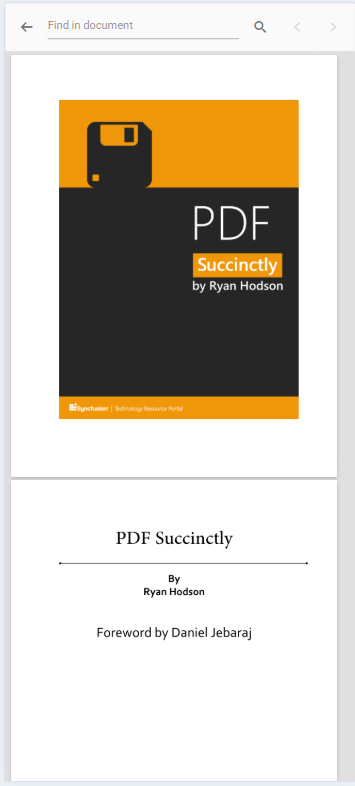

# Mobile Toolbar Interface in Angular PDF Viewer component

The Mobile PDF Viewer offers features for viewing, searching, annotating, and managing PDF documents on mobile devices. It includes Essential&reg; tools such as search, download, bookmarking, annotation, and page organization. Desktop toolbar features can also be enabled in mobile mode to provide a more extensive set of actions.

## Mobile mode toolbar configuration
In mobile mode, the toolbar is optimized for small screens and presents the most common actions for interacting with a PDF document. The key features available in mobile mode include:

### Main toolbar options

**OpenOption:** Load a PDF document.

**SearchOption:** Open the search bar to find text within the document.

**UndoRedoTool:** Undo or redo annotations.

**OrganizePagesTool:** Enable or disable page organization features to modify document pages.

**AnnotationEditTool:** Enable or disable annotation editing to add or modify annotations.

N> In mobile mode, the annotation toolbar is conveniently displayed at the bottom of the viewer.

### More options menu
Opening the "More options" menu displays additional actions such as:

**DownloadOption:** Download the currently opened PDF document.

**BookmarkOption:** View bookmarks within the document.

## Enable desktop mode on mobile

Enable the desktop version of the toolbar on mobile devices using the `enableDesktopMode` API. This provides access to additional toolbar actions that are typically available on desktop platforms.

### Steps to enable desktop mode

**Step 1:** Set `enableDesktopMode` to true in the API configuration.

**Step 2:** The mobile toolbar is replaced with the desktop toolbar layout, allowing access to more actions and controls.




import { Component, OnInit } from '@angular/core';
import { LinkAnnotationService, BookmarkViewService,
         MagnificationService, ThumbnailViewService, ToolbarService,
         NavigationService, TextSearchService, TextSelectionService,
         PrintService, FormDesignerService, FormFieldsService,
         AnnotationService, PageOrganizerService } from '@syncfusion/ej2-angular-pdfviewer';

@Component({
  selector: 'app-root',
  // specifies the template string for the PDF Viewer component
  template: `

  <ejs-pdfviewer
    id="pdfViewer"
    [documentPath]='document'
    [resourceUrl]='resource'
    [enableDesktopMode]=true
    style="height:640px;display:block">
  </ejs-pdfviewer>

`,
  providers: [ LinkAnnotationService, BookmarkViewService, MagnificationService,
               ThumbnailViewService, ToolbarService, NavigationService,
               TextSearchService, TextSelectionService, PrintService,
               AnnotationService, FormDesignerService, FormFieldsService, PageOrganizerService]
})
export class AppComponent implements OnInit {
    public document = 'https://cdn.syncfusion.com/content/pdf/pdf-succinctly.pdf';
    public resource: string = "https://cdn.syncfusion.com/ej2/25.1.35/dist/ej2-pdfviewer-lib";

    ngOnInit(): void {
    }
}




import { Component, OnInit } from '@angular/core';
import { LinkAnnotationService, BookmarkViewService,
         MagnificationService, ThumbnailViewService, ToolbarService,
         NavigationService, TextSearchService, TextSelectionService,
         PrintService, FormDesignerService, FormFieldsService,
         AnnotationService, PageOrganizerService } from '@syncfusion/ej2-angular-pdfviewer';

@Component({
  selector: 'app-root',
  // specifies the template string for the PDF Viewer component
  template: `

  <ejs-pdfviewer
    id="pdfViewer"
    [documentPath]='document'
    [serviceUrl]='service'
    [enableDesktopMode]=true
    style="height:640px;display:block">
  </ejs-pdfviewer>

`,
  providers: [ LinkAnnotationService, BookmarkViewService, MagnificationService,
               ThumbnailViewService, ToolbarService, NavigationService,
               TextSearchService, TextSelectionService, PrintService,
               AnnotationService, FormDesignerService, FormFieldsService, PageOrganizerService]
})
export class AppComponent implements OnInit {
    public document = 'https://cdn.syncfusion.com/content/pdf/pdf-succinctly.pdf';
    public service: string = 'https://document.syncfusion.com/web-services/pdf-viewer/api/pdfviewer';
    ngOnInit(): void {
    }
}



## Enable scrolling in desktop mode with touch gestures

To ensure smooth scrolling of PDF documents on a mobile device in desktop mode, enable touch gesture scrolling by setting the `enableTextSelection` option to **false**.




import { Component, OnInit } from '@angular/core';
import { LinkAnnotationService, BookmarkViewService,
         MagnificationService, ThumbnailViewService, ToolbarService,
         NavigationService, TextSearchService, TextSelectionService,
         PrintService, FormDesignerService, FormFieldsService,
         AnnotationService, PageOrganizerService } from '@syncfusion/ej2-angular-pdfviewer';

@Component({
  selector: 'app-root',
  // specifies the template string for the PDF Viewer component
  template: `

  <ejs-pdfviewer
    id="pdfViewer"
    [documentPath]='document'
    [resourceUrl]='resource'
    [enableDesktopMode]=true
    [enableTextSelection]=false
    style="height:640px;display:block">
  </ejs-pdfviewer>

`,
  providers: [ LinkAnnotationService, BookmarkViewService, MagnificationService,
               ThumbnailViewService, ToolbarService, NavigationService,
               TextSearchService, TextSelectionService, PrintService,
               AnnotationService, FormDesignerService, FormFieldsService, PageOrganizerService]
})
export class AppComponent implements OnInit {
    public document = 'https://cdn.syncfusion.com/content/pdf/pdf-succinctly.pdf';
    public resource: string = "https://cdn.syncfusion.com/ej2/25.1.35/dist/ej2-pdfviewer-lib";

    ngOnInit(): void {
    }
}




import { Component, OnInit } from '@angular/core';
import { LinkAnnotationService, BookmarkViewService,
         MagnificationService, ThumbnailViewService, ToolbarService,
         NavigationService, TextSearchService, TextSelectionService,
         PrintService, FormDesignerService, FormFieldsService,
         AnnotationService, PageOrganizerService } from '@syncfusion/ej2-angular-pdfviewer';

@Component({
  selector: 'app-root',
  // specifies the template string for the PDF Viewer component
  template: `

  <ejs-pdfviewer
    id="pdfViewer"
    [documentPath]='document'
    [serviceUrl]='service'
    [enableDesktopMode]=true
    [enableTextSelection]=false
    style="height:640px;display:block">
  </ejs-pdfviewer>

`,
  providers: [ LinkAnnotationService, BookmarkViewService, MagnificationService,
               ThumbnailViewService, ToolbarService, NavigationService,
               TextSearchService, TextSelectionService, PrintService,
               AnnotationService, FormDesignerService, FormFieldsService, PageOrganizerService]
})
export class AppComponent implements OnInit {
    public document = 'https://cdn.syncfusion.com/content/pdf/pdf-succinctly.pdf';
    public service: string = 'https://document.syncfusion.com/web-services/pdf-viewer/api/pdfviewer';
    ngOnInit(): void {
    }
}



## Print option not available

The Print option is not available in mobile mode by default. To use printing on mobile devices, enable the desktop toolbar using the `enableDesktopMode` API.

### How to Use Print on Mobile:

**Enable desktop mode:** Set `enableDesktopMode` to true to load the desktop version of the toolbar on a mobile device.

**Print option:** After enabling desktop mode, the print option becomes available, allowing the document to be printed directly from a mobile device.

N> In mobile mode, the print functionality will not be available unless desktop mode is enabled.