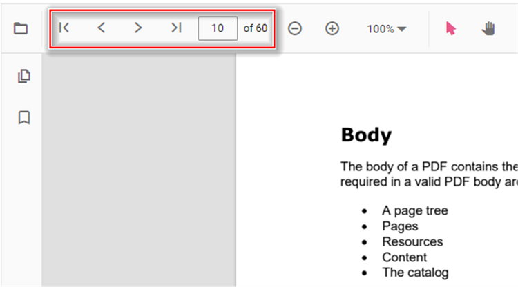
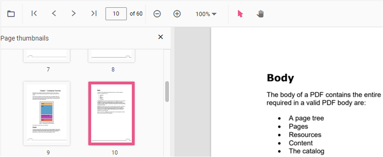
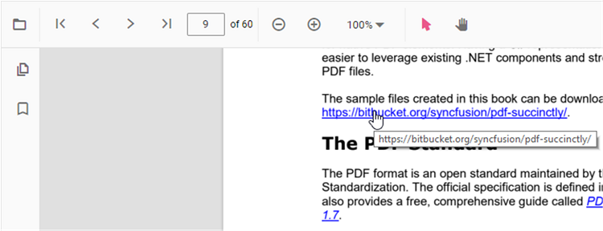
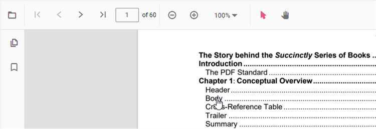
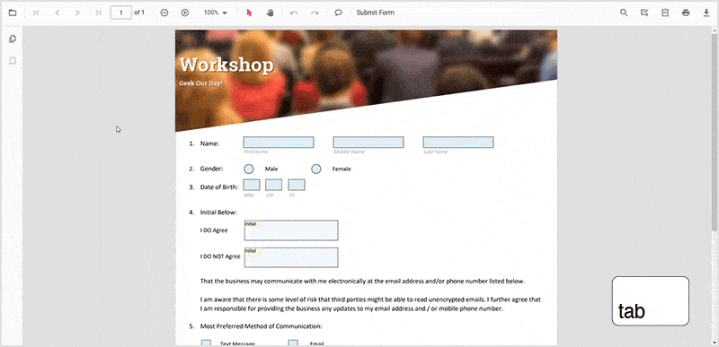
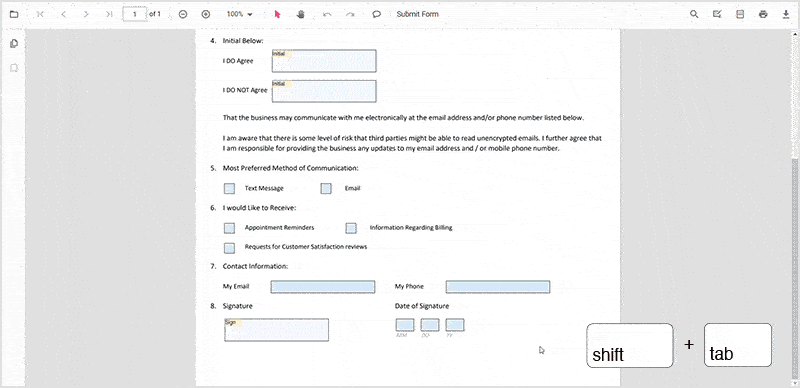

# Navigation in Angular PDF Viewer component

The ASP.NET Core PDF Viewer supports different internal and external navigations.

## Toolbar page navigation option

The default toolbar of PDF Viewer contains the following navigation options

* **Go to page**:- Navigates to the specific page of a PDF document.
* **Show next page**:- Navigates to the next page of PDF a document.
* **Show previous page**:- Navigates to the previous page of a PDF document.
* **Show first page**:-  Navigates to the first page of a PDF document.
* **Show last page**:- Navigates to the last page of a PDF document.

You can enable/disable page navigation option in PDF Viewer using the following code snippet.,




import { Component, OnInit } from '@angular/core';
import { LinkAnnotationService, BookmarkViewService, MagnificationService,
         ThumbnailViewService, ToolbarService,  NavigationService,
         TextSearchService, AnnotationService, TextSelectionService,
         PrintService
       } from '@syncfusion/ej2-angular-pdfviewer';

@Component({
  selector: 'app-container',
  // specifies the template string for the PDF Viewer component
  template: `

                <ejs-pdfviewer id="pdfViewer"
                          [documentPath]='document'
                          [enableNavigation]='true'
                          style="height:640px;display:block">
                </ejs-pdfviewer>
              
`,
  providers: [ LinkAnnotationService, BookmarkViewService, MagnificationService,
               ThumbnailViewService, ToolbarService, NavigationService,
               AnnotationService, TextSearchService, TextSelectionService,
               PrintService]
  })
  export class AppComponent implements OnInit {
      public document = 'https://cdn.syncfusion.com/content/pdf/pdf-succinctly.pdf';
  }





import { Component, OnInit } from '@angular/core';
import { LinkAnnotationService, BookmarkViewService, MagnificationService,
         ThumbnailViewService, ToolbarService,  NavigationService,
         TextSearchService, AnnotationService, TextSelectionService,
         PrintService
       } from '@syncfusion/ej2-angular-pdfviewer';

@Component({
  selector: 'app-container',
  // specifies the template string for the PDF Viewer component
  template: `

                <ejs-pdfviewer id="pdfViewer"
                          [serviceUrl]='service'
                          [documentPath]='document'
                          [enableNavigation]='true'
                          style="height:640px;display:block">
                </ejs-pdfviewer>
              
`,
  providers: [ LinkAnnotationService, BookmarkViewService, MagnificationService,
               ThumbnailViewService, ToolbarService, NavigationService,
               AnnotationService, TextSearchService, TextSelectionService,
               PrintService]
  })
  export class AppComponent implements OnInit {
      public service = 'https://document.syncfusion.com/web-services/pdf-viewer/api/pdfviewer';
      public document = 'https://cdn.syncfusion.com/content/pdf/pdf-succinctly.pdf';
  }




## Bookmark navigation

The Bookmarks saved in PDF files are loaded and made ready for easy navigation.
You can enable/disable bookmark navigation by using the following code snippet.,




import { Component, OnInit } from '@angular/core';
import { LinkAnnotationService, BookmarkViewService, MagnificationService,
         ThumbnailViewService,ToolbarService, NavigationService,
         TextSearchService, AnnotationService, TextSelectionService,
         PrintService
       } from '@syncfusion/ej2-angular-pdfviewer';

@Component({
  selector: 'app-container',
  // specifies the template string for the PDF Viewer component
  template: `

                <ejs-pdfviewer id="pdfViewer"
                            [documentPath]='document'
                            [enableBookmark]='true'
                            style="height:640px;display:block">
                </ejs-pdfviewer>
            
`,
  providers: [ LinkAnnotationService, BookmarkViewService, MagnificationService,
               ThumbnailViewService, ToolbarService, NavigationService,
               AnnotationService, TextSearchService, TextSelectionService,
               PrintService]
})
export class AppComponent implements OnInit {
  public document = 'https://cdn.syncfusion.com/content/pdf/pdf-succinctly.pdf';
}





import { Component, OnInit } from '@angular/core';
import { LinkAnnotationService, BookmarkViewService, MagnificationService,
         ThumbnailViewService,ToolbarService, NavigationService,
         TextSearchService, AnnotationService, TextSelectionService,
         PrintService
       } from '@syncfusion/ej2-angular-pdfviewer';

@Component({
  selector: 'app-container',
  // specifies the template string for the PDF Viewer component
  template: `

                <ejs-pdfviewer id="pdfViewer"
                            [serviceUrl]='service'
                            [documentPath]='document'
                            [enableBookmark]='true'
                            style="height:640px;display:block">
                </ejs-pdfviewer>
            
`,
  providers: [ LinkAnnotationService, BookmarkViewService, MagnificationService,
               ThumbnailViewService, ToolbarService, NavigationService,
               AnnotationService, TextSearchService, TextSelectionService,
               PrintService]
})
export class AppComponent implements OnInit {
  public service = 'https://document.syncfusion.com/web-services/pdf-viewer/api/pdfviewer';
  public document = 'https://cdn.syncfusion.com/content/pdf/pdf-succinctly.pdf';
}




## Thumbnail navigation

Thumbnails is the miniature representation of actual pages in PDF files. This feature displays thumbnails of the pages and allows navigation.
You can enable/disable thumbnail navigation by using the following code snippet.,




import { Component, OnInit } from '@angular/core';
import { LinkAnnotationService, BookmarkViewService, MagnificationService,
         ThumbnailViewService, ToolbarService, NavigationService,
         TextSearchService, AnnotationService, TextSelectionService,
         PrintService
       } from '@syncfusion/ej2-angular-pdfviewer';
@Component({
  selector: 'app-container',
  // specifies the template string for the PDF Viewer component
  template: `

                <ejs-pdfviewer id="pdfViewer"
                            [documentPath]='document'
                            [enableThumbnail]='true'
                            style="height:640px;display:block">
                </ejs-pdfviewer>
            
`,
  providers: [ LinkAnnotationService, BookmarkViewService, MagnificationService,
               ThumbnailViewService, ToolbarService, NavigationService,
               AnnotationService,TextSearchService,TextSelectionService,
               PrintService]
  })
  export class AppComponent implements OnInit {
      public document = 'https://cdn.syncfusion.com/content/pdf/pdf-succinctly.pdf';
  }





import { Component, OnInit } from '@angular/core';
import { LinkAnnotationService, BookmarkViewService, MagnificationService,
         ThumbnailViewService, ToolbarService, NavigationService,
         TextSearchService, AnnotationService, TextSelectionService,
         PrintService
       } from '@syncfusion/ej2-angular-pdfviewer';
@Component({
  selector: 'app-container',
  // specifies the template string for the PDF Viewer component
  template: `

                <ejs-pdfviewer id="pdfViewer"
                            [serviceUrl]='service'
                            [documentPath]='document'
                            [enableThumbnail]='true'
                            style="height:640px;display:block">
                </ejs-pdfviewer>
            
`,
  providers: [ LinkAnnotationService, BookmarkViewService, MagnificationService,
               ThumbnailViewService, ToolbarService, NavigationService,
               AnnotationService,TextSearchService,TextSelectionService,
               PrintService]
  })
  export class AppComponent implements OnInit {
      public service = 'https://document.syncfusion.com/web-services/pdf-viewer/api/pdfviewer';
      public document = 'https://cdn.syncfusion.com/content/pdf/pdf-succinctly.pdf';
  }




## Hyperlink navigation

Hyperlink navigation features enables navigation to the URLs (website links) in a PDF file.

## Table of content navigation

Table of contents navigation allows users to navigate to different parts of a PDF file that are listed in the table of contents section.

You can enable/disable link navigation by using the following code snippet.,




  import { Component, OnInit } from '@angular/core';
  import { LinkAnnotationService,BookmarkViewService, MagnificationService,
           ThumbnailViewService, ToolbarService, NavigationService,
           TextSearchService, AnnotationService, TextSelectionService,
           PrintService
         } from '@syncfusion/ej2-angular-pdfviewer';
  @Component({
    selector: 'app-container',
    // specifies the template string for the PDF Viewer component
    template: `

                 <ejs-pdfviewer id="pdfViewer"
                         [documentPath]='document'
                         [enableHyperlink]='true'
                         style="height:640px;display:block">
                 </ejs-pdfviewer>
               
`,
    providers: [ LinkAnnotationService, BookmarkViewService, MagnificationService,
                 ThumbnailViewService, ToolbarService, NavigationService,
                 AnnotationService, TextSearchService, TextSelectionService,
                 PrintService]
    })
    export class AppComponent implements OnInit {
      public document = 'https://cdn.syncfusion.com/content/pdf/pdf-succinctly.pdf';
    }





  import { Component, OnInit } from '@angular/core';
  import { LinkAnnotationService,BookmarkViewService, MagnificationService,
           ThumbnailViewService, ToolbarService, NavigationService,
           TextSearchService, AnnotationService, TextSelectionService,
           PrintService
         } from '@syncfusion/ej2-angular-pdfviewer';
  @Component({
    selector: 'app-container',
    // specifies the template string for the PDF Viewer component
    template: `

                 <ejs-pdfviewer id="pdfViewer"
                         [serviceUrl]='service'
                         [documentPath]='document'
                         [enableHyperlink]='true'
                         style="height:640px;display:block">
                 </ejs-pdfviewer>
               
`,
    providers: [ LinkAnnotationService, BookmarkViewService, MagnificationService,
                 ThumbnailViewService, ToolbarService, NavigationService,
                 AnnotationService, TextSearchService, TextSelectionService,
                 PrintService]
    })
    export class AppComponent implements OnInit {
      public service = 'https://document.syncfusion.com/web-services/pdf-viewer/api/pdfviewer';
      public document = 'https://cdn.syncfusion.com/content/pdf/pdf-succinctly.pdf';
    }




You can change the open state of the hyperlink in the PDF Viewer by using the following code snippet,




import { Component, OnInit } from '@angular/core';
import { LinkAnnotationService, BookmarkViewService, MagnificationService,
         ThumbnailViewService, ToolbarService, NavigationService,
         TextSearchService, AnnotationService, TextSelectionService,
         PrintService
       } from '@syncfusion/ej2-angular-pdfviewer';
@Component({
  selector: 'app-container',
  // specifies the template string for the PDF Viewer component
  template: `

                <ejs-pdfviewer id="pdfViewer"
                              [documentPath]='document'
                              [hyperlinkOpenState]='linkOpenState'
                              style="height:640px;display:block">
                </ejs-pdfviewer>
              
`,
  providers: [ LinkAnnotationService, BookmarkViewService, MagnificationService,
               ThumbnailViewService, ToolbarService, NavigationService,
               AnnotationService, TextSearchService, TextSelectionService,
               PrintService]
  })
  export class AppComponent implements OnInit {
      public document = 'https://cdn.syncfusion.com/content/pdf/pdf-succinctly.pdf';
      public linkOpenState = 'NewTab';
  }





import { Component, OnInit } from '@angular/core';
import { LinkAnnotationService, BookmarkViewService, MagnificationService,
         ThumbnailViewService, ToolbarService, NavigationService,
         TextSearchService, AnnotationService, TextSelectionService,
         PrintService
       } from '@syncfusion/ej2-angular-pdfviewer';
@Component({
  selector: 'app-container',
  // specifies the template string for the PDF Viewer component
  template: `

                <ejs-pdfviewer id="pdfViewer"
                              [serviceUrl]='service'
                              [documentPath]='document'
                              [hyperlinkOpenState]='linkOpenState'
                              style="height:640px;display:block">
                </ejs-pdfviewer>
              
`,
  providers: [ LinkAnnotationService, BookmarkViewService, MagnificationService,
               ThumbnailViewService, ToolbarService, NavigationService,
               AnnotationService, TextSearchService, TextSelectionService,
               PrintService]
  })
  export class AppComponent implements OnInit {
      public service = 'https://document.syncfusion.com/web-services/pdf-viewer/api/pdfviewer';
      public document = 'https://cdn.syncfusion.com/content/pdf/pdf-succinctly.pdf';
      public linkOpenState = 'NewTab';
  }




## Keyboard navigation with Tab and Shift+Tab keys

The Syncfusion&reg; PDF Viewer component supports keyboard navigation for the form fields in a PDF document using the `Tab` and `Shift+Tab` keys. This allows users to easily navigate through the form fields in a PDF document, making it easier for them to fill out forms.

Here's how it works:

Pressing the `Tab` key will move the focus to the `next formfield` in the document.

Pressing `Shift+Tab` will move the focus to the `previous formfield` in the document.

N> The order of the form fields is determined by the order in which they appear in a PDF document.

## See also

* [Toolbar items](./toolbar)
* [Feature Modules](./feature-module)