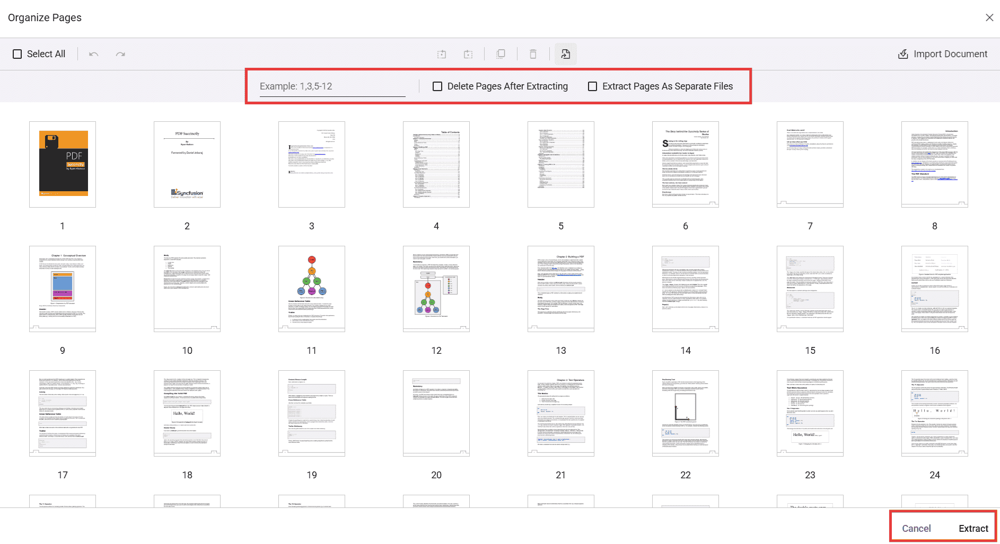
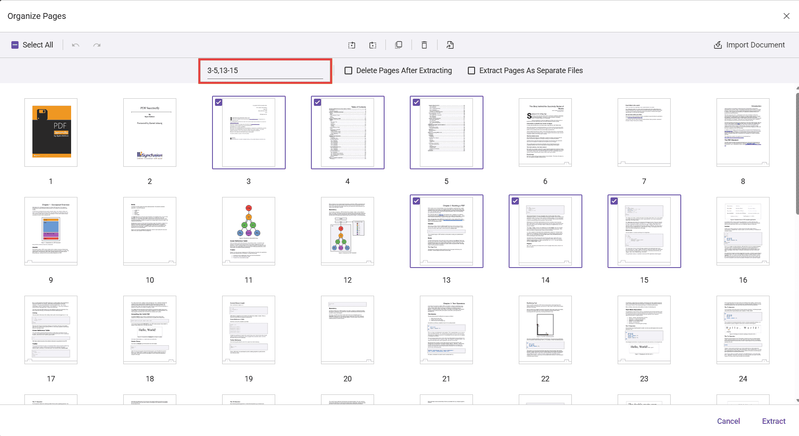
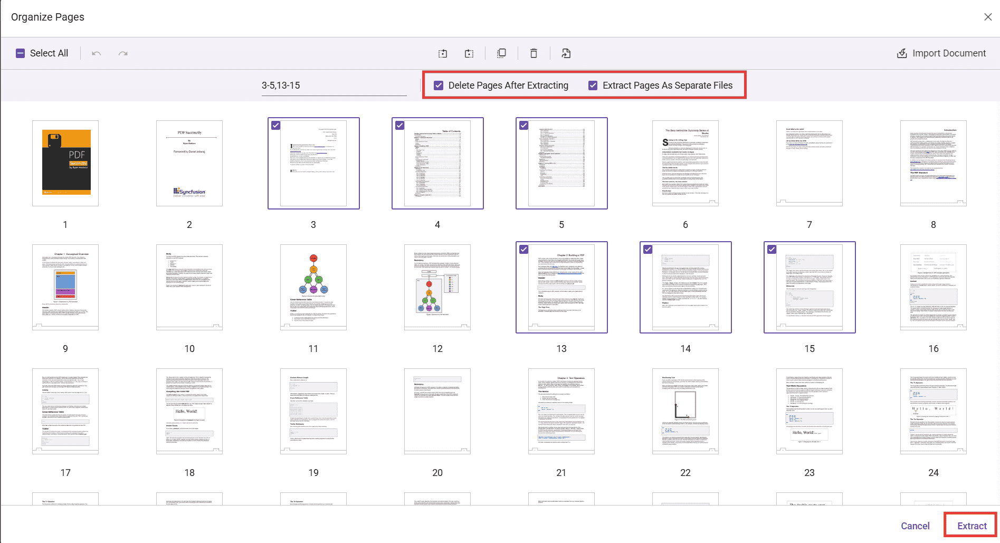

# Extract pages in Angular PDF Viewer

The PDF Viewer component provides an Extract Pages tool in the Organize Pages UI to export selected pages as a new PDF file. The Extract Pages tool is enabled by default.

## Extract Pages in Organize Pages

- Open the Organize Pages panel in the PDF Viewer toolbar.
- Locate and click the Extract Pages option.

When selected, a secondary toolbar dedicated to extraction is displayed.

## Extract pages using the UI

You can extract by typing page numbers/ranges or by selecting thumbnails.

1. Click Extract Pages in the Organize Pages panel.
2. In the input box, enter pages to extract. Supported formats:
  - Single pages: 1,3,5
  - Ranges: 2-6
  - Combinations: 1,4,7-9
3. Alternatively, select the page thumbnails to extract instead of typing values.
4. Click Extract to download the selected pages as a new PDF; click Cancel to close the tool.

Note: Page numbers are 1-based (the first page is 1). Invalid or out-of-range entries are ignored; only valid pages are processed. Consider validating input before extraction to ensure expected results.

## Extraction options (checkboxes)

The secondary toolbar provides two options:

- **Delete Pages After Extracting** — When enabled, the selected pages are removed from the currently loaded document after extraction; the extracted pages are still downloaded as a separate PDF.

- **Extract Pages As Separate Files** — When enabled, each selected page is exported as an individual PDF (for example, selecting pages 3, 5, and 6 downloads 3.pdf, 5.pdf, and 6.pdf).

## Programmatic options and APIs

You can control the Extract Pages experience via settings and invoke extraction through code.

### Enable/disable or show/hide Extract Pages

Use the `canExtractPages` API to enable or disable the Extract Pages option. When set to `false`, the Extract Pages tool is disabled in the toolbar. The default value is `true`.

Use the following code snippet to enable or disable the Extract Pages option:




import { Component, OnInit } from '@angular/core';
import {
  PdfViewerModule,
  LinkAnnotationService,
  BookmarkViewService,
  MagnificationService,
  ThumbnailViewService,
  ToolbarService,
  NavigationService,
  AnnotationService,
  TextSearchService,
  TextSelectionService,
  PrintService,
  FormFieldsService,
  FormDesignerService,
  PageOrganizerService,
} from '@syncfusion/ej2-angular-pdfviewer';

@Component({
  selector: 'app-root',
  standalone: true,
  imports: [PdfViewerModule],
  providers: [
    LinkAnnotationService,
    BookmarkViewService,
    MagnificationService,
    ThumbnailViewService,
    ToolbarService,
    NavigationService,
    AnnotationService,
    TextSearchService,
    TextSelectionService,
    PrintService,
    FormFieldsService,
    FormDesignerService,
    PageOrganizerService,
  ],
  template: `
    

      <ejs-pdfviewer 
        id="pdfViewer"
        [resourceUrl]="resourceUrl"
        [documentPath]="document"
        [pageOrganizerSettings]="{ canExtractPages: false }"
        style="height: 640px; display: block;">
      </ejs-pdfviewer>
    

  `,
})
export class AppComponent implements OnInit {
  public document: string = 'https://cdn.syncfusion.com/content/pdf/pdf-succinctly.pdf';
  public resourceUrl: string = 'https://cdn.syncfusion.com/ej2/31.1.23/dist/ej2-pdfviewer-lib';
  ngOnInit(): void { }
}




Use the `showExtractPagesOption` API to show or hide the Extract Pages option. When set to `false`, the Extract Pages tool is removed from the toolbar. The default value is `true`.

Use the following code snippet to remove the Extract Pages option:




import { Component, OnInit } from '@angular/core';
import {
  PdfViewerModule,
  LinkAnnotationService,
  BookmarkViewService,
  MagnificationService,
  ThumbnailViewService,
  ToolbarService,
  NavigationService,
  AnnotationService,
  TextSearchService,
  TextSelectionService,
  PrintService,
  FormFieldsService,
  FormDesignerService,
  PageOrganizerService,
} from '@syncfusion/ej2-angular-pdfviewer';

@Component({
  selector: 'app-root',
  standalone: true,
  imports: [PdfViewerModule],
  providers: [
    LinkAnnotationService,
    BookmarkViewService,
    MagnificationService,
    ThumbnailViewService,
    ToolbarService,
    NavigationService,
    AnnotationService,
    TextSearchService,
    TextSelectionService,
    PrintService,
    FormFieldsService,
    FormDesignerService,
    PageOrganizerService,
  ],
  template: `
    

      <ejs-pdfviewer 
        id="pdfViewer"
        [resourceUrl]="resourceUrl"
        [documentPath]="document"
        [pageOrganizerSettings]="{ showExtractPagesOption: false }"
        style="height: 640px; display: block;">
      </ejs-pdfviewer>
    

  `,
})
export class AppComponent implements OnInit {
  public document: string = 'https://cdn.syncfusion.com/content/pdf/pdf-succinctly.pdf';
  public resourceUrl: string = 'https://cdn.syncfusion.com/ej2/31.1.23/dist/ej2-pdfviewer-lib';
  ngOnInit(): void { }
}




### Extract pages and load the result programmatically

You can extract pages programmatically using the `extractPages` method.
The following example extracts pages 1 and 2, then immediately loads the extracted pages back into the viewer. The returned value is a byte array (e.g., Uint8Array) representing the PDF file contents.




import { Component, ViewChild, OnInit } from '@angular/core';
import {
  PdfViewerComponent,
  PdfViewerModule,
  LinkAnnotationService,
  BookmarkViewService,
  MagnificationService,
  ThumbnailViewService,
  ToolbarService,
  NavigationService,
  TextSearchService,
  TextSelectionService,
  PrintService,
  AnnotationService,
  FormFieldsService,
  FormDesignerService,
  PageOrganizerService,
} from '@syncfusion/ej2-angular-pdfviewer';

@Component({
  selector: 'app-root',
  standalone: true,
  imports: [PdfViewerModule],
  providers: [
    LinkAnnotationService,
    BookmarkViewService,
    MagnificationService,
    ThumbnailViewService,
    ToolbarService,
    NavigationService,
    TextSearchService,
    TextSelectionService,
    PrintService,
    AnnotationService,
    FormFieldsService,
    FormDesignerService,
    PageOrganizerService,
  ],
  template: `
    

      <button (click)="onExtract()">Extract Pages</button>
      <ejs-pdfviewer 
        #pdfviewer
        id="pdfViewer"
        [resourceUrl]="resourceUrl"
        [documentPath]="document"
        [pageOrganizerSettings]="{ showExtractPagesOption: true }"
        style="height: 640px; display: block;">
      </ejs-pdfviewer>
    

  `,
})
export class AppComponent implements OnInit {
  @ViewChild('pdfviewer')
  public pdfviewerControl!: PdfViewerComponent;

  public document: string = 'https://cdn.syncfusion.com/content/pdf/pdf-succinctly.pdf';
  public resourceUrl: string = 'https://cdn.syncfusion.com/ej2/31.1.23/dist/ej2-pdfviewer-lib';
  ngOnInit(): void { }

  onExtract() {
    // Extract pages 1 and 2
    const array = (this.pdfviewerControl as any).extractPages('1,2');
    // Load the extracted pages back into the viewer
    (this.pdfviewerControl as any).load(array, "");
    console.log(array);
  }
}




[View sample in GitHub](https://github.com/SyncfusionExamples/angular-pdf-viewer-examples/tree/master/How%20to)

## See also

- [Overview](../overview)
- [UI interactions](../ui-interactions)
- [Programmatic support](../programmatic-support)
- [Toolbar](../toolbar)
- [Events](../events)
- [Mobile view](../mobile-view)
