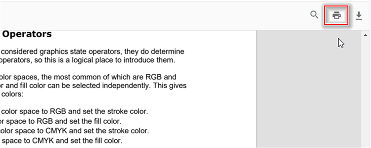

# Print in Angular PDF Viewer component

The PDF Viewer supports printing loaded PDF files. Enable printing by setting the `enablePrint` property, as shown in the examples below.




import { Component, OnInit } from '@angular/core';
import { LinkAnnotationService, BookmarkViewService, MagnificationService,
         ThumbnailViewService, ToolbarService, NavigationService,
         TextSearchService, AnnotationService, TextSelectionService,
         PrintService
       } from '@syncfusion/ej2-angular-pdfviewer';
@Component({
  selector: 'app-container',
  // specifies the template string for the PDF Viewer component
  template: `<div class="content-wrapper">
                  <ejs-pdfviewer id="pdfViewer"
                            [documentPath]='document'
                            [enablePrint]='true'
                            style="height:640px;display:block">
                  </ejs-pdfviewer>
              </div>`,
  providers: [ LinkAnnotationService, BookmarkViewService, MagnificationService,
               ThumbnailViewService, ToolbarService, NavigationService,
               AnnotationService, TextSearchService, TextSelectionService,
               PrintService]
  })
  export class AppComponent implements OnInit {
    public document = 'https://cdn.syncfusion.com/content/pdf/pdf-succinctly.pdf';
  }





import { Component, OnInit } from '@angular/core';
import { LinkAnnotationService, BookmarkViewService, MagnificationService,
         ThumbnailViewService, ToolbarService, NavigationService,
         TextSearchService, AnnotationService, TextSelectionService,
         PrintService
       } from '@syncfusion/ej2-angular-pdfviewer';
@Component({
  selector: 'app-container',
  // specifies the template string for the PDF Viewer component
  template: `<div class="content-wrapper">
                  <ejs-pdfviewer id="pdfViewer"
                            [serviceUrl]='service'
                            [documentPath]='document'
                            [enablePrint]='true'
                            style="height:640px;display:block">
                  </ejs-pdfviewer>
              </div>`,
  providers: [ LinkAnnotationService, BookmarkViewService, MagnificationService,
               ThumbnailViewService, ToolbarService, NavigationService,
               AnnotationService, TextSearchService, TextSelectionService,
               PrintService]
  })
  export class AppComponent implements OnInit {
    public service = 'https://document.syncfusion.com/web-services/pdf-viewer/api/pdfviewer';
    public document = 'https://cdn.syncfusion.com/content/pdf/pdf-succinctly.pdf';
  }






Invoke the print action using the following snippet.

```html
<script>
    window.onload = function () {
        var pdfViewer = document.getElementById('pdfviewer').ej2_instances[0];
        pdfViewer.print.print();
    }
</script>

```

## Print the PDF document in the new window.

The PDF Viewer supports printing loaded PDF files directly in the browser. Use the [printMode](https://ej2.syncfusion.com/angular/documentation/api/pdfviewer/printMode/) parameter to select the printing mode; set it to [NewWindow](https://ej2.syncfusion.com/angular/documentation/api/pdfviewer/printMode/) to open print output in a separate browser window. Below is a code snippet demonstrating how to configure this option.




import { Component, OnInit } from '@angular/core';
import { LinkAnnotationService, BookmarkViewService, MagnificationService,
         ThumbnailViewService, ToolbarService, NavigationService,
         TextSearchService, AnnotationService, TextSelectionService,
         PrintService
       } from '@syncfusion/ej2-angular-pdfviewer';
@Component({
  selector: 'app-container',
  // specifies the template string for the PDF Viewer component
  template: `<div class="content-wrapper">
                  <ejs-pdfviewer id="pdfViewer"
                            [documentPath]='document'
                            [printMode] = "printMode"
                            style="height:640px;display:block">
                  </ejs-pdfviewer>
              </div>`,
  providers: [ LinkAnnotationService, BookmarkViewService, MagnificationService,
               ThumbnailViewService, ToolbarService, NavigationService,
               AnnotationService, TextSearchService, TextSelectionService,
               PrintService]
  })
  export class AppComponent implements OnInit {
    public document: string = 'https://cdn.syncfusion.com/content/pdf/pdf-succinctly.pdf';
    public resource: string = "https://cdn.syncfusion.com/ej2/23.1.43/dist/ej2-pdfviewer-lib";
    public printMode: string = "NewWindow";
  }





import { Component, OnInit } from '@angular/core';
import { LinkAnnotationService, BookmarkViewService, MagnificationService,
         ThumbnailViewService, ToolbarService, NavigationService,
         TextSearchService, AnnotationService, TextSelectionService,
         PrintService
       } from '@syncfusion/ej2-angular-pdfviewer';
@Component({
  selector: 'app-container',
  // specifies the template string for the PDF Viewer component
  template: `<div class="content-wrapper">
                  <ejs-pdfviewer id="pdfViewer"
                            [serviceUrl]='service'
                            [documentPath]='document'
                            [printMode] = "printMode"
                            style="height:640px;display:block">
                  </ejs-pdfviewer>
              </div>`,
  providers: [ LinkAnnotationService, BookmarkViewService, MagnificationService,
               ThumbnailViewService, ToolbarService, NavigationService,
               AnnotationService, TextSearchService, TextSelectionService,
               PrintService]
  })
  export class AppComponent implements OnInit {
    public service = 'https://document.syncfusion.com/web-services/pdf-viewer/api/pdfviewer';
    public document = 'https://cdn.syncfusion.com/content/pdf/pdf-succinctly.pdf';
    public printMode: string = "NewWindow";
  }




Setting `printMode` to `NewWindow` opens a separate window for printing the PDF document.

## Limiting the Dialog Opening for Printing

The Syncfusion<sup style="font-size:70%">&reg;</sup> PDF Viewer raises the [printStart](https://ej2.syncfusion.com/angular/documentation/api/pdfviewer/printStartEventArgs/) event before printing begins. Use this event to customize printing behavior—for example, to prevent the browser print dialog from opening. Below is a code snippet demonstrating this.




import { Component, OnInit } from '@angular/core';
import { LinkAnnotationService, BookmarkViewService, MagnificationService,
         ThumbnailViewService, ToolbarService, NavigationService,
         TextSearchService, PrintStartEventArgs, AnnotationService, TextSelectionService,
         PrintService
       } from '@syncfusion/ej2-angular-pdfviewer';
@Component({
  selector: 'app-container',
  // specifies the template string for the PDF Viewer component
  template: `<div class="content-wrapper">
                  <ejs-pdfviewer id="pdfViewer"
                            [documentPath]='document'
                            (printStart)="printStart($event)"
                            style="height:640px;display:block">
                  </ejs-pdfviewer>
              </div>`,
  providers: [ LinkAnnotationService, BookmarkViewService, MagnificationService,
               ThumbnailViewService, ToolbarService, NavigationService,
               AnnotationService, TextSearchService, TextSelectionService,
               PrintService]
  })
  export class AppComponent implements OnInit {
    public document: string = 'https://cdn.syncfusion.com/content/pdf/pdf-succinctly.pdf';
    public resource: string = "https://cdn.syncfusion.com/ej2/23.1.43/dist/ej2-pdfviewer-lib";
    ngOnInit(): void {
    }
    printStart(args: PrintStartEventArgs){
      console.log(args);
      args.cancel = true;
    }
}





import { Component, OnInit } from '@angular/core';
import { LinkAnnotationService, BookmarkViewService, MagnificationService,
         ThumbnailViewService, ToolbarService, NavigationService,
         TextSearchService, PrintStartEventArgs, AnnotationService, TextSelectionService,
         PrintService
       } from '@syncfusion/ej2-angular-pdfviewer';
@Component({
  selector: 'app-container',
  // specifies the template string for the PDF Viewer component
  template: `<div class="content-wrapper">
                  <ejs-pdfviewer id="pdfViewer"
                            [serviceUrl]='service'
                            [documentPath]='document'
                            (printStart)="printStart($event)"
                            style="height:640px;display:block">
                  </ejs-pdfviewer>
              </div>`,
  providers: [ LinkAnnotationService, BookmarkViewService, MagnificationService,
               ThumbnailViewService, ToolbarService, NavigationService,
               AnnotationService, TextSearchService, TextSelectionService,
               PrintService]
  })
  export class AppComponent implements OnInit {
    public service = 'https://document.syncfusion.com/web-services/pdf-viewer/api/pdfviewer';
    public document = 'https://cdn.syncfusion.com/content/pdf/pdf-succinctly.pdf';

    ngOnInit(): void {
    }
    printStart(args: PrintStartEventArgs){
      console.log(args);
      args.cancel = true;
    }
}




In these examples, the `printStart` handler sets `args.cancel = true` to prevent the print dialog from opening. By default, the [cancel](https://ej2.syncfusion.com/angular/documentation/api/pdfviewer/printStartEventArgs/) property is `false`.

## Customizing Print Quality using printScaleFactor API

Adjust print quality with the [printScaleFactor](https://ej2.syncfusion.com/angular/documentation/api/pdfviewer/PrintScaleFactor/) API. Valid values are 0.5–5 (default is 1). Values below 0.5 or above 5 revert to standard quality. Increasing the value within this range improves print fidelity but can increase print time.




import { Component, OnInit } from '@angular/core';
import { LinkAnnotationService, BookmarkViewService, MagnificationService,
         ThumbnailViewService, ToolbarService, NavigationService,
         TextSearchService, AnnotationService, TextSelectionService,
         PrintService
       } from '@syncfusion/ej2-angular-pdfviewer';
@Component({
  selector: 'app-container',
  // specifies the template string for the PDF Viewer component
  template: `<div class="content-wrapper">
                  <ejs-pdfviewer id="pdfViewer"
                            [documentPath]='document'
                            [enablePrint]='true'
                            [printScaleFactor]='printScaleFactor'
                            style="height:640px;display:block">
                  </ejs-pdfviewer>
              </div>`,
  providers: [ LinkAnnotationService, BookmarkViewService, MagnificationService,
               ThumbnailViewService, ToolbarService, NavigationService,
               AnnotationService, TextSearchService, TextSelectionService,
               PrintService]
  })
  export class AppComponent implements OnInit {
    public document = 'https://cdn.syncfusion.com/content/pdf/pdf-succinctly.pdf';
    //pdf with low quality. By changing values you can change the quality of the pdf.
    public printScaleFactor = 0.5;
  }





import { Component, OnInit } from '@angular/core';
import { LinkAnnotationService, BookmarkViewService, MagnificationService,
         ThumbnailViewService, ToolbarService, NavigationService,
         TextSearchService, AnnotationService, TextSelectionService,
         PrintService
       } from '@syncfusion/ej2-angular-pdfviewer';
@Component({
  selector: 'app-container',
  // specifies the template string for the PDF Viewer component
  template: `<div class="content-wrapper">
                  <ejs-pdfviewer id="pdfViewer"
                            [serviceUrl]='service'
                            [documentPath]='document'
                            [printScaleFactor]='printScaleFactor'
                            [enablePrint]='true'
                            style="height:640px;display:block">
                  </ejs-pdfviewer>
              </div>`,
  providers: [ LinkAnnotationService, BookmarkViewService, MagnificationService,
               ThumbnailViewService, ToolbarService, NavigationService,
               AnnotationService, TextSearchService, TextSelectionService,
               PrintService]
  })
  export class AppComponent implements OnInit {
    public service = 'https://document.syncfusion.com/web-services/pdf-viewer/api/pdfviewer';
    public document = 'https://cdn.syncfusion.com/content/pdf/pdf-succinctly.pdf';
    //pdf with low quality. By changing values you can change the quality of the pdf.
  public printScaleFactor = 0.5;
  }




[View sample in GitHub](https://github.com/SyncfusionExamples/angular-pdf-viewer-examples/tree/master/How%20to/Customization%20%20Print%20Quality)

## See also

* [Toolbar items](./toolbar)
* [Feature Modules](./feature-module)