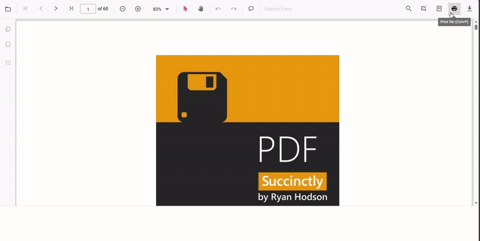

# Enable print rotation in Angular PDF Viewer

This guide shows how to enable automatic rotation of landscape pages during printing so they match the paper orientation and reduce clipping. Use [`enablePrintRotation`](https://ej2.syncfusion.com/angular/documentation/api/pdfviewer#enableprintrotation) when printing documents that include landscape pages and you want them rotated to match the printer paper orientation.

## Prerequisites

- The [`Print`](https://ej2.syncfusion.com/angular/documentation/api/pdfviewer/print) module must be injected into [`PdfViewerComponent`](https://ej2.syncfusion.com/angular/documentation/api/pdfviewer).

## Steps to enable print rotation

1. Inject the required modules (including [`Print`](https://ej2.syncfusion.com/angular/documentation/api/pdfviewer/print)) into [`PdfViewerComponent`](https://ej2.syncfusion.com/angular/documentation/api/pdfviewer).
2. Set [`enablePrintRotation`](https://ej2.syncfusion.com/angular/documentation/api/pdfviewer#enableprintrotation) to `true` in the PDF Viewer during initialization.

## Example



import { Component, ViewChild, OnInit } from '@angular/core';
import {
  PdfViewerComponent,
  PdfViewerModule,
  LinkAnnotationService,
  BookmarkViewService,
  MagnificationService,
  ThumbnailViewService,
  ToolbarService,
  NavigationService,
  TextSearchService,
  TextSelectionService,
  PrintService,
  AnnotationService,
  FormFieldsService,
  FormDesignerService,
  PageOrganizerService,
} from '@syncfusion/ej2-angular-pdfviewer';

@Component({
  selector: 'app-root',
  standalone: true,
  imports: [PdfViewerModule],
  providers: [
    LinkAnnotationService,
    BookmarkViewService,
    MagnificationService,
    ThumbnailViewService,
    ToolbarService,
    NavigationService,
    TextSearchService,
    TextSelectionService,
    PrintService,
    AnnotationService,
    FormFieldsService,
    FormDesignerService,
    PageOrganizerService,
  ],
  template: `
      <ejs-pdfviewer
        #pdfviewer
        id="PdfViewer"
        [documentPath]="document"
        [resourceUrl]="resource"
        [enablePrintRotation]="true"
        style="height: 100vh; width: 100%; display: block"
      >
      </ejs-pdfviewer>
    `,
})
export class AppComponent implements OnInit {
  @ViewChild('pdfviewer')
  public pdfviewerControl!: PdfViewerComponent;

  public document: string =
    'https://cdn.syncfusion.com/content/pdf/pdf-succinctly.pdf';

  public resource: string =
    'https://cdn.syncfusion.com/ej2/23.2.6/dist/ej2-pdfviewer-lib';

  ngOnInit(): void {
    // Initialization logic (if needed)
  }
}



[View sample on GitHub](https://github.com/SyncfusionExamples/angular-pdf-viewer-examples)

## Troubleshooting

- If you need to preserve original page orientation for archival printing, set [`enablePrintRotation`](https://ej2.syncfusion.com/angular/documentation/api/pdfviewer#enableprintrotation) to `false`.
- Confirm that injected modules include [`Print`](https://ej2.syncfusion.com/angular/documentation/api/pdfviewer/print) or the property will have no effect.

## See also

- [Overview](./overview)
- [Print quality](./print-quality)
- [Print modes](./print-modes)
- [Print events](./events)