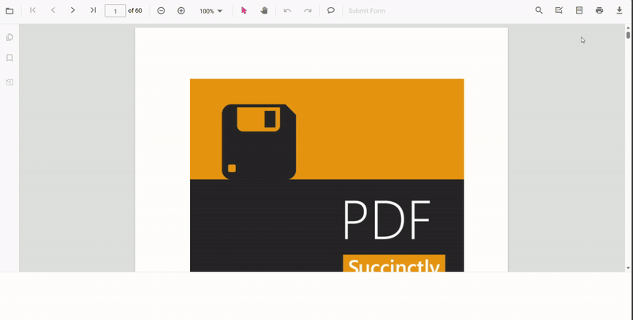

# Print PDF in Angular PDF Viewer

The Angular PDF Viewer includes built-in printing via the toolbar and APIs so users can control how documents are printed and monitor the process.

Select **Print** in the built-in toolbar to open the browser print dialog.

## Enable or Disable Print in Angular PDF Viewer

The Syncfusion Angular PDF Viewer component lets users print a loaded PDF document through the built-in toolbar or programmatic calls. Control whether printing is available by setting the [`enablePrint`](https://ej2.syncfusion.com/angular/documentation/api/pdfviewer#enableprint) property (`true` enables printing; `false` disables it).

The following Angular example renders the PDF Viewer with printing disabled.



import { Component, ViewChild, OnInit } from '@angular/core';
import {
  PdfViewerComponent,
  PdfViewerModule,
  LinkAnnotationService,
  BookmarkViewService,
  MagnificationService,
  ThumbnailViewService,
  ToolbarService,
  NavigationService,
  TextSearchService,
  TextSelectionService,
  PrintService,
  AnnotationService,
  FormFieldsService,
  FormDesignerService,
  PageOrganizerService,
} from '@syncfusion/ej2-angular-pdfviewer';

@Component({
  selector: 'app-root',
  standalone: true,
  imports: [PdfViewerModule],
  providers: [
    LinkAnnotationService,
    BookmarkViewService,
    MagnificationService,
    ThumbnailViewService,
    ToolbarService,
    NavigationService,
    TextSearchService,
    TextSelectionService,
    PrintService,
    AnnotationService,
    FormFieldsService,
    FormDesignerService,
    PageOrganizerService,
  ],
  template: `
      <ejs-pdfviewer
        #pdfviewer
        id="PdfViewer"
        [documentPath]="document"
        [resourceUrl]="resource"
        [enablePrint]="false"
        style="height: 100vh; width: 100%; display: block"
      >
      </ejs-pdfviewer>
    `,
})
export class AppComponent implements OnInit {
  @ViewChild('pdfviewer')
  public pdfviewerControl!: PdfViewerComponent;

  public document: string =
    'https://cdn.syncfusion.com/content/pdf/pdf-succinctly.pdf';

  public resource: string =
    'https://cdn.syncfusion.com/ej2/23.2.6/dist/ej2-pdfviewer-lib';

  ngOnInit(): void {
    // Initialization logic (if needed)
  }
}



## Print programmatically in Angular PDF Viewer

To start printing from code, call the [`pdfviewer.print.print()`](https://ej2.syncfusion.com/angular/documentation/api/pdfviewer/print#print-1) method after the document is fully loaded. This approach is useful when wiring up custom UI or initiating printing automatically; calling print before the document finishes loading can result in no output or an empty print dialog.



import { Component, ViewChild } from '@angular/core';
import {
  PdfViewerComponent,
  PdfViewerModule,
  ToolbarService,
  NavigationService,
  PrintService,
  MagnificationService,
} from '@syncfusion/ej2-angular-pdfviewer';

@Component({
  selector: 'app-root',
  standalone: true,
  imports: [PdfViewerModule],
  providers: [
    ToolbarService,
    NavigationService,
    PrintService,
    MagnificationService,
  ],
  template: `
    <button (click)="printPdf()" style="margin: 8px;">
      Print
    </button>
    <ejs-pdfviewer
      #pdfviewer
      id="PdfViewer"
      [documentPath]="document"
      [resourceUrl]="resource"
      style="height: calc(100vh - 50px); width: 100%; display: block"
    >
    </ejs-pdfviewer>
  `,
})
export class AppComponent {
  @ViewChild('pdfviewer')
  public pdfviewerObj!: PdfViewerComponent;

  public document: string =
    'https://cdn.syncfusion.com/content/pdf/pdf-succinctly.pdf';

  public resource: string =
    'https://cdn.syncfusion.com/ej2/31.1.23/dist/ej2-pdfviewer-lib';

  printPdf(): void {
    this.pdfviewerObj.print.print();
  }
}




## Key capabilities

- Enable or disable printing with the [`enablePrint`](https://ej2.syncfusion.com/angular/documentation/api/pdfviewer#enableprint) property
- Start printing from UI (toolbar Print) or programmatically using [`print.print()`](https://ej2.syncfusion.com/angular/documentation/api/pdfviewer/print#print-1).
- Control output quality with the [`printScaleFactor`](./print-quality) property (0.5–5)
- Auto‑rotate pages during print using [`enablePrintRotation`](./enable-print-rotation)
- Choose where printing happens with [`printMode`](./print-modes) (Default or NewWindow)
- Track the life cycle with [`printStart` and `printEnd` events](./events)

## Troubleshooting

- Ensure the [`resourceUrl`](https://ej2.syncfusion.com/angular/documentation/api/pdfviewer#resourceurl) value matches the deployed `ej2-pdfviewer-lib` version.
- Calling [`print()`](https://ej2.syncfusion.com/angular/documentation/api/pdfviewer/print#print-1) launches the browser print dialog; behavior varies by browser and may be affected by popup blockers or browser settings.

[View Sample in GitHub](https://github.com/SyncfusionExamples/angular-pdf-viewer-examples)

## See Also

- [Print quality](./print-quality)
- [Enable print rotation](./enable-print-rotation)
- [Print modes](./print-modes)
- [Print events](./events)
