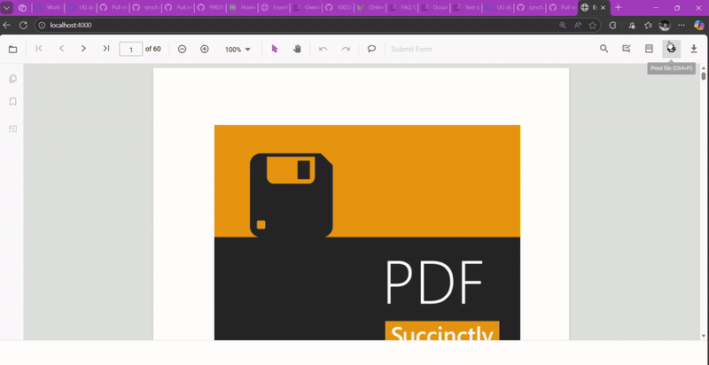

# Print Modes in the Angular PDF Viewer

This guide shows how to set the PDF Viewer [`printMode`](https://ej2.syncfusion.com/angular/documentation/api/pdfviewer#printmode) so PDFs print from the current window or from a new window/tab.

## Prerequisites

- An Angular app with the Syncfusion PDF Viewer and [`Print`](https://ej2.syncfusion.com/angular/documentation/api/pdfviewer/print) module injected.

## Steps to set print mode

**Step 1:** Decide which [`printMode`](https://ej2.syncfusion.com/angular/documentation/api/pdfviewer#printmode) you need:
   - `Default` — print from the same browser window.
   - `NewWindow` — print from a new window or tab (may be blocked by pop-up blockers).

**Step 2:** Set [`printMode`](https://ej2.syncfusion.com/angular/documentation/api/pdfviewer#printmode) during viewer initialization (recommended):



import { Component, ViewChild, OnInit } from '@angular/core';
import {
  PdfViewerComponent,
  PdfViewerModule,
  LinkAnnotationService,
  BookmarkViewService,
  MagnificationService,
  ThumbnailViewService,
  ToolbarService,
  NavigationService,
  TextSearchService,
  TextSelectionService,
  PrintService,
  AnnotationService,
  FormFieldsService,
  FormDesignerService,
  PageOrganizerService,
} from '@syncfusion/ej2-angular-pdfviewer';

@Component({
  selector: 'app-root',
  standalone: true,
  imports: [PdfViewerModule],
  providers: [
    LinkAnnotationService,
    BookmarkViewService,
    MagnificationService,
    ThumbnailViewService,
    ToolbarService,
    NavigationService,
    TextSearchService,
    TextSelectionService,
    PrintService,
    AnnotationService,
    FormFieldsService,
    FormDesignerService,
    PageOrganizerService,
  ],
  template: `
      <ejs-pdfviewer
        #pdfviewer
        id="PdfViewer"
        [documentPath]="document"
        [resourceUrl]="resource"
        [printMode]="'NewWindow'"
        style="height: 100vh; width: 100%; display: block"
      >
      </ejs-pdfviewer>
    `,
})
export class AppComponent implements OnInit {
  @ViewChild('pdfviewer')
  public pdfviewerControl!: PdfViewerComponent;

  public document: string =
    'https://cdn.syncfusion.com/content/pdf/pdf-succinctly.pdf';

  public resource: string =
    'https://cdn.syncfusion.com/ej2/23.2.6/dist/ej2-pdfviewer-lib';

  ngOnInit(): void {
    // Initialization logic (if needed)
  }
}





**Step 3:** Print mode can also be changed at runtime after the viewer is created:

```ts
// switch to NewWindow at runtime
pdfviewer.printMode = 'NewWindow';
```

## Quick reference

- `Default`: Print from the same window (default).
- `NewWindow`: Print from a new window or tab.

N> Browser pop-up blockers must allow new windows or tabs when using `pdfviewer.printMode = "NewWindow"`.

[View live examples and samples on GitHub](https://github.com/SyncfusionExamples/angular-pdf-viewer-examples)

## See also

- [Overview](./overview)
- [Print quality](./print-quality)
- [Enable print rotation](./enable-print-rotation)
- [Print events](./events)