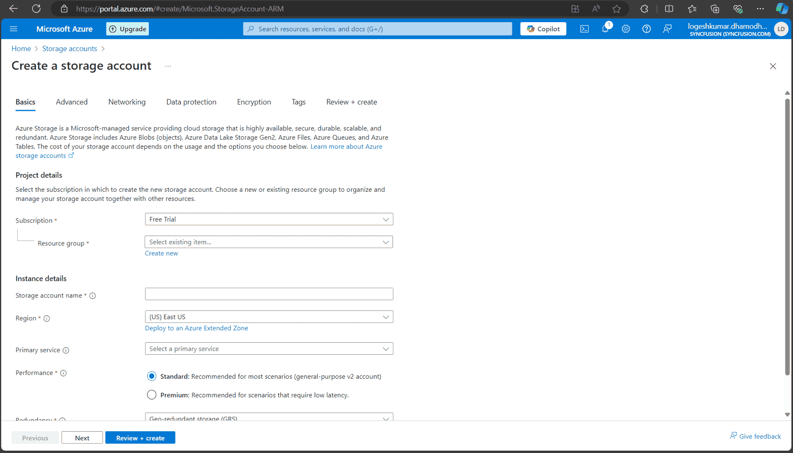

# Save PDF to Azure Active Directory in PDF Viewer

### Overview

The Syncfusion<sup style="font-size:70%">&reg;</sup> PDF Viewer supports loading and saving PDF files directly from Azure Active Directory (AAD). The steps to securely load and store PDF documents from and to AAD using the PDF Viewer are provided below.

### Open a PDF file from Azure Active Directory

---

### Step 1: Register an application in Azure Active Directory (AAD)

1. **Go to the Azure portal**:
   - Navigate to the [Azure Portal](https://portal.azure.com).

2. **Register an application**:
   - In the Azure portal, go to **Azure Active Directory** > **App registrations** > **New registration**.
   - Register the application and note down the **Application (client) ID** and **Directory (tenant) ID**.

   

3. **Create a client secret**:
   - In the registered application, go to **Certificates & secrets**.
   - Click **New client secret**.
   - Provide a description and set an expiration period.
   - Click **Add**.
   - Copy the client secret value immediately, as it will be hidden later and must be stored securely.

   

---

### Step 2: Create the Azure Storage account

1. **Create a Storage account**:
   - In the Azure portal, use the search bar to find **Storage accounts**.
   - Create a new storage account by providing the required details (e.g., name, location, resource group).

   

---

### Step 3: Assign role to the application

1. **Go to a Storage account**:
   - Navigate to **Access control (IAM)** > **Add role assignment** in the Azure Storage account.

2. **Assign role**:
   - Assign the **Storage Blob Data Contributor** role to the registered application.
   - In the **Assign access to** dropdown, select **User, group, or service principal**.
   - Click **Select members** and search for the registered application by name or client ID.
   - Select the application and click **Select**.
   - Click **Review + assign** to finalize the role assignment.

   
---

### Step 4: Upload the PDF document to the Azure Storage account

1. **Navigate to Data Storage**:
   - In the Azure portal, go to **Data storage** > **Containers**.

2. **Upload the PDF file**:
   - Create a new container and upload the PDF document for access in the PDF Viewer.

   
---

### Step 5: Server-side configuration

1. **Configure server-side code**:
   - Open the server-side application (e.g., ASP.NET Core) and configure the following details in the `PdfViewerController` file:
     - `tenantId` (Azure AD tenant ID),
     - `clientId` (registered application client ID),
     - `clientSecret` (registered application client secret),
     - `blobServiceEndpoint` (storage account blob service URL),
     - `containerName` (container name in Azure Blob Storage).

2. **Run the web service**:
   - After configuring the necessary details, run the web service to make it accessible.

---

### Step 6: Client-side configuration

1. **Run the Angular sample**:
   - Start the Angular sample that includes the Syncfusion<sup style="font-size:70%">&reg;</sup> PDF Viewer.

2. **Load PDF from AAD**:
   - When the **Load from AAD** button is clicked, the Angular client makes an HTTP request to the server-side API to fetch the PDF from Azure Blob Storage.
   - The server retrieves the PDF from Azure, converts it to a Base64 string, and returns it to the client.

3. **Display PDF in the PDF Viewer**:
   - Once the Base64 string is received, the PDF Viewer loads the PDF using the `viewer.load()` method.

---

### Step 7: Save the PDF document to Azure

1. **Save PDF to AAD**:
   - Clicking the **Save to AAD** button uploads any modifications to the PDF back to Azure Blob Storage.
   - This action sends the modified PDF to the server, where it is converted into a byte array and saved to the specified Azure Blob container.

---

### Server-side code snippets
```cs
string tenantId = "Provide the tenant id here";
string clientId = "Provide the clientid here";
string clientSecret = "Provide the client secret here";
string blobServiceEndpoint = "https://your-storage-account.blob.core.windows.net";
string containerName = "Provide the container name here";


[HttpPost("LoadFromAAD")]
[Route("[controller]/LoadFromAAD")]
public async Task<IActionResult> LoadFromAAD(string fileName)
{
    var clientSecretCredential = new ClientSecretCredential(tenantId, clientId, clientSecret);
    var blobServiceClient = new BlobServiceClient(new Uri(blobServiceEndpoint), clientSecretCredential);
    var containerClient = blobServiceClient.GetBlobContainerClient(containerName);
    var blobClient = containerClient.GetBlobClient(fileName);

    // Download the PDF file to a local stream
    using MemoryStream pdfStream = new MemoryStream();
    await blobClient.DownloadToAsync(pdfStream);
    var base64 = Convert.ToBase64String(pdfStream.ToArray());
    return Content("data:application/pdf;base64," + base64);
}

[AcceptVerbs("SaveToAAD")]
[HttpPost("SaveToAAD")]
[Route("[controller]/SaveToAAD")]
public async Task<IActionResult> SaveToAAD([FromBody] Dictionary<string, string> jsonObject)
{
    PdfRenderer pdfviewer = new PdfRenderer(_cache);
    var fileName = jsonObject.ContainsKey("documentId") ? jsonObject["documentId"] : "Test.pdf";
    string documentBase = pdfviewer.GetDocumentAsBase64(jsonObject);
    string convertedBase = documentBase.Substring(documentBase.LastIndexOf(',') + 1);
    // Decode the Base64 string to a byte array
    byte[] byteArray = Convert.FromBase64String(convertedBase);
    // Create a MemoryStream from the byte array
    MemoryStream stream = new MemoryStream(byteArray);
    // Create a new BlobServiceClient using the DefaultAzureCredential
    var clientSecretCredential = new ClientSecretCredential(tenantId, clientId, clientSecret);
    var blobServiceClient = new BlobServiceClient(new Uri(blobServiceEndpoint), clientSecretCredential);
    // Get a reference to the container
    var containerClient = blobServiceClient.GetBlobContainerClient(containerName);
    // Get a reference to the blob
    var blobClient = containerClient.GetBlobClient(fileName);
    //FileStream uploadFileStream = new FileStream();
    await blobClient.UploadAsync(stream, true);
    stream.Close();
    return Content(string.Empty);
}

```

### Client-side code snippets

```typescript

import { Component, OnInit } from '@angular/core';
import {
  LinkAnnotationService, BookmarkViewService, MagnificationService,
  ThumbnailViewService, ToolbarService, NavigationService,
  AnnotationService, TextSearchService, TextSelectionService,
  PrintService, FormDesignerService, FormFieldsService, CustomToolbarItemModel
} from '@syncfusion/ej2-angular-pdfviewer';
import { ComboBox } from "@syncfusion/ej2-dropdowns";
import { TextBox } from "@syncfusion/ej2-inputs";

@Component({
  selector: 'app-root',
  template: `<div class="content-wrapper">
                <ejs-pdfviewer id="pdfViewer"
                      [documentPath]="document"
                      [serviceUrl]="service"
                      [toolbarSettings]="toolbarSettings"
                      (toolbarClick)="toolbarClick($event)"
                      style="height:640px;display:block">
                </ejs-pdfviewer>
             </div>`,
  providers: [
    LinkAnnotationService, BookmarkViewService, MagnificationService,
    ThumbnailViewService, ToolbarService, NavigationService,
    AnnotationService, TextSearchService, TextSelectionService,
    PrintService, FormDesignerService, FormFieldsService
  ]
})
export class AppComponent implements OnInit {
  public document: string = '';
  public service: string = 'https://localhost:44308/pdfviewer';
  // Custom Toolbar Items
  public toolItem1: CustomToolbarItemModel = {
    id: 'loadFromAAD',
    text: 'Load From AAD',
    tooltipText: 'Custom toolbar item',
    align: 'left'
  };

  public toolItem2: CustomToolbarItemModel = {
    id: 'saveToAAD',
    text: 'Save To AAD',
    tooltipText: 'Custom toolbar item',
    align: 'left'
  };


  // Toolbar settings
  public toolbarSettings = {
    showTooltip: true,
    toolbarItems: [
      this.toolItem1,
      this.toolItem2,
      'OpenOption',
      'PageNavigationTool',
      'MagnificationTool',
      'PanTool',
      'SelectionTool',
      'SearchOption',
      'PrintOption',
      'DownloadOption',
      'UndoRedoTool',
      'AnnotationEditTool',
      'FormDesignerEditTool',
      'CommentTool',
      'SubmitForm'
    ]
  };

  constructor() { }

  ngOnInit(): void {
  }

  // Toolbar click event handler
  public toolbarClick(args: any): void {
    var viewer = (<any>document.getElementById('pdfViewer')).ej2_instances[0];
    if (args.item && args.item.id === 'loadFromAAD') {
      var xhr = new XMLHttpRequest();
      xhr.open(
        'POST',
        `https://localhost:44308/pdfviewer/LoadFromAAD?fileName=pdf-succinctly.pdf`,
        true
      );
      xhr.onreadystatechange = function () {
        if (xhr.readyState === 4 && xhr.status === 200) {
          var data = xhr.responseText;
          console.log(data); // Handle the  response
          viewer.load(data);
        }
      };
      xhr.send();
    } else if (args.item && args.item.id === 'saveToAAD') {
        viewer.serverActionSettings.download = "SaveToAAD";
      viewer.download();
    }
  }
}


```

[View sample in GitHub](https://github.com/SyncfusionExamples/open-save-pdf-documents-in-aad).