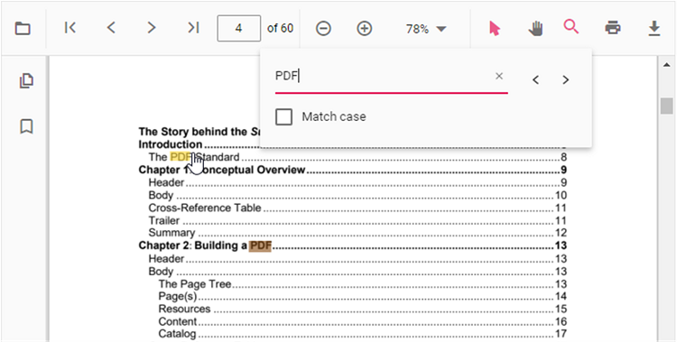

# Text Search in Angular PDF Viewer component

The Text Search option in PDF Viewer is used to find and highlight the text content from the document. You can enable/disable the text search using the following code snippet.




import { Component, OnInit } from '@angular/core';
import { LinkAnnotationService, BookmarkViewService, MagnificationService,
         ThumbnailViewService, ToolbarService, NavigationService,
         TextSearchService, AnnotationService, TextSelectionService,
         PrintService
       } from '@syncfusion/ej2-angular-pdfviewer';
@Component({
  selector: 'app-container',
  // specifies the template string for the PDF Viewer component
  template: `<div class="content-wrapper">
                <ejs-pdfviewer id="pdfViewer"
                              [documentPath]='document'
                              [enableTextSearch]='true'
                              style="height:640px;display:block">
                </ejs-pdfviewer>
            </div>`,
  providers: [ LinkAnnotationService, BookmarkViewService, MagnificationService,
               ThumbnailViewService, ToolbarService, NavigationService,
               AnnotationService, TextSearchService, TextSelectionService,
               PrintService]
  })
  export class AppComponent implements OnInit {
      public document = 'https://cdn.syncfusion.com/content/pdf/pdf-succinctly.pdf';
  }





import { Component, OnInit } from '@angular/core';
import { LinkAnnotationService, BookmarkViewService, MagnificationService,
         ThumbnailViewService, ToolbarService, NavigationService,
         TextSearchService, AnnotationService, TextSelectionService,
         PrintService
       } from '@syncfusion/ej2-angular-pdfviewer';
@Component({
  selector: 'app-container',
  // specifies the template string for the PDF Viewer component
  template: `<div class="content-wrapper">
                <ejs-pdfviewer id="pdfViewer"
                              [serviceUrl]='service'
                              [documentPath]='document'
                              [enableTextSearch]='true'
                              style="height:640px;display:block">
                </ejs-pdfviewer>
            </div>`,
  providers: [ LinkAnnotationService, BookmarkViewService, MagnificationService,
               ThumbnailViewService, ToolbarService, NavigationService,
               AnnotationService, TextSearchService, TextSelectionService,
               PrintService]
  })
  export class AppComponent implements OnInit {
      public service = 'https://document.syncfusion.com/web-services/pdf-viewer/api/pdfviewer';
      public document = 'https://cdn.syncfusion.com/content/pdf/pdf-succinctly.pdf';
  }




## Text search Features

### Real time search suggestion while typing
Entering text into the search input dynamically displays search suggestions based on the provided input. The suggestions are updated in real-time as text is typed, offering relevant matches from the available content. This feature enhances the search experience by allowing quick access to potential results while typing.


### Selecting Search Suggestions from the Popup
Entering text into the search input triggers a popup displaying relevant suggestions based on the input. Selecting a suggestion from the popup enables direct navigation to its occurrences in the document.


### Search Text with enabling 'Match Case' checkbox
By enabling the 'Match Case' option and entering text into the search input, only the exact case-sensitive matches in the document are highlighted. This feature allows navigation through each occurrence of the exact text match within the document.


### Search Text without enabling 'Match Case' checkbox
When text is entered into the search input without enabling the 'Match Case' option, all instances of the text, regardless of case, are highlighted in the document. This allows easy navigation through every occurrence of the search term.


### Search list of text by enabling 'Match Any Word' checkbox
When the 'Match Any Word' option is enabled, the entered text in the search input is split into individual words based on spaces. As the text is typed, the popup dynamically displays search suggestions for each word in real time, highlighting potential matches within the document.


The following text search methods are available in the PDF Viewer,

* [**Search text**](https://ej2.syncfusion.com/documentation/api/pdfviewer/textSearch/#searchtext):- Searches the target text in the PDF document and highlights the occurrences in the pages.
* [**Search next**](https://ej2.syncfusion.com/documentation/api/pdfviewer/textSearch/#searchnext):- Searches the next occurrence of the searched text from the current occurrence of the PdfViewer.
* [**Search previous**](https://ej2.syncfusion.com/documentation/api/pdfviewer/textSearch/#searchprevious):- Searches the previous occurrence of the searched text from the current occurrence of the PdfViewer.
* [**Cancel text search**](https://ej2.syncfusion.com/documentation/api/pdfviewer/textSearch/#canceltextsearch):- The text search can be canceled and the highlighted occurrences from the PDF Viewer can be removed .



## Find text method
Searches for the specified text or an array of strings within the document and returns the bounding rectangles for each occurrence. The search can be case-sensitive based on the provided parameters. If a specific page index is provided, it returns the bounding rectangles for these search strings on that page; otherwise, it returns the bounding rectangles for all pages in the document where the strings were found.

### Find and get the bounds of a text
Searches for the specified text within the document and returns the bounding rectangles of the matched text. The search can be case-sensitive based on the provided parameter. It returns the bounding rectangles for all pages in the document where the text was found. The below code snippet shows how to get the bounds of the given text:




```ts
import { Component, OnInit } from "@angular/core";
import {
  LinkAnnotationService,
  BookmarkViewService,
  MagnificationService,
  ThumbnailViewService,
  ToolbarService,
  NavigationService,
  AnnotationService,
  TextSearchService,
  TextSelectionService,
  PrintService,
  FormFieldsService,
  FormDesignerService,
} from "@syncfusion/ej2-angular-pdfviewer";

@Component({
  selector: "app-root",
  // specifies the template string for the PDF Viewer component
  template: `<div class="content-wrapper">
    <button #btn1 (click)="textBounds()">Text Bounds</button>
    <ejs-pdfviewer
      id="pdfViewer"
      [serviceUrl]="service"
      [documentPath]="document"
      style="height:640px;display:block"
    ></ejs-pdfviewer>
  </div>`,
  providers: [
    LinkAnnotationService,
    BookmarkViewService,
    MagnificationService,
    ThumbnailViewService,
    ToolbarService,
    NavigationService,
    AnnotationService,
    TextSearchService,
    TextSelectionService,
    PrintService,
    FormFieldsService,
    FormDesignerService,
  ],
})
export class AppComponent implements OnInit {
  public document = 'https://cdn.syncfusion.com/content/pdf/pdf-succinctly.pdf';
  ngOnInit(): void {}

  textBounds() {
    let viewer = (<any>document.getElementById("pdfViewer")).ej2_instances[0];
    console.log(viewer.textSearch.findText('pdf', false));
  }
}
```



```ts
import { Component, OnInit } from "@angular/core";
import {
  LinkAnnotationService,
  BookmarkViewService,
  MagnificationService,
  ThumbnailViewService,
  ToolbarService,
  NavigationService,
  AnnotationService,
  TextSearchService,
  TextSelectionService,
  PrintService,
  FormFieldsService,
  FormDesignerService,
} from "@syncfusion/ej2-angular-pdfviewer";

@Component({
  selector: "app-root",
  // specifies the template string for the PDF Viewer component
  template: `<div class="content-wrapper">
    <button #btn1 (click)="textBounds()">Text Bounds</button>
    <ejs-pdfviewer
      id="pdfViewer"
      [serviceUrl]="service"
      [documentPath]="document"
      style="height:640px;display:block"
    ></ejs-pdfviewer>
  </div>`,
  providers: [
    LinkAnnotationService,
    BookmarkViewService,
    MagnificationService,
    ThumbnailViewService,
    ToolbarService,
    NavigationService,
    AnnotationService,
    TextSearchService,
    TextSelectionService,
    PrintService,
    FormFieldsService,
    FormDesignerService,
  ],
})
export class AppComponent implements OnInit {
  public service =
    "https://document.syncfusion.com/web-services/pdf-viewer/api/pdfviewer";
  public document = 'https://cdn.syncfusion.com/content/pdf/pdf-succinctly.pdf';
  ngOnInit(): void {}

  textBounds() {
    let viewer = (<any>document.getElementById("pdfViewer")).ej2_instances[0];
    console.log(viewer.textSearch.findText('pdf', false));
  }
}
```



### Find and get the bounds of a text on the desired page
Searches for the specified text within the document and returns the bounding rectangles of the matched text. The search can be case-sensitive based on the provided parameter. It returns the bounding rectangles for that page in the document where the text was found. The below code snippet shows how to get the bounds of the given text from the desired page:




```ts
import { Component, OnInit } from "@angular/core";
import {
  LinkAnnotationService,
  BookmarkViewService,
  MagnificationService,
  ThumbnailViewService,
  ToolbarService,
  NavigationService,
  AnnotationService,
  TextSearchService,
  TextSelectionService,
  PrintService,
  FormFieldsService,
  FormDesignerService,
} from "@syncfusion/ej2-angular-pdfviewer";

@Component({
  selector: "app-root",
  // specifies the template string for the PDF Viewer component
  template: `<div class="content-wrapper">
    <button #btn1 (click)="textBounds()">Text Bounds</button>
    <ejs-pdfviewer
      id="pdfViewer"
      [serviceUrl]="service"
      [documentPath]="document"
      style="height:640px;display:block"
    ></ejs-pdfviewer>
  </div>`,
  providers: [
    LinkAnnotationService,
    BookmarkViewService,
    MagnificationService,
    ThumbnailViewService,
    ToolbarService,
    NavigationService,
    AnnotationService,
    TextSearchService,
    TextSelectionService,
    PrintService,
    FormFieldsService,
    FormDesignerService,
  ],
})
export class AppComponent implements OnInit {
  public document = 'https://cdn.syncfusion.com/content/pdf/pdf-succinctly.pdf';
  ngOnInit(): void {}

  textBounds() {
    let viewer = (<any>document.getElementById("pdfViewer")).ej2_instances[0];
    console.log(viewer.textSearch.findText('pdf', false, 7));
  }
}
```



```ts
import { Component, OnInit } from "@angular/core";
import {
  LinkAnnotationService,
  BookmarkViewService,
  MagnificationService,
  ThumbnailViewService,
  ToolbarService,
  NavigationService,
  AnnotationService,
  TextSearchService,
  TextSelectionService,
  PrintService,
  FormFieldsService,
  FormDesignerService,
} from "@syncfusion/ej2-angular-pdfviewer";

@Component({
  selector: "app-root",
  // specifies the template string for the PDF Viewer component
  template: `<div class="content-wrapper">
    <button #btn1 (click)="textBounds()">Text Bounds</button>
    <ejs-pdfviewer
      id="pdfViewer"
      [serviceUrl]="service"
      [documentPath]="document"
      style="height:640px;display:block"
    ></ejs-pdfviewer>
  </div>`,
  providers: [
    LinkAnnotationService,
    BookmarkViewService,
    MagnificationService,
    ThumbnailViewService,
    ToolbarService,
    NavigationService,
    AnnotationService,
    TextSearchService,
    TextSelectionService,
    PrintService,
    FormFieldsService,
    FormDesignerService,
  ],
})
export class AppComponent implements OnInit {
  public service =
    "https://document.syncfusion.com/web-services/pdf-viewer/api/pdfviewer";
  public document = 'https://cdn.syncfusion.com/content/pdf/pdf-succinctly.pdf';
  ngOnInit(): void {}

  textBounds() {
    let viewer = (<any>document.getElementById("pdfViewer")).ej2_instances[0];
    console.log(viewer.textSearch.findText('pdf', false, 7));
  }
}
```



### Find and get the bounds of the list of text
Searches for an array of strings within the document and returns the bounding rectangles for each occurrence. The search can be case-sensitive based on the provided parameters. It returns the bounding rectangles for all pages in the document where the strings were found.




```ts
import { Component, OnInit } from "@angular/core";
import {
  LinkAnnotationService,
  BookmarkViewService,
  MagnificationService,
  ThumbnailViewService,
  ToolbarService,
  NavigationService,
  AnnotationService,
  TextSearchService,
  TextSelectionService,
  PrintService,
  FormFieldsService,
  FormDesignerService,
} from "@syncfusion/ej2-angular-pdfviewer";

@Component({
  selector: "app-root",
  // specifies the template string for the PDF Viewer component
  template: `<div class="content-wrapper">
    <button #btn1 (click)="textBounds()">Text Bounds</button>
    <ejs-pdfviewer
      id="pdfViewer"
      [serviceUrl]="service"
      [documentPath]="document"
      style="height:640px;display:block"
    ></ejs-pdfviewer>
  </div>`,
  providers: [
    LinkAnnotationService,
    BookmarkViewService,
    MagnificationService,
    ThumbnailViewService,
    ToolbarService,
    NavigationService,
    AnnotationService,
    TextSearchService,
    TextSelectionService,
    PrintService,
    FormFieldsService,
    FormDesignerService,
  ],
})
export class AppComponent implements OnInit {
  public document = 'https://cdn.syncfusion.com/content/pdf/pdf-succinctly.pdf';
  ngOnInit(): void {}

  textBounds() {
    let viewer = (<any>document.getElementById("pdfViewer")).ej2_instances[0];
    console.log(viewer.textSearch.findText(['pdf', 'adobe'], false));
  }
}
```



```ts
import { Component, OnInit } from "@angular/core";
import {
  LinkAnnotationService,
  BookmarkViewService,
  MagnificationService,
  ThumbnailViewService,
  ToolbarService,
  NavigationService,
  AnnotationService,
  TextSearchService,
  TextSelectionService,
  PrintService,
  FormFieldsService,
  FormDesignerService,
} from "@syncfusion/ej2-angular-pdfviewer";

@Component({
  selector: "app-root",
  // specifies the template string for the PDF Viewer component
  template: `<div class="content-wrapper">
    <button #btn1 (click)="textBounds()">Text Bounds</button>
    <ejs-pdfviewer
      id="pdfViewer"
      [serviceUrl]="service"
      [documentPath]="document"
      style="height:640px;display:block"
    ></ejs-pdfviewer>
  </div>`,
  providers: [
    LinkAnnotationService,
    BookmarkViewService,
    MagnificationService,
    ThumbnailViewService,
    ToolbarService,
    NavigationService,
    AnnotationService,
    TextSearchService,
    TextSelectionService,
    PrintService,
    FormFieldsService,
    FormDesignerService,
  ],
})
export class AppComponent implements OnInit {
  public service =
    "https://document.syncfusion.com/web-services/pdf-viewer/api/pdfviewer";
  public document = 'https://cdn.syncfusion.com/content/pdf/pdf-succinctly.pdf';
  ngOnInit(): void {}

  textBounds() {
    let viewer = (<any>document.getElementById("pdfViewer")).ej2_instances[0];
    console.log(viewer.textSearch.findText(['pdf', 'adobe'], false));
  }
}
```



### Find and get the bounds of the list of text on desired page
Searches for an array of strings within the document and returns the bounding rectangles for each occurrence. The search can be case-sensitive based on the provided parameters. It returns the bounding rectangles for these search strings on that particular page where the strings were found.




```ts
import { Component, OnInit } from "@angular/core";
import {
  LinkAnnotationService,
  BookmarkViewService,
  MagnificationService,
  ThumbnailViewService,
  ToolbarService,
  NavigationService,
  AnnotationService,
  TextSearchService,
  TextSelectionService,
  PrintService,
  FormFieldsService,
  FormDesignerService,
} from "@syncfusion/ej2-angular-pdfviewer";

@Component({
  selector: "app-root",
  // specifies the template string for the PDF Viewer component
  template: `<div class="content-wrapper">
    <button #btn1 (click)="textBounds()">Text Bounds</button>
    <ejs-pdfviewer
      id="pdfViewer"
      [serviceUrl]="service"
      [documentPath]="document"
      style="height:640px;display:block"
    ></ejs-pdfviewer>
  </div>`,
  providers: [
    LinkAnnotationService,
    BookmarkViewService,
    MagnificationService,
    ThumbnailViewService,
    ToolbarService,
    NavigationService,
    AnnotationService,
    TextSearchService,
    TextSelectionService,
    PrintService,
    FormFieldsService,
    FormDesignerService,
  ],
})
export class AppComponent implements OnInit {
  public document = 'https://cdn.syncfusion.com/content/pdf/pdf-succinctly.pdf';
  ngOnInit(): void {}

  textBounds() {
    let viewer = (<any>document.getElementById("pdfViewer")).ej2_instances[0];
    console.log(viewer.textSearch.findText(['pdf', 'adobe'], false, 7));
  }
}
```



```ts
import { Component, OnInit } from "@angular/core";
import {
  LinkAnnotationService,
  BookmarkViewService,
  MagnificationService,
  ThumbnailViewService,
  ToolbarService,
  NavigationService,
  AnnotationService,
  TextSearchService,
  TextSelectionService,
  PrintService,
  FormFieldsService,
  FormDesignerService,
} from "@syncfusion/ej2-angular-pdfviewer";

@Component({
  selector: "app-root",
  // specifies the template string for the PDF Viewer component
  template: `<div class="content-wrapper">
    <button #btn1 (click)="textBounds()">Text Bounds</button>
    <ejs-pdfviewer
      id="pdfViewer"
      [serviceUrl]="service"
      [documentPath]="document"
      style="height:640px;display:block"
    ></ejs-pdfviewer>
  </div>`,
  providers: [
    LinkAnnotationService,
    BookmarkViewService,
    MagnificationService,
    ThumbnailViewService,
    ToolbarService,
    NavigationService,
    AnnotationService,
    TextSearchService,
    TextSelectionService,
    PrintService,
    FormFieldsService,
    FormDesignerService,
  ],
})
export class AppComponent implements OnInit {
  public service =
    "https://document.syncfusion.com/web-services/pdf-viewer/api/pdfviewer";
  public document = 'https://cdn.syncfusion.com/content/pdf/pdf-succinctly.pdf';
  ngOnInit(): void {}

  textBounds() {
    let viewer = (<any>document.getElementById("pdfViewer")).ej2_instances[0];
    console.log(viewer.textSearch.findText(['pdf', 'adobe'], false, 7));
  }
}
```



[View sample in GitHub](https://github.com/SyncfusionExamples/angular-pdf-viewer-examples/tree/master/How%20to/TextSearch)

## See also

* [Toolbar items](./toolbar)
* [Feature Modules](./feature-module)