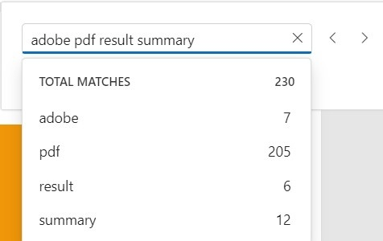

# Text Search in Angular PDF Viewer component

The Text Search option in the PDF Viewer finds and highlights matching text within a document. Enable or disable text search using the example code snippets below.




import { Component, OnInit } from '@angular/core';
import { LinkAnnotationService, BookmarkViewService, MagnificationService,
         ThumbnailViewService, ToolbarService, NavigationService,
         TextSearchService, AnnotationService, TextSelectionService,
         PrintService
       } from '@syncfusion/ej2-angular-pdfviewer';
@Component({
  selector: 'app-container',
  // specifies the template string for the PDF Viewer component
  template: `<div class="content-wrapper">
                <ejs-pdfviewer id="pdfViewer"
                              [documentPath]='document'
                              [enableTextSearch]='true'
                              style="height:640px;display:block">
                </ejs-pdfviewer>
            </div>`,
  providers: [ LinkAnnotationService, BookmarkViewService, MagnificationService,
               ThumbnailViewService, ToolbarService, NavigationService,
               AnnotationService, TextSearchService, TextSelectionService,
               PrintService]
  })
  export class AppComponent implements OnInit {
      public document = 'https://cdn.syncfusion.com/content/pdf/pdf-succinctly.pdf';
  }





import { Component, OnInit } from '@angular/core';
import { LinkAnnotationService, BookmarkViewService, MagnificationService,
         ThumbnailViewService, ToolbarService, NavigationService,
         TextSearchService, AnnotationService, TextSelectionService,
         PrintService
       } from '@syncfusion/ej2-angular-pdfviewer';
@Component({
  selector: 'app-container',
  // specifies the template string for the PDF Viewer component
  template: `<div class="content-wrapper">
                <ejs-pdfviewer id="pdfViewer"
                              [serviceUrl]='service'
                              [documentPath]='document'
                              [enableTextSearch]='true'
                              style="height:640px;display:block">
                </ejs-pdfviewer>
            </div>`,
  providers: [ LinkAnnotationService, BookmarkViewService, MagnificationService,
               ThumbnailViewService, ToolbarService, NavigationService,
               AnnotationService, TextSearchService, TextSelectionService,
               PrintService]
  })
  export class AppComponent implements OnInit {
      public service = 'https://document.syncfusion.com/web-services/pdf-viewer/api/pdfviewer';
      public document = 'https://cdn.syncfusion.com/content/pdf/pdf-succinctly.pdf';
  }




## Text search Features

### Real time search suggestion while typing
Typing into the search input displays real-time suggestions that update as characters are entered, helping users discover matches quickly.


### Selecting Search Suggestions from the Popup
Selecting a suggestion from the popup navigates directly to its occurrences in the document.


### Search Text with enabling 'Match Case' checkbox
With the 'Match Case' option enabled, only exact case-sensitive matches are highlighted and navigable.


### Search Text without enabling 'Match Case' checkbox
When 'Match Case' is disabled, matches are found regardless of letter case, highlighting all occurrences of the search term.


### Search list of text by enabling 'Match Any Word' checkbox
When 'Match Any Word' is enabled, the input is split into words and suggestions are shown for each word, enabling matches for any individual term.



The following text search methods are available in the PDF Viewer:

* [**Search text**](https://ej2.syncfusion.com/documentation/api/pdfviewer/textSearch/#searchtext):- Searches the target text in the PDF document and highlights occurrences in the pages.
* [**Search next**](https://ej2.syncfusion.com/documentation/api/pdfviewer/textSearch/#searchnext):- Navigates to the next occurrence of the searched text.
* [**Search previous**](https://ej2.syncfusion.com/documentation/api/pdfviewer/textSearch/#searchprevious):- Navigates to the previous occurrence of the searched text.
* [**Cancel text search**](https://ej2.syncfusion.com/documentation/api/pdfviewer/textSearch/#canceltextsearch):- Cancels the ongoing search and removes highlighted occurrences.


## Find text method
The `findText` method searches for a string or an array of strings and returns the bounding rectangles for each match. Searches can be case-sensitive and may be restricted to a single page when a `pageIndex` is provided; otherwise, results span all pages where matches occur.

### Find and get the bounds of a text
Searches for the specified text within the document and returns the bounding rectangles of the matched text. The search can be case-sensitive based on the provided parameter. It returns the bounding rectangles for all pages in the document where the text was found. The below code snippet shows how to get the bounds of the given text:




```ts
import { Component, OnInit } from "@angular/core";
import {
  LinkAnnotationService,
  BookmarkViewService,
  MagnificationService,
  ThumbnailViewService,
  ToolbarService,
  NavigationService,
  AnnotationService,
  TextSearchService,
  TextSelectionService,
  PrintService,
  FormFieldsService,
  FormDesignerService,
} from "@syncfusion/ej2-angular-pdfviewer";

@Component({
  selector: "app-root",
  // specifies the template string for the PDF Viewer component
  template: `<div class="content-wrapper">
    <button #btn1 (click)="textBounds()">Text Bounds</button>
    <ejs-pdfviewer
      id="pdfViewer"
      [serviceUrl]="service"
      [documentPath]="document"
      style="height:640px;display:block"
    ></ejs-pdfviewer>
  </div>`,
  providers: [
    LinkAnnotationService,
    BookmarkViewService,
    MagnificationService,
    ThumbnailViewService,
    ToolbarService,
    NavigationService,
    AnnotationService,
    TextSearchService,
    TextSelectionService,
    PrintService,
    FormFieldsService,
    FormDesignerService,
  ],
})
export class AppComponent implements OnInit {
  public document = 'https://cdn.syncfusion.com/content/pdf/pdf-succinctly.pdf';
  ngOnInit(): void {}

  textBounds() {
    let viewer = (<any>document.getElementById("pdfViewer")).ej2_instances[0];
    console.log(viewer.textSearch.findText('pdf', false));
  }
}
```



```ts
import { Component, OnInit } from "@angular/core";
import {
  LinkAnnotationService,
  BookmarkViewService,
  MagnificationService,
  ThumbnailViewService,
  ToolbarService,
  NavigationService,
  AnnotationService,
  TextSearchService,
  TextSelectionService,
  PrintService,
  FormFieldsService,
  FormDesignerService,
} from "@syncfusion/ej2-angular-pdfviewer";

@Component({
  selector: "app-root",
  // specifies the template string for the PDF Viewer component
  template: `<div class="content-wrapper">
    <button #btn1 (click)="textBounds()">Text Bounds</button>
    <ejs-pdfviewer
      id="pdfViewer"
      [serviceUrl]="service"
      [documentPath]="document"
      style="height:640px;display:block"
    ></ejs-pdfviewer>
  </div>`,
  providers: [
    LinkAnnotationService,
    BookmarkViewService,
    MagnificationService,
    ThumbnailViewService,
    ToolbarService,
    NavigationService,
    AnnotationService,
    TextSearchService,
    TextSelectionService,
    PrintService,
    FormFieldsService,
    FormDesignerService,
  ],
})
export class AppComponent implements OnInit {
  public service =
    "https://document.syncfusion.com/web-services/pdf-viewer/api/pdfviewer";
  public document = 'https://cdn.syncfusion.com/content/pdf/pdf-succinctly.pdf';
  ngOnInit(): void {}

  textBounds() {
    let viewer = (<any>document.getElementById("pdfViewer")).ej2_instances[0];
    console.log(viewer.textSearch.findText('pdf', false));
  }
}
```



### Find and get the bounds of a text on the desired page
Searches for the specified text within the document and returns the bounding rectangles of the matched text. The search can be case-sensitive based on the provided parameter. It returns the bounding rectangles for that page in the document where the text was found. The below code snippet shows how to get the bounds of the given text from the desired page:




```ts
import { Component, OnInit } from "@angular/core";
import {
  LinkAnnotationService,
  BookmarkViewService,
  MagnificationService,
  ThumbnailViewService,
  ToolbarService,
  NavigationService,
  AnnotationService,
  TextSearchService,
  TextSelectionService,
  PrintService,
  FormFieldsService,
  FormDesignerService,
} from "@syncfusion/ej2-angular-pdfviewer";

@Component({
  selector: "app-root",
  // specifies the template string for the PDF Viewer component
  template: `<div class="content-wrapper">
    <button #btn1 (click)="textBounds()">Text Bounds</button>
    <ejs-pdfviewer
      id="pdfViewer"
      [serviceUrl]="service"
      [documentPath]="document"
      style="height:640px;display:block"
    ></ejs-pdfviewer>
  </div>`,
  providers: [
    LinkAnnotationService,
    BookmarkViewService,
    MagnificationService,
    ThumbnailViewService,
    ToolbarService,
    NavigationService,
    AnnotationService,
    TextSearchService,
    TextSelectionService,
    PrintService,
    FormFieldsService,
    FormDesignerService,
  ],
})
export class AppComponent implements OnInit {
  public document = 'https://cdn.syncfusion.com/content/pdf/pdf-succinctly.pdf';
  ngOnInit(): void {}

  textBounds() {
    let viewer = (<any>document.getElementById("pdfViewer")).ej2_instances[0];
    console.log(viewer.textSearch.findText('pdf', false, 7));
  }
}
```



```ts
import { Component, OnInit } from "@angular/core";
import {
  LinkAnnotationService,
  BookmarkViewService,
  MagnificationService,
  ThumbnailViewService,
  ToolbarService,
  NavigationService,
  AnnotationService,
  TextSearchService,
  TextSelectionService,
  PrintService,
  FormFieldsService,
  FormDesignerService,
} from "@syncfusion/ej2-angular-pdfviewer";

@Component({
  selector: "app-root",
  // specifies the template string for the PDF Viewer component
  template: `<div class="content-wrapper">
    <button #btn1 (click)="textBounds()">Text Bounds</button>
    <ejs-pdfviewer
      id="pdfViewer"
      [serviceUrl]="service"
      [documentPath]="document"
      style="height:640px;display:block"
    ></ejs-pdfviewer>
  </div>`,
  providers: [
    LinkAnnotationService,
    BookmarkViewService,
    MagnificationService,
    ThumbnailViewService,
    ToolbarService,
    NavigationService,
    AnnotationService,
    TextSearchService,
    TextSelectionService,
    PrintService,
    FormFieldsService,
    FormDesignerService,
  ],
})
export class AppComponent implements OnInit {
  public service =
    "https://document.syncfusion.com/web-services/pdf-viewer/api/pdfviewer";
  public document = 'https://cdn.syncfusion.com/content/pdf/pdf-succinctly.pdf';
  ngOnInit(): void {}

  textBounds() {
    let viewer = (<any>document.getElementById("pdfViewer")).ej2_instances[0];
    console.log(viewer.textSearch.findText('pdf', false, 7));
  }
}
```



### Find and get the bounds of the list of text
Searches for an array of strings within the document and returns the bounding rectangles for each occurrence. The search can be case-sensitive based on the provided parameters. It returns the bounding rectangles for all pages in the document where the strings were found.




```ts
import { Component, OnInit } from "@angular/core";
import {
  LinkAnnotationService,
  BookmarkViewService,
  MagnificationService,
  ThumbnailViewService,
  ToolbarService,
  NavigationService,
  AnnotationService,
  TextSearchService,
  TextSelectionService,
  PrintService,
  FormFieldsService,
  FormDesignerService,
} from "@syncfusion/ej2-angular-pdfviewer";

@Component({
  selector: "app-root",
  // specifies the template string for the PDF Viewer component
  template: `<div class="content-wrapper">
    <button #btn1 (click)="textBounds()">Text Bounds</button>
    <ejs-pdfviewer
      id="pdfViewer"
      [serviceUrl]="service"
      [documentPath]="document"
      style="height:640px;display:block"
    ></ejs-pdfviewer>
  </div>`,
  providers: [
    LinkAnnotationService,
    BookmarkViewService,
    MagnificationService,
    ThumbnailViewService,
    ToolbarService,
    NavigationService,
    AnnotationService,
    TextSearchService,
    TextSelectionService,
    PrintService,
    FormFieldsService,
    FormDesignerService,
  ],
})
export class AppComponent implements OnInit {
  public document = 'https://cdn.syncfusion.com/content/pdf/pdf-succinctly.pdf';
  ngOnInit(): void {}

  textBounds() {
    let viewer = (<any>document.getElementById("pdfViewer")).ej2_instances[0];
    console.log(viewer.textSearch.findText(['pdf', 'adobe'], false));
  }
}
```



```ts
import { Component, OnInit } from "@angular/core";
import {
  LinkAnnotationService,
  BookmarkViewService,
  MagnificationService,
  ThumbnailViewService,
  ToolbarService,
  NavigationService,
  AnnotationService,
  TextSearchService,
  TextSelectionService,
  PrintService,
  FormFieldsService,
  FormDesignerService,
} from "@syncfusion/ej2-angular-pdfviewer";

@Component({
  selector: "app-root",
  // specifies the template string for the PDF Viewer component
  template: `<div class="content-wrapper">
    <button #btn1 (click)="textBounds()">Text Bounds</button>
    <ejs-pdfviewer
      id="pdfViewer"
      [serviceUrl]="service"
      [documentPath]="document"
      style="height:640px;display:block"
    ></ejs-pdfviewer>
  </div>`,
  providers: [
    LinkAnnotationService,
    BookmarkViewService,
    MagnificationService,
    ThumbnailViewService,
    ToolbarService,
    NavigationService,
    AnnotationService,
    TextSearchService,
    TextSelectionService,
    PrintService,
    FormFieldsService,
    FormDesignerService,
  ],
})
export class AppComponent implements OnInit {
  public service =
    "https://document.syncfusion.com/web-services/pdf-viewer/api/pdfviewer";
  public document = 'https://cdn.syncfusion.com/content/pdf/pdf-succinctly.pdf';
  ngOnInit(): void {}

  textBounds() {
    let viewer = (<any>document.getElementById("pdfViewer")).ej2_instances[0];
    console.log(viewer.textSearch.findText(['pdf', 'adobe'], false));
  }
}
```



### Find and get the bounds of the list of text on desired page
Searches for an array of strings within the document and returns the bounding rectangles for each occurrence. The search can be case-sensitive based on the provided parameters. It returns the bounding rectangles for these search strings on that particular page where the strings were found.




```ts
import { Component, OnInit } from "@angular/core";
import {
  LinkAnnotationService,
  BookmarkViewService,
  MagnificationService,
  ThumbnailViewService,
  ToolbarService,
  NavigationService,
  AnnotationService,
  TextSearchService,
  TextSelectionService,
  PrintService,
  FormFieldsService,
  FormDesignerService,
} from "@syncfusion/ej2-angular-pdfviewer";

@Component({
  selector: "app-root",
  // specifies the template string for the PDF Viewer component
  template: `<div class="content-wrapper">
    <button #btn1 (click)="textBounds()">Text Bounds</button>
    <ejs-pdfviewer
      id="pdfViewer"
      [serviceUrl]="service"
      [documentPath]="document"
      style="height:640px;display:block"
    ></ejs-pdfviewer>
  </div>`,
  providers: [
    LinkAnnotationService,
    BookmarkViewService,
    MagnificationService,
    ThumbnailViewService,
    ToolbarService,
    NavigationService,
    AnnotationService,
    TextSearchService,
    TextSelectionService,
    PrintService,
    FormFieldsService,
    FormDesignerService,
  ],
})
export class AppComponent implements OnInit {
  public document = 'https://cdn.syncfusion.com/content/pdf/pdf-succinctly.pdf';
  ngOnInit(): void {}

  textBounds() {
    let viewer = (<any>document.getElementById("pdfViewer")).ej2_instances[0];
    console.log(viewer.textSearch.findText(['pdf', 'adobe'], false, 7));
  }
}
```



```ts
import { Component, OnInit } from "@angular/core";
import {
  LinkAnnotationService,
  BookmarkViewService,
  MagnificationService,
  ThumbnailViewService,
  ToolbarService,
  NavigationService,
  AnnotationService,
  TextSearchService,
  TextSelectionService,
  PrintService,
  FormFieldsService,
  FormDesignerService,
} from "@syncfusion/ej2-angular-pdfviewer";

@Component({
  selector: "app-root",
  // specifies the template string for the PDF Viewer component
  template: `<div class="content-wrapper">
    <button #btn1 (click)="textBounds()">Text Bounds</button>
    <ejs-pdfviewer
      id="pdfViewer"
      [serviceUrl]="service"
      [documentPath]="document"
      style="height:640px;display:block"
    ></ejs-pdfviewer>
  </div>`,
  providers: [
    LinkAnnotationService,
    BookmarkViewService,
    MagnificationService,
    ThumbnailViewService,
    ToolbarService,
    NavigationService,
    AnnotationService,
    TextSearchService,
    TextSelectionService,
    PrintService,
    FormFieldsService,
    FormDesignerService,
  ],
})
export class AppComponent implements OnInit {
  public service =
    "https://document.syncfusion.com/web-services/pdf-viewer/api/pdfviewer";
  public document = 'https://cdn.syncfusion.com/content/pdf/pdf-succinctly.pdf';
  ngOnInit(): void {}

  textBounds() {
    let viewer = (<any>document.getElementById("pdfViewer")).ej2_instances[0];
    console.log(viewer.textSearch.findText(['pdf', 'adobe'], false, 7));
  }
}
```



[View sample in GitHub](https://github.com/SyncfusionExamples/angular-pdf-viewer-examples/tree/master/How%20to/TextSearch)

## See also

* [Toolbar items](./toolbar)
* [Feature Modules](./feature-module)