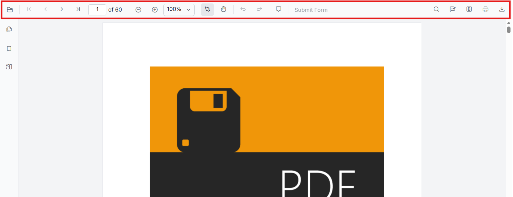
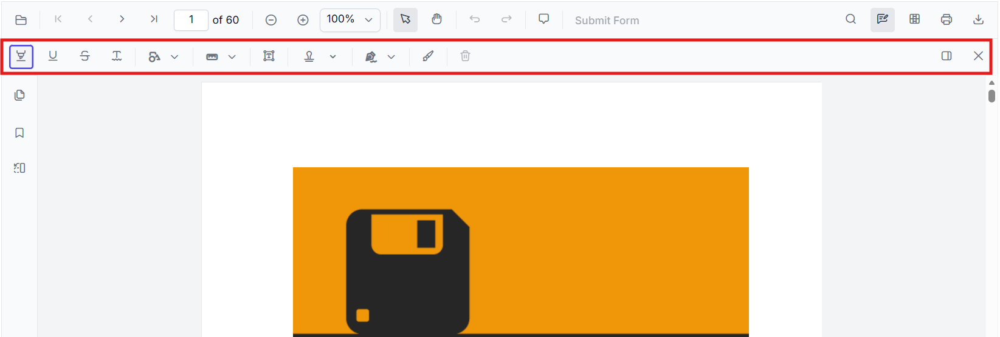
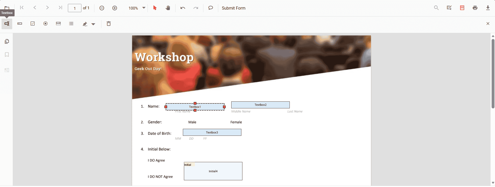
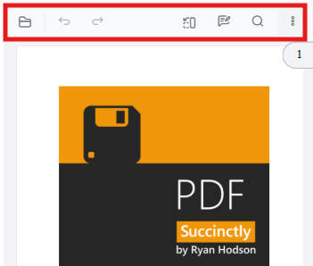
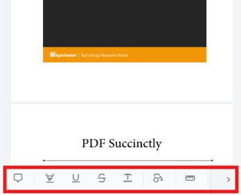

# Toolbar overview in Angular PDF Viewer

## Overview

This page provides a concise reference describing the toolbars available in the EJ2 Angular PDF Viewer component. It also explains what each toolbar is for and when it appears.

**Scope**: covers available toolbars and their functions.

## List of Available Toolbars

- [Primary toolbar](#primary-toolbar)
- [Annotation toolbar](#annotation-toolbar)
- [Form Designer toolbar](#form-designer-toolbar)
- [Mobile toolbar](#mobile-toolbar)
- [Custom toolbar](./custom-toolbar)

## Functional overview of each toolbar

### Primary toolbar

The primary toolbar presents core viewer actions such as open/load, page navigation, zoom controls, and print. It appears in standard desktop layouts and at the top of the viewer when `ToolbarService` is injected. Typical actions: page forward/back, zoom in/out, fit-to-page, print.

For detailed information, see [Customize Primary Toolbar](./primary-toolbar).

### Annotation toolbar

The annotation toolbar surfaces annotation-related tools for adding, editing, and deleting annotations (text markup, shapes, stamps). It appears when `AnnotationService` is enabled and when a user opens annotation mode. Typical actions: highlight, underline, draw shape, add sticky note, delete annotation.

For detailed information, see [Customize Annotation Toolbar](./annotation-toolbar).

### Form Designer toolbar

Form designer toolbar provides form-field authoring controls used when designing or editing form fields inside a PDF. It appears when `FormDesignerService` is enabled (design mode) and contains actions for adding form field controls.

For detailed information, see [Customize Form Designer Toolbar](./form-designer-toolbar).

### Mobile toolbar

- A compact toolbar layout optimized for small screens and touch interactions. It appears automatically on mobile-sized view ports (or when a mobile layout is explicitly chosen) and contains the most frequently used actions in a space-efficient arrangement.

    

- Annotation toolbar in mobile mode appears at the bottom of the PDF Viewer component.

    

For detailed information, see [Customize Mobile Toolbar](./mobile-toolbar).

## Show or hide toolbar items

The following quick links describe how to customize, show, or hide specific toolbar items. Each linked page defines custom toolbar configurations and examples.

- [Show or hide annotation toolbar items](./annotation-toolbar#2-show-or-hide-annotation-toolbar-items)
- [Show or hide form designer toolbar items](./form-designer-toolbar#3-show-or-hide-form-designer-toolbar-items)
- [Show or hide primary toolbar items](./primary-toolbar#3-show-or-hide-primary-toolbar-items)
- [Add a custom primary toolbar item](./primary-toolbar#4-add-a-custom-primary-toolbar-item)

## Further Reading

- [Customize annotation toolbar](./annotation-toolbar)
- [Customize form designer toolbar](./form-designer-toolbar)
- [Customize mobile toolbar](./mobile-toolbar)
- [Customize primary toolbar](./primary-toolbar)
- [Create a custom toolbar](./custom-toolbar)