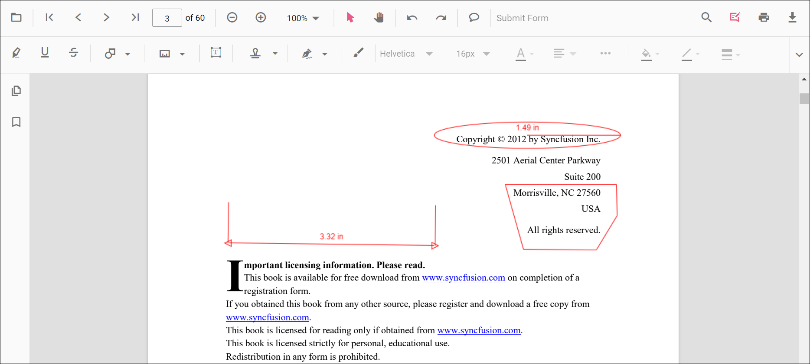
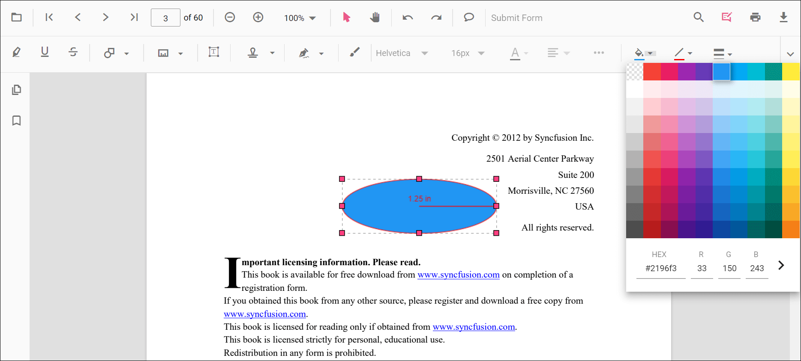
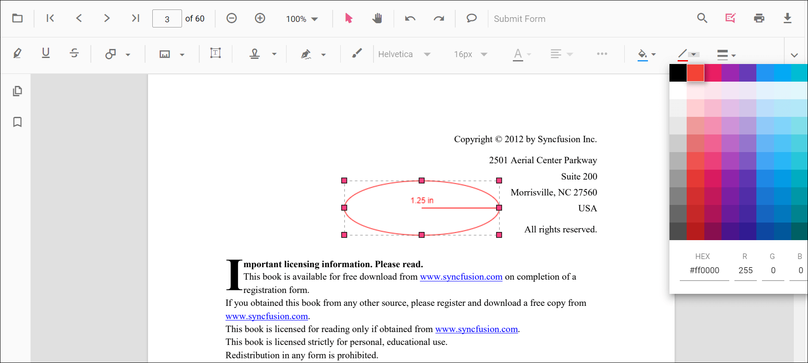
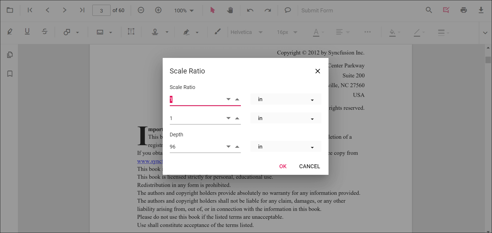

# Measurement Annotation in the ASP.NET MVC PDF Viewer component

The PDF Viewer provides the options to add measurement annotations. You can measure the page annotations with the help of measurement annotation. The supported measurement annotations in the PDF Viewer control are:

* Distance
* Perimeter
* Area
* Radius
* Volume

## Adding a measurement annotation to the PDF document

The measurement annotations can be added to the PDF document using the annotation toolbar.

* Click the **Edit Annotation** button in the PDF Viewer toolbar. A toolbar appears below it.
* Click the **Measurement Annotation** dropdown button. A dropdown pop-up will appear and shows the measurement annotations to be added.
* Select the measurement type to be added to the page in the dropdown pop-up. It enables the selected measurement annotation mode.
* You can measure and add the annotation over the pages of the PDF document.

In the pan mode, if the measurement annotation mode is entered, the PDF Viewer control will switch to text select mode.

Refer to the following code sample to switch to the distance annotation mode.




<!--Element to set measurement annotation mode-->
<button id="set" onclick="addAnnot()">Distance</button>

    @Html.EJS().PdfViewer("pdfviewer").DocumentPath("https://cdn.syncfusion.com/content/pdf/pdf-succinctly.pdf").Render()




<!--Element to set measurement annotation mode-->
<button id="set" onclick="addAnnot()">Distance</button>

    @Html.EJS().PdfViewer("pdfviewer").ServiceUrl(VirtualPathUtility.ToAbsolute("~/PdfViewer/")).DocumentPath("https://cdn.syncfusion.com/content/pdf/pdf-succinctly.pdf").Render()




## Adding a measurement annotation to the PDF document Programmatically

With the PDF Viewer library, you can add a measurement annotation to the PDF Viewer control programmatically using the **addAnnotation()** method.

Here's a example of how you can utilize the **addAnnotation()** method to include a measurement annotation programmatically:




<button onclick="addDistanceAnnotation()">Add Distance Annotation programatically</button>
<button onclick="addPerimeterAnnotation()">Add Perimeter Annotation programatically</button>
<button onclick="addAreaAnnotation()">Add Area Annotation programatically</button>
<button onclick="addRadiusAnnotation()">Add Radius Annotation programatically</button>
<button onclick="addVolumeAnnotation()">Add Volume Annotation programatically</button>

    @Html.EJS().PdfViewer("pdfviewer").DocumentPath("https://cdn.syncfusion.com/content/pdf/pdf-succinctly.pdf").Render()




<button onclick="addDistanceAnnotation()">Add Distance Annotation programatically</button>
<button onclick="addPerimeterAnnotation()">Add Perimeter Annotation programatically</button>
<button onclick="addAreaAnnotation()">Add Area Annotation programatically</button>
<button onclick="addRadiusAnnotation()">Add Radius Annotation programatically</button>
<button onclick="addVolumeAnnotation()">Add Volume Annotation programatically</button>

    @Html.EJS().PdfViewer("pdfviewer").ServiceUrl(VirtualPathUtility.ToAbsolute("~/PdfViewer/")).DocumentPath("https://cdn.syncfusion.com/content/pdf/pdf-succinctly.pdf").Render()




## Edit the existing measurement annotation programmatically

To modify existing measurement annotation in the Syncfusion&reg; PDF viewer programmatically, you can use the **editAnnotation()** method.

Here is an example of how you can use the **editAnnotation()** method:




<button onclick="editDistanceAnnotation()">edit Distance Annotation programatically</button>
<button onclick="editPerimeterAnnotation()">edit Perimeter Annotation programatically</button>
<button onclick="editAreaAnnotation()">edit Area Annotation programatically</button>
<button onclick="editRadiusAnnotation()">edit Radius Annotation programatically</button>
<button onclick="editVolumeAnnotation()">edit Volume Annotation programatically</button>

    @Html.EJS().PdfViewer("pdfviewer").DocumentPath("https://cdn.syncfusion.com/content/pdf/pdf-succinctly.pdf").Render()




<button onclick="editDistanceAnnotation()">edit Distance Annotation programatically</button>
<button onclick="editPerimeterAnnotation()">edit Perimeter Annotation programatically</button>
<button onclick="editAreaAnnotation()">edit Area Annotation programatically</button>
<button onclick="editRadiusAnnotation()">edit Radius Annotation programatically</button>
<button onclick="editVolumeAnnotation()">edit Volume Annotation programatically</button>

    @Html.EJS().PdfViewer("pdfviewer").ServiceUrl(VirtualPathUtility.ToAbsolute("~/PdfViewer/")).DocumentPath("https://cdn.syncfusion.com/content/pdf/pdf-succinctly.pdf").Render()




## Editing the properties of measurement annotation

The fill color, stroke color, thickness, and opacity of the measurement annotation can be edited using the Edit Color tool, Edit Stroke Color tool, Edit Thickness tool, and Edit Opacity tool in the annotation toolbar.

### Editing fill color

The fill color of the annotation can be edited using the color palette provided in the Edit Color tool.

### Editing stroke color

The stroke color of the annotation can be edited using the color palette provided in the Edit Stroke Color tool.

### Editing thickness

The thickness of the border of the annotation can be edited using the range slider provided in the Edit thickness tool.

### Editing opacity

The opacity of the annotation can be edited using the range slider provided in the Edit Opacity tool.

### Editing the line properties

The properties of the line shapes such as distance and perimeter annotations can be edited using the Line properties window. It can be opened by selecting the Properties option in the context menu that appears on right-clicking the distance and perimeter annotations.

## Setting default properties during control initialization

The properties of the shape annotations can be set before creating the control using DistanceSettings, PerimeterSettings, AreaSettings, RadiusSettings, and VolumeSettings.
Refer to the following code sample to set the default annotation settings.




    @Html.EJS().PdfViewer("pdfviewer").DocumentPath("https://cdn.syncfusion.com/content/pdf/pdf-succinctly.pdf").DistanceSettings(new Syncfusion.EJ2.PdfViewer.PdfViewerDistanceSettings { FillColor = "blue", Opacity = 0.6, StrokeColor = "green" }).PerimeterSettings(new Syncfusion.EJ2.PdfViewer.PdfViewerPerimeterSettings { FillColor = "green", Opacity = 0.6, StrokeColor = "blue" }).AreaSettings(new Syncfusion.EJ2.PdfViewer.PdfViewerAreaSettings { FillColor = "yellow", Opacity = 0.6, StrokeColor = "orange" }).RadiusSettings(new Syncfusion.EJ2.PdfViewer.PdfViewerRadiusSettings { FillColor = "orange", Opacity = 0.6, StrokeColor = "pink" }).VolumeSettings(new Syncfusion.EJ2.PdfViewer.PdfViewerVolumeSettings { FillColor = "pink", Opacity = 0.6, StrokeColor = "yellow" }).Render()




    @Html.EJS().PdfViewer("pdfviewer").ServiceUrl(VirtualPathUtility.ToAbsolute("~/PdfViewer/")).DocumentPath("https://cdn.syncfusion.com/content/pdf/pdf-succinctly.pdf").DistanceSettings(new Syncfusion.EJ2.PdfViewer.PdfViewerDistanceSettings { FillColor = "blue", Opacity = 0.6, StrokeColor = "green" }).PerimeterSettings(new Syncfusion.EJ2.PdfViewer.PdfViewerPerimeterSettings { FillColor = "green", Opacity = 0.6, StrokeColor = "blue" }).AreaSettings(new Syncfusion.EJ2.PdfViewer.PdfViewerAreaSettings { FillColor = "yellow", Opacity = 0.6, StrokeColor = "orange" }).RadiusSettings(new Syncfusion.EJ2.PdfViewer.PdfViewerRadiusSettings { FillColor = "orange", Opacity = 0.6, StrokeColor = "pink" }).VolumeSettings(new Syncfusion.EJ2.PdfViewer.PdfViewerVolumeSettings { FillColor = "pink", Opacity = 0.6, StrokeColor = "yellow" }).Render()




## Editing scale ratio and unit of the measurement annotation

The scale ratio and unit of measurement can be modified using the scale ratio option provided in the context menu of the PDF Viewer control.

The Units of measurements supported for the measurement annotations in the PDF Viewer are:

* Inch
* Millimeter
* Centimeter
* Point
* Pica
* Feet

## Setting default scale ratio settings during the control initialization

The properties of scale ratio for measurement annotation can be set before creating the control using the ScaleRatioSettings as shown in the following code sample.




    @Html.EJS().PdfViewer("pdfviewer").DocumentPath("https://cdn.syncfusion.com/content/pdf/pdf-succinctly.pdf").MeasurementSettings(new Syncfusion.EJ2.PdfViewer.PdfViewerMeasurementSettings { ScaleRatio = 2, ConversionUnit = Syncfusion.EJ2.PdfViewer.CalibrationUnit.Cm }).Render()




     @Html.EJS().PdfViewer("pdfviewer").ServiceUrl(VirtualPathUtility.ToAbsolute("~/PdfViewer/")).DocumentPath("https://cdn.syncfusion.com/content/pdf/pdf-succinctly.pdf").MeasurementSettings(new Syncfusion.EJ2.PdfViewer.PdfViewerMeasurementSettings { ScaleRatio = 2, ConversionUnit = Syncfusion.EJ2.PdfViewer.CalibrationUnit.Cm }).Render()


