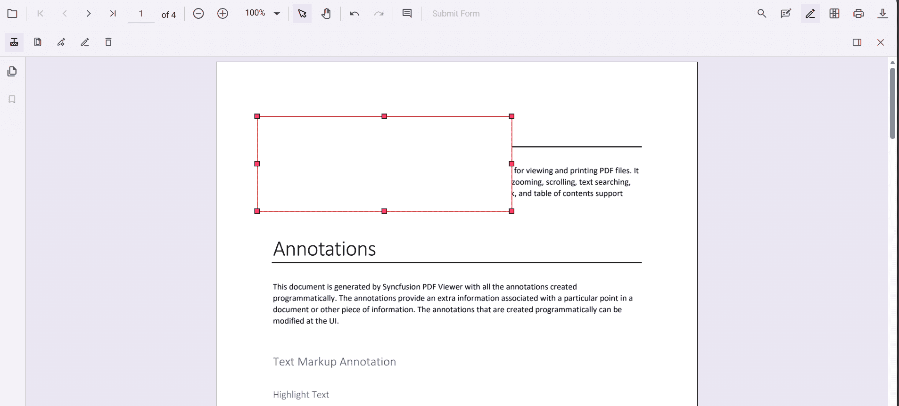

# Redaction in ASP.NET Core PdfViewer

Redaction annotations hide confidential or sensitive information in a PDF. The Syncfusion ASP.NET Core PDF Viewer enables marking areas or entire pages for redaction, customizing their appearance, and permanently applying redactions.

## Enable the redaction toolbar

To enable the redaction toolbar, configure the `toolbarSettings.toolbarItems` property of the PdfViewer instance to include the **RedactionEditTool**.

The following example shows how to enable the redaction toolbar:




    <ejs-pdfviewer
        id="pdfViewer"
        style="height:640px; display:block"
        resourceUrl="https://cdn.syncfusion.com/ej2/31.2.12/dist/ej2-pdfviewer-lib"
        documentPath="https://cdn.syncfusion.com/content/pdf/pdf-succinctly.pdf">
    </ejs-pdfviewer>




N> Prerequisites: Add the PdfViewer control to the ASP.NET Core application and confirm that the redaction feature is available in the used product version. Applying redaction permanently removes the selected content.

## Add Redaction Annotations

Mark specific content for redaction using the toolbar or programmatically.

Select the **Redaction tool** and draw over the text or graphics to hide. Optionally add overlay text (for example, “Confidential”) and adjust the style: fill color, border color, and opacity.

## Delete Redaction Annotations

Remove redaction annotations by either:

- Clicking the **Delete** button on the toolbar, or
- Selecting the annotation and pressing the **Delete** key.

## Redact Entire Pages

Redact whole pages that contain sensitive information. Choose specific pages, page ranges, or redact all pages using the built‑in dialog, or perform the same action programmatically.

## Apply Redaction

After adding annotations, permanently apply them to the document. This action is irreversible.

Use the **Apply Redaction** button on the toolbar or call the API method:

- The button remains disabled until at least one redaction annotation exists.
- It becomes active when redaction annotations are present.

A confirmation dialog appears before applying redaction to ensure you acknowledge the irreversible nature of the process.

N> After redaction is applied, the original content cannot be recovered.

## Comment Support

Redaction annotations can include comments using the built‑in comment panel. This helps you add notes, track reviews, or record the reason for redaction.  

Comments can be added through the UI or API. For more details, see the [Comments documentation](../annotations/comments).

## Import and Export Redaction Annotations

You can save and reload redaction annotations by exporting and importing them in JSON format. This makes it easy to persist annotations or share them across sessions.

For more details, see the [Export and import annotations documentation](../how-to/import-export-annotation).

## See also

* [Redaction UI interactions](./ui-interaction)
* [Redaction Programmatic support](./programmatic-support)
* [Redaction Toolbar](./toolbar)
* [Redaction Mobile view](./mobile-view)
* [Search Text and Redact](./search-redact)
