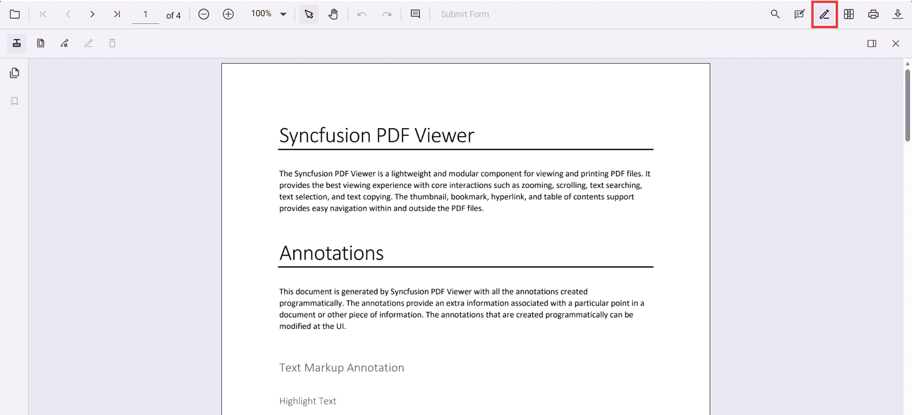
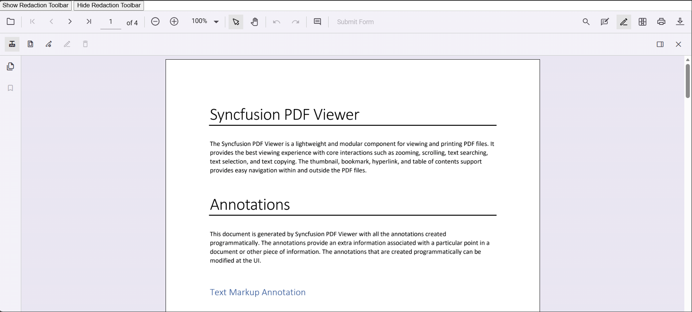

# Customize the Redaction Toolbar in ASP.NET Core PDF Viewer

This guide shows how to enable and control the redaction toolbar in the ASP.NET Core PDF Viewer, including showing/hiding it from the primary toolbar programmatically.

**Outcome**: a working viewer with the Redaction toolbar available and code to toggle it.

## Prerequisites

- Syncfusion ASP.NET Core PDF Viewer installed and added to your project. See [getting started guide](../getting-started).
- A public PDF or service endpoint (the examples use a CDN-hosted PDF and the Syncfusion resource URL).

## Steps

### Enable redaction toolbar

To enable the redaction toolbar, configure the `toolbarSettings.toolbarItems` property of the PdfViewer instance to include the **RedactionEditTool**.

The following example shows how to enable the redaction toolbar:




    <ejs-pdfviewer
        id="pdfViewer"
        style="height:640px; display:block"
        resourceUrl="https://cdn.syncfusion.com/ej2/31.2.12/dist/ej2-pdfviewer-lib"
        documentPath="https://cdn.syncfusion.com/content/pdf/pdf-succinctly.pdf">
    </ejs-pdfviewer>




Refer to the following image for the toolbar view:

**Expected result**: the primary toolbar contains the Redaction icon. Clicking it opens the redaction toolbar.

## Show or hide the redaction toolbar

Toggle the redaction toolbar using the built‑in toolbar icon or programmatically with the `showRedactionToolbar` method.

### Display the redaction toolbar using the toolbar icon

When `RedactionEditTool` is included in the toolbar settings, clicking the redaction icon in the primary toolbar shows or hides the redaction toolbar.

### Display the redaction toolbar programmatically

Control visibility in code by calling `viewer.toolbar.showRedactionToolbar(true)` or `viewer.toolbar.showRedactionToolbar(false)`.

The following example demonstrates toggling the redaction toolbar programmatically:




    <!-- Separate buttons: Show and Hide Redaction toolbar -->
    

        <button type="button" onclick="showRedactionToolbar()">Show Redaction Toolbar</button>
        <button type="button" onclick="hideRedactionToolbar()">Hide Redaction Toolbar</button>
    

    <ejs-pdfviewer
        id="pdfViewer"
        style="height:640px; display:block"
        resourceUrl="https://cdn.syncfusion.com/ej2/31.2.12/dist/ej2-pdfviewer-lib"
        documentPath="https://cdn.syncfusion.com/content/pdf/pdf-succinctly.pdf">
    </ejs-pdfviewer>




[View Sample in GitHub](https://github.com/SyncfusionExamples/asp-core-pdf-viewer-examples)

Refer to the following image for details:

## Troubleshooting

- If redaction icon not visible, ensure that `'RedactionEditTool'` is added to `toolbarSettings.toolbarItems` and `Toolbar` is included in the injected services.
- If toolbar buttons have no effect, verify `resourceUrl` points to a reachable `ej2-pdfviewer-lib` bundle appropriate for your viewer version.
- If viewer fails to load PDF, use a public PDF URL or configure a server-side service endpoint.

## Related topics

- [Adding the redaction annotation in PDF viewer](./overview)
- [Redaction UI interactions](./ui-interaction)
- [Programmatic support](./programmatic-support)
- [Mobile view](./mobile-view)
- [Search Text and Redact](./search-redact)