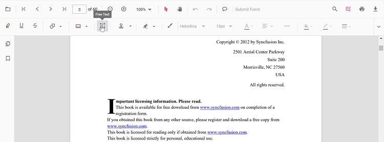

# Add Free Text Annotations in ASP.NET Core PDF Viewer
Free Text annotations let users place editable text boxes on a PDF page to add comments, labels, or notes without changing the original document content.

## Enable Free Text in the Viewer

To enable Free Text annotations, inject the following modules into the ASP.NET Core PDF Viewer:




    <ejs-pdfviewer id="pdfviewer"
                   style="height:600px"
                   documentPath="https://cdn.syncfusion.com/content/pdf/pdf-succinctly.pdf"
                   resourceUrl="https://cdn.syncfusion.com/ej2/31.2.2/dist/ej2-pdfviewer-lib">
    </ejs-pdfviewer>




## Add Free Text

### Add Free Text Using the Toolbar
1. Open the **Annotation Toolbar**.
2. Click **Free Text** to enable Free Text mode.
3. Click on the page to place the text box and start typing.

N>* When Pan mode is active, choosing Free Text switches the viewer into the appropriate selection/edit workflow for a smoother experience.

### Enable Free Text Mode

Programmatically switch to Free Text mode.







#### Exit Free Text Mode






### Add Free Text Programmatically

Use the [`addAnnotation`](https://ej2.syncfusion.com/javascript/documentation/api/pdfviewer/index-default#addannotation) API to create a text box at a given location with desired styles.







## Customize Free Text Appearance

Configure default properties using the [`FreeTextSettings`](https://help.syncfusion.com/cr/aspnetcore-js2/syncfusion.ej2.pdfviewer.pdfviewer.html#Syncfusion_EJ2_PdfViewer_PdfViewer_FreeTextSettings) property (for example, default **fill color**, **border color**, **font color**, **opacity**, and **auto‑fit**). 




    <ejs-pdfviewer id="pdfviewer"
                   style="height:650px"
                   documentPath="https://cdn.syncfusion.com/content/pdf/pdf-succinctly.pdf"
                   resourceUrl="https://cdn.syncfusion.com/ej2/31.2.2/dist/ej2-pdfviewer-lib">
    </ejs-pdfviewer>




N> To tailor right‑click options, see [**Customize Context Menu**](../../context-menu/custom-context-menu).

## Modify, Edit, Delete Free Text

- **Move/Resize**: Drag the box or use the resize handles.
- **Edit Text**: Click inside the box and type.
- **Delete**: Use the toolbar or context menu options. For deletion workflows and API details, see [**Delete Annotation**](../remove-annotations).

### Edit Free Text

#### Edit Free Text (UI)

Use the annotation toolbar to configure font family, size, color, alignment, styles, fill color, stroke color, border thickness, and opacity.

- Edit the **font family** using the Font Family tool.

- Edit the **font size** using the Font Size tool.  

- Edit the **font color** using the Font Color tool.  

- Edit the **text alignment** using the Text Alignment tool.  

- Edit the **font styles** (bold, italic, underline) using the Font Style tool.

- Edit the **fill color** using the Edit Color tool.  

- Edit the **stroke color** using the color palette in the Edit Stroke Color tool.

- Edit the **border thickness** using the Edit Thickness tool.  

- Edit the **opacity** using the Edit Opacity tool.  

#### Edit Free Text Programmatically

Update bounds or text and call `editAnnotation()`.







N> Free Text annotations do **not** modify the original PDF text; they overlay editable text boxes on top of the page content.

### Delete Free Text

Delete Free Text via UI (toolbar/context menu) or programmatically. For supported workflows and APIs, see [**Delete Annotation**](../remove-annotations).

## Set Default Properties During Initialization
Apply defaults for new text boxes using the [`freeTextSettings`](https://help.syncfusion.com/cr/aspnetcore-js2/syncfusion.ej2.pdfviewer.pdfviewer.html#Syncfusion_EJ2_PdfViewer_PdfViewer_FreeTextSettings) property. You can also enable **Auto‑fit** so the box expands with content.




    <ejs-pdfviewer id="pdfviewer"
                   style="height:650px"
                   documentPath="https://cdn.syncfusion.com/content/pdf/pdf-succinctly.pdf"
                   resourceUrl="https://cdn.syncfusion.com/ej2/31.2.2/dist/ej2-pdfviewer-lib">
    </ejs-pdfviewer>




## Free Text Annotation Events

Listen to add/modify/select/remove events for Free Text and handle them as needed. For the full list and parameters, see [**Annotation Events**](../annotation-event).

## Export and Import

Free Text annotations can be exported or imported just like other annotations. For supported formats and steps, see [**Export and Import annotations**](../export-import-annotations).

## See Also
- [Annotation Toolbar](../../toolbar-customization/annotation-toolbar)
- [Customize Context Menu](../../context-menu/custom-context-menu)
- [Comments Panel](../comments)
- [Annotation Events](../annotation-event)
- [Export and Import annotations](../export-import-annotations)
- [Delete Annotations](../remove-annotations)
