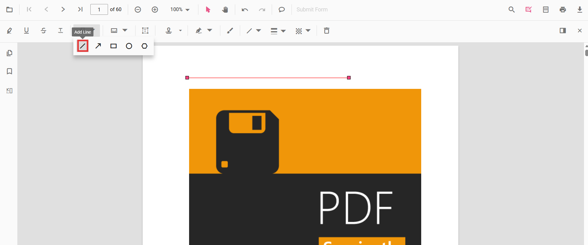

# Line Annotation (Shape) in ASP.NET Core PDF Viewer

Line annotations allow users to draw straight connectors or callouts on PDFs for markup, review, diagrams, or measurement guides. They support customization of color, thickness, opacity, and arrowheads, and can be edited, resized, deleted, or exported along with the document.

## Enable Line Annotation in the Viewer

In the ASP.NET Core PDF Viewer, annotation modules such as Line annotation are enabled by default.



    <ejs-pdfviewer id="pdfviewer"
                   style="height:600px"
                   documentPath="https://cdn.syncfusion.com/content/pdf/pdf-succinctly.pdf"
                   resourceUrl="https://cdn.syncfusion.com/ej2/31.2.2/dist/ej2-pdfviewer-lib">
    </ejs-pdfviewer>




## Add Line Annotation

### Add Line Annotation Using the Toolbar

1. Open the **Annotation Toolbar**.
2. Select **Shapes** → **Line**.
3. Click and drag on the PDF page to draw the line.

N> When in Pan mode, selecting a shape tool automatically switches the viewer to selection mode for smooth interaction.

### Enable Line Mode

Switch the viewer into line mode using `setAnnotationMode('Line')`.







#### Exit Line Mode

Switch back to normal mode using:







### Add Line Programmatically

You can add line annotations using the [`addAnnotation`](https://ej2.syncfusion.com/javascript/documentation/api/pdfviewer/index-default#addannotation) API.







## Customize Line Appearance

Configure default line appearance using the [`lineSettings`](https://help.syncfusion.com/cr/aspnetcore-js2/syncfusion.ej2.pdfviewer.pdfviewer.html#Syncfusion_EJ2_PdfViewer_PdfViewer_LineSettings) property.




    <ejs-pdfviewer id="pdfviewer"
                   style="height:650px"
                   documentPath="https://cdn.syncfusion.com/content/pdf/pdf-succinctly.pdf"
                   resourceUrl="https://cdn.syncfusion.com/ej2/31.2.2/dist/ej2-pdfviewer-lib">
    </ejs-pdfviewer>




N> Fill color is available only when an arrowhead style is applied at the Start or End of the line. If both are set to `None`, the Fill option is disabled.

## Manage Line (Edit, Move, Resize, Delete)

### Edit Line 

#### Edit Line Appearance (UI)
- Select a line to view resize handles.
- Drag endpoints to adjust length/angle.
- Edit stroke color, opacity, and thickness using the annotation toolbar.

Use the annotation toolbar:
- **Edit Color** tool  

- **Edit Opacity** slider

- **Line Properties** 
Open the Line Properties dialog via **Right Click → Properties**.

#### Edit Line Programmatically

Modify an existing Line programmatically using `editAnnotation()`.







### Delete Line

The PDF Viewer supports deleting existing annotations through the UI and API.
See [**Delete Annotation**](../remove-annotations) for full behavior and workflows.

### Comments

Use the [**Comments panel**](../comments) to add, view, and reply to threaded discussions linked to line annotations. It provides a dedicated interface for collaboration and review within the PDF Viewer.

## Set properties while adding Individual Annotation

Set properties for individual line annotations using the [`lineSettings`](https://help.syncfusion.com/cr/aspnetcore-js2/syncfusion.ej2.pdfviewer.pdfviewer.html#Syncfusion_EJ2_PdfViewer_PdfViewer_LineSettings) API or by passing per‑annotation values during [`addAnnotation`](https://ej2.syncfusion.com/javascript/documentation/api/pdfviewer/index-default#addannotation).







## Disable Line Annotation

Disable shape annotations (Line, Arrow, Rectangle, Circle, Polygon) using the [`enableShapeAnnotation`](https://help.syncfusion.com/cr/aspnetcore-js2/syncfusion.ej2.pdfviewer.pdfviewer.html#Syncfusion_EJ2_PdfViewer_PdfViewer_EnableShapeAnnotation) property.




    <ejs-pdfviewer id="pdfviewer"
                   style="height:650px"
                   documentPath="https://cdn.syncfusion.com/content/pdf/pdf-succinctly.pdf"
                   resourceUrl="https://cdn.syncfusion.com/ej2/31.2.2/dist/ej2-pdfviewer-lib"
                   enableShapeAnnotation ="false">
    </ejs-pdfviewer>




## Handle Line Events

The PDF viewer provides annotation life-cycle events that notify when Line annotations are added, modified, selected, or removed.
For the full list of available events and their descriptions, see [**Annotation Events**](../annotation-event)

## Export and Import
The PDF Viewer supports exporting and importing annotations. For details on supported formats and workflows, see [**Export and Import annotations**](../export-import-annotations).

## See Also
- [Annotation Toolbar](../../toolbar-customization/annotation-toolbar)
- [Customize Context Menu](../../context-menu/custom-context-menu)
- [Comments Panel](../comments)
- [Annotation Events](../annotation-event)
- [Export and Import annotations](../export-import-annotations)
- [Delete Annotations](../remove-annotations)
