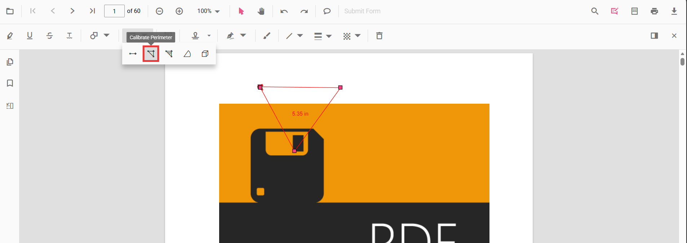
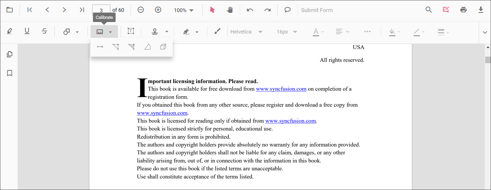
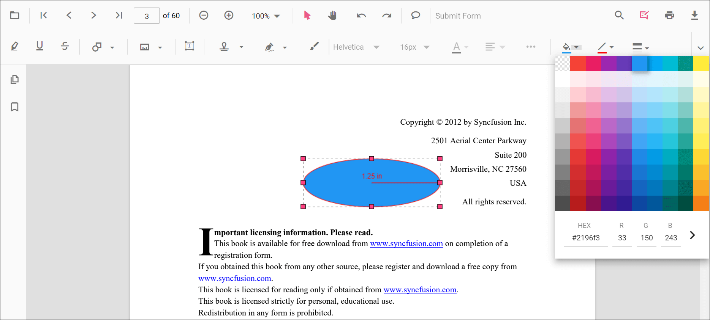
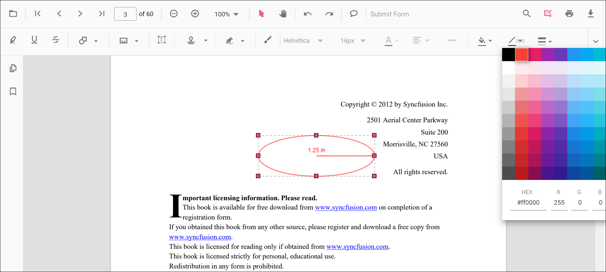
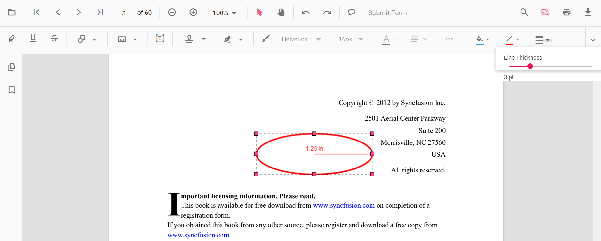
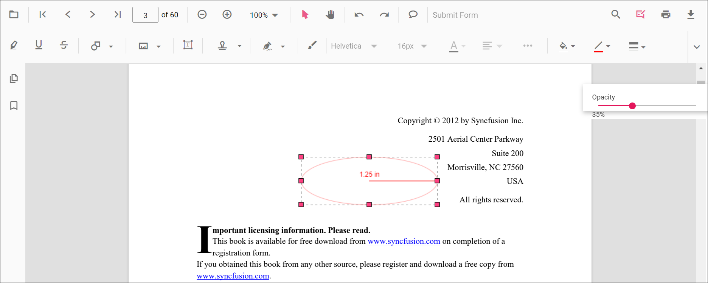
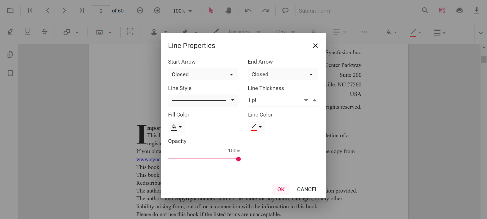
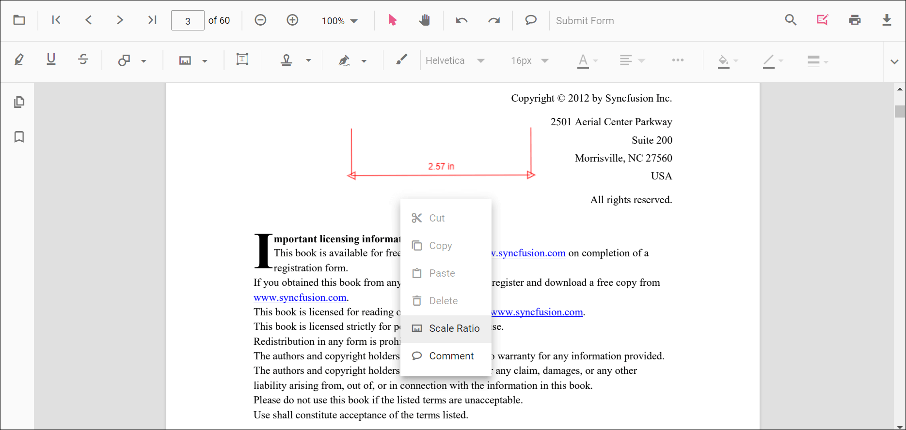
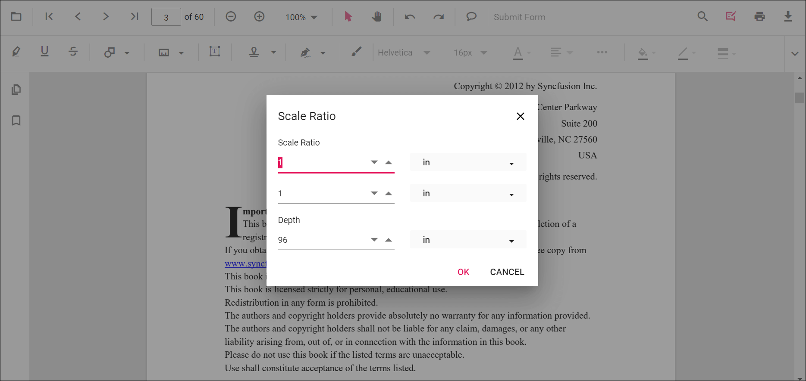

# Add Perimeter Measurement Annotations in ASP.NET Core PDF Viewer
Perimeter is a measurement annotation used to calculate the length around a closed polyline on a PDF page—useful for technical markups and reviews. 

## Enable Perimeter Measurement

In the ASP.NET Core PDF Viewer, annotation modules such as Perimeter annotation are enabled by default.



    <ejs-pdfviewer id="pdfviewer"
                   style="height:650px"
                   documentPath="https://cdn.syncfusion.com/content/pdf/pdf-succinctly.pdf"
                   resourceUrl="https://cdn.syncfusion.com/ej2/31.2.2/dist/ej2-pdfviewer-lib">
    </ejs-pdfviewer>




## Add Perimeter Annotation

### Add Perimeter Annotation Using the Toolbar

1. Open the **Annotation Toolbar**.
2. Select **Measurement** → **Perimeter**.
3. Click multiple points to define the polyline; double‑click to close and finalize the perimeter.

N> If Pan mode is active, choosing a measurement tool switches the viewer into the appropriate interaction mode for a smoother workflow.

### Enable Perimeter Mode
Programmatically switch the viewer into Perimeter mode.







#### Exit Perimeter Mode






### Add Perimeter Programmatically
Use the [`addAnnotation`](https://ej2.syncfusion.com/javascript/documentation/api/pdfviewer/index-default#addannotation) API to draw a perimeter by providing multiple **vertexPoints**.







## Customize Perimeter Appearance
Configure default properties using the [`Perimeter Settings`](https://ej2.syncfusion.com/aspnetcore/documentation/api/pdfviewer/index-default#perimetersettings) property (for example, default **fill color**, **stroke color**, **opacity**).




    <ejs-pdfviewer id="pdfviewer"
                   style="height:650px"
                   documentPath="https://cdn.syncfusion.com/content/pdf/pdf-succinctly.pdf"
                   resourceUrl="https://cdn.syncfusion.com/ej2/31.2.2/dist/ej2-pdfviewer-lib">
    </ejs-pdfviewer>




## Manage Perimeter (Move, Reshape, Edit, Delete)
- **Move**: Drag inside the shape to reposition it.
- **Reshape**: Drag any vertex handle to adjust points and shape.

### Edit Perimeter

#### Edit Perimeter (UI)

- Edit the **fill color** using the Edit Color tool.  
  
- Edit the **stroke color** using the Edit Stroke Color tool.  
  
- Edit the **border thickness** using the Edit Thickness tool.  
  
- Edit the **opacity** using the Edit Opacity tool.  
  
- Open **Right Click → Properties** for additional line‑based options.
  

#### Edit Perimeter Programmatically
Update properties and call `editAnnotation()`.







### Delete Distance Annotation

Delete Distance Annotation via UI (toolbar/context menu) or programmatically. For supported workflows and APIs, see [**Delete Annotation**](../remove-annotations).

## Set Default Properties During Initialization
Apply defaults for Perimeter using the [`perimeterSettings`](https://help.syncfusion.com/cr/aspnetcore-js2/syncfusion.ej2.pdfviewer.pdfviewer.html#Syncfusion_EJ2_PdfViewer_PdfViewer_PerimeterSettings) property.




    <ejs-pdfviewer id="pdfviewer"
                   style="height:650px"
                   documentPath="https://cdn.syncfusion.com/content/pdf/pdf-succinctly.pdf"
                   resourceUrl="https://cdn.syncfusion.com/ej2/31.2.2/dist/ej2-pdfviewer-lib">
    </ejs-pdfviewer>




## Set Properties While Adding Individual Annotation
Pass per‑annotation values directly when calling [`addAnnotation`](https://ej2.syncfusion.com/javascript/documentation/api/pdfviewer/index-default#addannotation).







## Scale Ratio and Units

- Use **Scale Ratio** from the context menu to set the actual‑to‑page scale.  
  
- Supported units include **Inch, Millimeter, Centimeter, Point, Pica, Feet**.  
  

### Set Default Scale Ratio During Initialization
Configure scale defaults using [`measurementSettings`](https://help.syncfusion.com/cr/aspnetcore-js2/syncfusion.ej2.pdfviewer.pdfviewer.html#Syncfusion_EJ2_PdfViewer_PdfViewer_MeasurementSettings).




    <ejs-pdfviewer id="pdfviewer"
                   style="height:650px"
                   documentPath="https://cdn.syncfusion.com/content/pdf/pdf-succinctly.pdf"
                   resourceUrl="https://cdn.syncfusion.com/ej2/31.2.2/dist/ej2-pdfviewer-lib">
    </ejs-pdfviewer>




## Handle Perimeter Events

Listen to annotation life-cycle events (add/modify/select/remove). For the full list and parameters, see [**Annotation Events**](../annotation-event).

## Export and Import
Perimeter measurements can be exported or imported with other annotations. For workflows and supported formats, see [**Export and Import annotations**](../export-import-annotations).

## See Also
- [Annotation Toolbar](../../toolbar-customization/annotation-toolbar)
- [Customize Context Menu](../../context-menu/custom-context-menu)
- [Comments Panel](../comments)
- [Annotation Events](../annotation-event)
- [Export and Import annotations](../export-import-annotations)
- [Delete Annotations](../remove-annotations)
