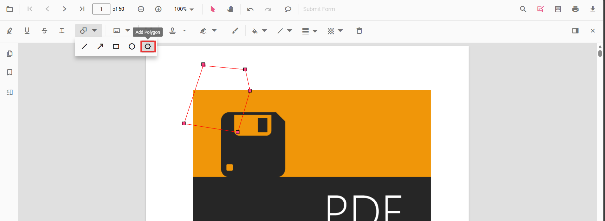

# Polygon Annotation (Shape) in ASP.NET Core PDF Viewer
Polygon annotations allow users to outline irregular regions, draw custom shapes, highlight non-rectangular areas, or create specialized callouts on PDFs for review and markup.

## Enable Polygon Annotation in the Viewer

In the ASP.NET Core PDF Viewer, annotation modules such as Polygon annotation are enabled by default.




    <ejs-pdfviewer id="pdfviewer"
                   style="height:650px"
                   documentPath="https://cdn.syncfusion.com/content/pdf/pdf-succinctly.pdf"
                   resourceUrl="https://cdn.syncfusion.com/ej2/31.2.2/dist/ej2-pdfviewer-lib">
    </ejs-pdfviewer>




##  Add Polygon Annotation

### Add Polygon Annotation Using the Toolbar
1. Open the **Annotation Toolbar**.
2. Select **Shapes** → **Polygon**.
3. Click multiple points on the page to draw the polygon.
4. Double-click to finalize the shape.

N> When in Pan mode, selecting a shape tool automatically switches the viewer to selection mode for smooth interaction.

### Enable Polygon Mode

Switch the viewer into polygon mode using `setAnnotationMode('Polygon')`.







#### Exit Polygon Mode

Switch back to normal mode using:







### Add Polygon Programmatically
Use the [`addAnnotation`](https://ej2.syncfusion.com/javascript/documentation/api/pdfviewer/index-default#addannotation) API to draw a polygon by specifying multiple `vertexPoints`.







## Customize Polygon Appearance
Configure default polygon appearance (fill color, stroke color, thickness, opacity) using the [`polygonSettings`](https://help.syncfusion.com/cr/aspnetcore-js2/syncfusion.ej2.pdfviewer.pdfviewer.html#Syncfusion_EJ2_PdfViewer_PdfViewer_PolygonSettings) property.




    <ejs-pdfviewer id="pdfviewer"
                   style="height:650px"
                   documentPath="https://cdn.syncfusion.com/content/pdf/pdf-succinctly.pdf"
                   resourceUrl="https://cdn.syncfusion.com/ej2/31.2.2/dist/ej2-pdfviewer-lib">
    </ejs-pdfviewer>




## Manage Polygon (Edit, Move, Resize, Delete)

### Edit Circle

#### Edit Circle (UI)

- Select a Circle to view resize handles.
- Drag any side/corner to resize; drag inside the shape to move it.
- Edit **fill**, **stroke**, **thickness**, and **opacity** using the annotation toolbar.

Use the annotation toolbar:
- **Edit fill Color** tool  

- **Edit stroke Color** tool

- **Edit Opacity** slider

- **Edit Thickness** slider

#### Edit Polygon Programmatically

Modify an existing Circle programmatically using `editAnnotation()`.







### Delete Polygon
The PDF Viewer supports deleting existing annotations through the UI and API.
See [**Delete Annotation**](../remove-annotations) for full behavior and workflows.

### Comments
Use the [**Comments panel**](../comments) to add, view, and reply to threaded discussions linked to polygon annotations. It provides a dedicated interface for collaboration and review within the PDF Viewer.

## Set properties while adding Individual Annotation
Configure per-annotation appearance while adding a polygon using [`addAnnotation`](https://ej2.syncfusion.com/javascript/documentation/api/pdfviewer/index-default#addannotation).







## Disable Shape Annotation
Disable shape annotations (Polygon, Line, Rectangle, Circle, Arrow) using the [`enableShapeAnnotation`](https://help.syncfusion.com/cr/aspnetcore-js2/syncfusion.ej2.pdfviewer.pdfviewer.html#Syncfusion_EJ2_PdfViewer_PdfViewer_EnableShapeAnnotation) property.




  <ejs-pdfviewer id="pdfviewer"
           style="height:650px"
           documentPath="https://cdn.syncfusion.com/content/pdf/pdf-succinctly.pdf"
           resourceUrl="https://cdn.syncfusion.com/ej2/31.2.2/dist/ej2-pdfviewer-lib"
           enableShapeAnnotation = "false">
  </ejs-pdfviewer>




## Handle Polygon Events

The PDF viewer provides annotation life-cycle events that notify when Polygon annotations are added, modified, selected, or removed.
For the full list of available events and their descriptions, see [**Annotation Events**](../annotation-event)

## Export and Import
The PDF Viewer supports exporting and importing annotations. For details on supported formats and workflows, see [**Export and Import annotations**](../export-import-annotations).

## See Also
- [Annotation Toolbar](../../toolbar-customization/annotation-toolbar)
- [Customize Context Menu](../../context-menu/custom-context-menu)
- [Comments Panel](../comments)
- [Annotation Events](../annotation-event)
- [Export and Import annotations](../export-import-annotations)
- [Delete Annotations](../remove-annotations)
