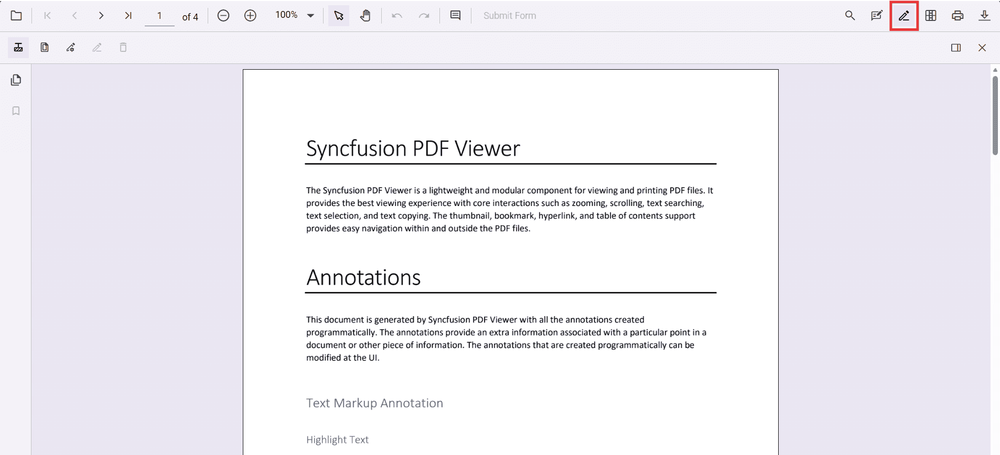
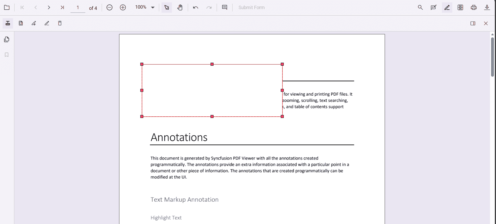
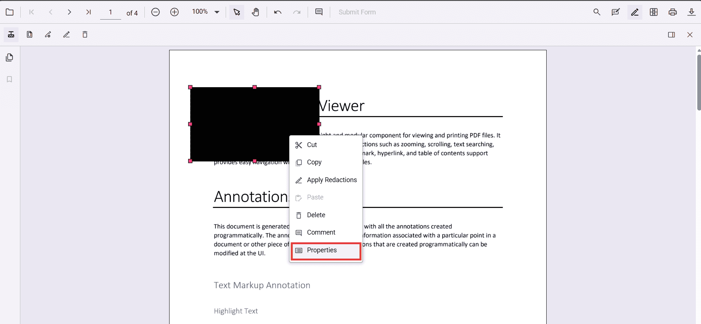
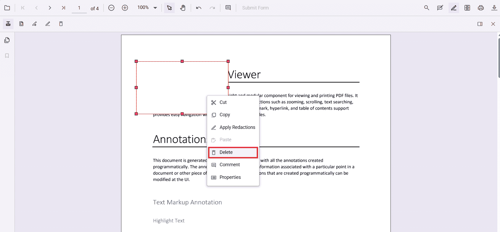
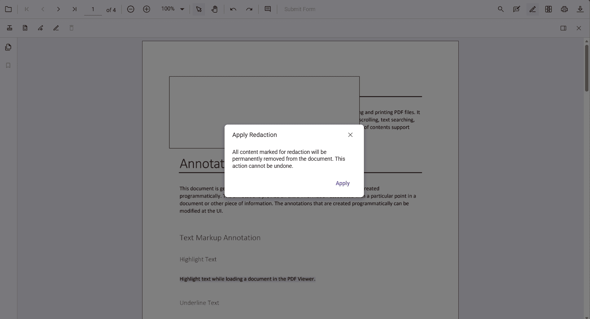

# Redaction annotation in ASP.NET Core PDF Viewer

Redaction annotations permanently remove sensitive content from a PDF. You can draw redaction marks over text or graphics, redact entire pages, customize overlay text and styling, and apply redaction to finalize. 

## Add Redaction Annotation

### Add redaction annotations in UI
- Use the **Redaction** tool from the toolbar to draw over content to hide it.  
- Redaction marks can show overlay text (for example, “Confidential”) and can be styled.

Redaction annotations are interactive:
- **Movable**  
  
- **Resizable**  

You can also add redaction annotations from the **context menu** by selecting content and choosing **Redact Annotation**.  

N> Ensure the **Redaction** tool is included in the toolbar. See [RedactionToolbar](../../Redaction/toolbar.md) for configuration.

### Add redaction annotations programmatically




    <ejs-pdfviewer id="pdfviewer"
                   style="height:650px"
                   documentPath="https://cdn.syncfusion.com/content/pdf/pdf-succinctly.pdf"
                   resourceUrl="https://cdn.syncfusion.com/ej2/31.2.2/dist/ej2-pdfviewer-lib">
    </ejs-pdfviewer>


  

Track additions using the `annotationAdd` event (wired above as a component prop).

## Edit Redaction Annotations

### Edit redaction annotations in UI
Use the viewer to select, move, and resize Redaction annotations. Use the context menu for additional actions.

#### Edit the properties of redaction annotations in UI
Use the property panel or **context menu → Properties** to change overlay text, font, fill color, and more.  
  

### Edit redaction annotations programmatically





  

This mirrors the TS logic using the ASP.NET Core component ref to access the annotation APIs.

## Delete redaction annotations

### Delete in UI
- **Right‑click → Delete**  

- Use the **Delete** button in the toolbar  

- Press **Delete** key

### Delete programmatically





  

This uses `annotationModule.deleteAnnotationById` with a known annotation id.

## Redact pages

### Redact pages in UI
Use the **Redact Pages** dialog to mark entire pages with options like **Current Page**, **Odd Pages Only**, **Even Pages Only**, and **Specific Pages**.  

### Add page redactions programmatically





  

Programmatically adds redaction marks to the given page numbers.

## Apply redaction

### Apply redaction in UI
Click **Apply Redaction** to permanently remove marked content.  
  

N> **Redaction is permanent and cannot be undone.**

### Apply redaction programmatically





  

N> Applying redaction is **irreversible**.

## Default redaction settings during initialization

Configure defaults with the `redactionSettings` property:




  <ejs-pdfviewer id="pdfviewer"
           style="height:650px"
           documentPath="https://cdn.syncfusion.com/content/pdf/pdf-succinctly.pdf"
           resourceUrl="https://cdn.syncfusion.com/ej2/31.2.2/dist/ej2-pdfviewer-lib">
  </ejs-pdfviewer>


  

[View Sample on GitHub](https://github.com/SyncfusionExamples/typescript-pdf-viewer-examples/tree/master)

## See also
- [Annotation Overview](../overview)
- [Redaction Overview](../../Redaction/overview)
- [Annotation Toolbar](../../toolbar-customization/annotation-toolbar)
- [Create and Modify Annotation](../../annotations/create-modify-annotation)
- [Customize Annotation](../../annotations/customize-annotation)
- [Remove Annotation](../../annotations/delete-annotation)
- [Handwritten Signature](../../annotations/signature-annotation)
- [Export and Import Annotation](../../annotations/export-import/export-annotation)
- [Annotation in Mobile View](../../annotations/annotations-in-mobile-view)
- [Annotation Events](../../annotations/annotation-event)
- [Annotation API](../../annotations/annotations-api)
