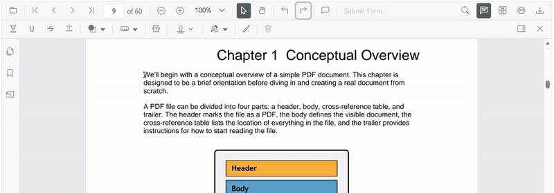
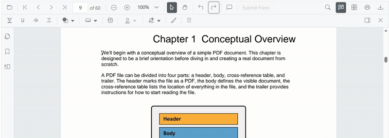

# Strikethrough Annotation (Text Markup) in ASP.NET Core PDF Viewer
This guide explains how to **enable**, **apply**, **customize**, and **manage** *Strikethrough* text markup annotations in the Syncfusion **ASP.NET Core PDF Viewer**. You can apply strikethrough using the toolbar or context menu, programmatically invoke strikethrough mode, customize default settings, handle events, and export the PDF with annotations.

## Enable Strikethrough in the Viewer
In the ASP.NET Core PDF Viewer, annotation modules such as Strikethrough annotation are enabled by default.

This minimal setup enables UI interactions like selection and strikethrough.




    <ejs-pdfviewer id="pdfviewer"
                   style="height:650px"
                   documentPath="https://cdn.syncfusion.com/content/pdf/pdf-succinctly.pdf"
                   resourceUrl="https://cdn.syncfusion.com/ej2/31.2.2/dist/ej2-pdfviewer-lib">
    </ejs-pdfviewer>




## Add Strikethrough Annotation

### Add Strikethrough Using the Toolbar
1. Select the text you want to strike through.
2. Click the **Strikethrough** icon in the annotation toolbar.
   - If **Pan Mode** is active, the viewer automatically switches to **Text Selection** mode.

### Add strikethrough using Context Menu
Right-click a selected text region → select **Strikethrough**.

To customize menu items, refer to [**Customize Context Menu**](../../context-menu/custom-context-menu) documentation.

### Enable Strikethrough Mode
Switch the viewer into strikethrough mode using `setAnnotationMode('Strikethrough')`.







#### Exit Strikethrough Mode
Switch back to normal mode using:







### Add Strikethrough Programmatically
Use [`addAnnotation()`](https://ej2.syncfusion.com/javascript/documentation/api/pdfviewer/index-default#addannotation) to insert a strikethrough at a specific location.







## Customize Strikethrough Appearance
Configure default strikethrough settings such as **color**, **opacity**, and **author** using [`strikethroughSettings`](https://help.syncfusion.com/cr/aspnetcore-js2/syncfusion.ej2.pdfviewer.pdfviewer.html#Syncfusion_EJ2_PdfViewer_PdfViewer_StrikethroughSettings).




    <ejs-pdfviewer id="pdfviewer"
                   style="height:650px"
                   documentPath="https://cdn.syncfusion.com/content/pdf/pdf-succinctly.pdf"
                   resourceUrl="https://cdn.syncfusion.com/ej2/31.2.2/dist/ej2-pdfviewer-lib">
    </ejs-pdfviewer>




## Manage Strikethrough (Edit, Delete, Comment)

### Edit Strikethrough

#### Edit Strikethrough Appearance (UI)
Use the annotation toolbar:
- **Edit Color** tool  

- **Edit Opacity** slider  

#### Edit Strikethrough Programmatically
Modify an existing strikethrough programmatically using `editAnnotation()` and `annotationCollection`.







### Delete Strikethrough
The PDF Viewer supports deleting existing annotations through both the UI and API. For detailed behavior, supported deletion workflows, and API reference, see [**Delete Annotation**](../remove-annotation).

### Comments
Use the [**Comments panel**](../comments) to add, view, and reply to threaded discussions linked to strikethrough annotations. It provides a dedicated UI for reviewing feedback, tracking conversations, and collaborating on annotation–related notes within the PDF Viewer.

## Set properties while adding Individual Annotation
Set properties for individual annotations when adding them programmatically by supplying fields on each `addAnnotation('Strikethrough', …)` call.



function addMultipleStrikethroughs() {
  const viewer = document.getElementById('container').ej2_instances[0];
  // Strikethrough 1
  viewer.annotation.addAnnotation('Strikethrough', {
    bounds: [{ x: 100, y: 150, width: 320, height: 14 }],
    pageNumber: 1,
    author: 'User 1',
    color: '#ffff00',
    opacity: 0.9
  });
  // Strikethrough 2
  viewer.annotation.addAnnotation('Strikethrough', {
    bounds: [{ x: 110, y: 220, width: 300, height: 14 }],
    pageNumber: 1,
    author: 'User 2',
    color: '#ff1010',
    opacity: 0.9
  });
}



## Disable TextMarkup Annotation
Disable text markup annotations (including strikethrough) using the `enableTextMarkupAnnotation` property.




    <ejs-pdfviewer id="pdfviewer"
                   style="height:650px"
                   enableTextMarkupAnnotation="false"
                   documentPath="https://cdn.syncfusion.com/content/pdf/pdf-succinctly.pdf"
                   resourceUrl="https://cdn.syncfusion.com/ej2/31.2.2/dist/ej2-pdfviewer-lib">
    </ejs-pdfviewer>




## Handle Strikethrough Events
The PDF viewer provides annotation life-cycle events that notify when strikethrough annotations are added, modified, selected, or removed. For the full list of available events and their descriptions, see [**Annotation Events**](../annotation-event).

## Export and Import
The PDF Viewer supports exporting and importing annotations, allowing you to save annotations as a separate file or load existing annotations back into the viewer. For full details on supported formats and steps to export or import annotations, see [**Export and Import Annotation**](../export-import-annotations).

## See Also

- [Annotation Toolbar](../../toolbar-customization/annotation-toolbar)
- [Customize Context Menu](../../context-menu/custom-context-menu)
- [Comments Panel](../comments)
- [Annotation Events](../annotation-event)
- [Export and Import annotations](../export-import-annotations)
- [Delete Annotations](../remove-annotations)
