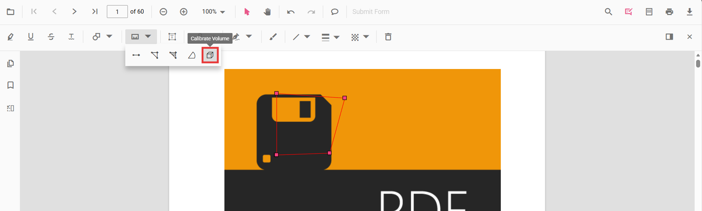

# Add Volume Measurement Annotations in ASP.NET Core PDF Viewer
Volume measurement annotations allow users to draw circular regions and calculate the volume visually.

## Enable Volume Measurement
Include the **Annotation** and **Toolbar** modules for the PDF Viewer to enable volume annotation tools.




    <ejs-pdfviewer id="pdfviewer"
                   style="height:650px"
                   documentPath="https://cdn.syncfusion.com/content/pdf/pdf-succinctly.pdf"
                   resourceUrl="https://cdn.syncfusion.com/ej2/31.2.2/dist/ej2-pdfviewer-lib">
    </ejs-pdfviewer>




## Add Volume Annotation

### Draw Volume Using the Toolbar

1. Open the **Annotation Toolbar**.
2. Select **Measurement → Volume**.
3. Click and drag on the page to draw the volume.

> If Pan mode is active, selecting the Volume tool automatically switches interaction mode.

### Enable Volume Mode
Programmatically switch the viewer into Volume mode.







#### Exit Volume Mode







### Add Volume Programmatically
Configure default properties using the [`volumeSettings`](https://help.syncfusion.com/cr/aspnetcore-js2/syncfusion.ej2.pdfviewer.pdfviewer.html#Syncfusion_EJ2_PdfViewer_PdfViewer_VolumeSettings) property (for example, default **fill color**, **stroke color**, **opacity**).







## Customize Volume Appearance
Configure default properties using the [`volumeSettings`](https://help.syncfusion.com/cr/aspnetcore-js2/syncfusion.ej2.pdfviewer.pdfviewer.html#Syncfusion_EJ2_PdfViewer_PdfViewer_VolumeSettings) property (for example, default **fill color**, **stroke color**, **opacity**).




    <ejs-pdfviewer id="pdfviewer"
                   style="height:650px"
                   documentPath="https://cdn.syncfusion.com/content/pdf/pdf-succinctly.pdf"
                   resourceUrl="https://cdn.syncfusion.com/ej2/31.2.2/dist/ej2-pdfviewer-lib">
    </ejs-pdfviewer>




## Manage Volume (Move, Resize, Delete)
- **Move**: Drag inside the polygon to reposition it.
- **Reshape**: Drag any vertex handle to adjust points and shape.

### Edit Volume Annotation

#### Edit Volume (UI)

- Edit the **fill color** using the Edit Color tool.  
  
- Edit the **stroke color** using the Edit Stroke Color tool.  
  
- Edit the **border thickness** using the Edit Thickness tool.  
  
- Edit the **opacity** using the Edit Opacity tool.  
  
- Open **Right Click → Properties** for additional line‑based options.
  

#### Edit Volume Programmatically
Update properties and call `editAnnotation()`.







### Delete Volume Annotation

Delete Volume Annotation via UI (toolbar/context menu) or programmatically. For supported workflows and APIs, see [**Delete Annotation**](../remove-annotations).

## Set Default Properties During Initialization
Apply defaults for Volume using the [`volumeSettings`](https://help.syncfusion.com/cr/aspnetcore-js2/syncfusion.ej2.pdfviewer.pdfviewer.html#Syncfusion_EJ2_PdfViewer_PdfViewer_VolumeSettings) property.




    <ejs-pdfviewer id="pdfviewer"
                   style="height:650px"
                   documentPath="https://cdn.syncfusion.com/content/pdf/pdf-succinctly.pdf"
                   resourceUrl="https://cdn.syncfusion.com/ej2/31.2.2/dist/ej2-pdfviewer-lib">
    </ejs-pdfviewer>




## Set Properties While Adding Individual Annotation
Apply defaults for Volume using the [`volumeSettings`](https://help.syncfusion.com/cr/aspnetcore-js2/syncfusion.ej2.pdfviewer.pdfviewer.html#Syncfusion_EJ2_PdfViewer_PdfViewer_VolumeSettings) property.







## Scale Ratio & Units
- Use **Scale Ratio** from the context menu.  
  
- Supported units: Inch, Millimeter, Centimeter, Point, Pica, Feet.  
  

### Set Default Scale Ratio During Initialization
Configure scale defaults using [`measurementSettings`](https://help.syncfusion.com/cr/aspnetcore-js2/syncfusion.ej2.pdfviewer.pdfviewer.html#Syncfusion_EJ2_PdfViewer_PdfViewer_MeasurementSettings).




    <ejs-pdfviewer id="pdfviewer"
                   style="height:650px"
                   documentPath="https://cdn.syncfusion.com/content/pdf/pdf-succinctly.pdf"
                   resourceUrl="https://cdn.syncfusion.com/ej2/31.2.2/dist/ej2-pdfviewer-lib">
    </ejs-pdfviewer>




## Handle Volume Events
Listen to annotation life-cycle events (add/modify/select/remove). For the full list and parameters, see [**Annotation Events**](../annotation-event).

## Export and Import
Volume measurements can be exported or imported with other annotations. For workflows and supported formats, see [**Export and Import annotations**](../export-import-annotations).

## See Also
- [Annotation Toolbar](../../toolbar-customization/annotation-toolbar)
- [Customize Context Menu](../../context-menu/custom-context-menu)
- [Comments Panel](../comments)
- [Annotation Events](../annotation-event)
- [Export and Import annotations](../export-import-annotations)
- [Delete Annotations](../remove-annotations)
